Another compartment box
===============
**Please note: This thing is part of a list that was [automatically generated](https://github.com/carlosgs/export-things) and may have been updated since then. Make sure to check for the current license and authorship.**  

Another compartment box  by obijuan , published Apr 30, 2013

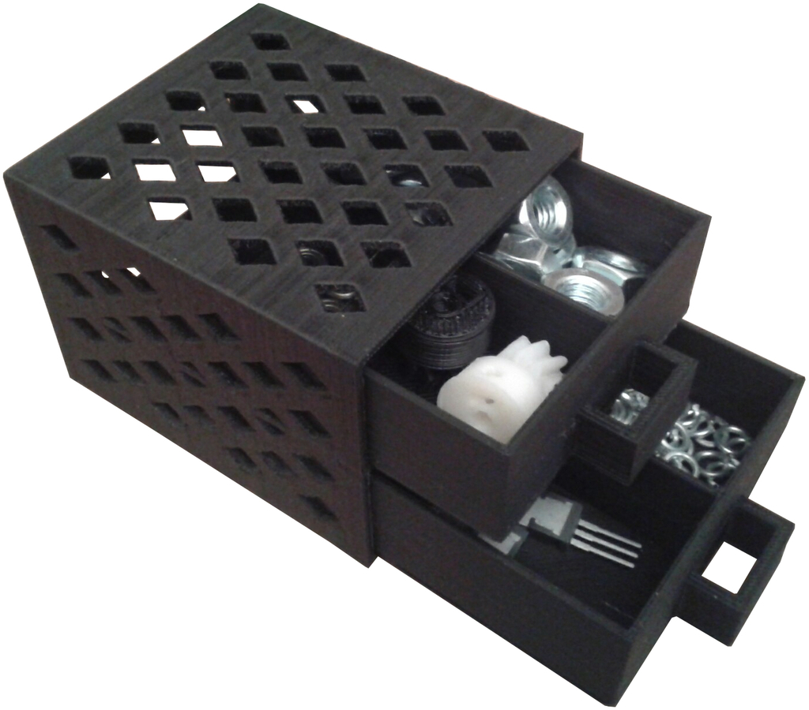

Description
--------
Just another compartment box, derived from the "deluxe parametric compartment box" by ttsalo.   
 
Sources also available in github:   
 
<a href="https://github.com/Obijuan/3D-parts/tree/master/compartment-box" target="_blank" rel="nofollow">github.com/Obijuan/3D-parts/tree/master/compartment-box</a>  
 
More information (in Spanish):   
<a href="http://www.iearobotics.com/wiki/index.php?title=Mini-cajones_organizadores" target="_blank" rel="nofollow">iearobotics.com/wiki/index.php?title=Mini-cajones_organizadores</a>

Instructions
--------
Printed with a 0.5 nozzle, 0.4 layer height, Slic3r 0.98

Files
--------

 [ drawer_2x2.stl](drawer_2x2.stl)  

[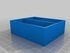](drawer_2x1.stl)
 [ drawer_2x1.stl](drawer_2x1.stl)  

[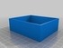](drawer_1x1.stl)
 [ drawer_1x1.stl](drawer_1x1.stl)  

[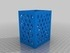](cabinet.stl)
 [ cabinet.stl](cabinet.stl)  

 [ compartment-box.scad](compartment-box.scad)  

Pictures
--------
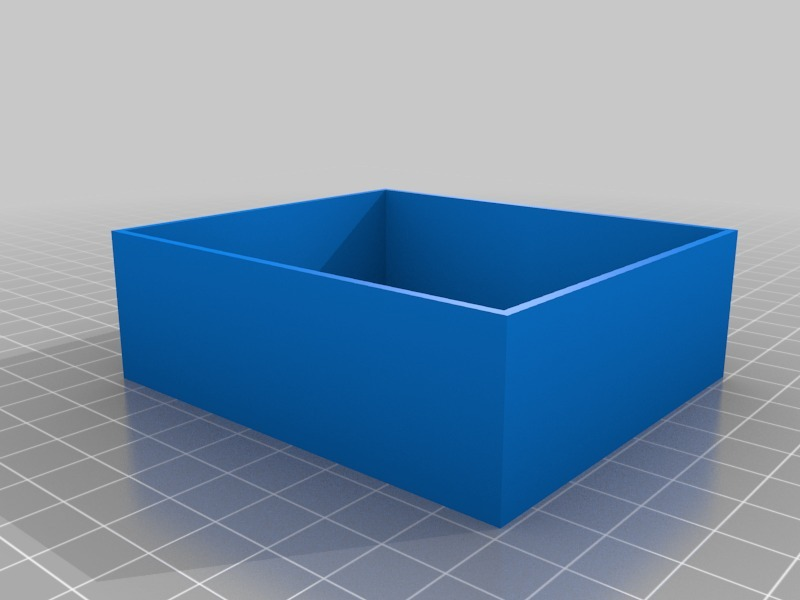
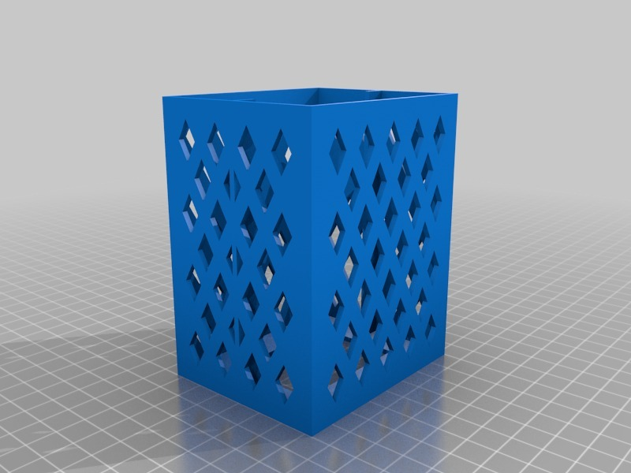
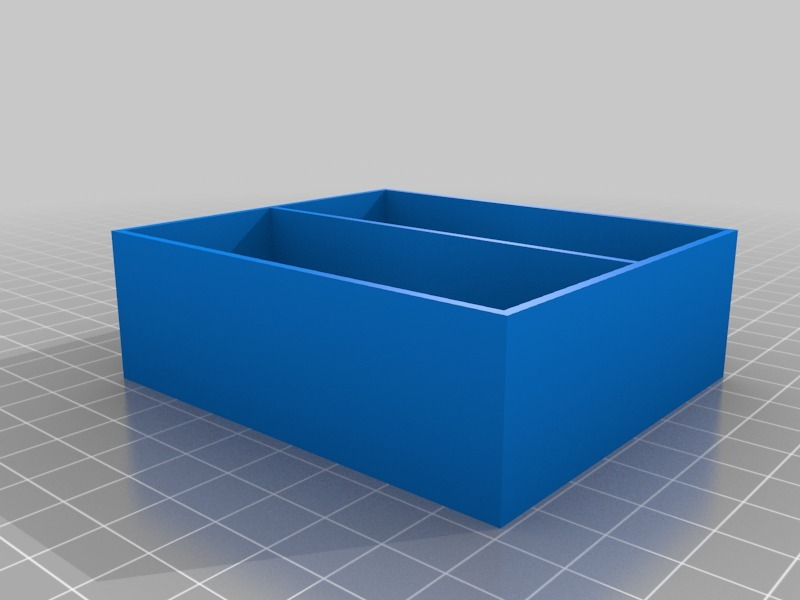
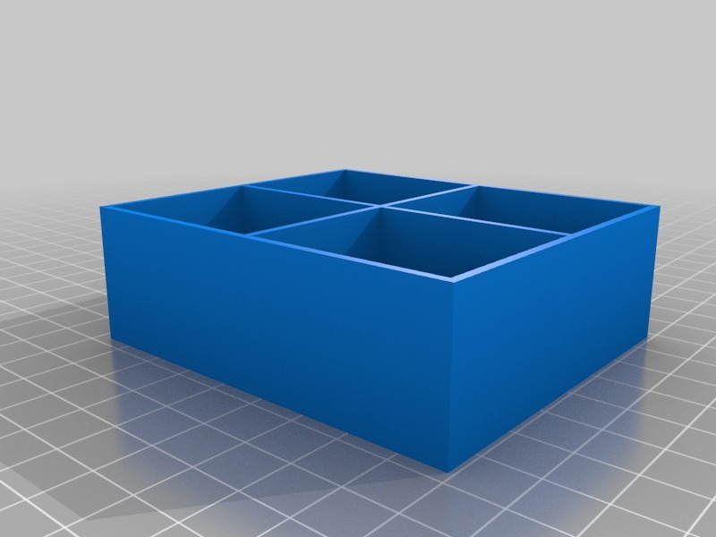
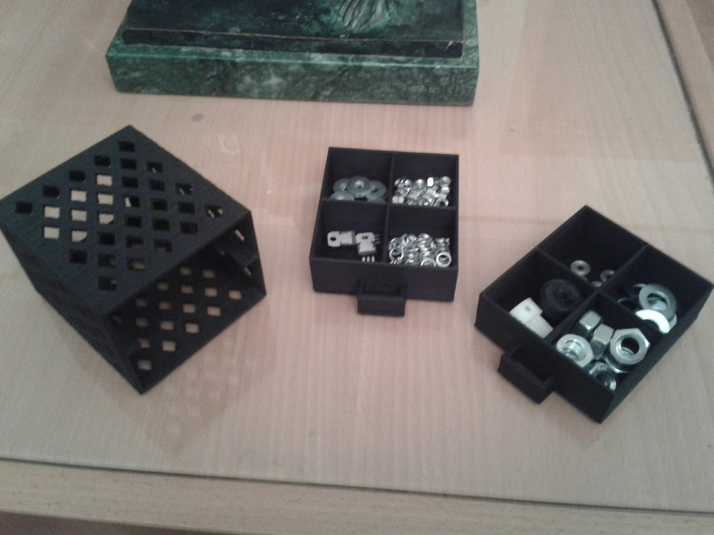
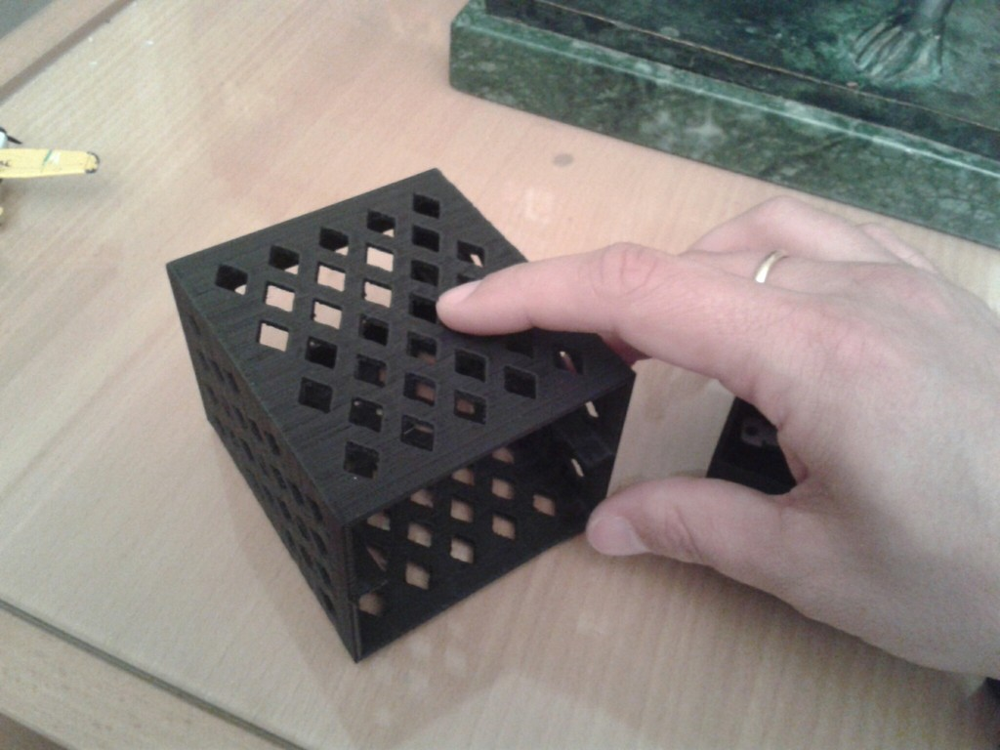
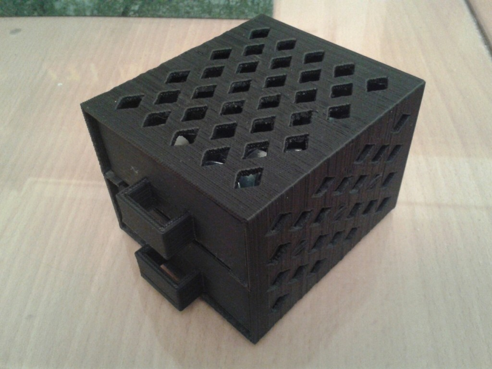

Tags
--------
drawer , github , openscad  

  

License
--------
Another compartment box by obijuan is licensed under the Creative Commons - Attribution license.  

By: Juan Gonzalez-Gomez (Obijuan)
--------
<http://www.iearobotics.com/wiki/index.php?title=Juan_Gonzalez:Main>