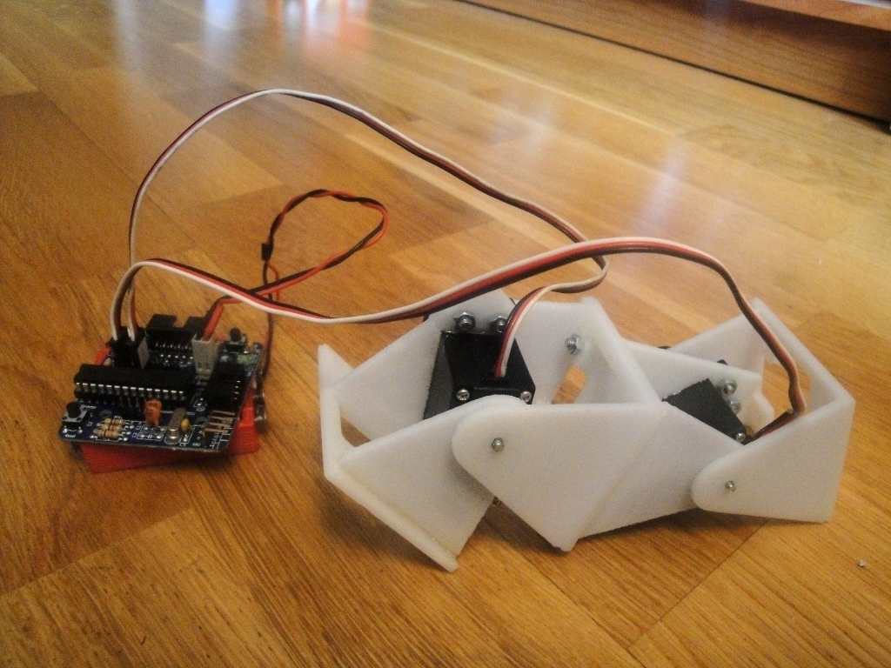
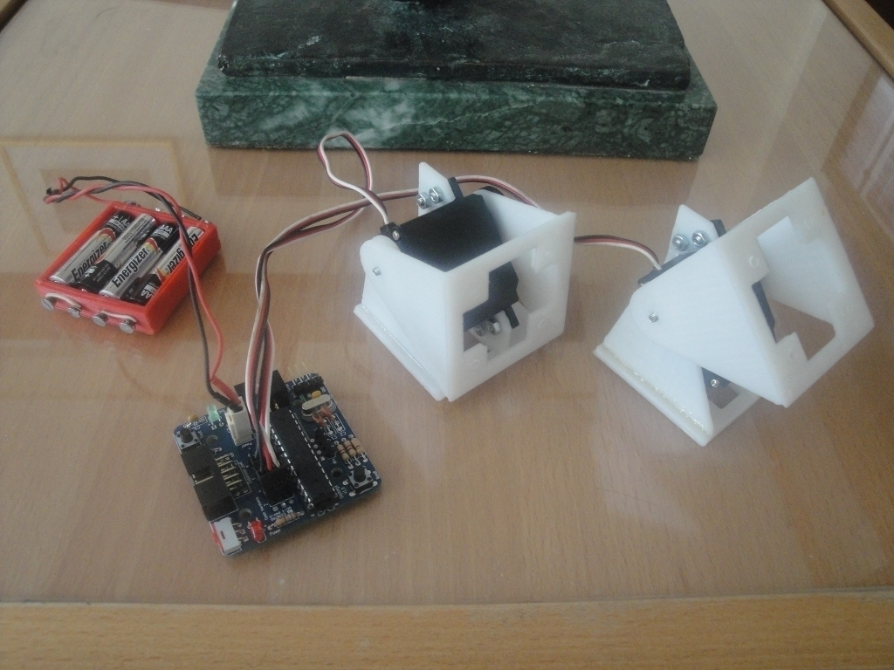
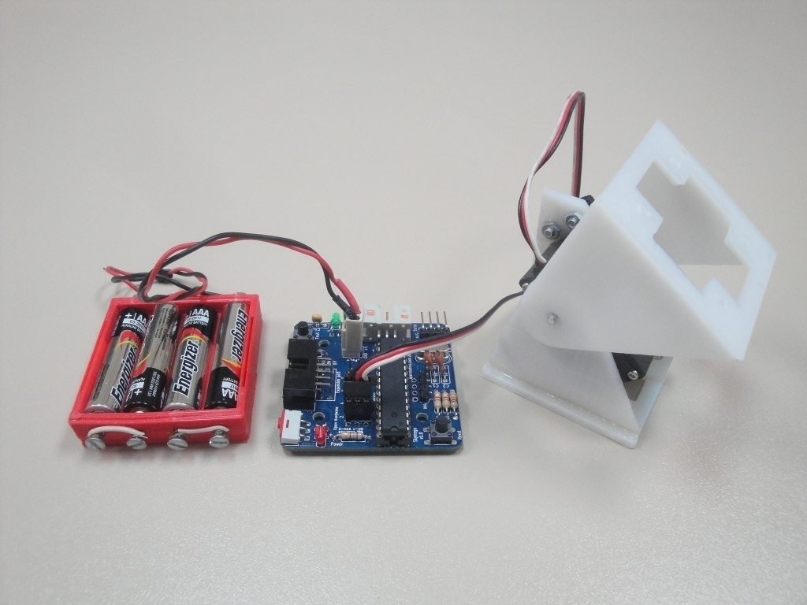
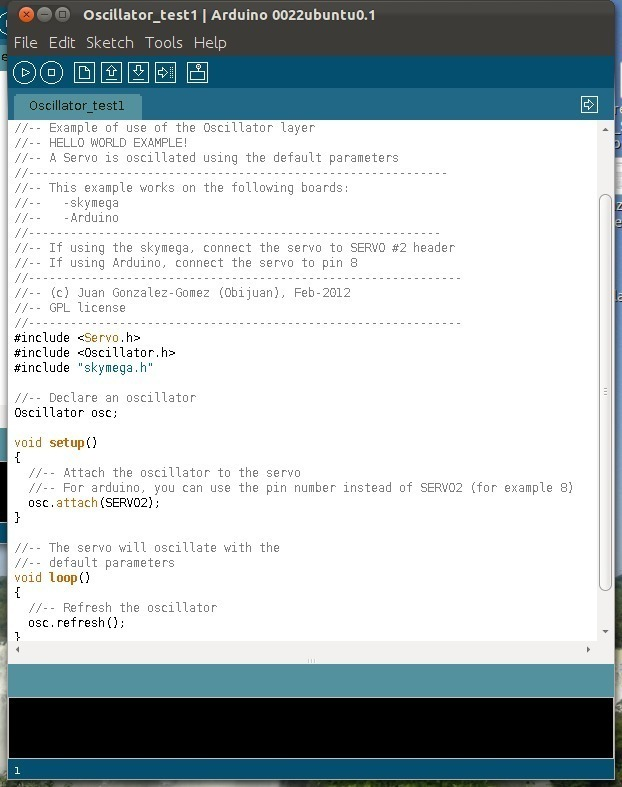

ArduSnake: Arduino Modular Snake Robots Library
===============
**Please note: This thing is part of a list that was [automatically generated](https://github.com/carlosgs/export-things) and may have been updated since then. Make sure to check for the current license and authorship.**  

ArduSnake: Arduino Modular Snake Robots Library  by obijuan , published Apr 15, 2012

Description
--------
Ardusnake is an Arduino Library for generating easily the locomotion of modular snake robots or other modular robots. It is based on sinusoidal oscillators which drive the servos. 
 
Here you can see a video of the locomotion of a 2-module worm: 
 
<a href="http://www.youtube.com/watch?v=jbBX5QE6ZFk" target="_blank" rel="nofollow">youtube.com/watch?v=jbBX5QE6ZFk</a> 
 
It also work for longer worms or even snakes (I will add more information about it on the future) 
 
You can find <b>more information</b>, examples, tutorials, pictures, etc in this wiki: 
 
<a href="http://www.iearobotics.com/wiki/index.php?title=ArduSnake:_Arduino_Modular_Snake_Robots_Library" target="_blank" rel="nofollow">iearobotics.com/wiki/index.php?title=ArduSnake:_Arduino_Modular_Snake_Robots_Library</a> 
 
and the github repository: 
 
<a href="https://github.com/Obijuan/ArduSnake" target="_blank" rel="nofollow">github.com/Obijuan/ArduSnake</a> 

Instructions
--------
1) Choose the modules for your modular robots. For example the repy 1.1 modules or their derivatives: 
 
<a href="http://www.thingiverse.com/thing:13442" target="_blank" rel="nofollow">thingiverse.com/thing:13442</a> 
 
2) Assembly the modules and build the robot 
 
3) You need an Arduino board or compatible. The skymega board is arduino compatible and has been designed to be screwed on the repy 1.1 modules: 
 
<a href="http://www.thingiverse.com/thing:14197" target="_blank" rel="nofollow">thingiverse.com/thing:14197</a> 
 
4) Use the ArduSnake library to move the robot 

Files
--------

 [ ArduSnake-001.zip](ArduSnake-001.zip)  

Pictures
--------

Tags
--------
modular_robot , plastic_valley , printbot , repy , robot , skymega , software , upm  

  

License
--------
ArduSnake: Arduino Modular Snake Robots Library by obijuan is licensed under the Creative Commons - Attribution - Share Alike license.  

By: Juan Gonzalez-Gomez (Obijuan)
--------
<http://www.iearobotics.com/wiki/index.php?title=Juan_Gonzalez:Main>