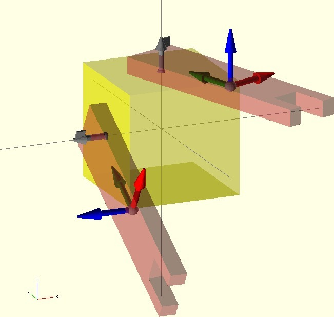
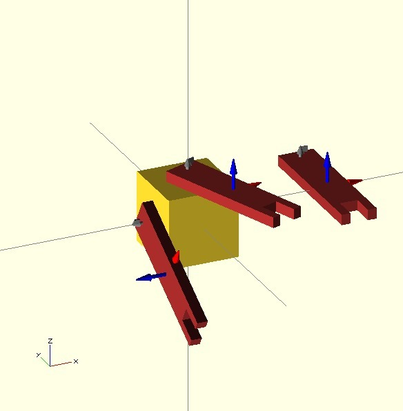
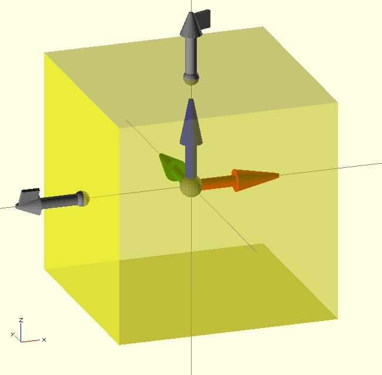
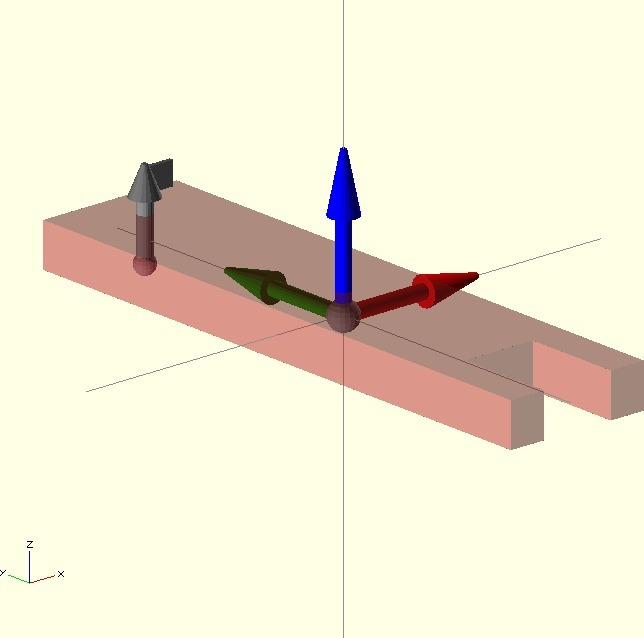
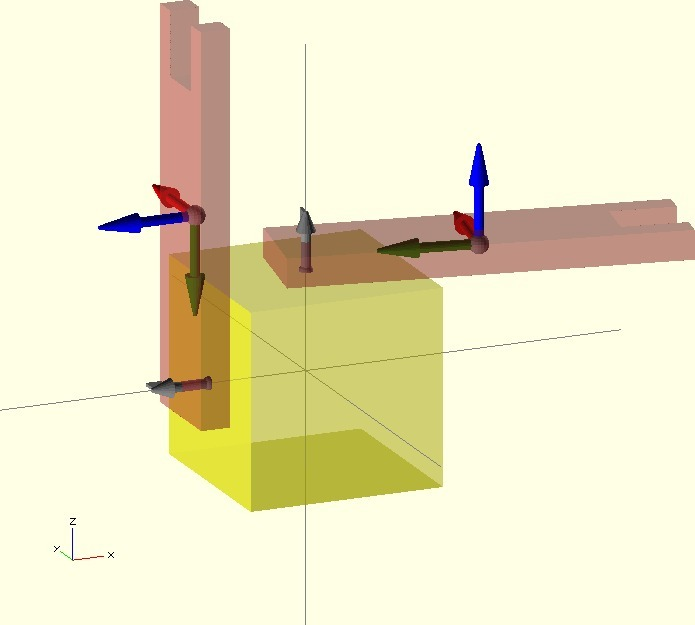
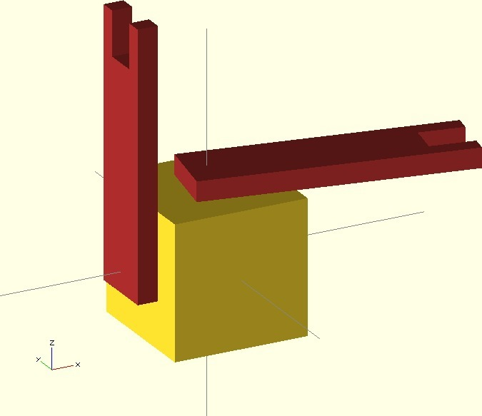

Attach library for Openscad
===============
**Please note: This thing is part of a list that was [automatically generated](https://github.com/carlosgs/export-things) and may have been updated since then. Make sure to check for the current license and authorship.**  

Attach library for Openscad  by obijuan , published Sep 10, 2012

Description
--------
Openscad library for easily attaching parts. This is an experimental work on enhancing the openscad tool. Usually the code written by users is difficult to read and understand. If we want to share the code and to reuse parts made by others, it is very important to write clean code. 
 
  The attach operator is a experimental way of joining together parts. It just hides all the translate/rotate operators to the user, making the code easier to read, maitain and reuse. 
 
I have written about it (and given an example of use) in this post: 
 
<a href="http://www.iearobotics.com/blog/2012/09/10/enhancing-openscad-with-the-attach-library/" target="_blank" rel="nofollow">iearobotics.com/blog/2012/09/10/enhancing-openscad-with-the-attach-library/</a> 
 
The attach operator is part of the obiscad tools I am developing: 
 
<a href="https://github.com/Obijuan/obiscad" target="_blank" rel="nofollow">github.com/Obijuan/obiscad</a> 
 
More information in this wiki (in Spanish): 
 
<a href="http://www.iearobotics.com/wiki/index.php?title=Obiscad" target="_blank" rel="nofollow">iearobotics.com/wiki/index.php?title=Obiscad</a>

Instructions
--------
Example of use: 
 
1) Define the connectors in a part (the points were you want to attach other parts). You should provide the attachment point, the axis and the roll angle: 
 
//--     att. point     att. axis    roll 
c1 = [ [0,0,10],  [0,0,1],     20 ];  
 
Add your main part. 
You can easily see the connector you have defined invoking the connector module: 
 
connector(c1); 
 
Then define the connector for the second part: 
 
//--  att. point  att. axis  roll 
a = [ [0, 2,2],   [0,0,1],   0  ]; 
 
Again, put your part and then view the connector with: 
connector(a); 
 
Now you are ready to attach the second part to the first one invoking the attach operator: 
 
attach(c1,a) your_part(); 
 
Were your_part() is a module or a tree of operators (union, translates and so on). 
 
 

Files
--------

 [ obiscad-attach-openscad.zip](obiscad-attach-openscad.zip)  

Pictures
--------

Tags
--------
library , obiscad , openscad , plastic_valley , printbot , robot  

  

License
--------
Attach library for Openscad by obijuan is licensed under the Creative Commons - Attribution - Share Alike license.  

By: Juan Gonzalez-Gomez (Obijuan)
--------
<http://www.iearobotics.com/wiki/index.php?title=Juan_Gonzalez:Main>