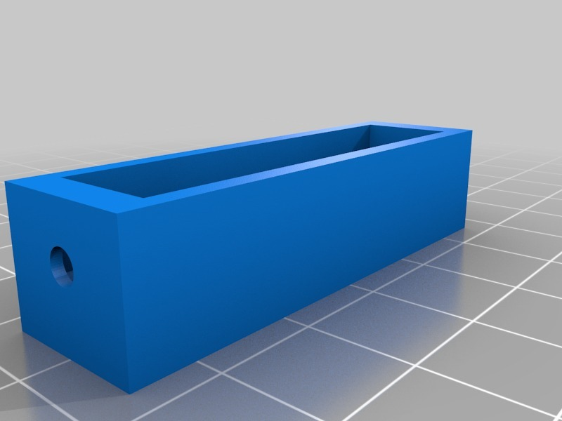
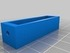
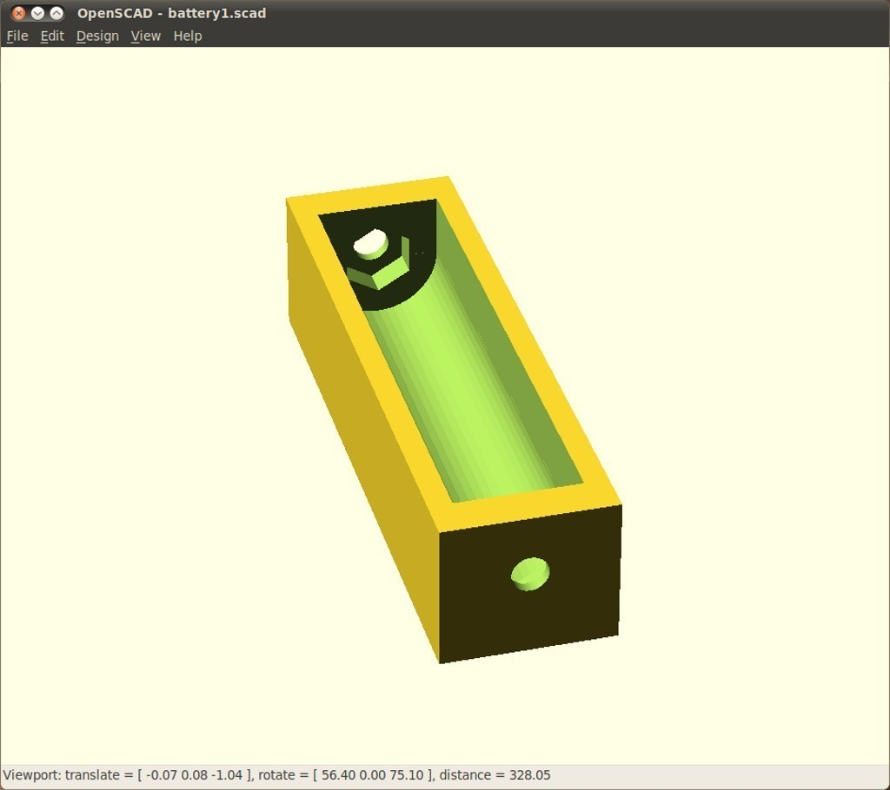
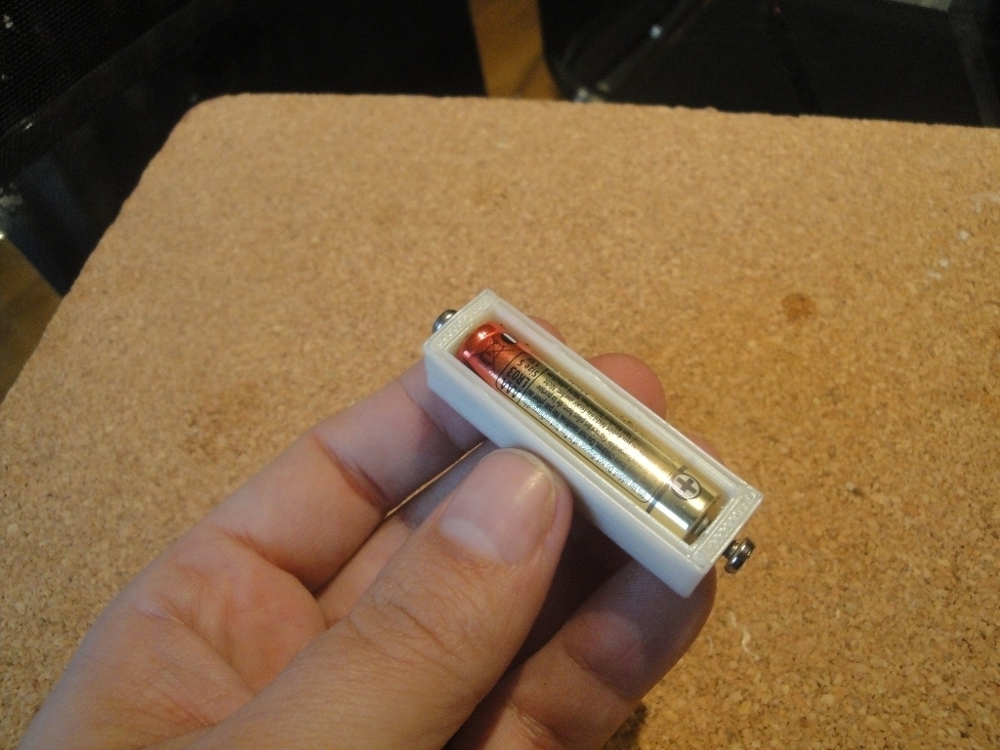
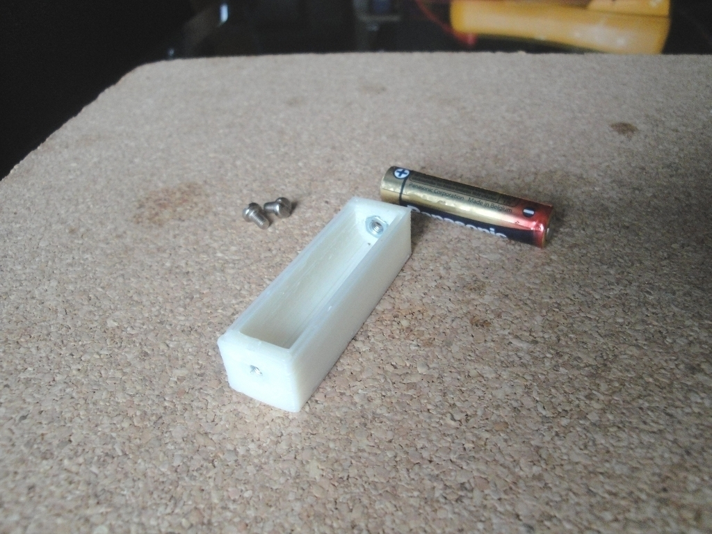
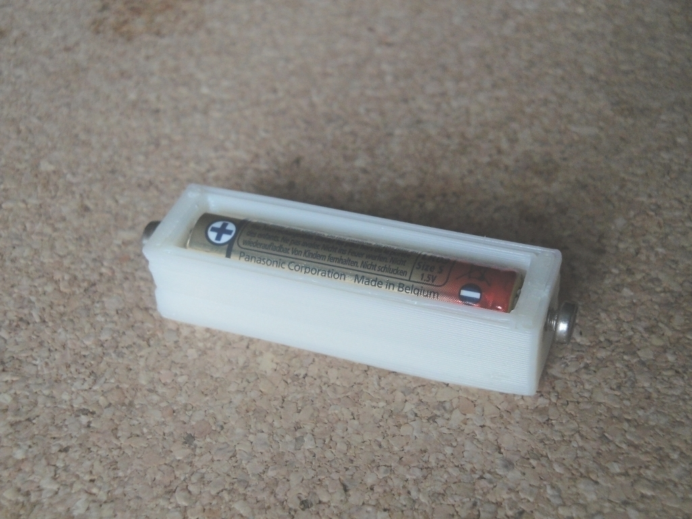
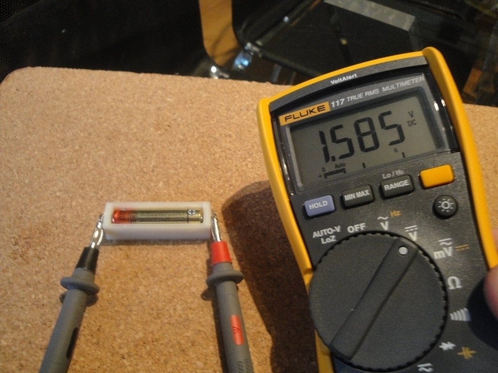

Battery Compartment with contacts
===============
**Please note: This thing is part of a list that was [automatically generated](https://github.com/carlosgs/export-things) and may have been updated since then. Make sure to check for the current license and authorship.**  

Battery Compartment with contacts  by obijuan , published Dec 8, 2010

Description
--------
This is a proof of concept. I have derived this object from the parameterized Battery compartment: <a href="http://www.thingiverse.com/thing:5051" target="_blank" rel="nofollow">thingiverse.com/thing:5051</a>. 
 
It is a Battery comparment for just 1 AAA battery. I have added two embedded nuts in contact with the positive and negative parts of the battery. From the outside, two metal screws are inserted. They will contact with the battery.  Now, you have a wonderful electrical access to the battery!! 
 
It works very well. 
 
For the future, I am planning to add this feature to the original parameterized battery comparment.

Instructions
--------
* Print the object 
* Insert the embedded nuts 
* Insert the AAA battery 
* Put two M3 screws 
* The battery compartment is ready to use! Enjoy!

Files
--------

 [ battery-compartment-nut-1AAA.stl](battery-compartment-nut-1AAA.stl)  

 [ battery-comparment-nut-1AAA.scad](battery-comparment-nut-1AAA.scad)  

Pictures
--------

Tags
--------
3D , batteries , container , electronics , makerbot , openscad  

  

License
--------
Battery Compartment with contacts by obijuan is licensed under the Creative Commons - Attribution - Share Alike license.  

By: Juan Gonzalez-Gomez (Obijuan)
--------
<http://www.iearobotics.com/wiki/index.php?title=Juan_Gonzalez:Main>