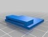
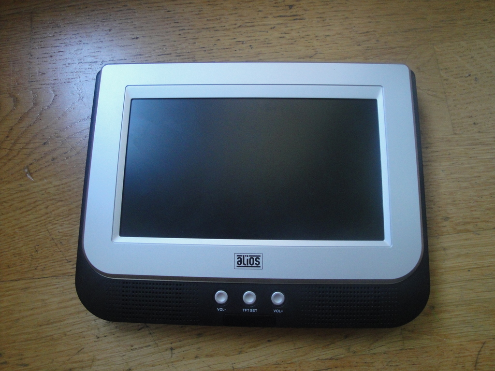
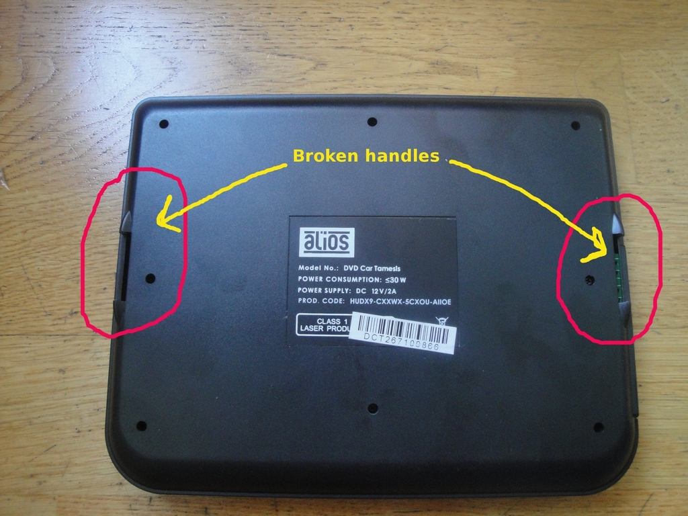
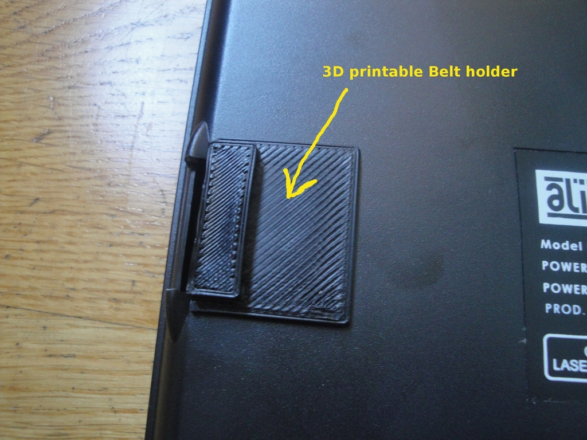
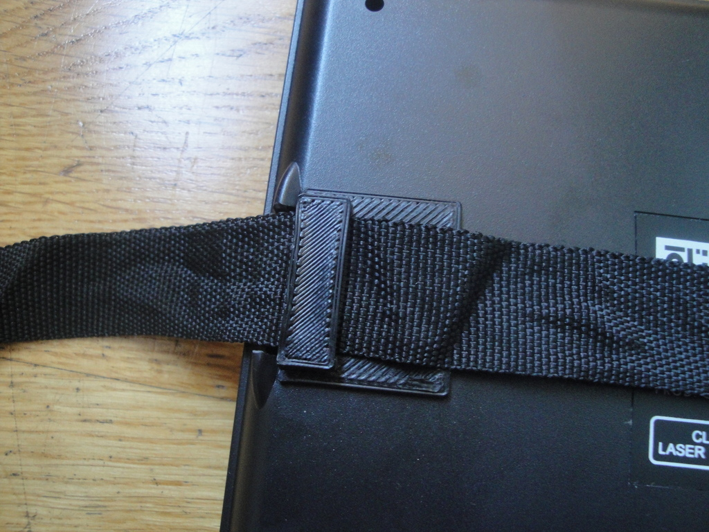
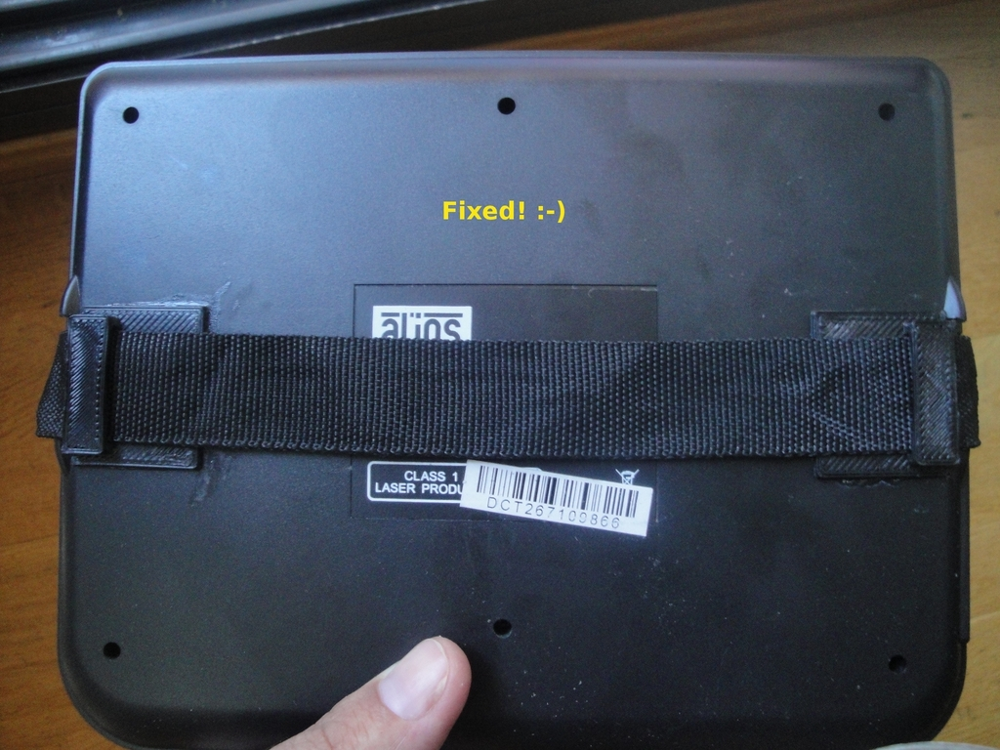
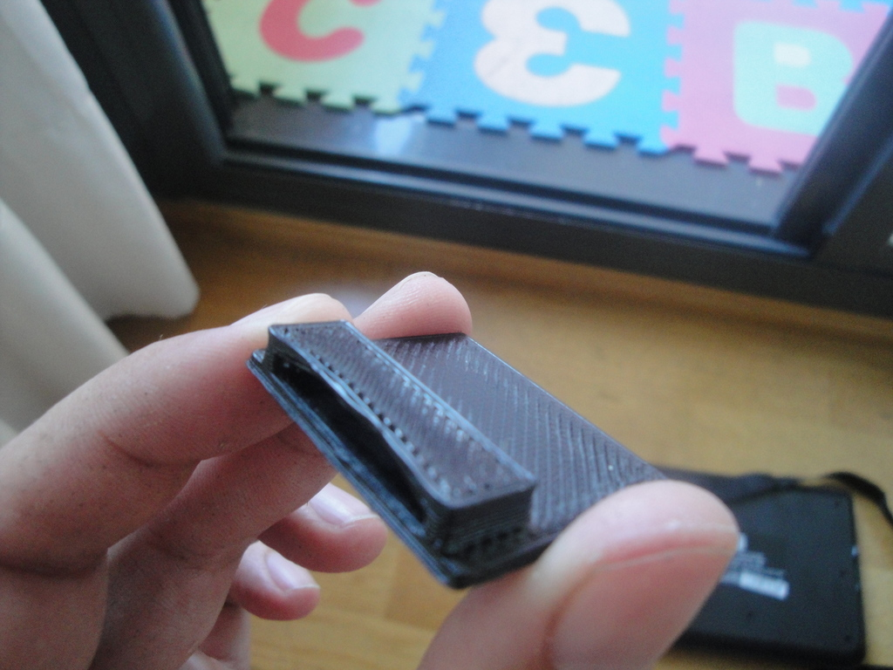
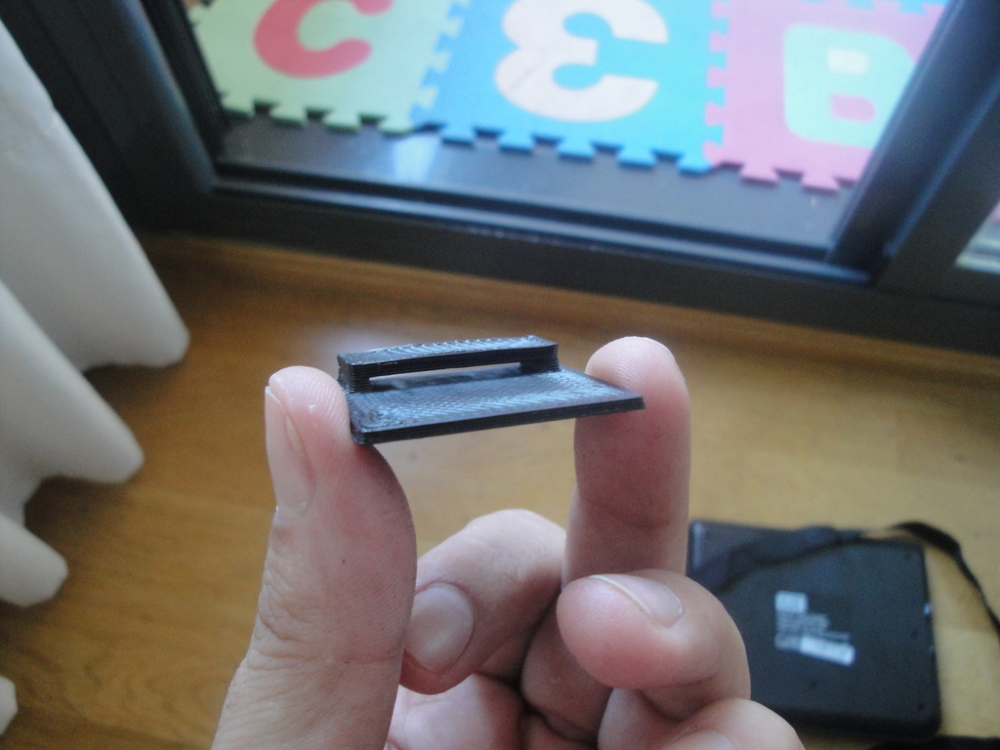

Belt holder for a portable DVD
===============
**Please note: This thing is part of a list that was [automatically generated](https://github.com/carlosgs/export-things) and may have been updated since then. Make sure to check for the current license and authorship.**  

Belt holder for a portable DVD  by obijuan , published Aug 20, 2012

Description
--------
A replacement part for broken handles of a portable DVD player 
 
The history:   In 8 hours I was going to leave Madrid for having holidays with my family... Suddenly I discovered that the handles of the portable DVD player were broken...  I had to drive my car for more than 6 hours... with 2 kids  (2 and 4 years old) and without the DVD! It was going to be terrible!!!  What to do? 
 
I designed a belt holder in openscad in 20 minutes. Then I printed it on my Prusa I2 and finally I glued the parts to the DVD.  Fixed! Problem solved!  Thanks prusa! Thanks Reprap!   
 
  The trip was so nice and calm.. :-)

Instructions
--------
* Print 2 copies of the belt-holder 
* Glue them to the back of the DVD player 
* Attach the belts 
* Enjoy the trip 
 
(More information in spanish: <a href="http://www.iearobotics.com/wiki/index.php?title=Objeto_3D:_Porta-correas_DVD" target="_blank" rel="nofollow">iearobotics.com/wiki/index.php?title=Objeto_3D:_Porta-correas_DVD</a> )

Files
--------

 [ belt-holder.stl](belt-holder.stl)  

 [ belt-holder.scad](belt-holder.scad)  

Pictures
--------

Tags
--------
openscad , plastic_valley , useful  

  

License
--------
Belt holder for a portable DVD by obijuan is licensed under the Creative Commons - Attribution - Share Alike license.  

By: Juan Gonzalez-Gomez (Obijuan)
--------
<http://www.iearobotics.com/wiki/index.php?title=Juan_Gonzalez:Main>