Bevel library for OpenScad
===============
**Please note: This thing is part of a list that was [automatically generated](https://github.com/carlosgs/export-things) and may have been updated since then. Make sure to check for the current license and authorship.**  

Bevel library for OpenScad  by obijuan , published Sep 13, 2012

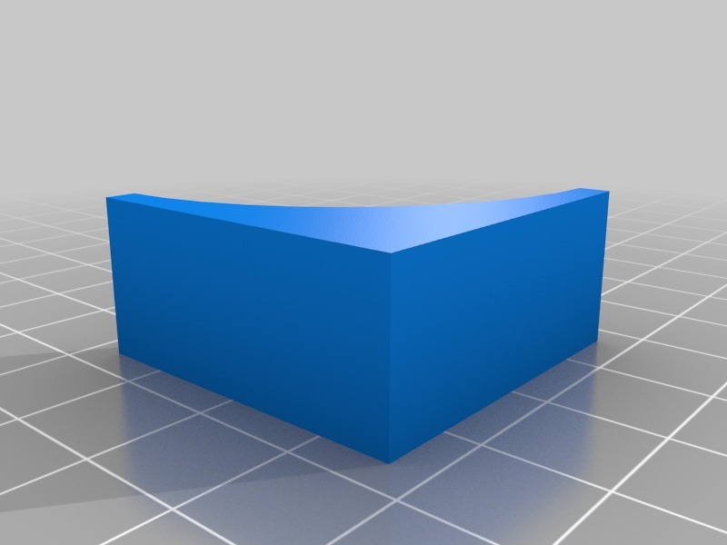

Description
--------
There is one very common operation that has to be done in nearly all the designs: beveling edges. It can be done on the convex side, for avoiding sharp edges, or on the concave side, for reinforce the part (avoiding the 90 degrees connection between parts). 
 
With the bevel library I am developing doing these two operations is a piece of cake. 
 
I have given some examples in this post: 
 
<a href="http://www.iearobotics.com/blog/2012/09/13/enhancing-openscad-ii-bevel-library/" target="_blank" rel="nofollow">iearobotics.com/blog/2012/09/13/enhancing-openscad-ii-bevel-library/</a> 
 
The bevel library is part of the obiscad tools I am developing: 
 
<a href="https://github.com/Obijuan/obiscad" target="_blank" rel="nofollow">github.com/Obijuan/obiscad</a> 
 
More information in this wiki (in Spanish): 
 
<a href="http://www.iearobotics.com/wiki/index.php?title=Obiscad" target="_blank" rel="nofollow">iearobotics.com/wiki/index.php?title=Obiscad</a> 
 
Many thanks to Miguel Angel de Frutos (MAF, <a href="http://www.thingiverse.com/MAF" target="_blank" rel="nofollow">thingiverse.com/MAF</a> ) for his technical advices 

Instructions
--------
How to bevel an edge: 
 
1) Define 2 connectors with the same attachment point in the edge. One vector should be poiting in the edge direction and the other is orthogonal, pointing to the exterior bisec. 
 
2) Invoke the Bevel() module (passing the connectors as parameters, as shown in the examples) 
 
3) Use the difference operator 
 
Three examples are provided (along with their STLs) 
 
The code of your part with beveled edges looks like: 
 
difference() 
{ 
  My_part(); 
  bevel(a1, a2, cr = 8, l=10);  //-- First beveled edge 
  bevel(b1, b2, ....);          //-- Second beveled edge 
  ... 
} 
 
The procedure for attaching buttress to you parts is similar, but in this case one of the connector should point to the inside bisector.

Files
--------

 [ Obiscad-bevel-library-openscad.zip](Obiscad-bevel-library-openscad.zip)  

[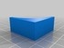](bevel_01_concave_corner.stl)
 [ bevel_01_concave_corner.stl](bevel_01_concave_corner.stl)  

[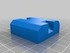](bevel_02_cube.stl)
 [ bevel_02_cube.stl](bevel_02_cube.stl)  

[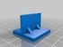](bevel_03_buttress.stl)
 [ bevel_03_buttress.stl](bevel_03_buttress.stl)  

Pictures
--------
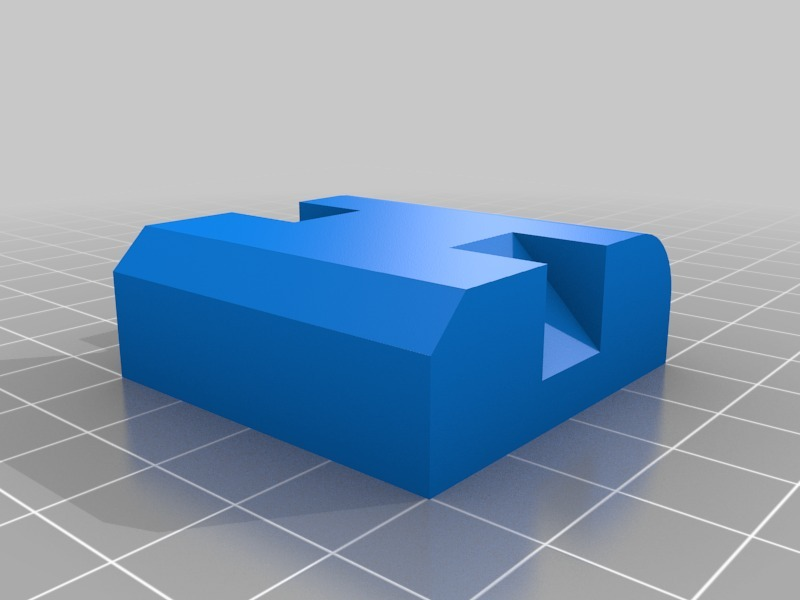
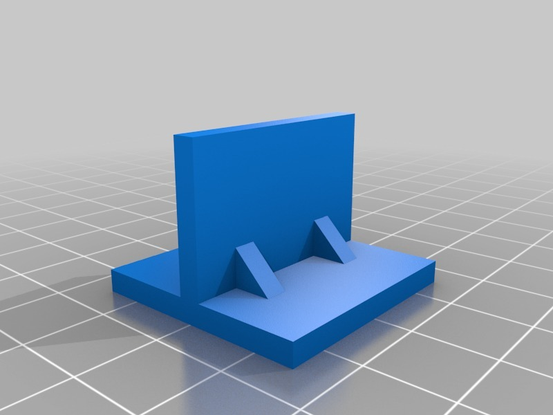
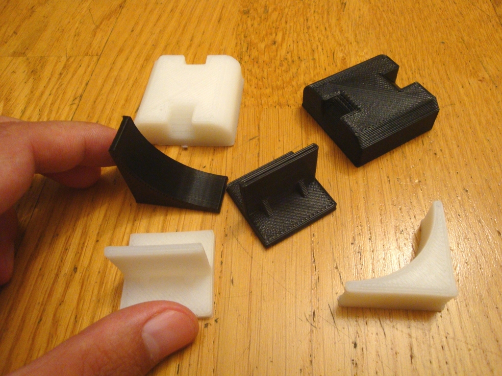
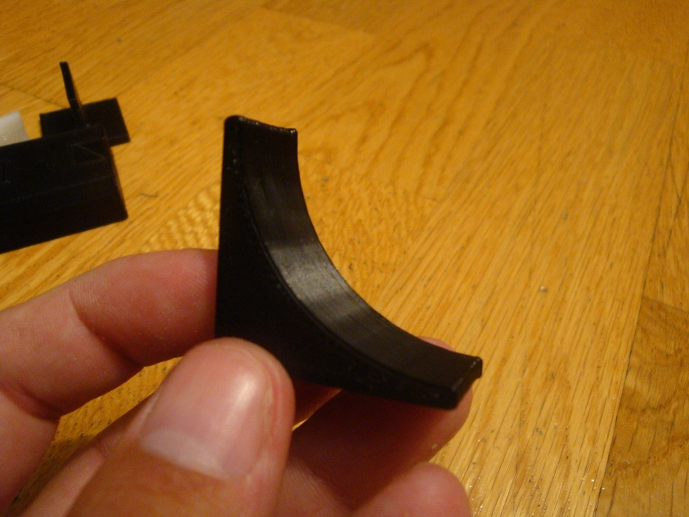
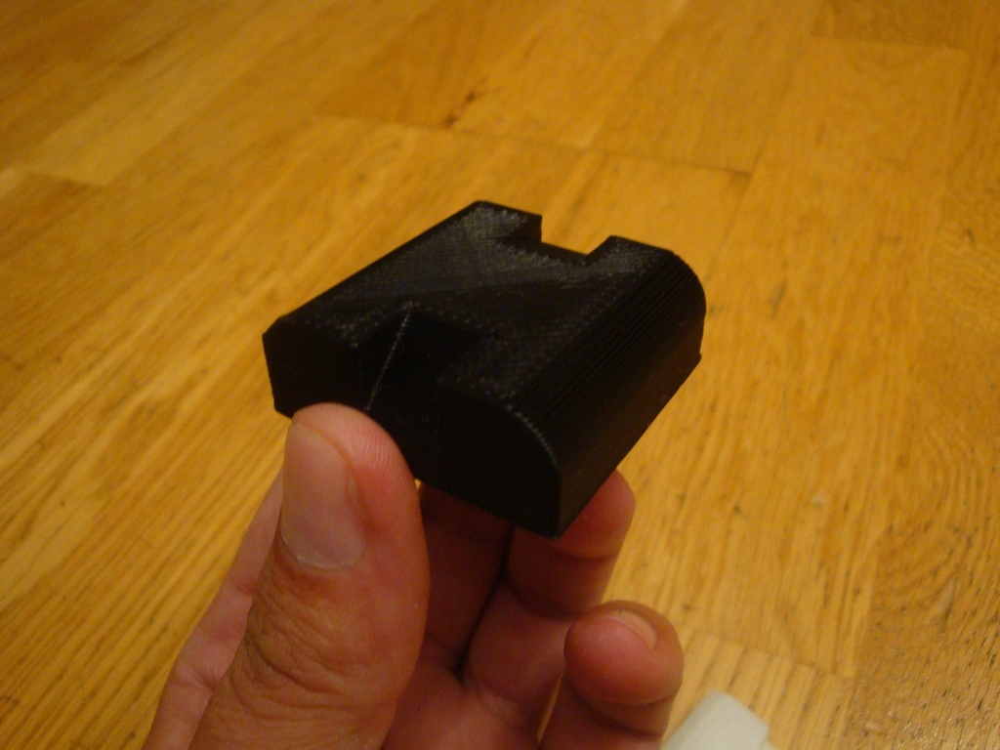
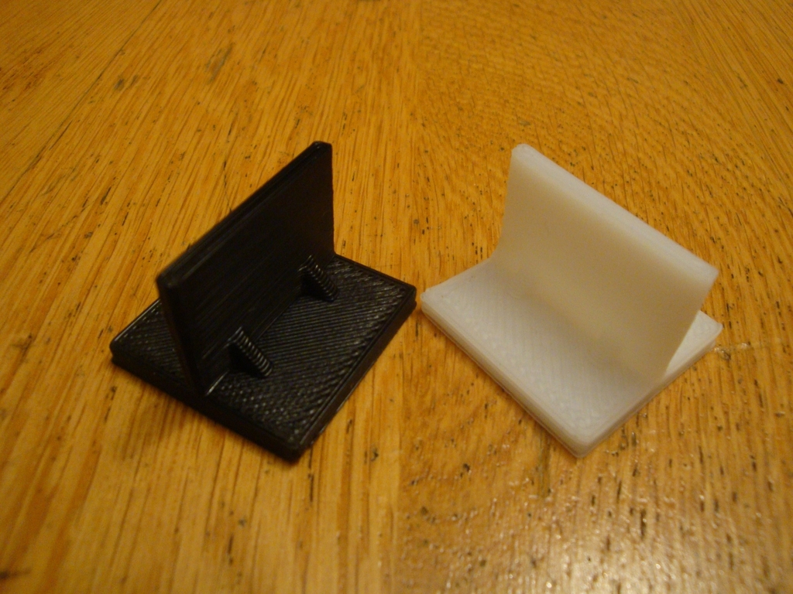
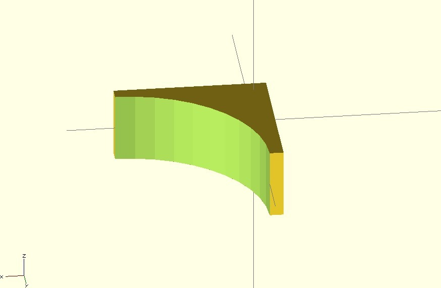

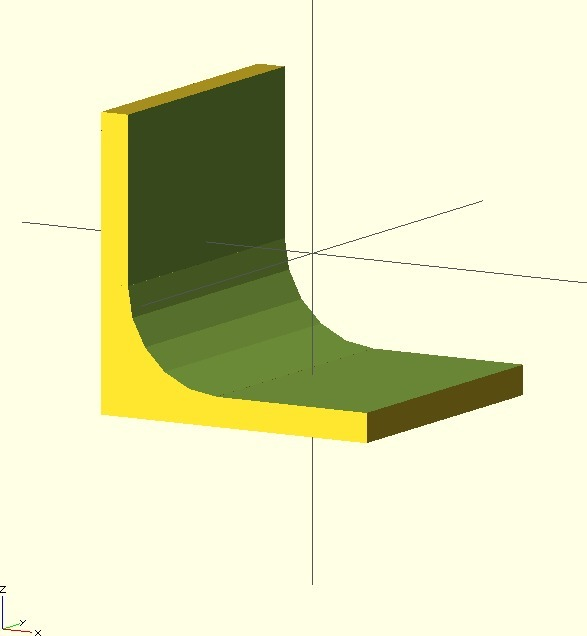
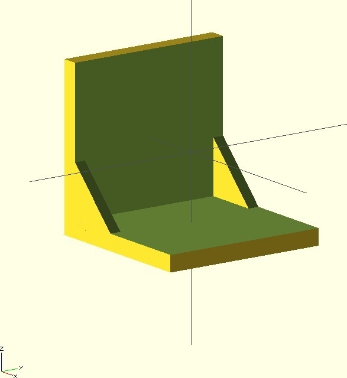

Tags
--------
library , obiscad , openscad , plastic_valley  

  

License
--------
Bevel library for OpenScad by obijuan is licensed under the Creative Commons - Attribution - Share Alike license.  

By: Juan Gonzalez-Gomez (Obijuan)
--------
<http://www.iearobotics.com/wiki/index.php?title=Juan_Gonzalez:Main>