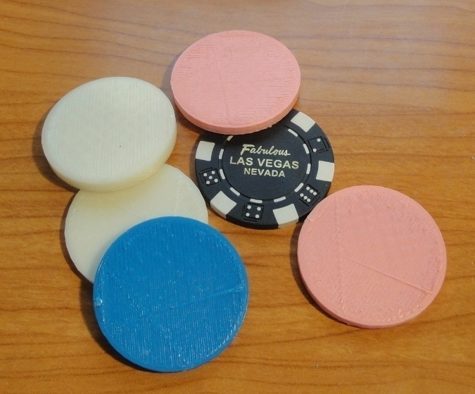
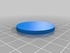
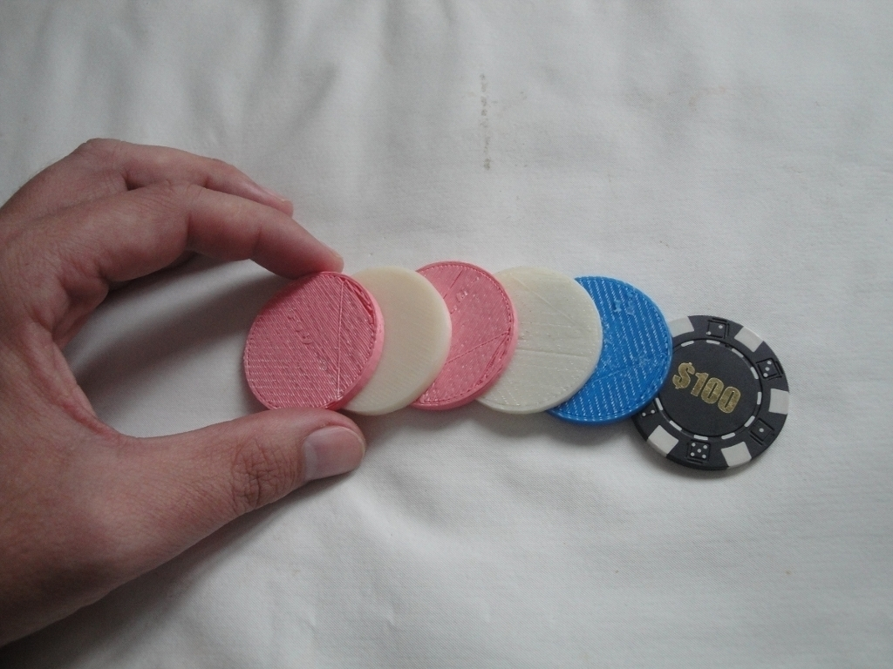
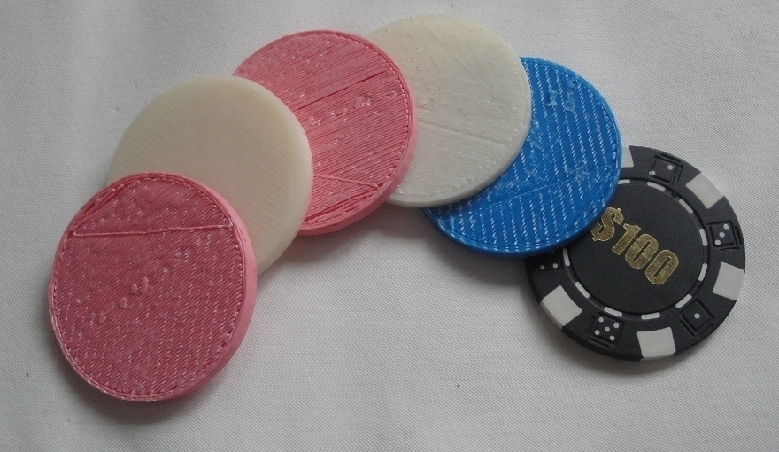
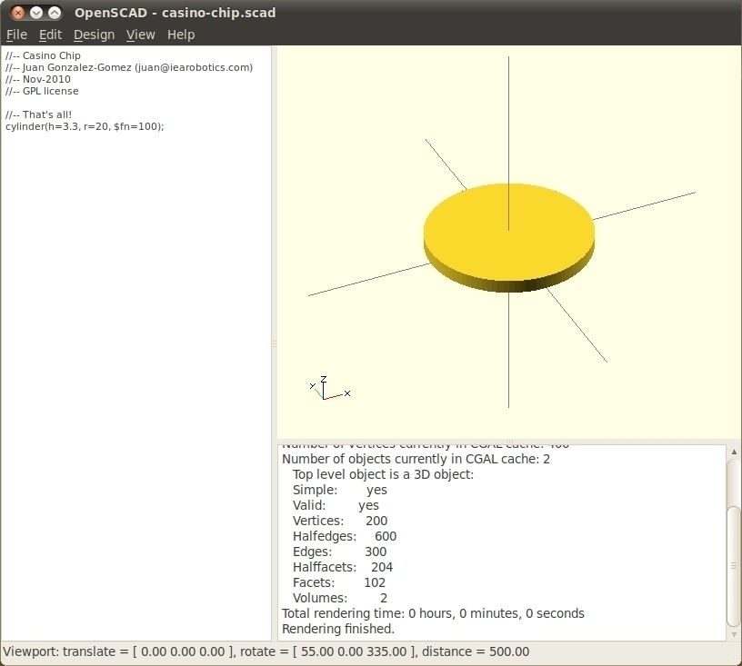
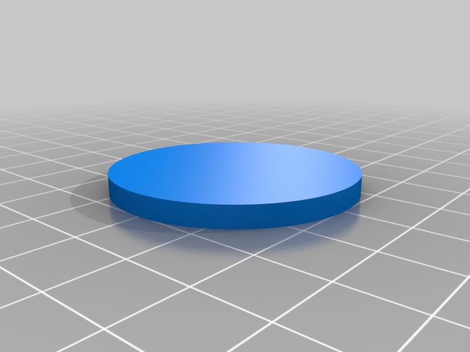

Casino chips
===============
**Please note: This thing is part of a list that was [automatically generated](https://github.com/carlosgs/export-things) and may have been updated since then. Make sure to check for the current license and authorship.**  

Casino chips  by obijuan , published Nov 7, 2010

Description
--------
A casino chip. It is a very simple object, but, hey! If you are so lazy just download it and print tons of casino Chips! Have fun with your friends at home playing poker and other games! 
 
More information in Spanish and the SVN repository can be found on this link: 
 
<a href="http://www.iearobotics.com/wiki/index.php?title=Objeto_3D:Ficha_de_casino" target="_blank" rel="nofollow">iearobotics.com/wiki/index.php?title=Objeto_3D:Ficha_de_casino</a>

Instructions
--------
Download it, skeingforge it and print it!

Files
--------

 [ casino-chip.scad](casino-chip.scad)  

 [ casino-chip.stl](casino-chip.stl)  

Pictures
--------

Tags
--------
3D , game , makerbot , openscad  

  

License
--------
Casino chips by obijuan is licensed under the Creative Commons - Attribution - Share Alike license.  

By: Juan Gonzalez-Gomez (Obijuan)
--------
<http://www.iearobotics.com/wiki/index.php?title=Juan_Gonzalez:Main>