Clone wars plate id
===============
**Please note: This thing is part of a list that was [automatically generated](https://github.com/carlosgs/export-things) and may have been updated since then. Make sure to check for the current license and authorship.**  

Clone wars plate id  by obijuan , published Dec 6, 2012

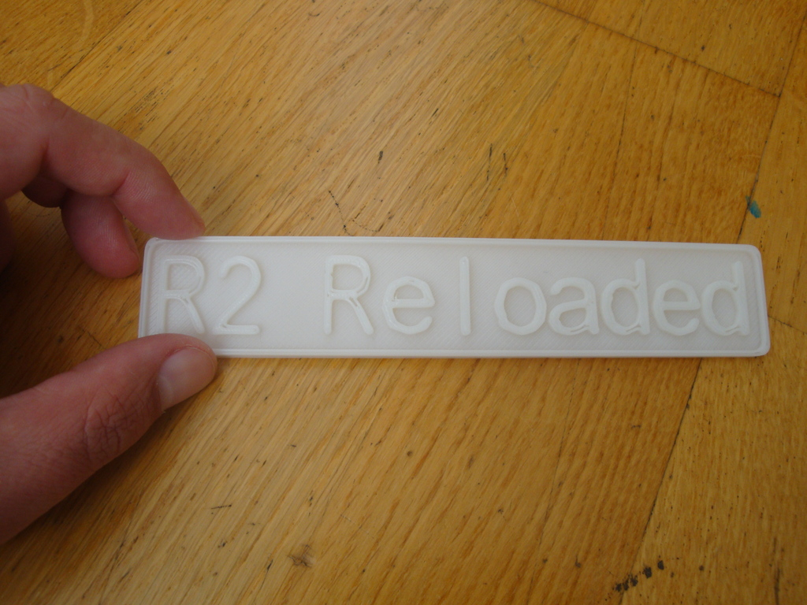

Description
--------
Identification plate for your printer. It is intended for the printers (clones) of the Clone wars project. We are more than 80! 
 
<a href="http://www.reprap.org/wiki/Proyecto_Clone_Wars" target="_blank" rel="nofollow">reprap.org/wiki/Proyecto_Clone_Wars</a> 
 
The plate has been designed using the wonderfull Write library for openscad, developed by HarlanDMII: 
 
<a href="http://www.thingiverse.com/thing:16193" target="_blank" rel="nofollow">thingiverse.com/thing:16193</a> 
 
More information of this plates (in spanish): 
<a href="http://www.iearobotics.com/wiki/index.php?title=Placa_de_identificaci%C3%B3n_clonewars" target="_blank" rel="nofollow">iearobotics.com/wiki/index.php?title=Placa_de_identificaci%C3%B3n_clonewars</a>

Instructions
--------
1) Open the main.scad file 
2) Change the examples, adding the name of your printer 
3) Print! 
 
If it is better to print the plates with the Extra Shells to 0 (Tab Fill in Skeinforge) 
 
Additionally you can print the Prusa decorators to fit the plate to your Prusa 
 
<a href="http://www.thingiverse.com/thing:20008" target="_blank" rel="nofollow">thingiverse.com/thing:20008</a>

Files
--------

 [ clonewars_id_openscad_src.zip](clonewars_id_openscad_src.zip)  

[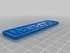](mamabot_plate_id.stl)
 [ mamabot_plate_id.stl](mamabot_plate_id.stl)  

[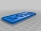](x-wing_plate_id.stl)
 [ x-wing_plate_id.stl](x-wing_plate_id.stl)  

[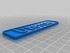](Uterus_plate_id.stl)
 [ Uterus_plate_id.stl](Uterus_plate_id.stl)  

 [ R2-Reloaded.stl](R2-Reloaded.stl)  

Pictures
--------
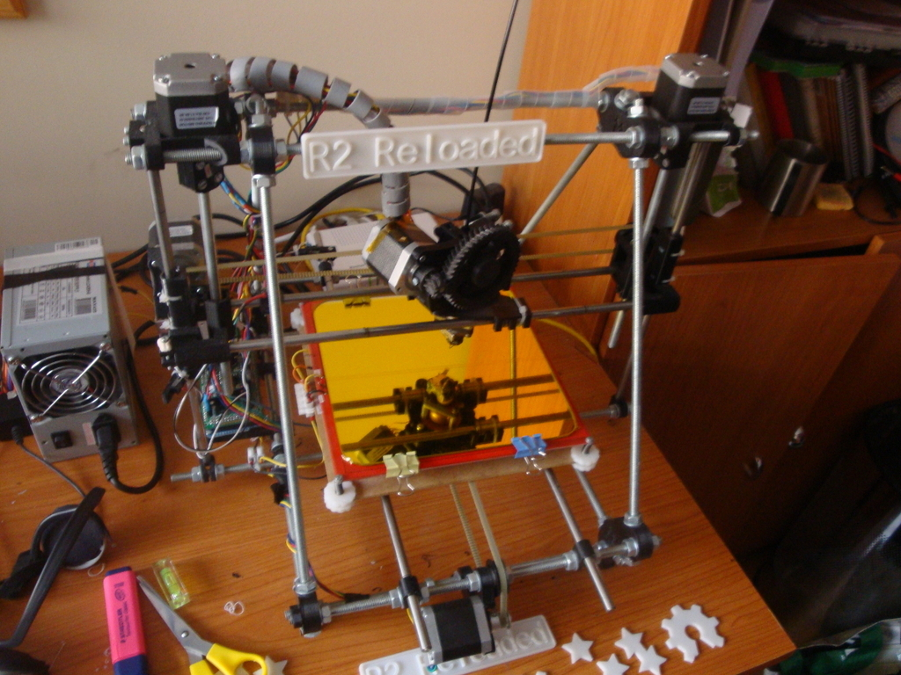
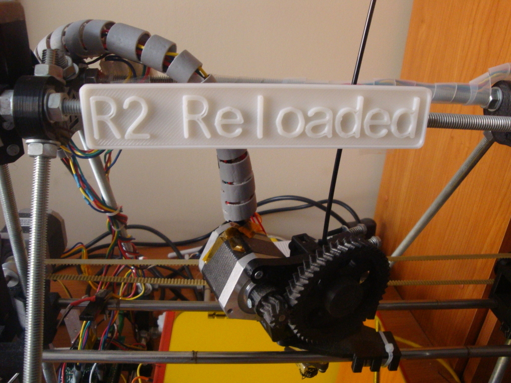
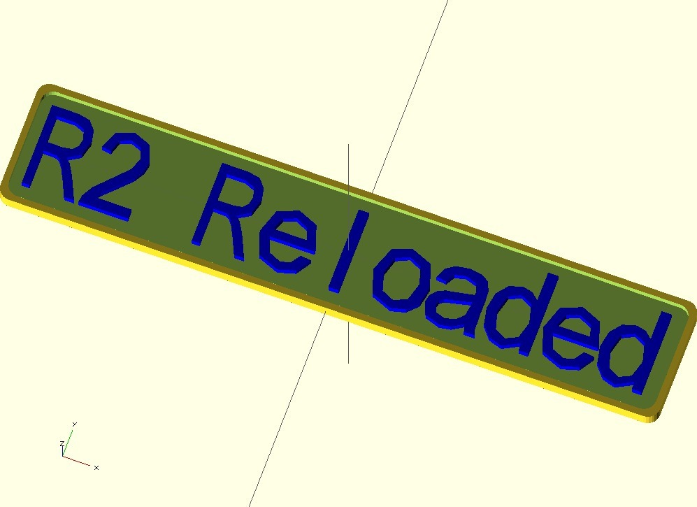
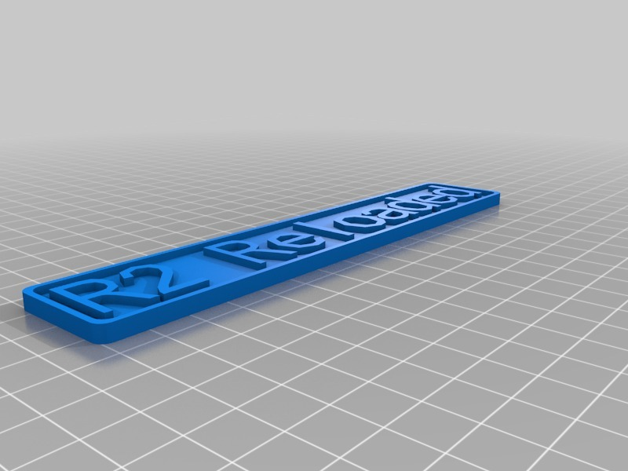
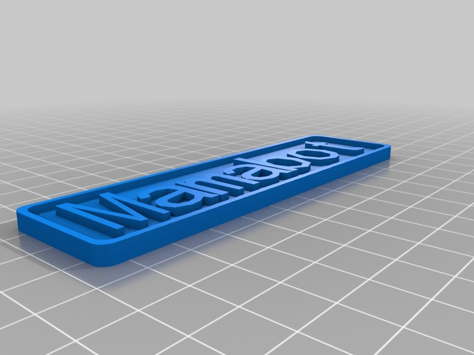
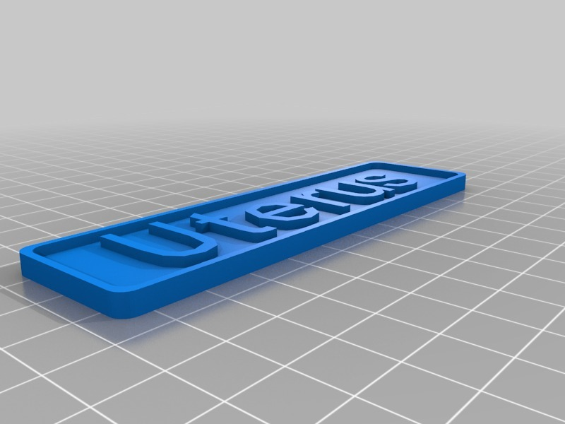
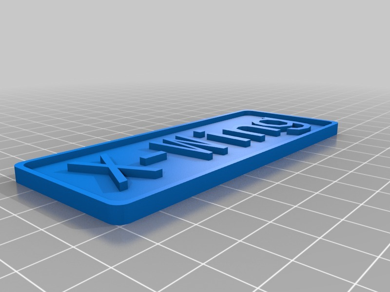
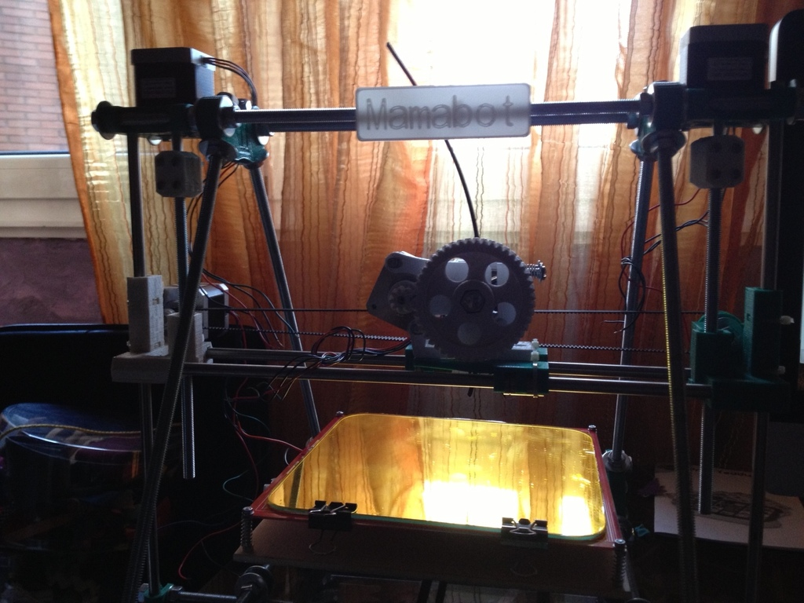

Tags
--------
clone_wars , openscad , plastic_valley , plate  

  

License
--------
Clone wars plate id by obijuan is licensed under the Creative Commons - Attribution - Share Alike license.  

By: Juan Gonzalez-Gomez (Obijuan)
--------
<http://www.iearobotics.com/wiki/index.php?title=Juan_Gonzalez:Main>