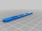
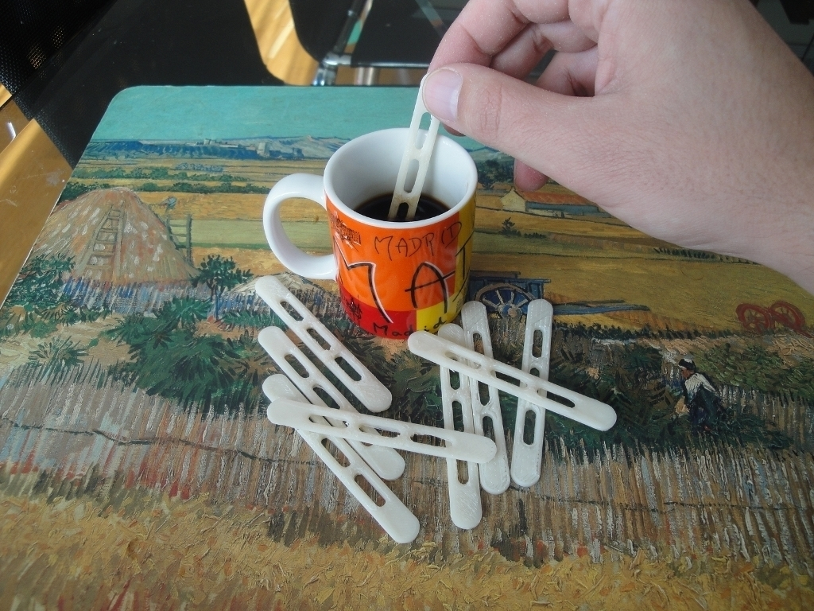
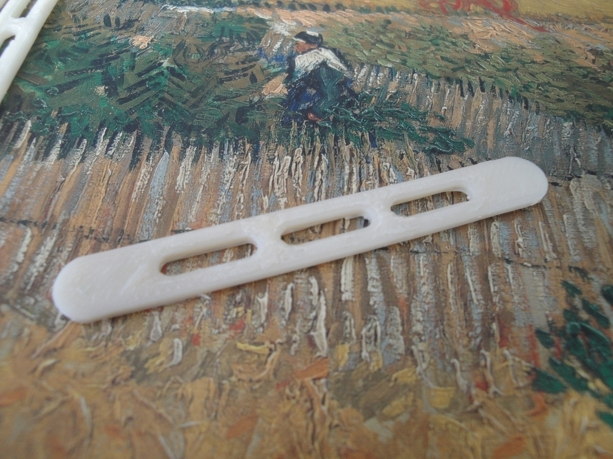
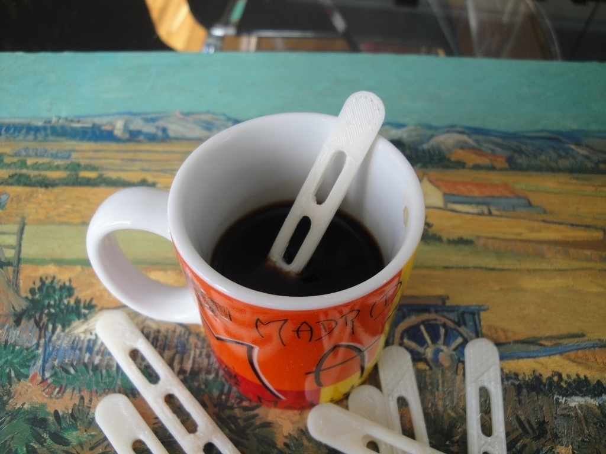
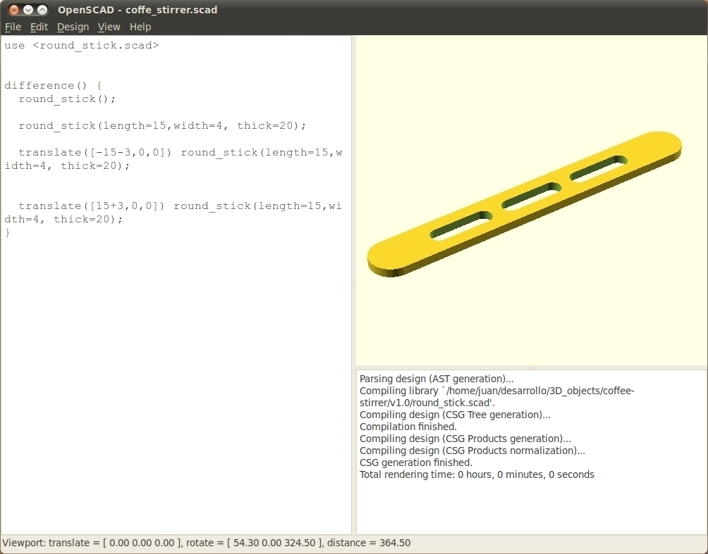

Coffee Stirrer
===============
**Please note: This thing is part of a list that was [automatically generated](https://github.com/carlosgs/export-things) and may have been updated since then. Make sure to check for the current license and authorship.**  

Coffee Stirrer  by obijuan , published Nov 20, 2010

Description
--------
I have a coffee machine in my working room. Sometimes we forget to buy coffee stirrers... but now it is no problem. We can easily print them :-) 
 
It has been designed with <b>OpenScad</b> 
 
By the way, the coffee tastes better if you use your own printed coffee stirrer! 
 
SVN repository, pictures and more information: 
<a href="http://www.iearobotics.com/wiki/index.php?title=Objeto_3D:_Cucharillas_para_el_caf%C3%A9" target="_blank" rel="nofollow">iearobotics.com/wiki/index.php?title=Objeto_3D:_Cucharillas_para_el_caf%C3%A9</a> 

Instructions
--------
Download, print and... have a nice coffee!

Files
--------

 [ coffee-stirrer-v1.0.zip](coffee-stirrer-v1.0.zip)  

 [ coffee-stirrer.stl](coffee-stirrer.stl)  

Pictures
--------

Tags
--------
coffee , makerbot , openscad , plastic valley , UC3M  

  

License
--------
Coffee Stirrer by obijuan is licensed under the Creative Commons - Attribution - Share Alike license.  

By: Juan Gonzalez-Gomez (Obijuan)
--------
<http://www.iearobotics.com/wiki/index.php?title=Juan_Gonzalez:Main>