Endstop Clamp
===============
**Please note: This thing is part of a list that was [automatically generated](https://github.com/carlosgs/export-things) and may have been updated since then. Make sure to check for the current license and authorship.**  

Endstop Clamp  by obijuan , published Apr 8, 2013

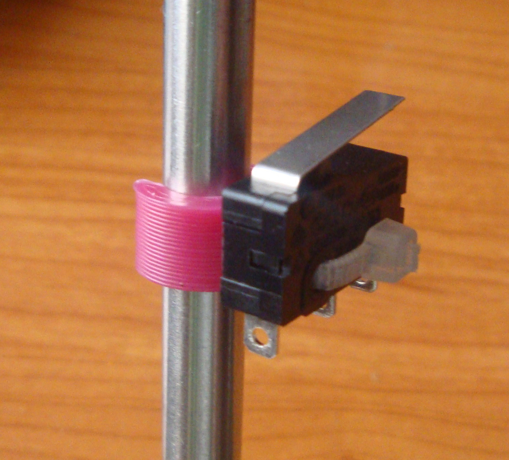

Description
--------
A very simple endstop holder with a clamp to attach it to an M8 smooth bar.  I am using it in my Prusa i3   
 
More information in spanish:   
 
<a href="http://www.iearobotics.com/wiki/index.php?title=Objetos_3D" target="_blank" rel="nofollow">iearobotics.com/wiki/index.php?title=Objetos_3D</a>

Instructions
--------
You need a small endstop, a zip tie and the endstop clamp   
 
1)  As shown in the pictures, use the zip tie to attach the endstop to the clamp   
 
2 Attach the clamp to the smooth bar

Files
--------

 [ endstop-clamp.scad](endstop-clamp.scad)  

 [ endstop-clamp.stl](endstop-clamp.stl)  

Pictures
--------

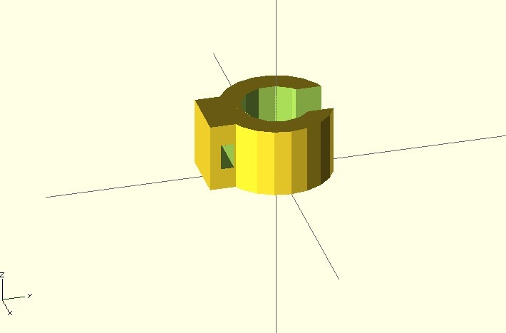
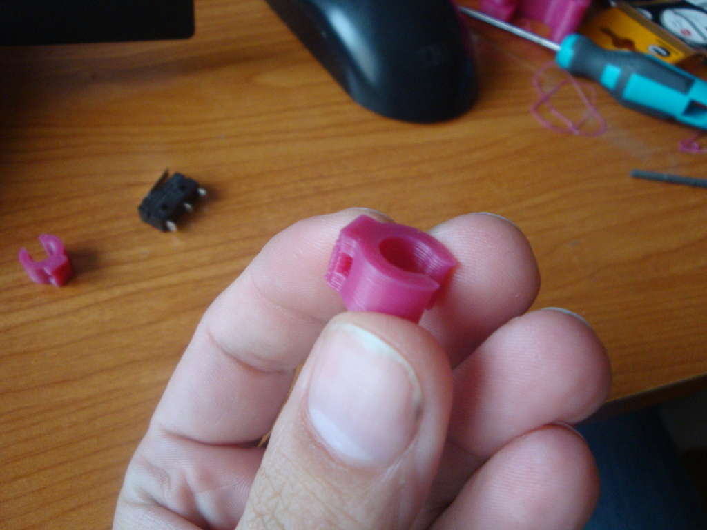
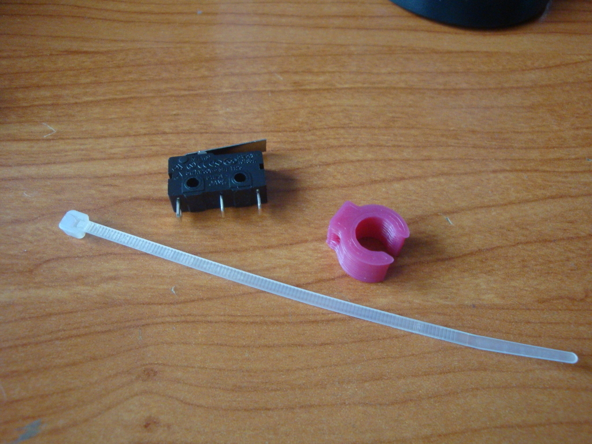
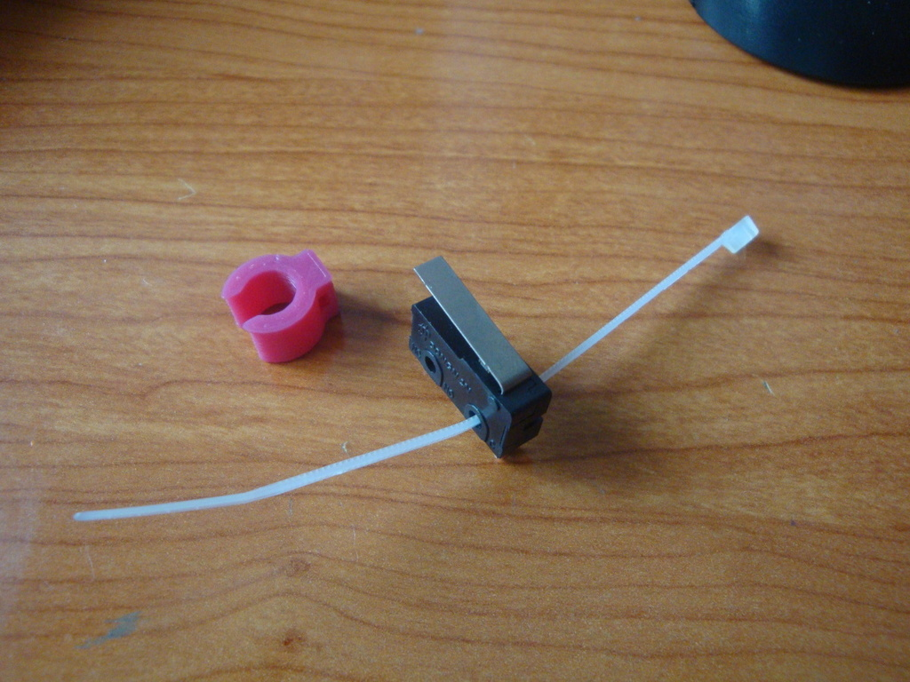
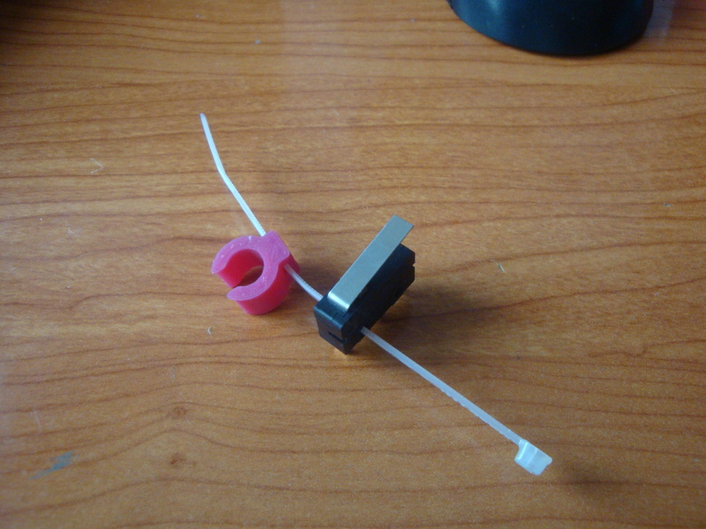
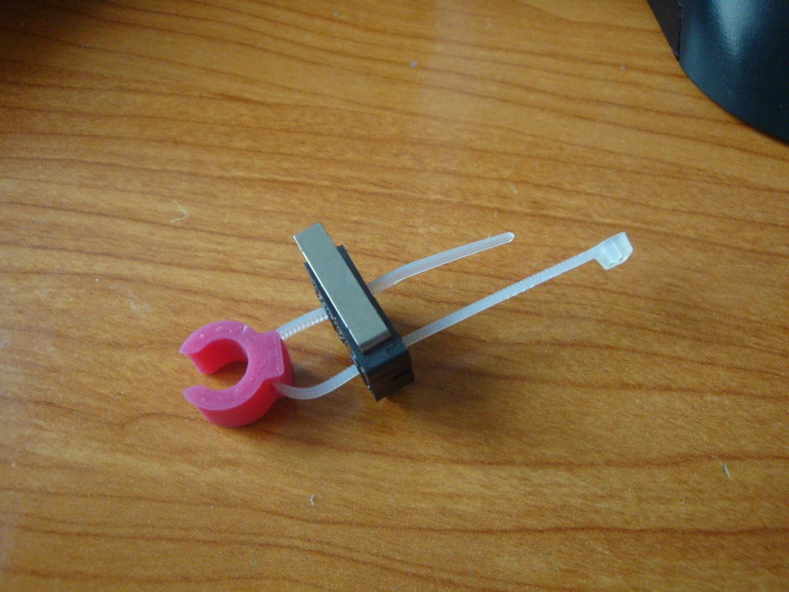
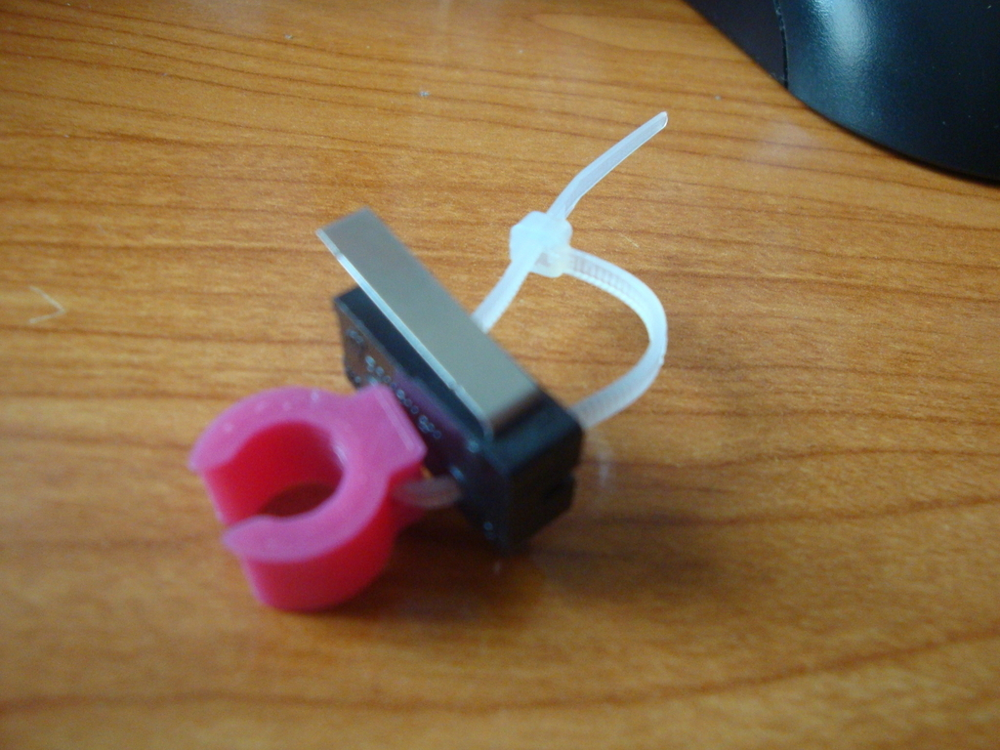
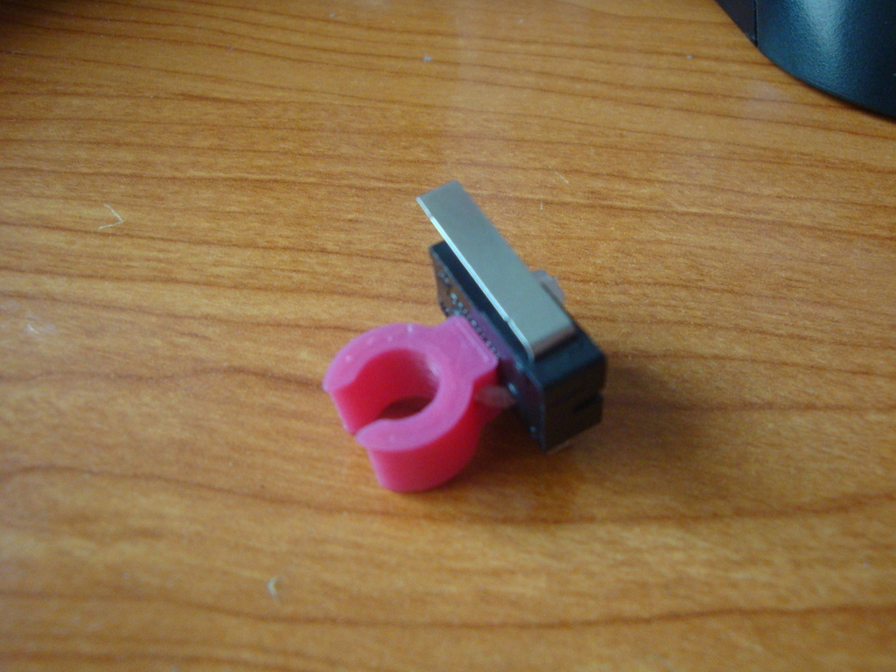
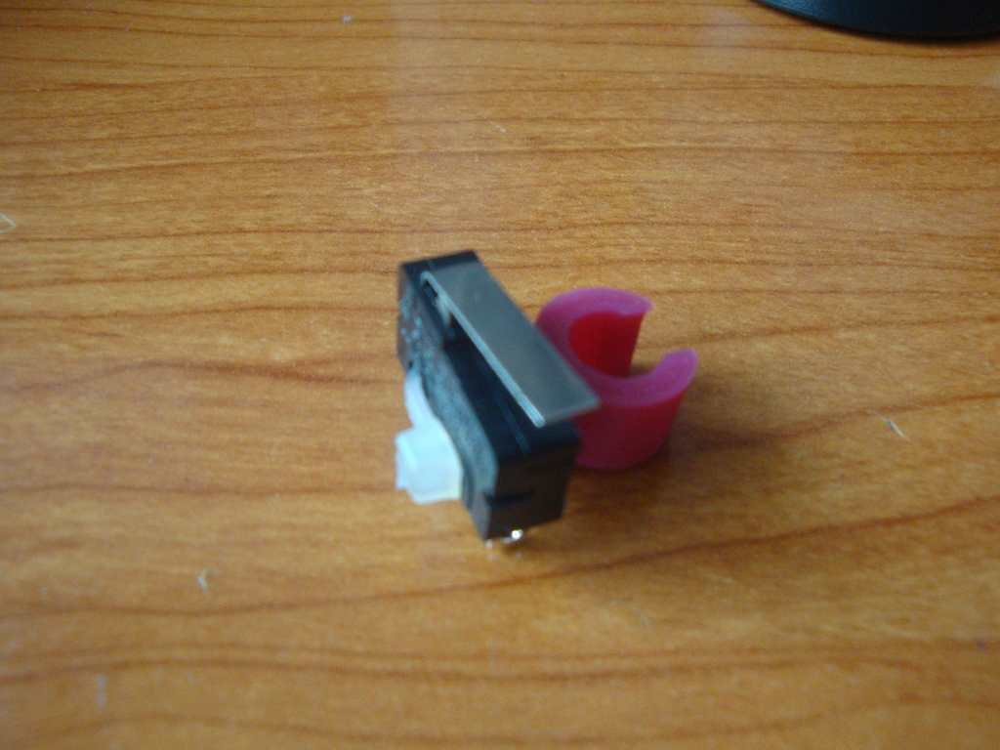
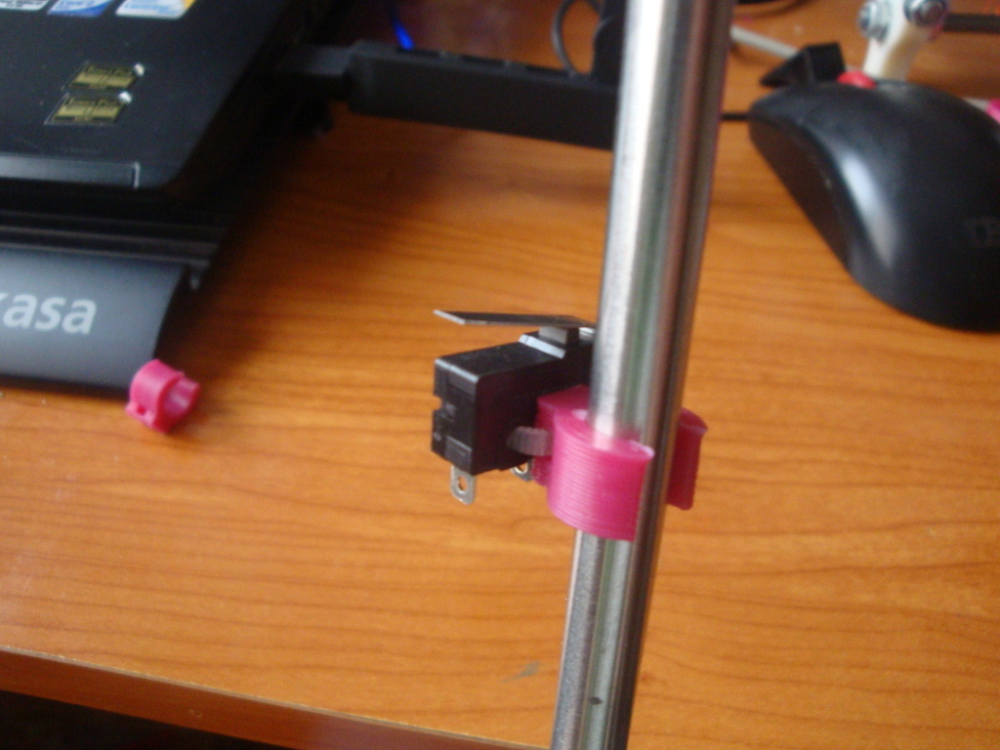

Tags
--------
endstop , prusa_i3  

  

License
--------
Endstop Clamp by obijuan is licensed under the Creative Commons - Attribution license.  

By: Juan Gonzalez-Gomez (Obijuan)
--------
<http://www.iearobotics.com/wiki/index.php?title=Juan_Gonzalez:Main>