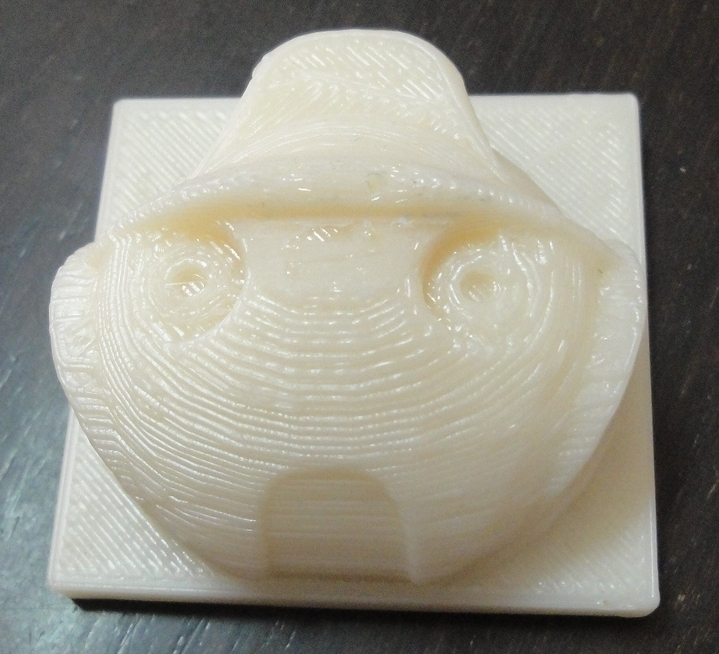
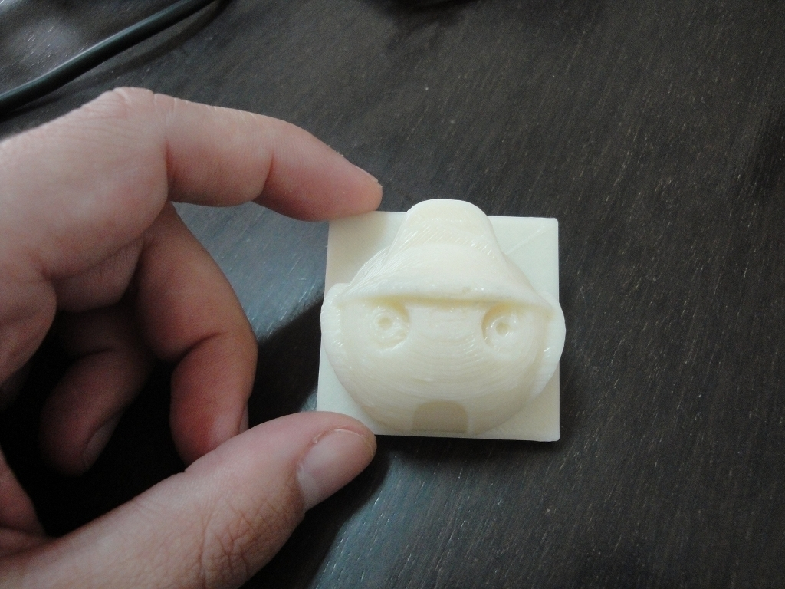
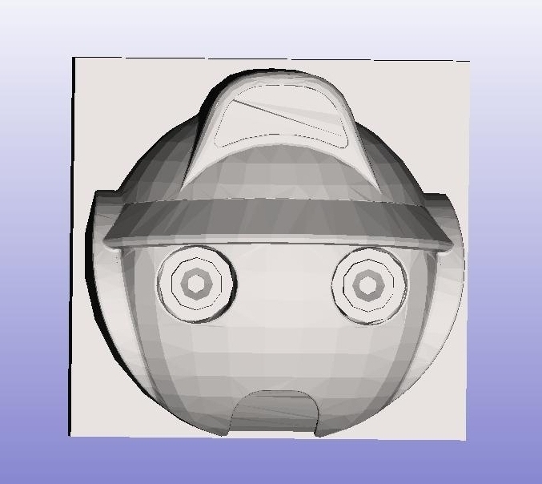
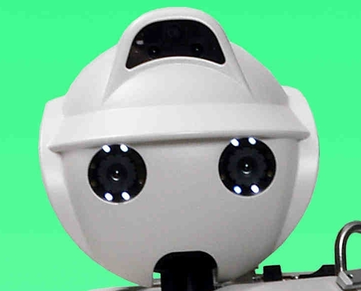
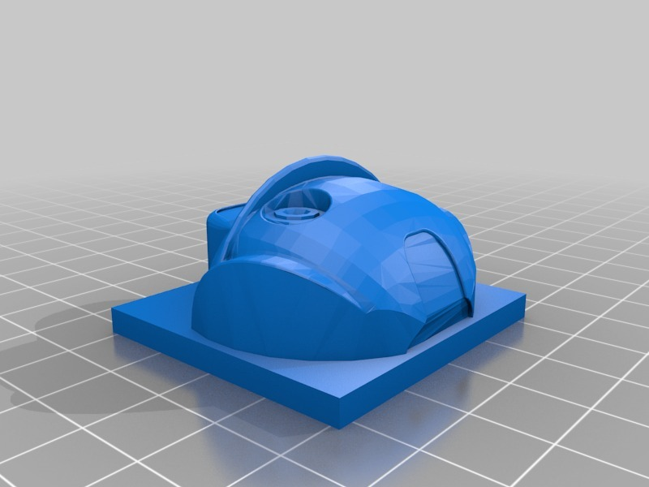

Hoap Robot's head
===============
**Please note: This thing is part of a list that was [automatically generated](https://github.com/carlosgs/export-things) and may have been updated since then. Make sure to check for the current license and authorship.**  

Hoap Robot's head  by obijuan , published Nov 26, 2010

Description
--------
The head of the Hoap robot. This is the humanoid robot developed by Fujitsu

Instructions
--------
Just print and enjoy!

Files
--------

 [ Hoap-face.blend](Hoap-face.blend)  

 [ Hoap-face.stl](Hoap-face.stl)  

Pictures
--------

Tags
--------
blender , makerbot , plastic valley , robot , toy , UC3M  

  

License
--------
Hoap Robot's head by obijuan is licensed under the Creative Commons - Attribution - Share Alike license.  

By: Juan Gonzalez-Gomez (Obijuan)
--------
<http://www.iearobotics.com/wiki/index.php?title=Juan_Gonzalez:Main>