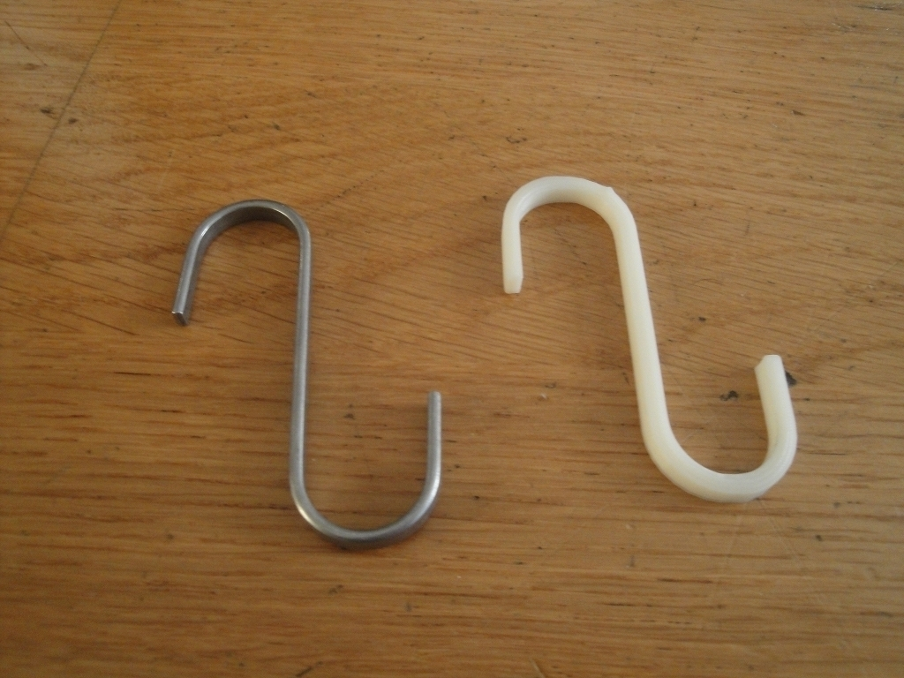
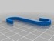
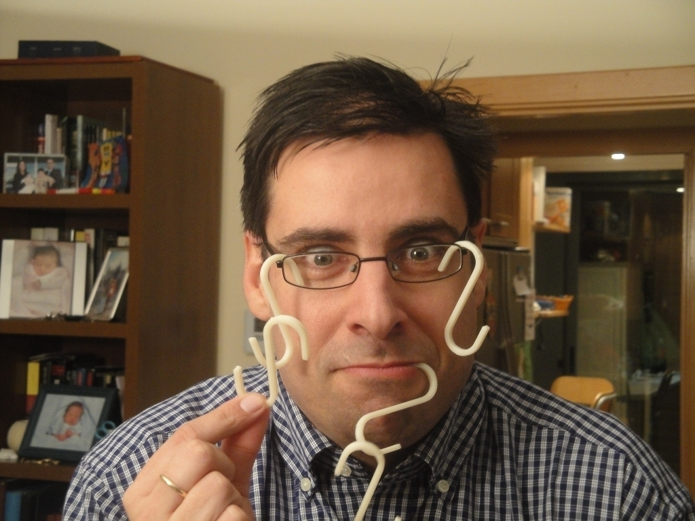
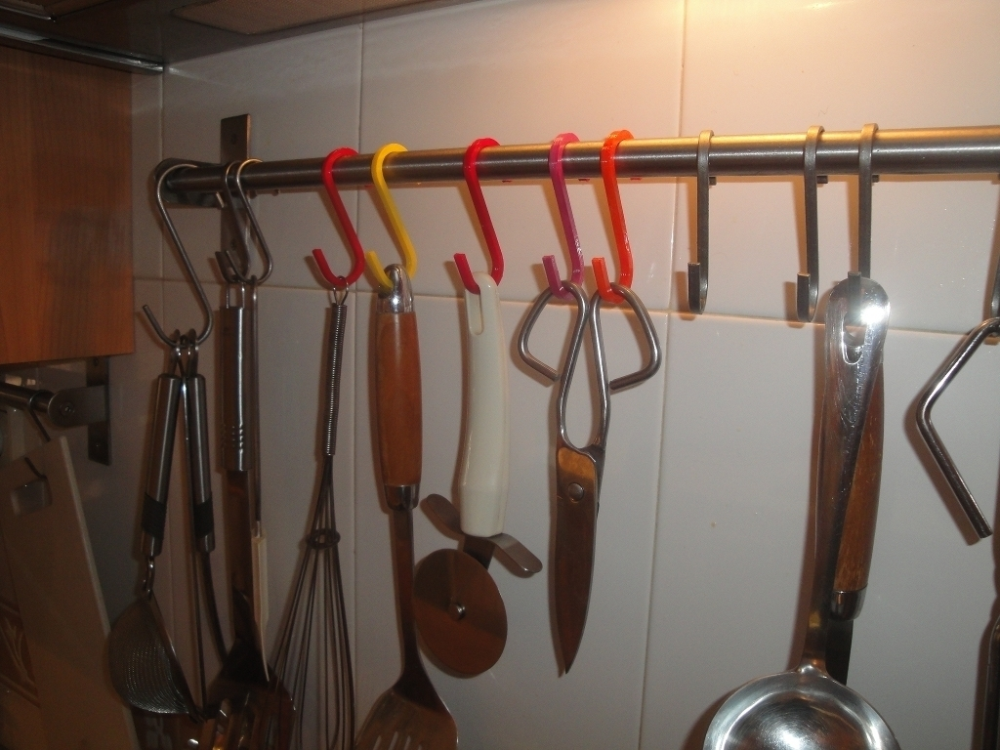
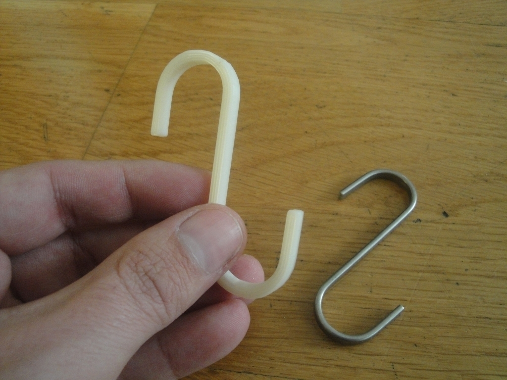
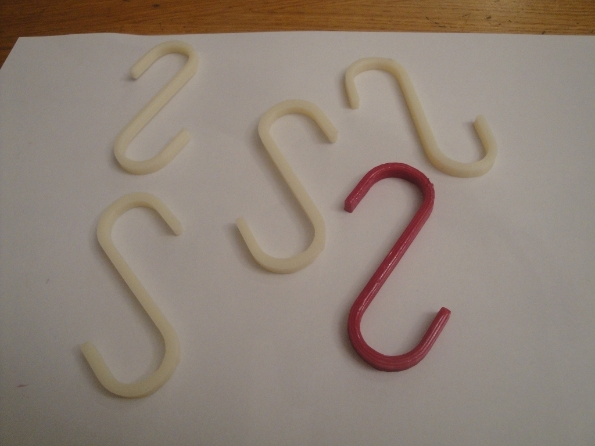
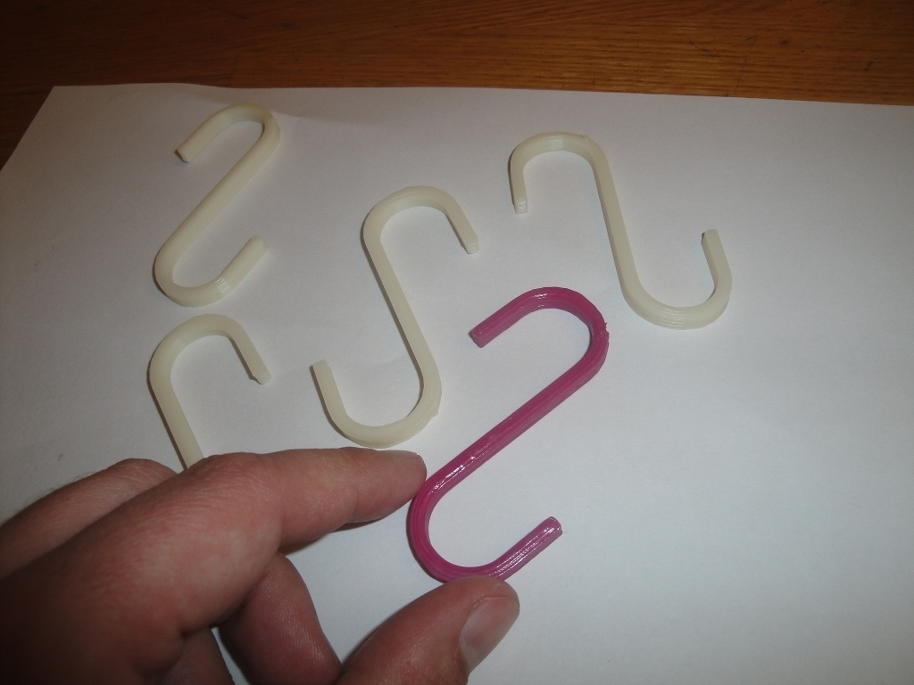
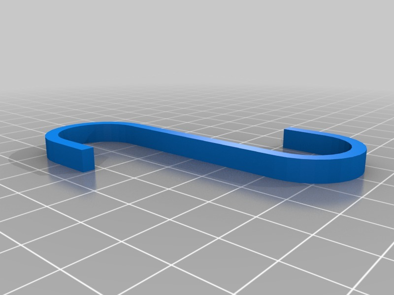

Ikea hook clone
===============
**Please note: This thing is part of a list that was [automatically generated](https://github.com/carlosgs/export-things) and may have been updated since then. Make sure to check for the current license and authorship.**  

Ikea hook clone  by obijuan , published Jan 7, 2012

Description
--------
My wife wanted me to buy more Ikea hooks for the kitchen... As I am too lazy I decided to design the hook in openscad and print some of them! 
 
  As a bonus, I designed a parameterized Ikea hook so that the diameter, length, width and height can be easily changed

Instructions
--------
Just print as many as you want!!!

Files
--------

 [ Ikea-hook.stl](Ikea-hook.stl)  

 [ Ikea-hook.scad](Ikea-hook.scad)  

Pictures
--------

Tags
--------
hook , kitchen , openscad , parametric , plastic valley , uc3m , useful  

  

License
--------
Ikea hook clone by obijuan is licensed under the Creative Commons - Attribution - Share Alike license.  

By: Juan Gonzalez-Gomez (Obijuan)
--------
<http://www.iearobotics.com/wiki/index.php?title=Juan_Gonzalez:Main>