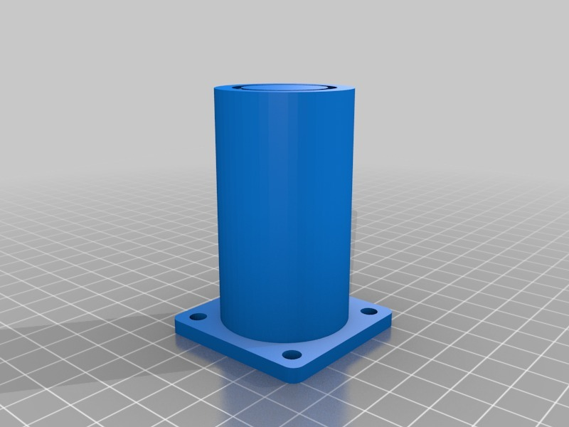
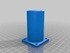
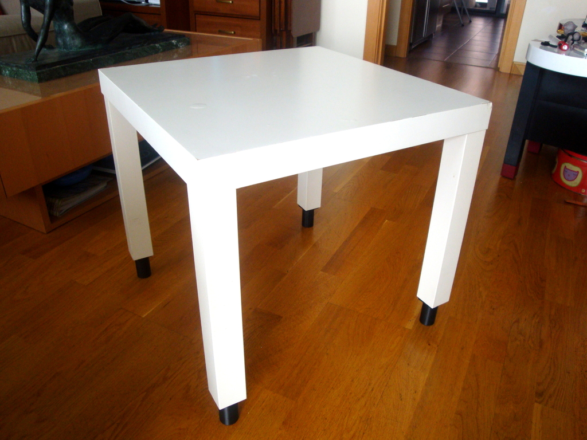
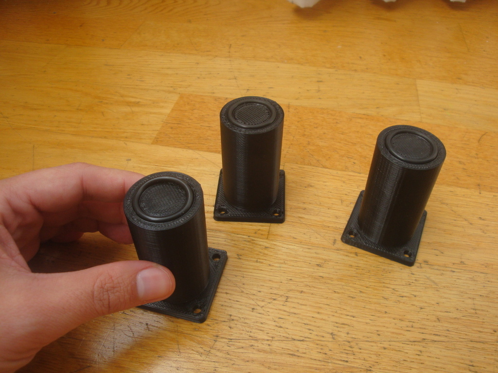
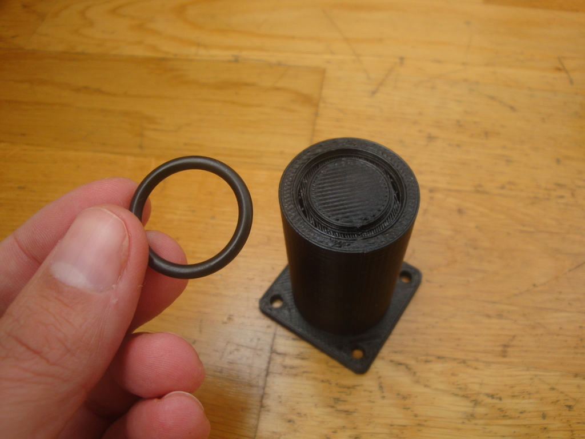
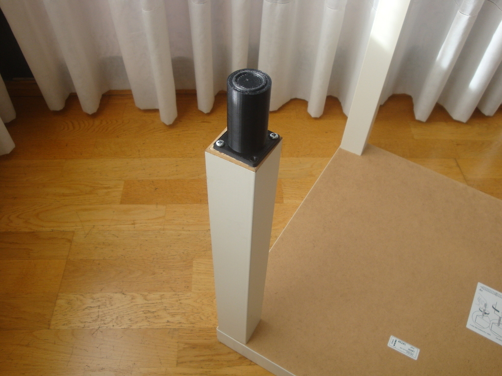
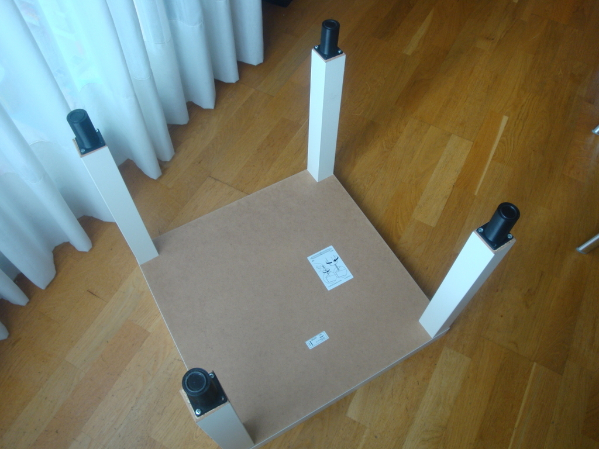
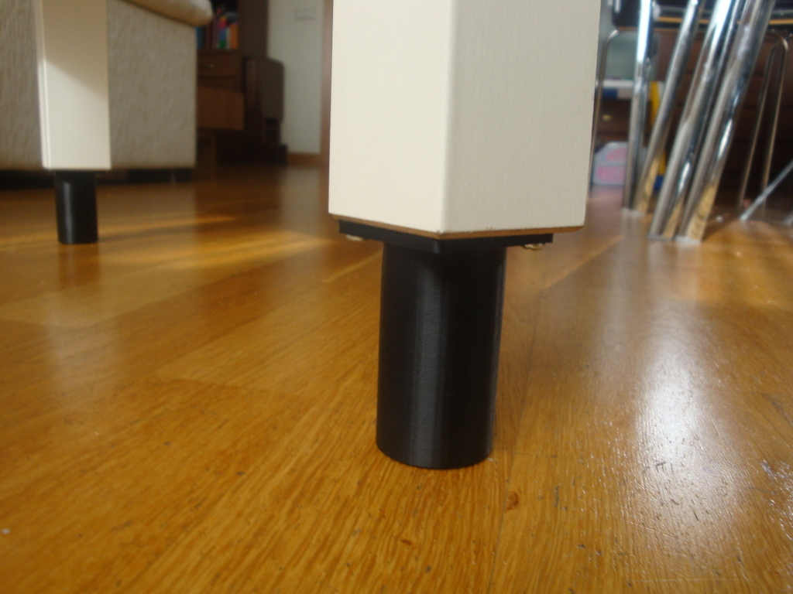
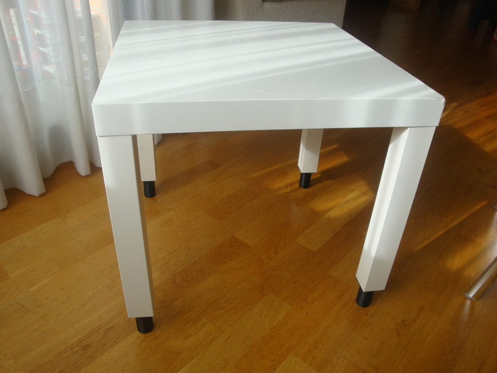
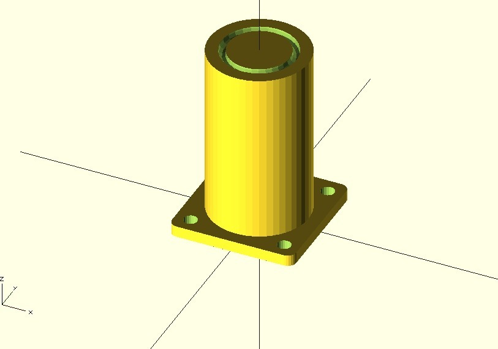

Ikea table foot
===============
**Please note: This thing is part of a list that was [automatically generated](https://github.com/carlosgs/export-things) and may have been updated since then. Make sure to check for the current license and authorship.**  

Ikea table foot  by obijuan , published Nov 28, 2012

Description
--------
My wife bought a small ikea table... but it was a little bit short. She asked me for help: "What can be do?". "-Do not worry, honey, I can print some feet for the table. How much higher should it be?" 
 
 
I modified the parametric table foot I had previously designed to fit my wife requirements 
 
The result is this part :-) 
 
You can find more information (in Spanish) in this wiki: 
 
 
 
<a href="http://www.iearobotics.com/wiki/index.php?title=Objeto_3D:_Pata_para_mesa_de_Ikea" target="_blank" rel="nofollow">iearobotics.com/wiki/index.php?title=Objeto_3D:_Pata_para_mesa_de_Ikea</a>

Instructions
--------
* Edit the source code to set your wife's requirements (height, diameter...) 
* Generate the SLT (openscad) 
* Add the O-ring (Default O-rings with internal diameter of 20mm and 3mm section) 
* Screw to the table legs 
* Make your wife happier 
 

Files
--------

 [ ikea_table_foot_openscad_src.zip](ikea_table_foot_openscad_src.zip)  

 [ Ikea_table_foot.stl](Ikea_table_foot.stl)  

Pictures
--------

Tags
--------
foot , ikea , openscad , plastic_valley , table  

  

License
--------
Ikea table foot by obijuan is licensed under the Creative Commons - Attribution - Share Alike license.  

By: Juan Gonzalez-Gomez (Obijuan)
--------
<http://www.iearobotics.com/wiki/index.php?title=Juan_Gonzalez:Main>