Mini-dome
===============
**Please note: This thing is part of a list that was [automatically generated](https://github.com/carlosgs/export-things) and may have been updated since then. Make sure to check for the current license and authorship.**  

Mini-dome  by obijuan , published Jul 15, 2012

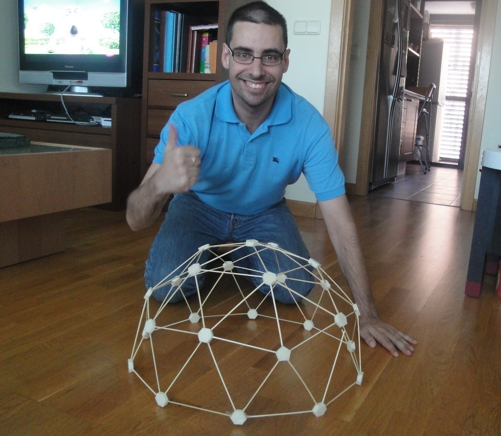

Description
--------
These are parameterized connectors for building small domes for learning. They are based on effalo's V2 dome kit. 
 
  I have re-written the scad files so that now it is possible to make small connectors that work with wooden sticks of very small diameter (3mm or less). 
 
  I have tested it building 2 domes that I've called as Mini-dome and Micro-dome, with diameters of 50cm and 15cm respectivelly. I have used wooden sticks with section of 3 and 2 mm, that are very cheap and very easy to find. 
 
  The connectors are parameterized. The user has to introduce the stick diameter (in mm) and the holedepth. The size of the connector (radius and height) will be automatically calculated. 
 
(More information in Spanish) 
La versin en Espaol la puedes ver aqu: 
<a href="http://www.iearobotics.com/wiki/index.php?title=Objeto_3D:_Mini_domo" target="_blank" rel="nofollow">iearobotics.com/wiki/index.php?title=Objeto_3D:_Mini_domo</a>

Instructions
--------
You can calculate your own stick length according to the total dome's diameter requiered: 
 
<a href="http://simplydifferently.org/Geodesic_Dome_Notes?page=3#2V/L2" target="_blank" rel="nofollow">simplydifferently.org/Geodesic_Dome_Notes?page=3#2V/L2</a> 
 
I have precalculated 2 examples. 
 
Example 1: Micro-dome 
* Diameter: 150 mm 
* Height: 75mm 
* 20 x Hexa-connectors 
* 6  x  Penta-connectors 
* 35 x Long sticks: 46.3mm (Green) 
* 30 x shot sticks: 41mm (Red) 
 
Example 2: Mini-dome 
* Diameter: 50cm 
* Height: 25cm 
* 20 x Hexa-connectors 
* 6  x  Penta-connectors 
* 35 x Long sticks: 154.5 mm (Green) 
* 30 x shot sticks: 136.6 mm (Red) 
 

Files
--------

 [ Mini-dome-hexa.scad](Mini-dome-hexa.scad)  

[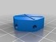](Mini-dome-hexa.stl)
 [ Mini-dome-hexa.stl](Mini-dome-hexa.stl)  

[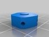](Micro-dome-penta.stl)
 [ Micro-dome-penta.stl](Micro-dome-penta.stl)  

[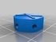](Micro-dome-hexa.stl)
 [ Micro-dome-hexa.stl](Micro-dome-hexa.stl)  

 [ Mini-dome-penta.stl](Mini-dome-penta.stl)  

 [ Mini-dome-penta.scad](Mini-dome-penta.scad)  

Pictures
--------
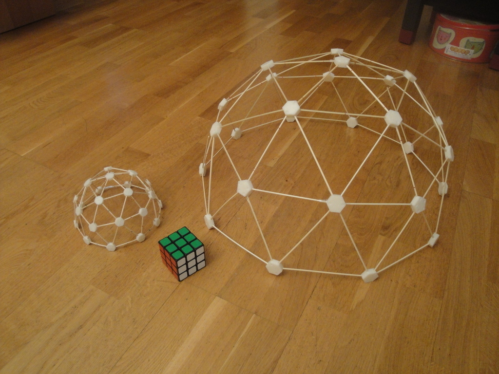
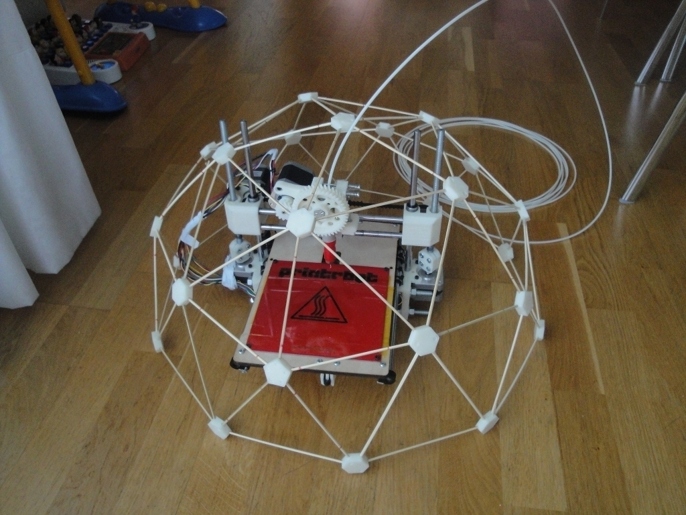
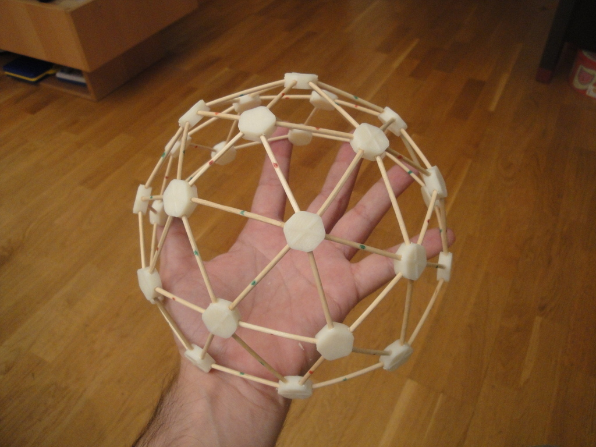
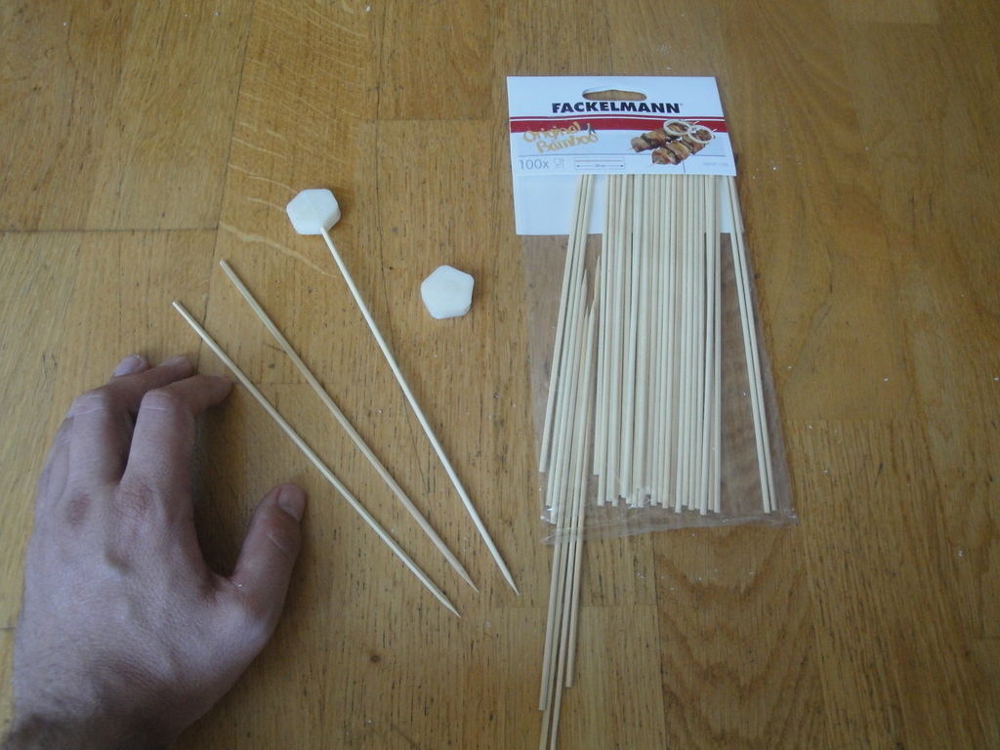

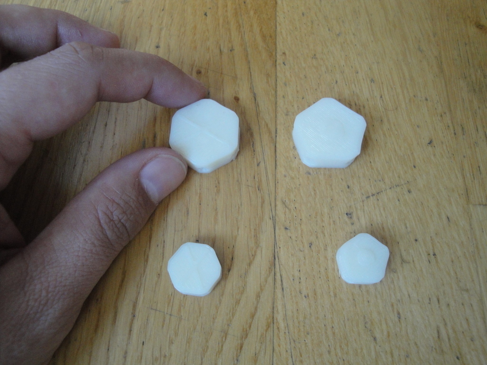
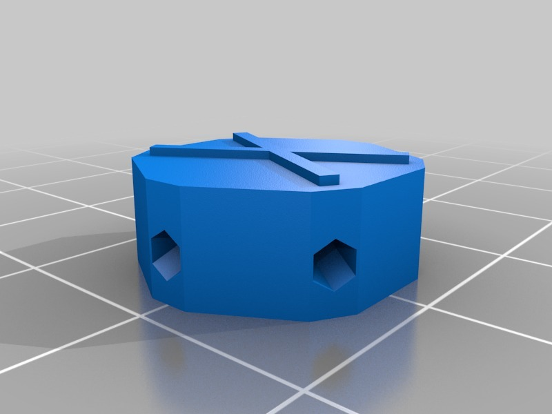
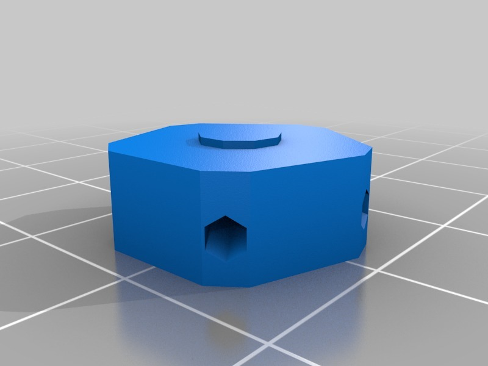
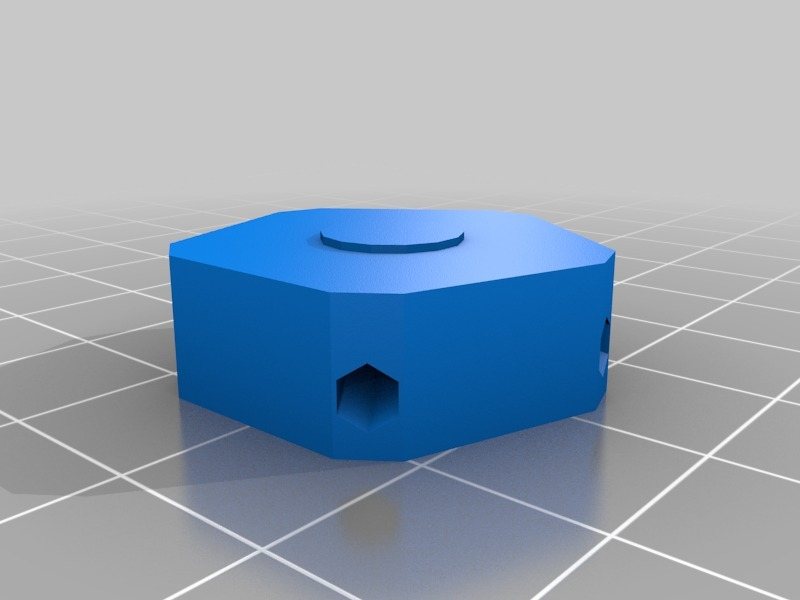
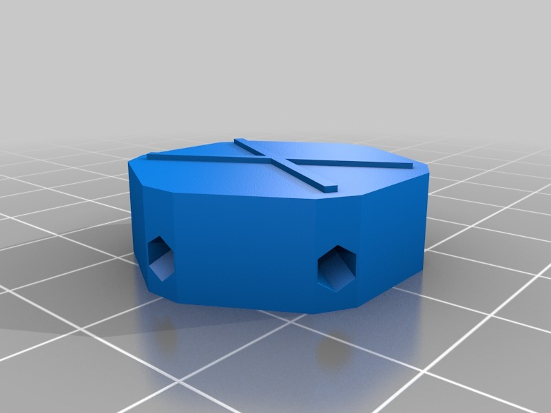

Tags
--------
dome , geodesic , openscad , plastic_valley , Polyhedra , sphere , upm  

  

License
--------
Mini-dome by obijuan is licensed under the Creative Commons - Attribution - Share Alike license.  

By: Juan Gonzalez-Gomez (Obijuan)
--------
<http://www.iearobotics.com/wiki/index.php?title=Juan_Gonzalez:Main>