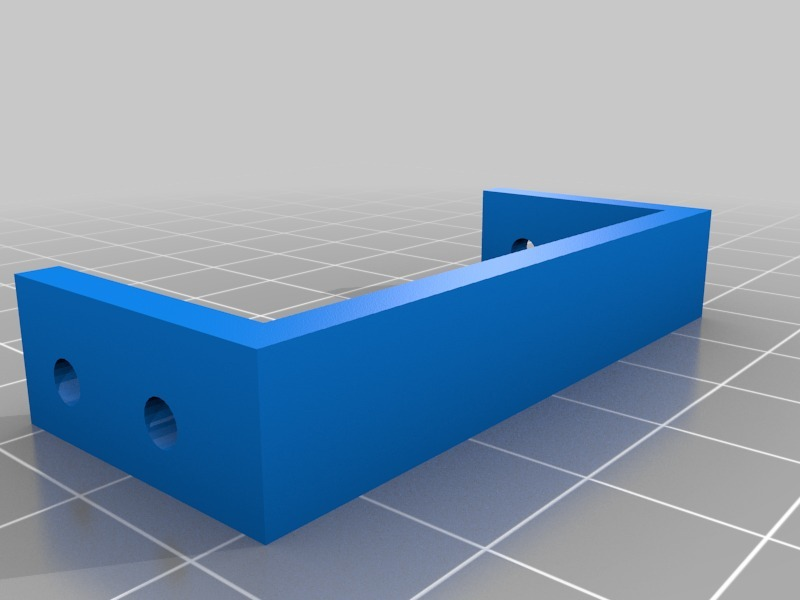
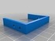
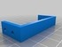
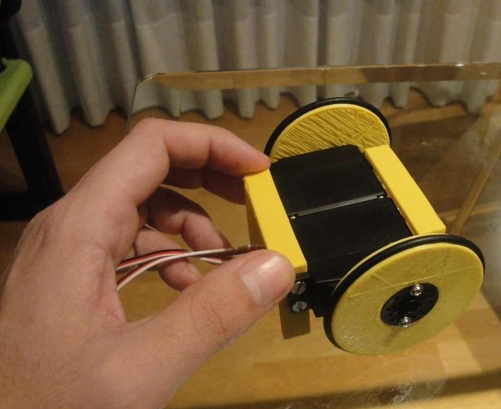
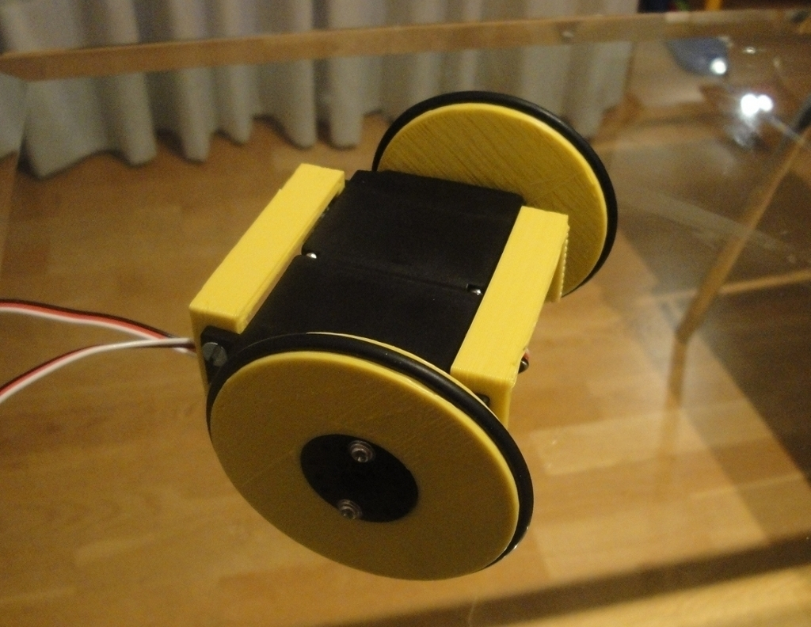
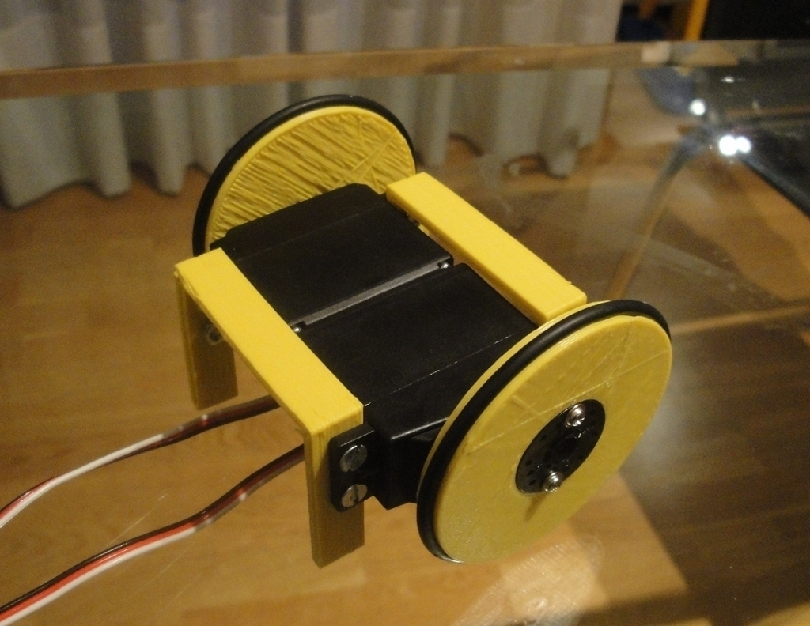
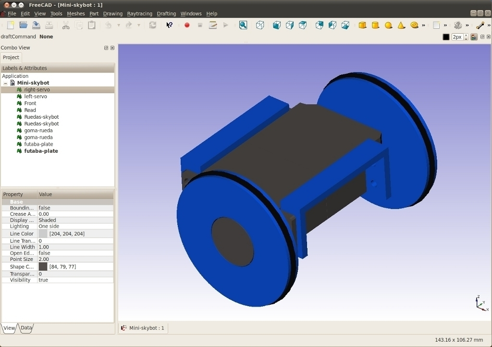
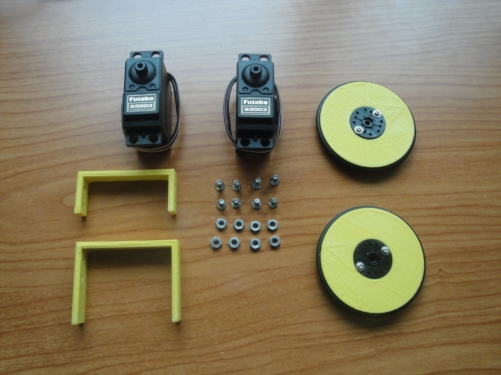
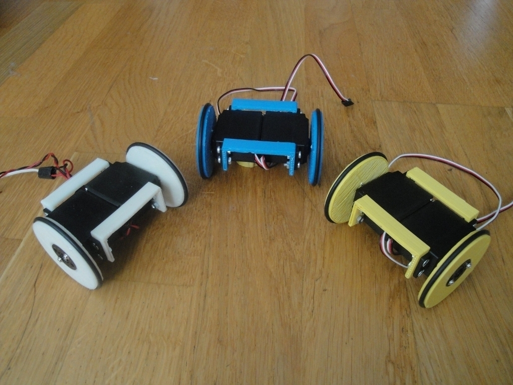
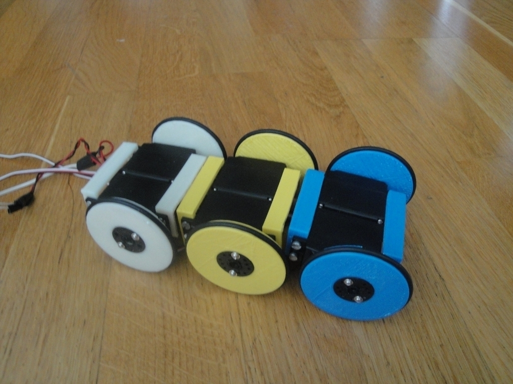

MiniSkybot Robot Chassis
===============
**Please note: This thing is part of a list that was [automatically generated](https://github.com/carlosgs/export-things) and may have been updated since then. Make sure to check for the current license and authorship.**  

MiniSkybot Robot Chassis  by obijuan , published Nov 28, 2010

Description
--------
The MiniSkybot robot is an educational open robot. Its chassis is minimal: it consist only of two tricked servos joined by two U-pieces. 
 
Now the robot is in an early stage of development. We are testing different minimal chassis. 
 
You can see a video Here: <a href="http://www.youtube.com/watch?v=x1v-4ejwBKk" target="_blank" rel="nofollow">youtube.com/watch?v=x1v-4ejwBKk</a> 
(This video is intended for my students so I am talking in Spanish) 
 
More information here: 
<a href="http://www.iearobotics.com/wiki/index.php?title=Mini-Skybot:_Ch%C3%A1sis" target="_blank" rel="nofollow">iearobotics.com/wiki/index.php?title=Mini-Skybot:_Ch%C3%A1sis</a> 
 
The pieces have been designed with <b>OpenScad</b>. All the virtual pieces have been assembled with <b>Freecad</b>  

Instructions
--------
* Print the two U-pieces (front and rear) 
* Print two Servo-wheels ( <a href="http://www.thingiverse.com/thing:4767" target="_blank" rel="nofollow">thingiverse.com/thing:4767</a> ) 
* Join the two U-pieces to the servos by means of 8 M3 bolts and nuts 
 
The pieces have been printed  in ABS with a Makerbot Cupcake MK5. Replicator 0020 and Skeinforge 0006. The profile chosen is cupcake-mk5-abs with the following modifications: 
    * speed/Feedrate (mm/s): 38 
    * fill/Extra Shells on Base (layers): 2 
    * fill/Extra Shells on Sparse Layer (layers): 2  
 
More pictures of the building process can be found here: 
 
<a href="http://www.iearobotics.com/wiki/index.php?title=Mini-Skybot:_Ch%C3%A1sis#Montaje" target="_blank" rel="nofollow">iearobotics.com/wiki/index.php?title=Mini-Skybot:_Ch%C3%A1sis#Montaje</a> 
 
<b>UPDATE May-23rd-2011:</b> 
 
  The new Miniskybot V1.0 is ready! <a href="http://www.thingiverse.com/thing:7989" target="_blank" rel="nofollow">thingiverse.com/thing:7989</a>

Files
--------

 [ Mini-skybot-U-rear.stl](Mini-skybot-U-rear.stl)  

 [ MiniSkybot-printable-pieces-v1_0.zip](MiniSkybot-printable-pieces-v1_0.zip)  

 [ Mini-skybot-Freecad.fcstd](Mini-skybot-Freecad.fcstd)  

 [ Mini-skybot-U-front.stl](Mini-skybot-U-front.stl)  

Pictures
--------

Tags
--------
makerbot , miniskybot , mobile robot , openscad , plastic valley , robot , robotics , UC3M  

  

License
--------
MiniSkybot Robot Chassis by obijuan is licensed under the Creative Commons - Attribution - Share Alike license.  

By: Juan Gonzalez-Gomez (Obijuan)
--------
<http://www.iearobotics.com/wiki/index.php?title=Juan_Gonzalez:Main>