Miniskybot 2
===============
**Please note: This thing is part of a list that was [automatically generated](https://github.com/carlosgs/export-things) and may have been updated since then. Make sure to check for the current license and authorship.**  

Miniskybot 2  by obijuan , published Mar 18, 2013

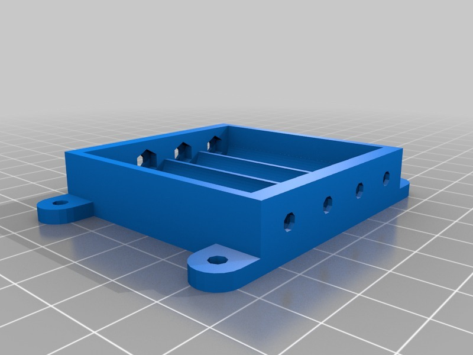

Description
--------
Miniskybot V2, a small Printbot (printable robot) for educational purposes.  
 
Features: 
*  Simplified chassis 
*  Marbel as cator wheel (thanks to sliptonic) 
 *  Battery holder screwed to the chassis 
*   Compact and small 
 *  3 type of wheels, for the 3 different servo horns 
 *   Electronics Compatible with skymega and Arduino UNO boards 
 
Github: 
<a href="https://github.com/Obijuan/Miniskybot" target="_blank" rel="nofollow">github.com/Obijuan/Miniskybot</a> 
 
Youtube videos: 
* <a href="http://www.youtube.com/watch?v=ybLnEIOfsBg" target="_blank" rel="nofollow">youtube.com/watch?v=ybLnEIOfsBg</a> 
 
* <a href="http://www.youtube.com/watch?v=9zH0n-bU9AU" target="_blank" rel="nofollow">youtube.com/watch?v=9zH0n-bU9AU</a> 
 
More information (in Spanish): 
<a href="http://www.iearobotics.com/wiki/index.php?title=Miniskybot_2" target="_blank" rel="nofollow">iearobotics.com/wiki/index.php?title=Miniskybot_2</a>

Instructions
--------
* Downloaded the STL files: chassis, battery holder and wheels 
* Print them! 
* Hack 2 servos so that they can turn 360 degrees freely (for example futaba 3003 or compatible) 
* Build the robot 
* Choose the electronics: 
** Arduino Uno: <a href="http://arduino.cc/en/Main/arduinoBoardUno" target="_blank" rel="nofollow">arduino.cc/en/Main/arduinoBoardUno</a> 
** Skymega: <a href="http://www.thingiverse.com/thing:14197" target="_blank" rel="nofollow">thingiverse.com/thing:14197</a> 
** Your own electronics :-) 
* Play!

Files
--------

 [ Battery-holder-doc.pdf](Battery-holder-doc.pdf)  

 [ Servo-wheel-rounded-horn.stl](Servo-wheel-rounded-horn.stl)  

[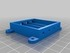](battery_holder.stl)
 [ battery_holder.stl](battery_holder.stl)  

 [ Miniskybot-v2-Openscad.zip](Miniskybot-v2-Openscad.zip)  

 [ Mini-skybot-v2-exploded_view_drawing.fcstd](Mini-skybot-v2-exploded_view_drawing.fcstd)  

 [ servo-wheels-doc.pdf](servo-wheels-doc.pdf)  

 [ Miniskybot-doc-svg.zip](Miniskybot-doc-svg.zip)  

 [ Futaba-doc.pdf](Futaba-doc.pdf)  

 [ chassis-doc.pdf](chassis-doc.pdf)  

[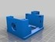](chassis.stl)
 [ chassis.stl](chassis.stl)  

 [ Mini-skybot-v2.fcstd](Mini-skybot-v2.fcstd)  

 [ Servo-wheel-4-arm-horn.stl](Servo-wheel-4-arm-horn.stl)  

[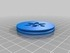](Servo-wheel-6-arm-horn.stl)
 [ Servo-wheel-6-arm-horn.stl](Servo-wheel-6-arm-horn.stl)  

Pictures
--------
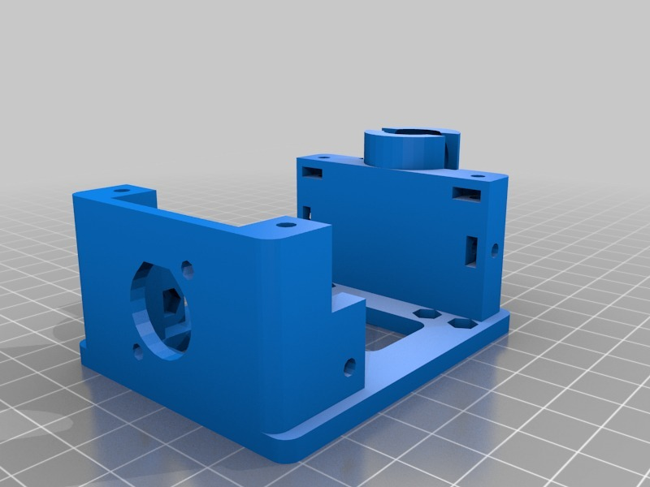
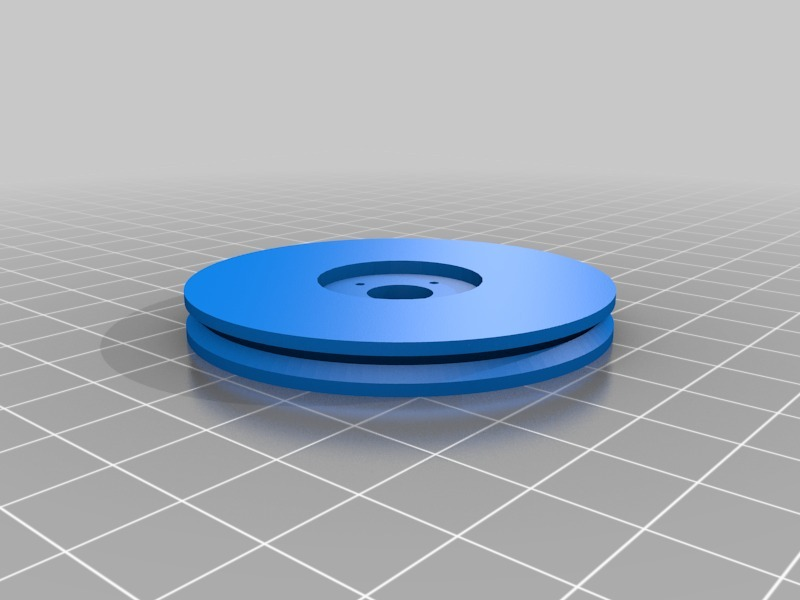
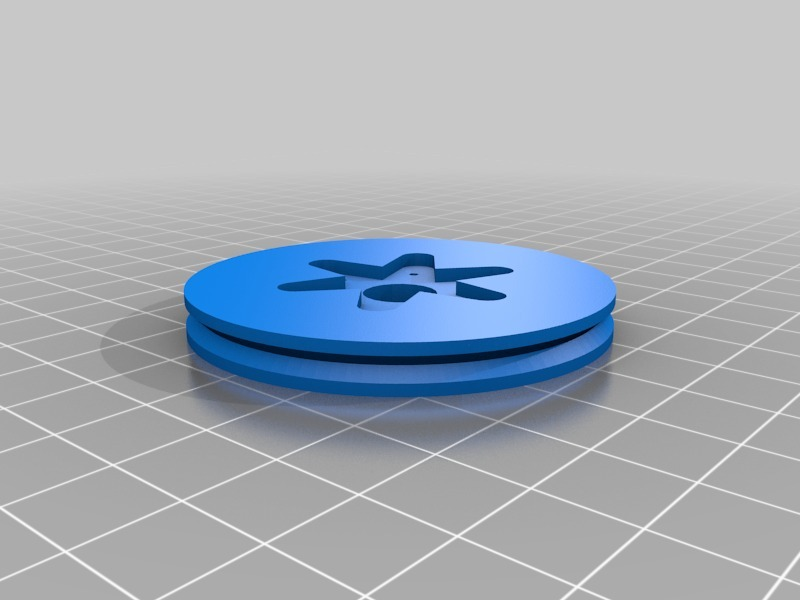

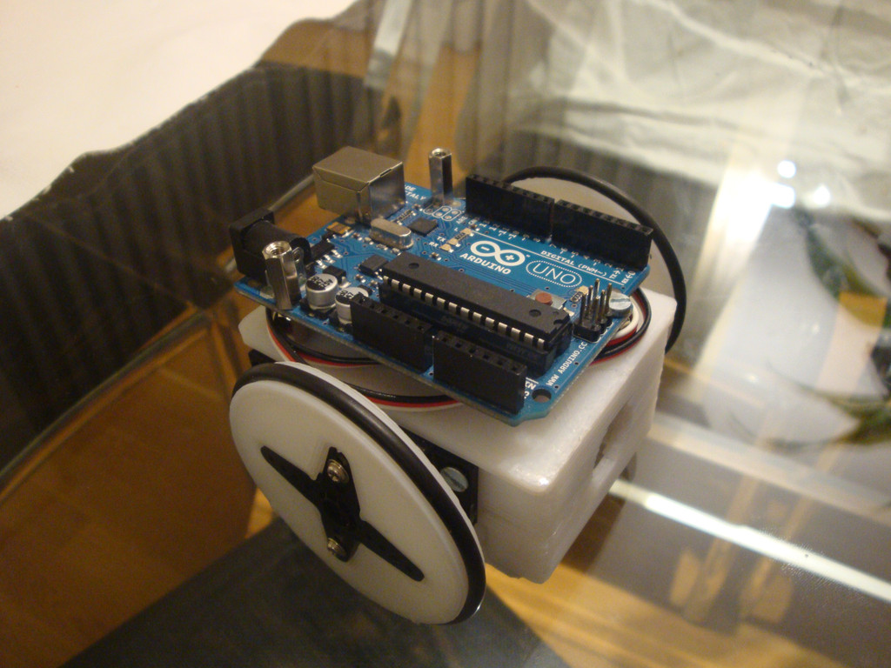
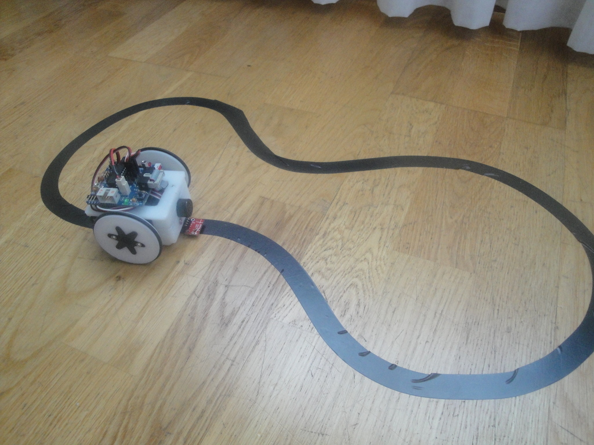
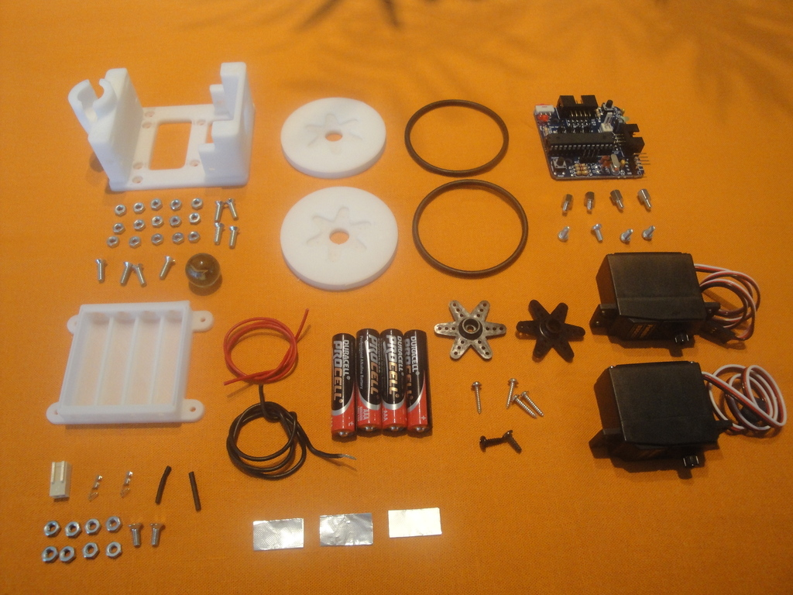
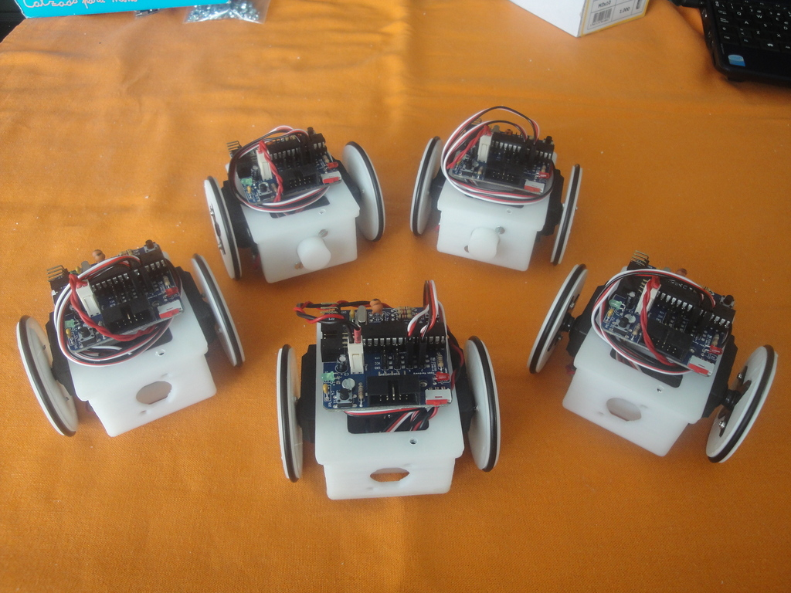
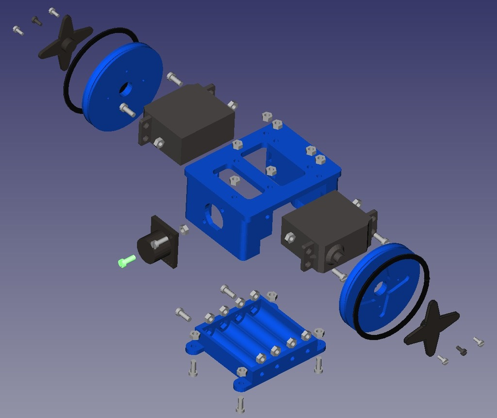
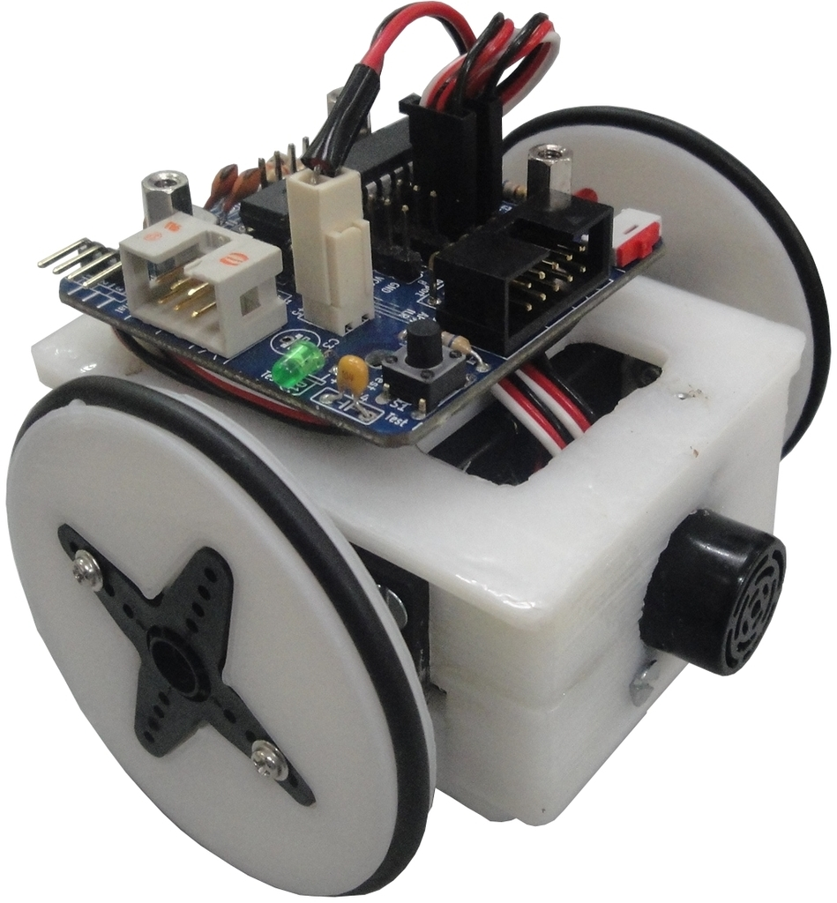
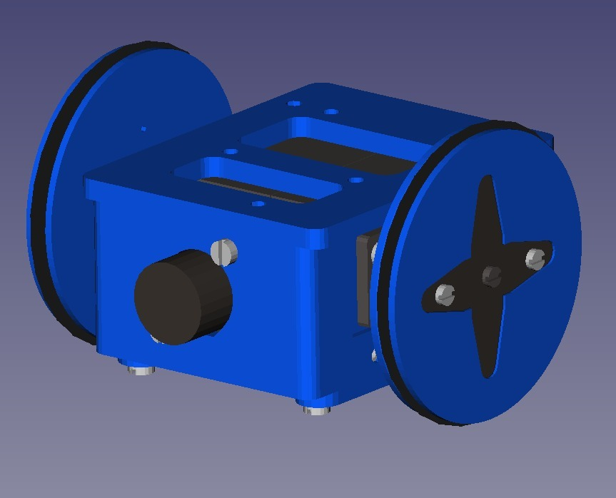
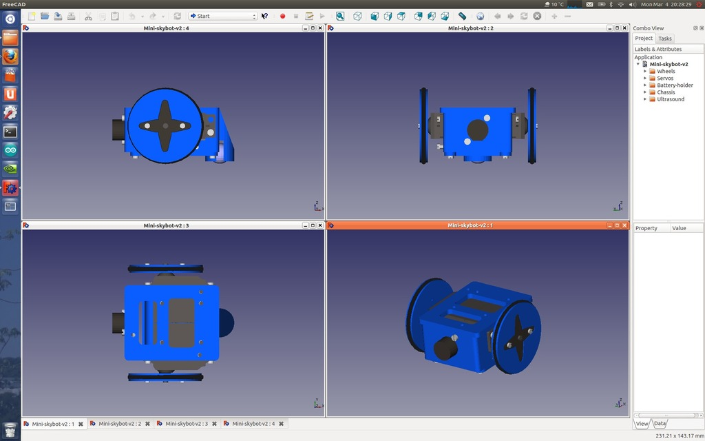

Tags
--------
openscad , plastic_valley , printbot , robot  

  

License
--------
Miniskybot 2 by obijuan is licensed under the GNU - GPL license.  

By: Juan Gonzalez-Gomez (Obijuan)
--------
<http://www.iearobotics.com/wiki/index.php?title=Juan_Gonzalez:Main>