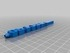

Obijuan's Pen
===============
**Please note: This thing is part of a list that was [automatically generated](https://github.com/carlosgs/export-things) and may have been updated since then. Make sure to check for the current license and authorship.**  

Obijuan's Pen  by obijuan , published Feb 3, 2013

Description
--------
Customized version of <a href="http://www.thingiverse.com/thing:45576" target="_blank" rel="nofollow">thingiverse.com/thing:45576</a> 
 
Created with Customizer! <a href="http://www.thingiverse.com/apps/customizer/run?thing_id=45576" target="_blank" rel="nofollow">thingiverse.com/apps/customizer/run?thing_id=45576</a> 
 

Instructions
--------
Using the following options: 
 
font_scale = 2.1 
pen_length = 130 
font_spacing = 0.81 
word = ObiJuan 

Files
--------

 [ Retro_Word_Pen.scad20130203-29080-1wn0zdw-0.stl](Retro_Word_Pen.scad20130203-29080-1wn0zdw-0.stl)  

Tags
--------
customized  

  

License
--------
Obijuan's Pen by obijuan is licensed under the Creative Commons - Attribution - Share Alike license.  

By: Juan Gonzalez-Gomez (Obijuan)
--------
<http://www.iearobotics.com/wiki/index.php?title=Juan_Gonzalez:Main>