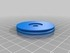
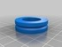
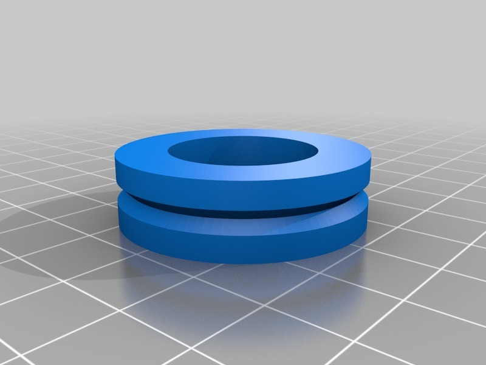
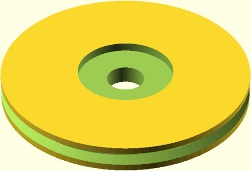
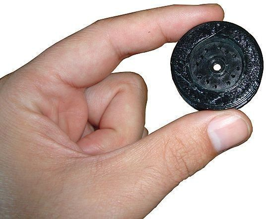
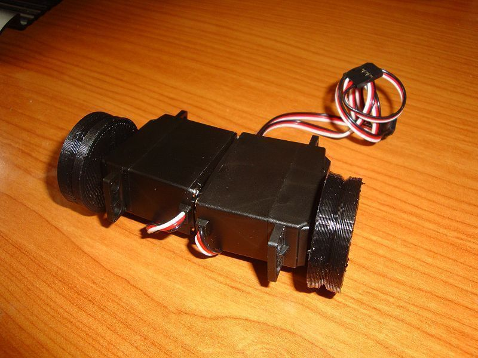
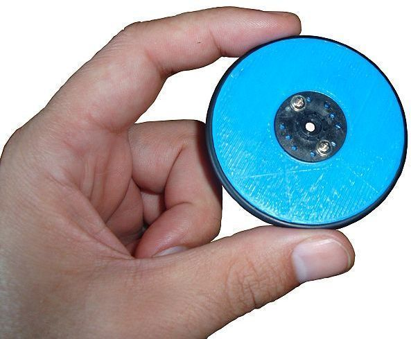
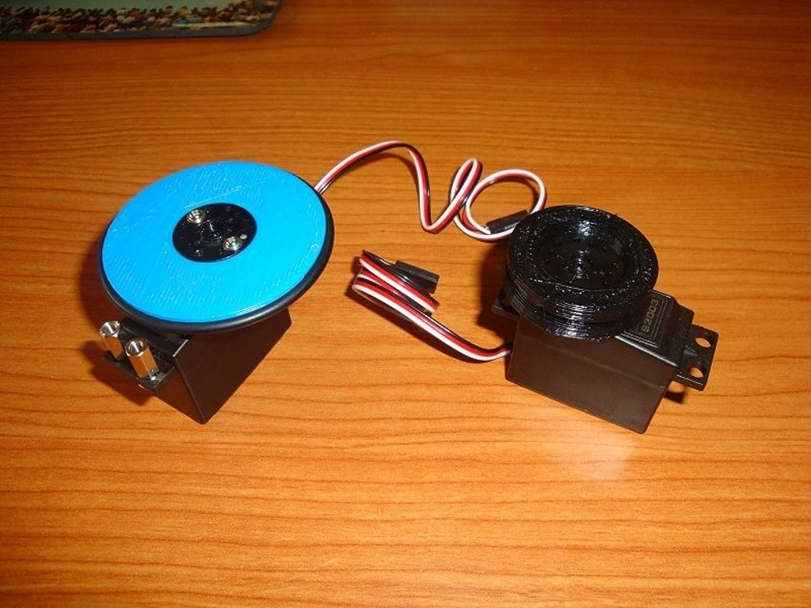
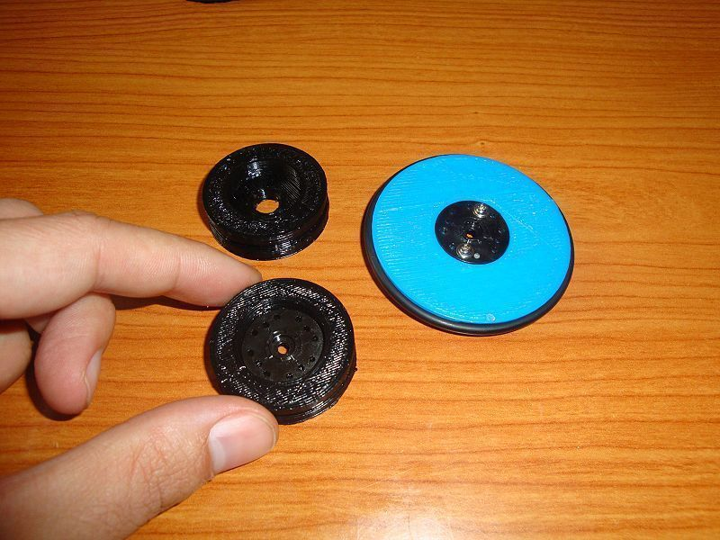
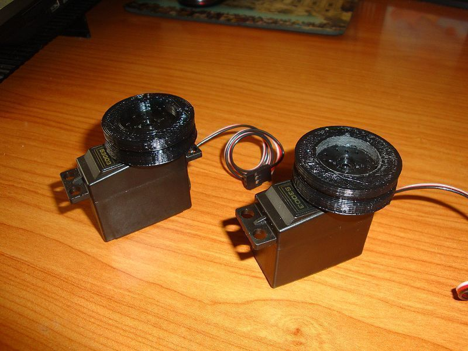

Parameterized Servo wheel for mobile robots
===============
**Please note: This thing is part of a list that was [automatically generated](https://github.com/carlosgs/export-things) and may have been updated since then. Make sure to check for the current license and authorship.**  

Parameterized Servo wheel for mobile robots  by obijuan , published Jun 5, 2011

Description
--------
This is the parameterized version of the servo wheel. The wheel diameter, height and o-rings parameters can be defined by the user. These are the type of wheels we are using for our printable robot projects. For example, the <b>Miniskybot robot </b> ( <a href="http://www.thingiverse.com/thing:7989" target="_blank" rel="nofollow">thingiverse.com/thing:7989</a> ) 
 
Currently the target servo is Futaba 3003.

Instructions
--------
1.- Set the parameteres 
2.- Create the stl file 
3.- Print the wheels 
4.- Attach the servo horn 
5.- insert the O-ring 
6.- Ready to use for building robot!

Files
--------

 [ servo_wheel-skybot.stl](servo_wheel-skybot.stl)  

 [ Servo-wheel.scad](Servo-wheel.scad)  

 [ servo_wheel_30mm.stl](servo_wheel_30mm.stl)  

Pictures
--------

Tags
--------
makerbot , Miniskybot , mobile robot , openscad , parametric , Plastic Valley , robot , robotics , servo , UC3M , wheel  

  

License
--------
Parameterized Servo wheel for mobile robots by obijuan is licensed under the Creative Commons - Attribution - Share Alike license.  

By: Juan Gonzalez-Gomez (Obijuan)
--------
<http://www.iearobotics.com/wiki/index.php?title=Juan_Gonzalez:Main>