Parameterized battery pack with contacts
===============
**Please note: This thing is part of a list that was [automatically generated](https://github.com/carlosgs/export-things) and may have been updated since then. Make sure to check for the current license and authorship.**  

Parameterized battery pack with contacts  by obijuan , published Dec 10, 2010

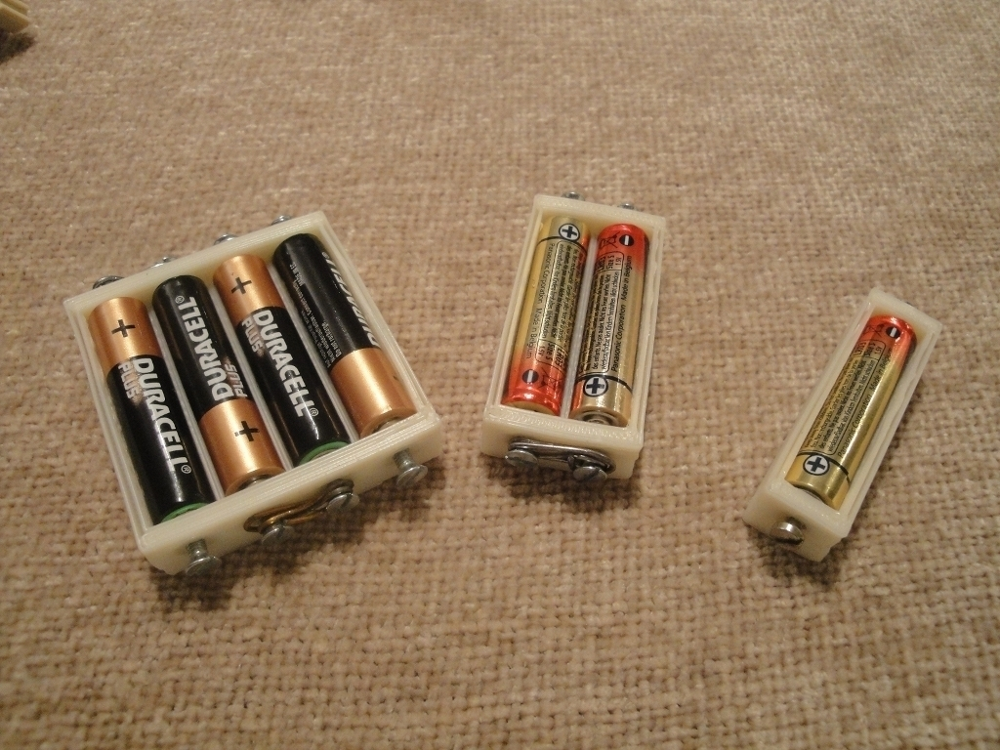

Description
--------
This design is derived from the parameterized Battery compartment: <a href="http://thingiverse.com/thing:5051" target="_blank" rel="nofollow">thingiverse.com/thing:5051</a> (<b>By Guru</b>). I have added a simple method for the electrical connections. The proof of concept was tested on this thing: <a href="http://thingiverse.com/thing:5070" target="_blank" rel="nofollow">thingiverse.com/thing:5070</a> 
 
<b>NOW you can print your own fully-functional battery pack :-)</b> 
 
For every battery there are two embedded nuts in contact with the positive and negative poles. Two metal M3 bolts are inserted from the outside. They will contact with the poles. Now, you have a wonderful electrical access to the battery!! 
 
  I have tested with 2-AAA and 4-AAA battery packs. It worked like a charm :-) 
 
In addition, I have added more parameters for generating the battery pack: the thickness of the bottom, front and rear, and side walls as well as the distance between two batteries. 
 
<b>Update</b>: Jan/30/2011. Added the contribution of <b>eaglepex</b> ( <a href="http://www.thingiverse.com/eagleapex" target="_blank" rel="nofollow">thingiverse.com/eagleapex</a> ). Now the batteries can also be in serial connection changing the ser parameter 
 

Instructions
--------
* Generate the battery pack with the desired parameters 
* Print! 
* Embed the nuts (1) 
* Insert the batteries (2) 
* Insert the bolts 
* Set the electrical connections (3) 
 
(1) There is a simple and powerful trick to embed the nuts into their slots (as shown in the pictures). Insert a M3 12mm bolt with a washer form the outside. Add the nut in the inside part. Screw the bolt until the nut reach the socket. Now, put the nut in the correct orientation so that it can enter the socket. Screw the bolts until the nut fits perfectly. Then remove the bolt. The nut will remain in its socket. 
 
(2) WARNING: The batteries can be inserted with different orientations. Make sure they are inserted with alternating poles: +, -, +, - so that they can be connected in serial. 
 
(3) Once the bolts are put, it is time to set the electrical connections. Connect the batteries in serial (Be careful of the short cuts!). It can be used standard wires. Or alternatively you can use Clips, as shown in the pictures. 
 
<b>Instruction for building a 2-battery-pack</b> 
See the following images: <a href="http://fotos.iearobotics.com/index.php?album=objetos-3d" target="_blank" rel="nofollow">fotos.iearobotics.com/index.php?album=objetos-3d</a>=dsc01654.jpg 
("Sig" means Next, "Ant" means Prev) 
 
<b>Instruction for building a 4-battery-pack</b> 
See the following images: <a href="http://fotos.iearobotics.com/index.php?album=objetos-3d" target="_blank" rel="nofollow">fotos.iearobotics.com/index.php?album=objetos-3d</a>=dsc01674.jpg 
("Sig" means Next, "Ant" means Prev) 
 
 
 
 

Files
--------

 [ battery-pack-contact-nuts.scad](battery-pack-contact-nuts.scad)  

[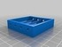](battery-pack-4-AAA.stl)
 [ battery-pack-4-AAA.stl](battery-pack-4-AAA.stl)  

[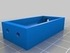](battery-pack-2-AAA.stl)
 [ battery-pack-2-AAA.stl](battery-pack-2-AAA.stl)  

Pictures
--------
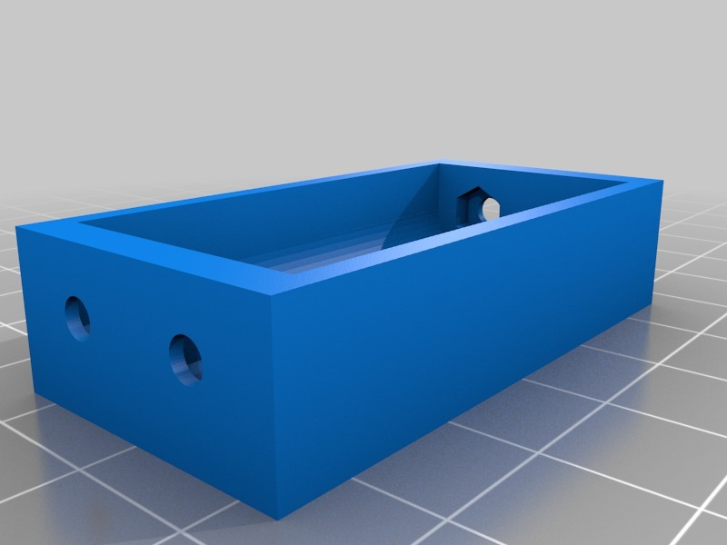
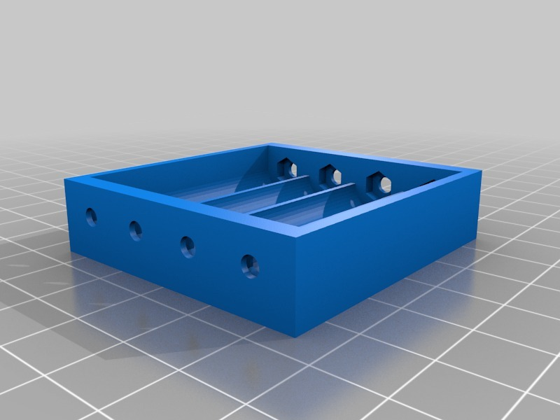
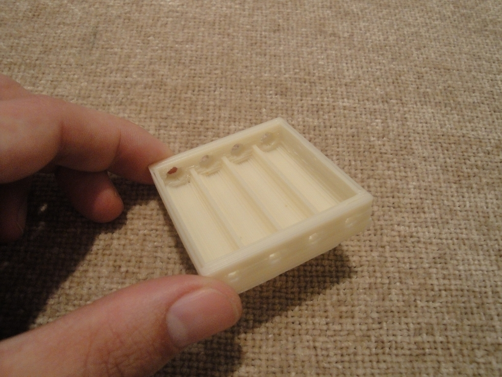
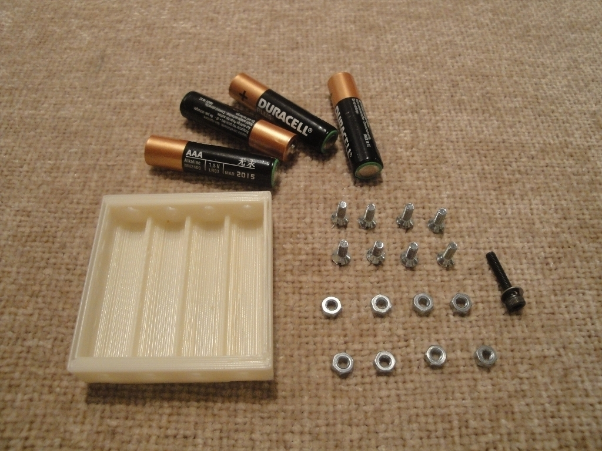
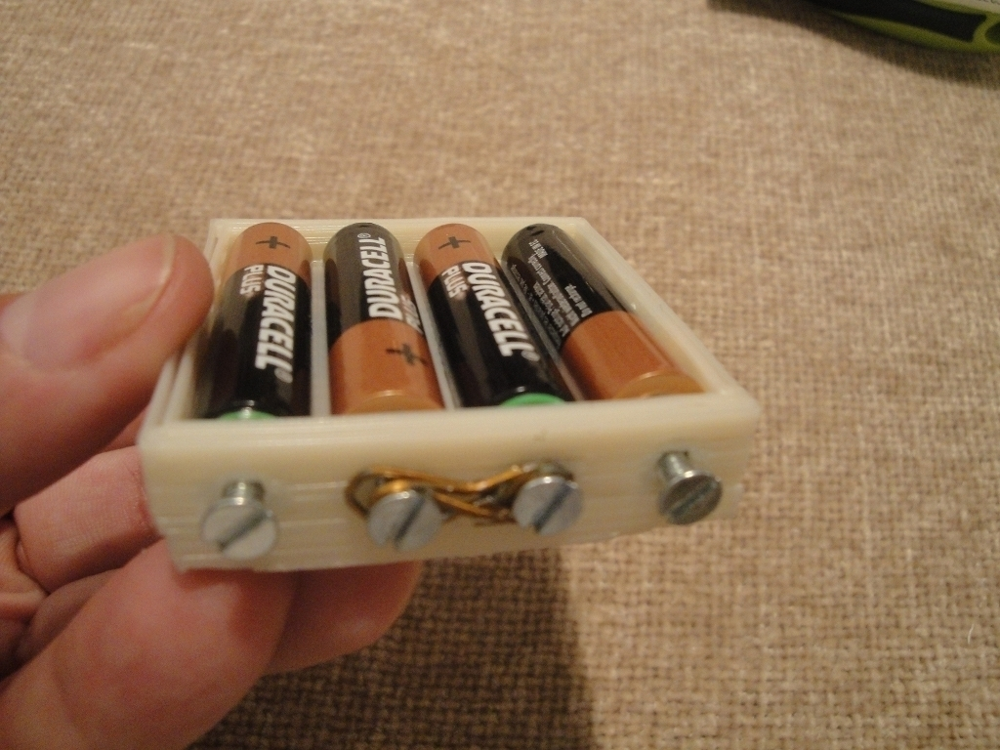
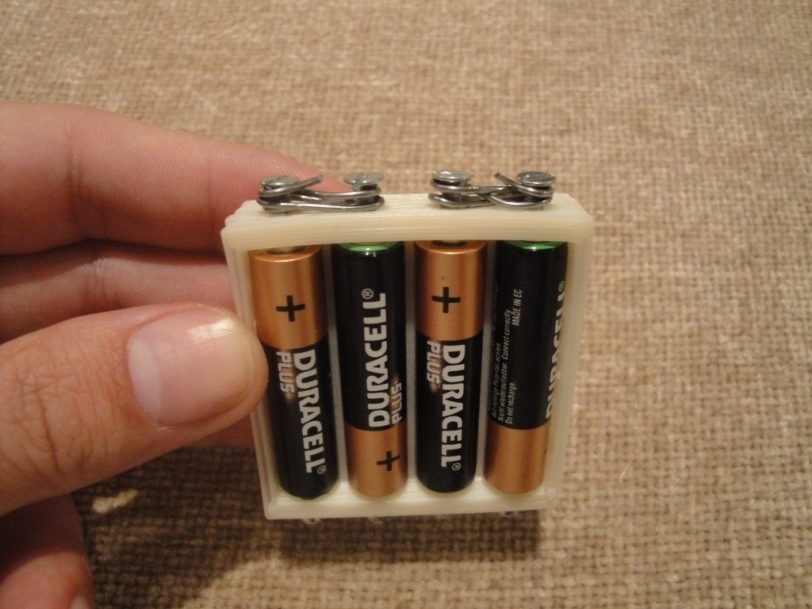
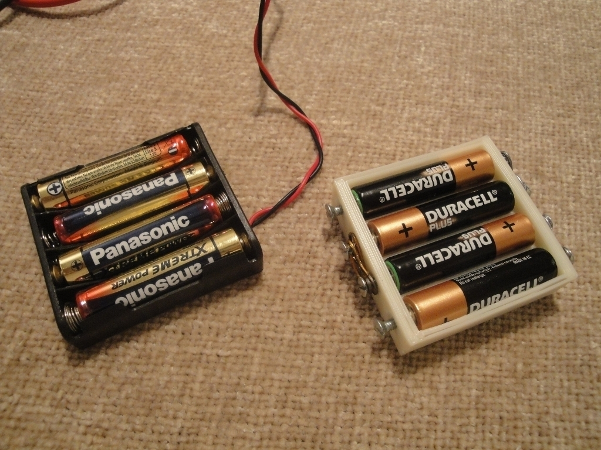
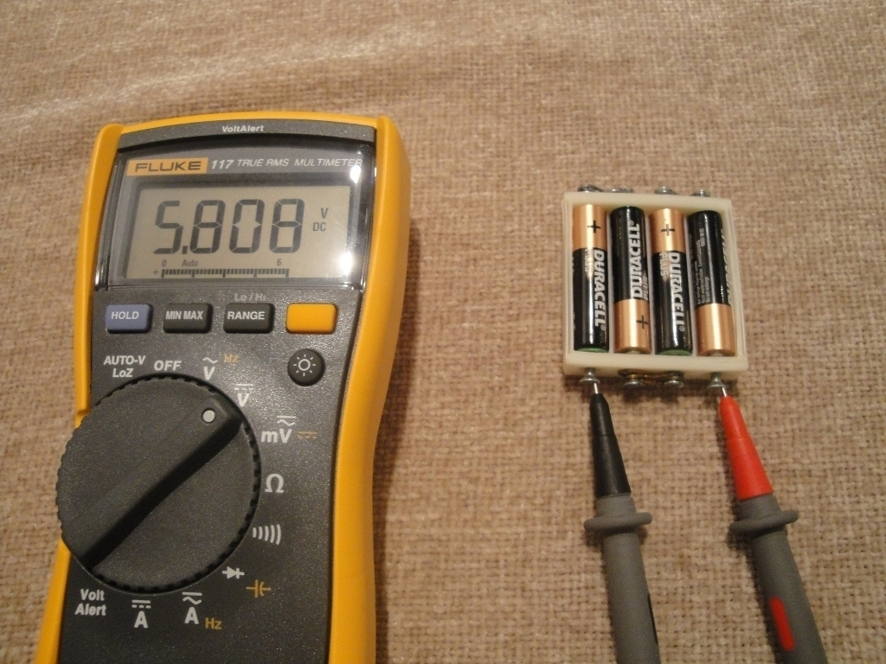
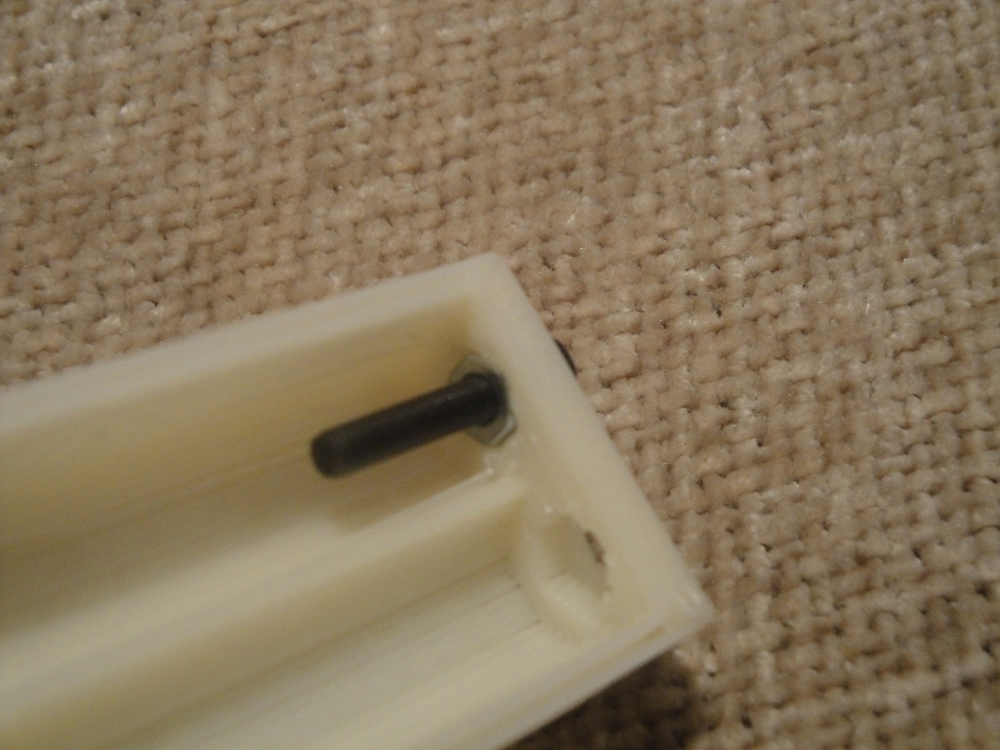
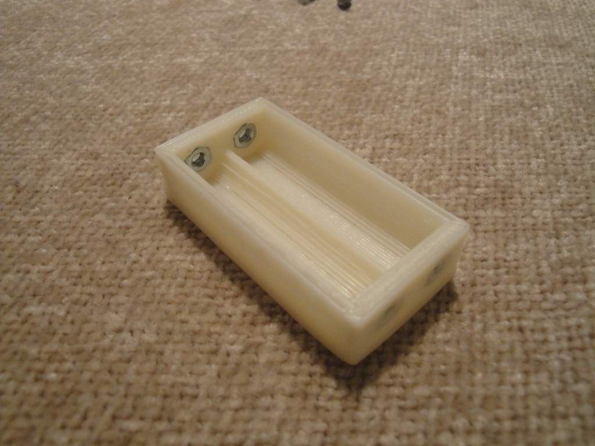
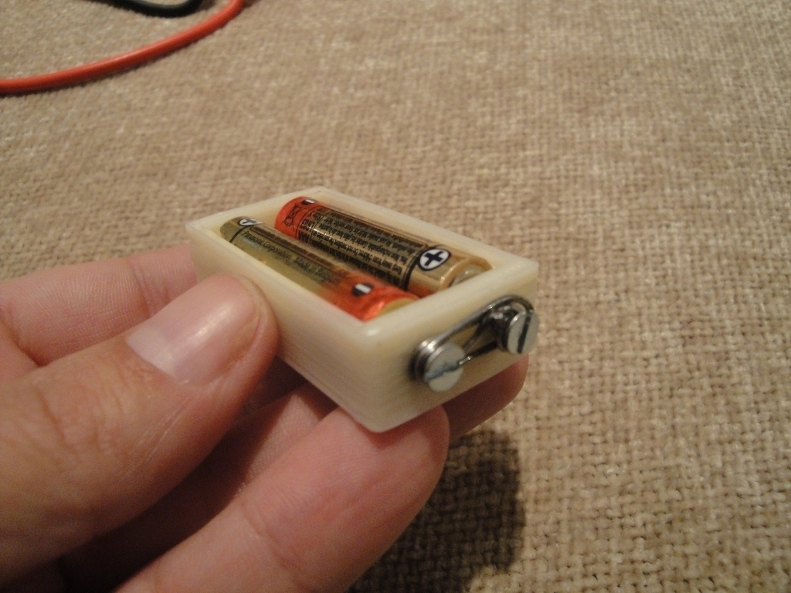

Tags
--------
3D , batteries , Battery , container , electronics , makerbot , Miniskybot , openscad , plastic valley , UC3M , wearable_computing  

  

License
--------
Parameterized battery pack with contacts by obijuan is licensed under the Creative Commons - Attribution - Share Alike license.  

By: Juan Gonzalez-Gomez (Obijuan)
--------
<http://www.iearobotics.com/wiki/index.php?title=Juan_Gonzalez:Main>