Parameterized printable spring
===============
**Please note: This thing is part of a list that was [automatically generated](https://github.com/carlosgs/export-things) and may have been updated since then. Make sure to check for the current license and authorship.**  

Parameterized printable spring  by obijuan , published Apr 12, 2012

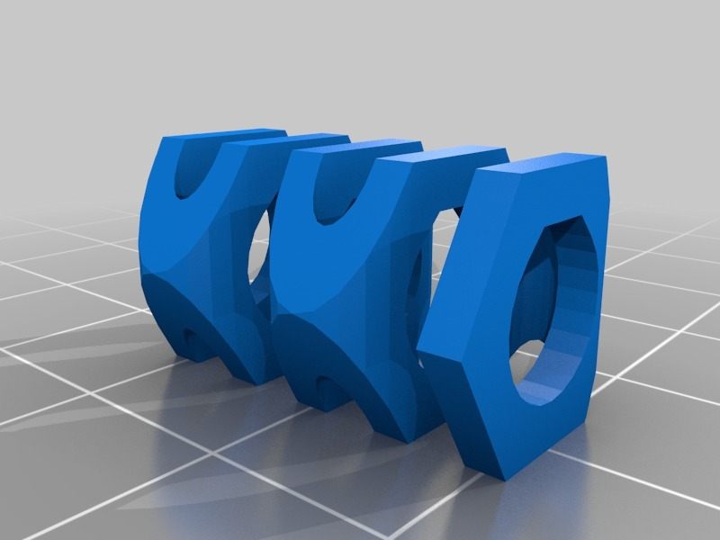

Description
--------
It is a proof of concept of a kind of printable spring. Initially I designed it for using in my Prusa Mendel, because the z axis springs were very difficult to find for me.  Then I generalized the idea and parameterized the spring. 
 
These springs conceptually consist of a strip of plastic that is bended. The outer cross section of the spring can be square, hexagonal or octogonal. 
 
The spring parameters are: 
* fid (fold inner diameter) 
* folds: Number of folds 
* th: strip thickness 
* Drill: Drill diameter 
* Diameter of the outer cross section 
 
Here there is a video of the proof of concept: 
<a href="http://www.youtube.com/watch?v=dbjiXFEyg_E" target="_blank" rel="nofollow">youtube.com/watch?v=dbjiXFEyg_E</a> 
 
 

Instructions
--------
1.- Download the spring.scad file. Change the spring parameters and generate the STL 
2.- Optionally you can just print the 3 springs given as examples 
3.- I have used slic3r for slicing it. If the spring is small, it is quite difficult to print it.  The easier springs to print are the ones with a square cross section. 
4.- Print it! 
5.- Before using it I had to file and clean the spring

Files
--------

 [ spring.scad](spring.scad)  

[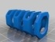](spring3.stl)
 [ spring3.stl](spring3.stl)  

[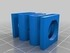](spring2.stl)
 [ spring2.stl](spring2.stl)  

[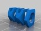](spring.stl)
 [ spring.stl](spring.stl)  

Pictures
--------
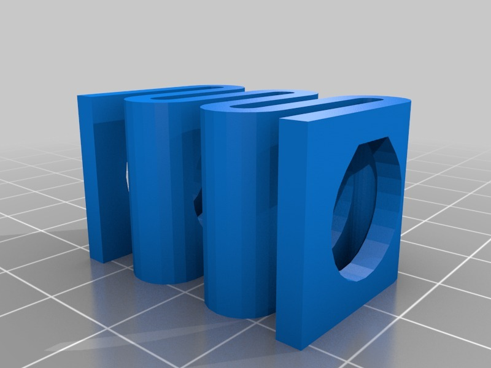
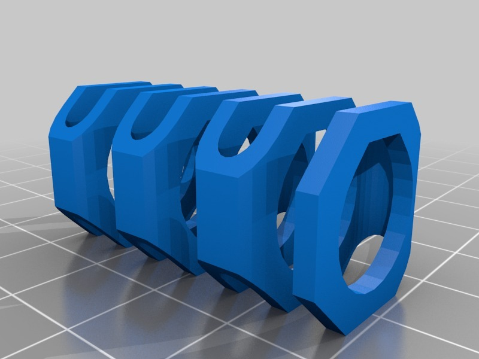
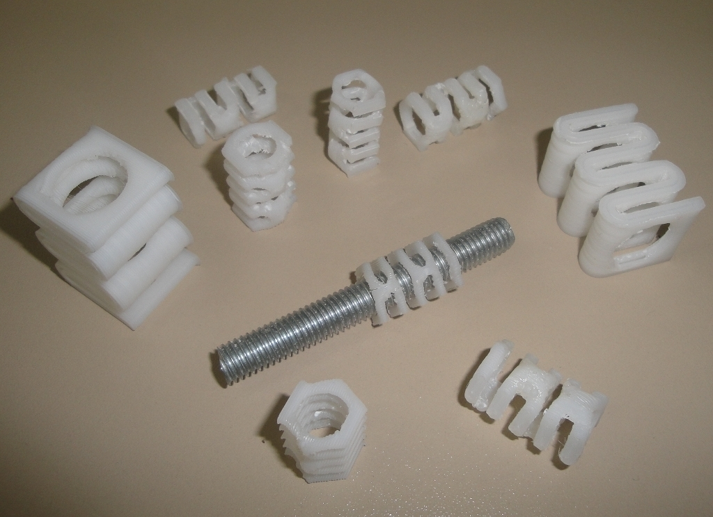
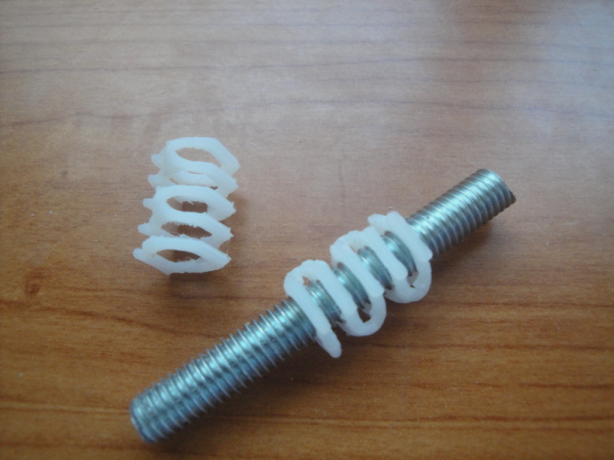

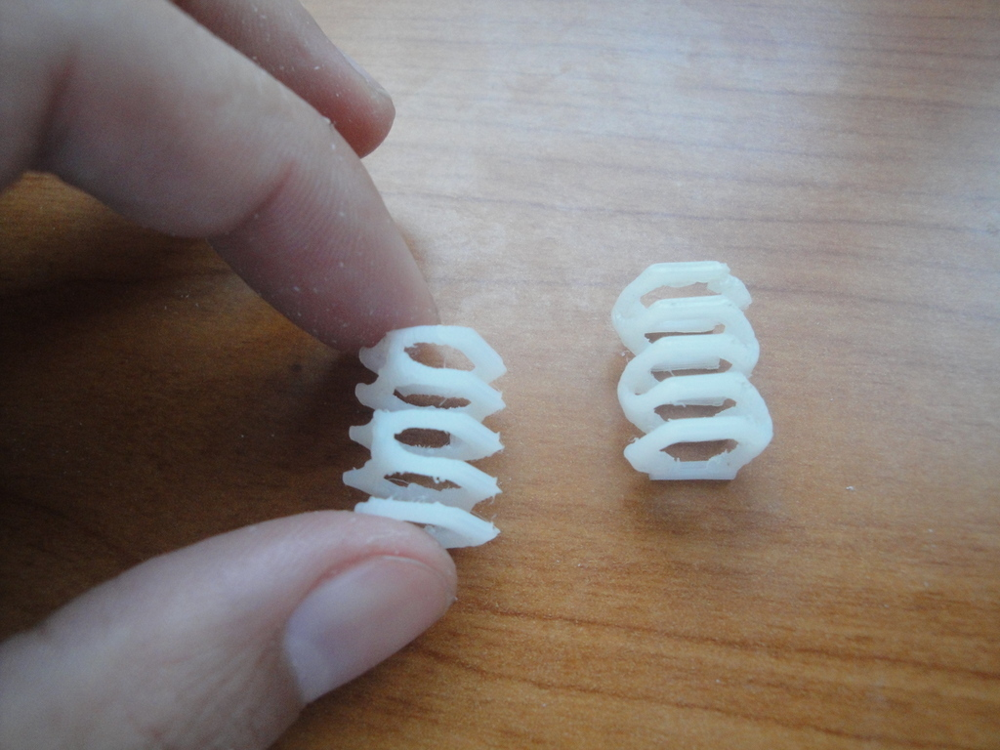
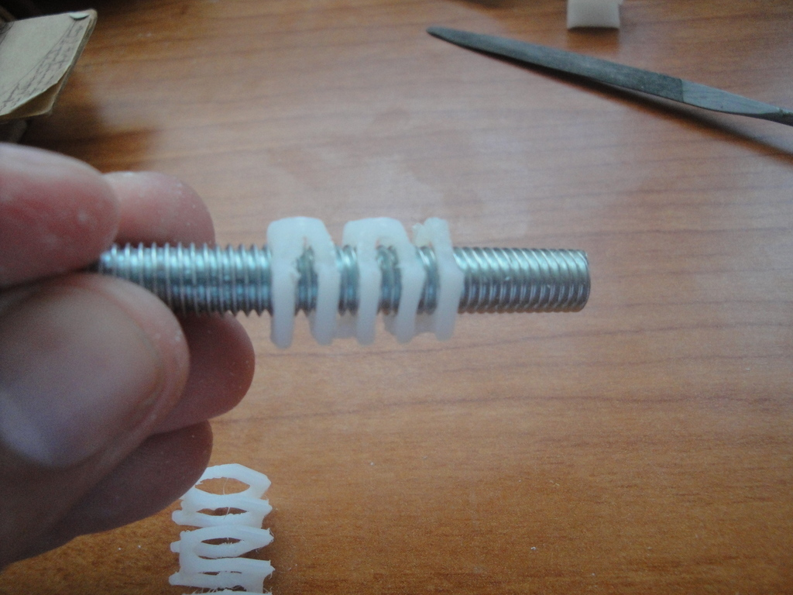
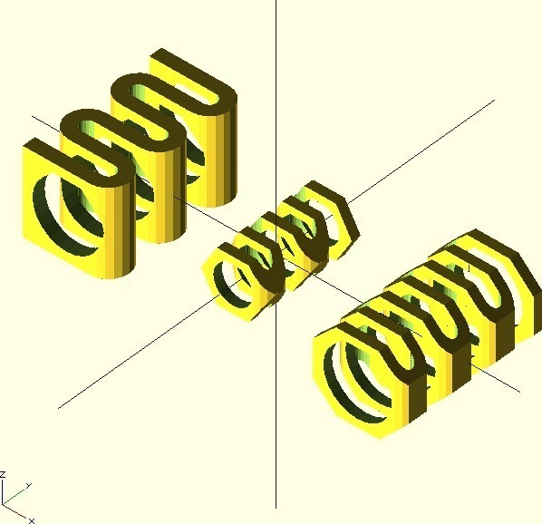

Tags
--------
axis , openscad , parametric , plastic_valley , prusa , spring , upm , z  

  

License
--------
Parameterized printable spring by obijuan is licensed under the Creative Commons - Attribution - Share Alike license.  

By: Juan Gonzalez-Gomez (Obijuan)
--------
<http://www.iearobotics.com/wiki/index.php?title=Juan_Gonzalez:Main>