Parametric openscad beveled cube
===============
**Please note: This thing is part of a list that was [automatically generated](https://github.com/carlosgs/export-things) and may have been updated since then. Make sure to check for the current license and authorship.**  

Parametric openscad beveled cube  by obijuan , published Sep 6, 2012

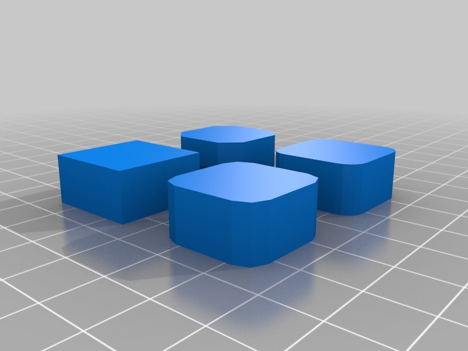

Description
--------
Parametric openscad module for doing beveled cubes. There are three different implementations for teaching openscad: using boolean operators, hull operator or minkowsky. 
 
 The default module uses the minkowsky approach, but the user can change it (good for testing the building speed using the three methods) 
 
More information (in Spanish): 
<a href="http://www.iearobotics.com/wiki/index.php?title=Objeto_3D:Cubo_Biselado" target="_blank" rel="nofollow">iearobotics.com/wiki/index.php?title=Objeto_3D:Cubo_Biselado</a>

Instructions
--------
Using the beveled cubes in your designes is very easy: 
 
#use &lt; bcube.scad &gt;  
 
bcube([20,20,10], cr=4, cres=0); 
 
where cr is the corner radius and cres the corner resolution (in points). 0 means the corners are just cutout using a straight line. If cres is 1, there will be a point in the midde (so the beveled corner will have 2 lines). The higher cres, the rounder the corner will be. 
 
The three implementations are in the files: bcube_boolean.scad, bcube_hull.scad and bcube_minkowsky.scad. Just rename the file name of the implementation you want to test to bcube.scad 
 
Good openscad learning!

Files
--------
[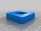](test.stl)
 [ test.stl](test.stl)  

[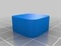](Beveled_calibration_cube.stl)
 [ Beveled_calibration_cube.stl](Beveled_calibration_cube.stl)  

[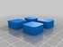](examples.stl)
 [ examples.stl](examples.stl)  

 [ beveled_cube_openscad.zip](beveled_cube_openscad.zip)  

Pictures
--------

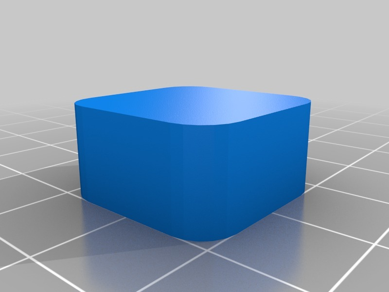
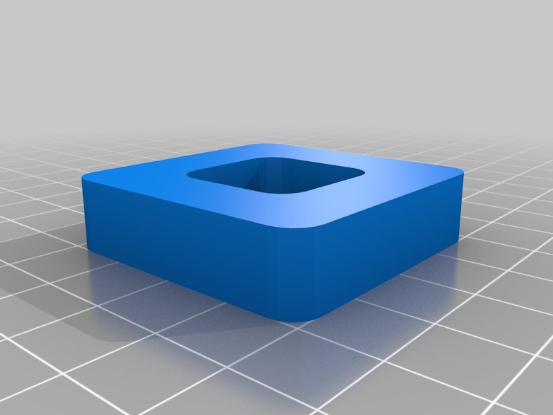
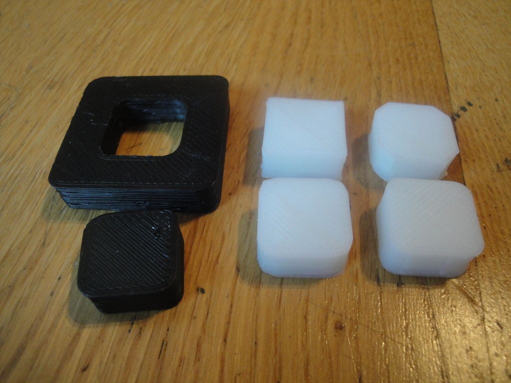

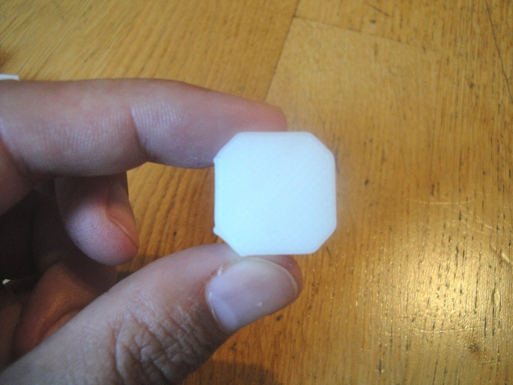
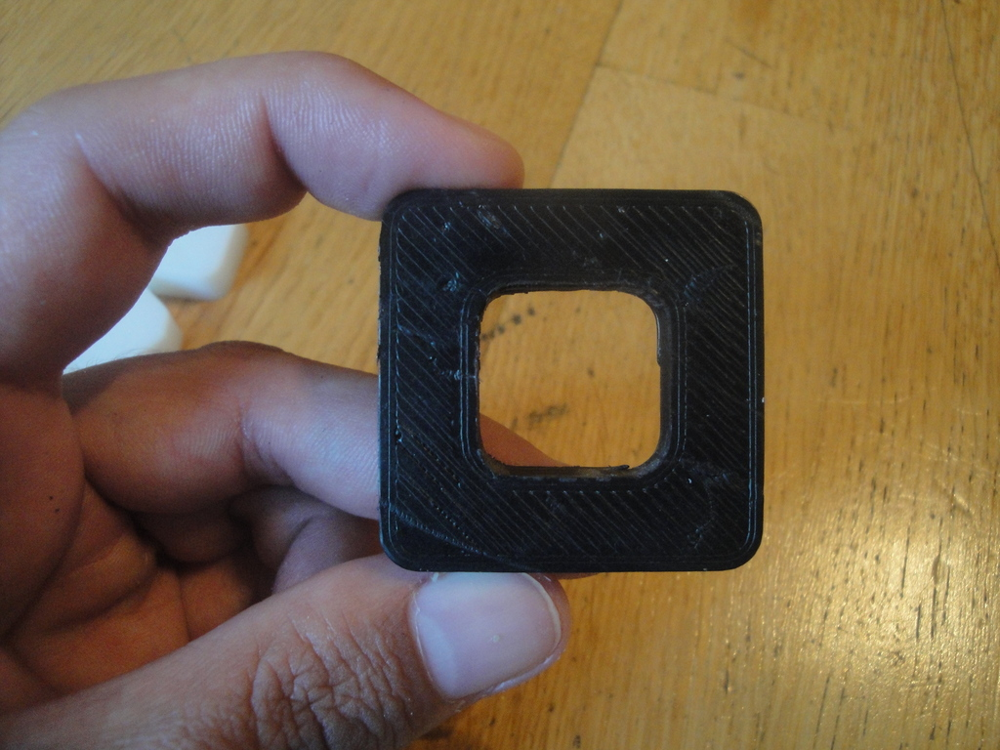
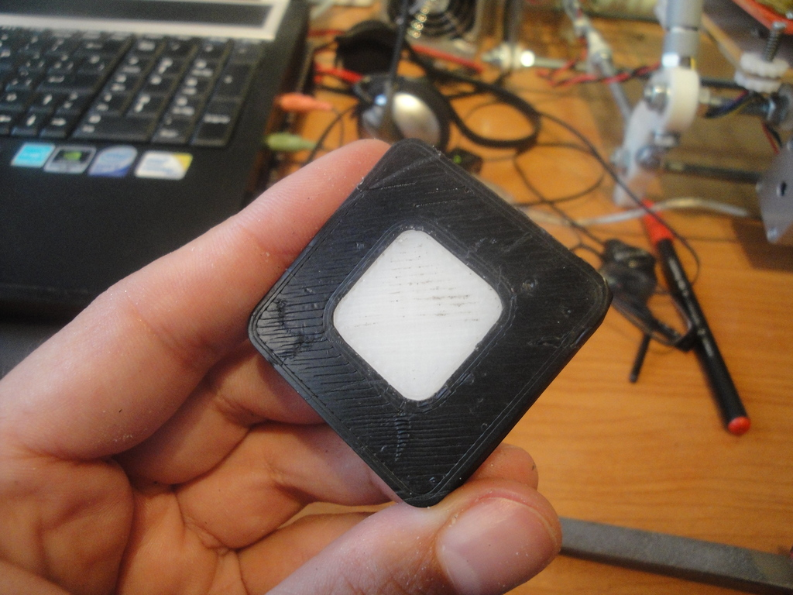

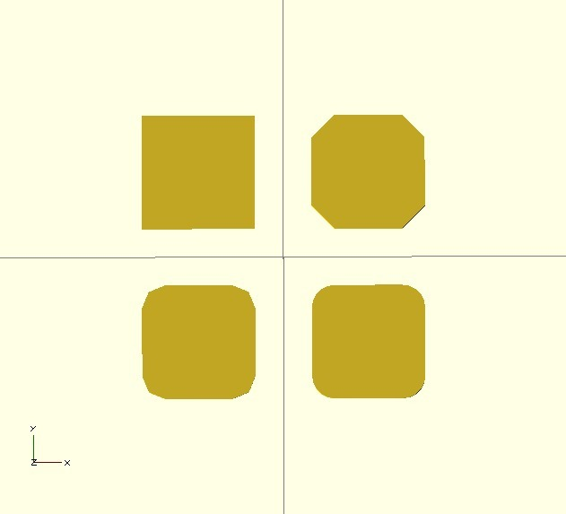
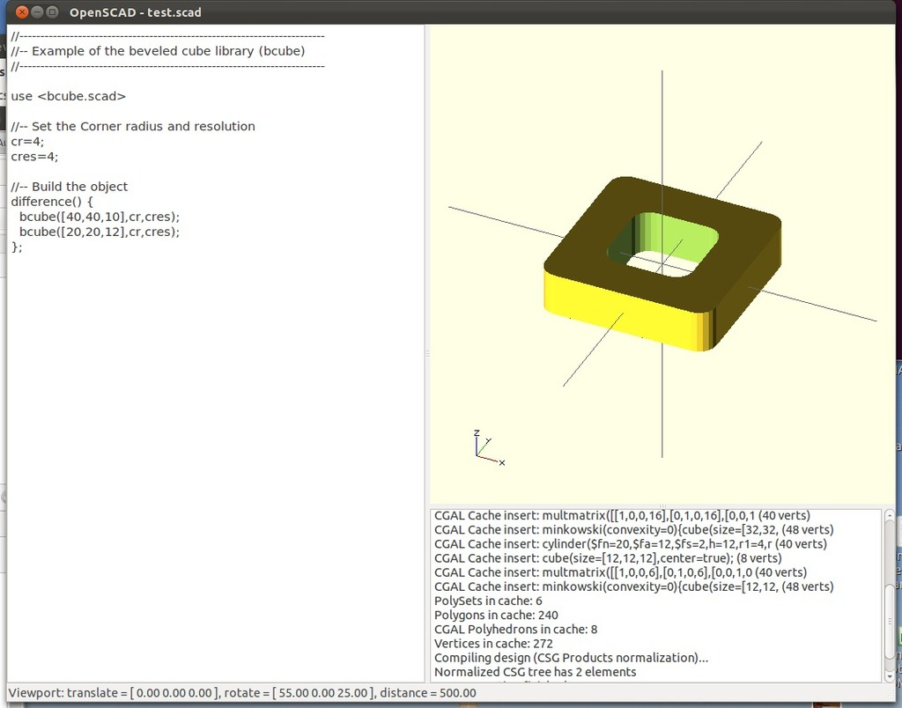

Tags
--------
cube , library , obiscad , openscad , parametric , plastic_valley  

  

License
--------
Parametric openscad beveled cube by obijuan is licensed under the Creative Commons - Attribution - Share Alike license.  

By: Juan Gonzalez-Gomez (Obijuan)
--------
<http://www.iearobotics.com/wiki/index.php?title=Juan_Gonzalez:Main>