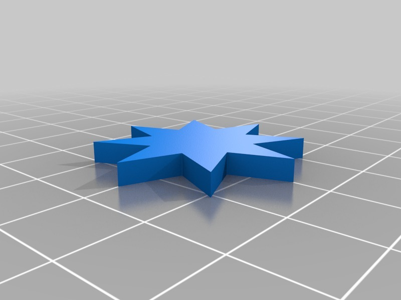
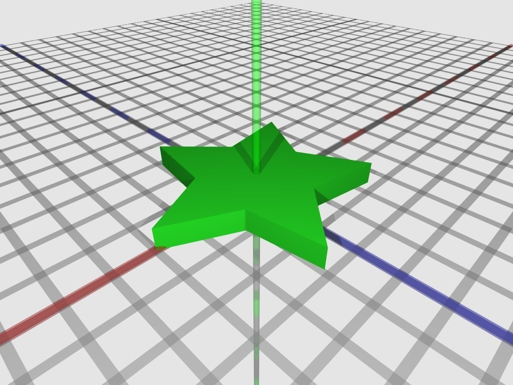
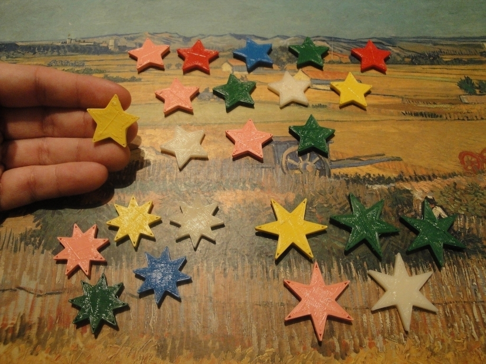
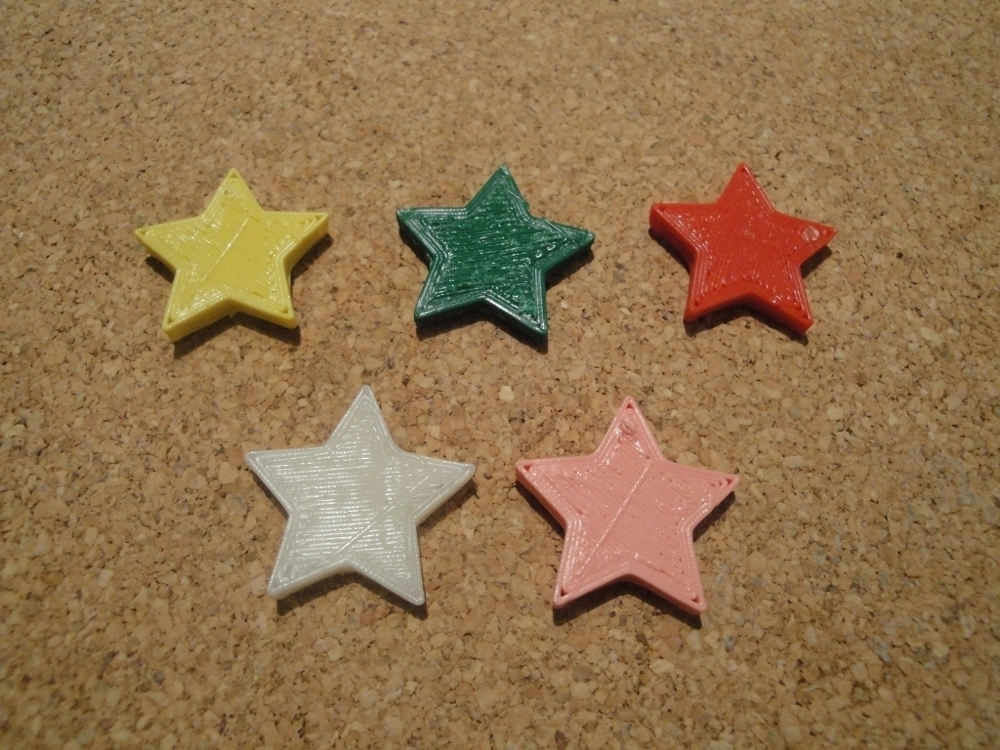
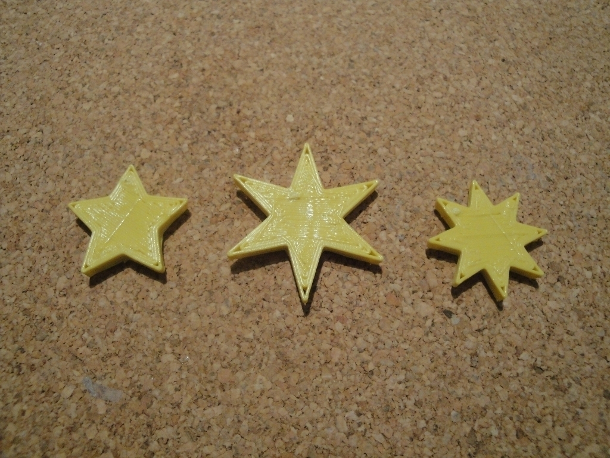
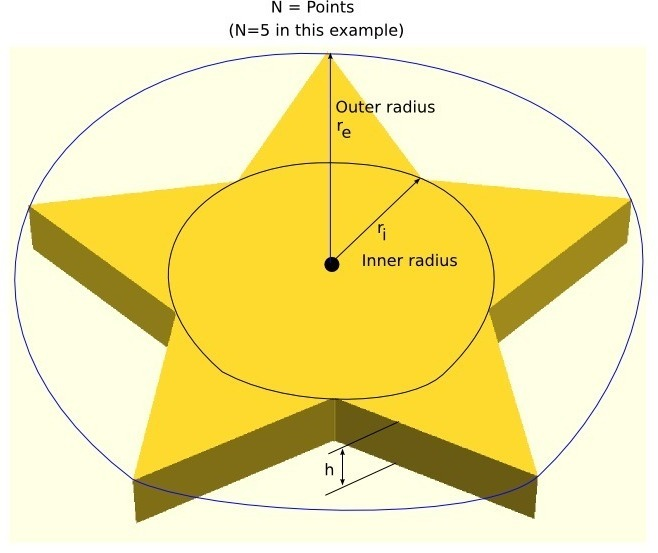
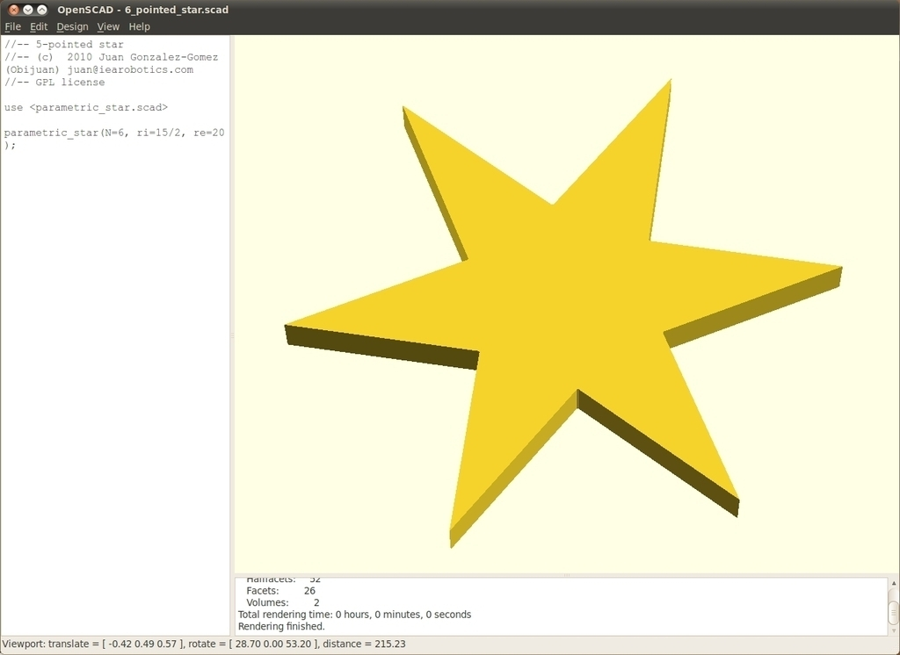
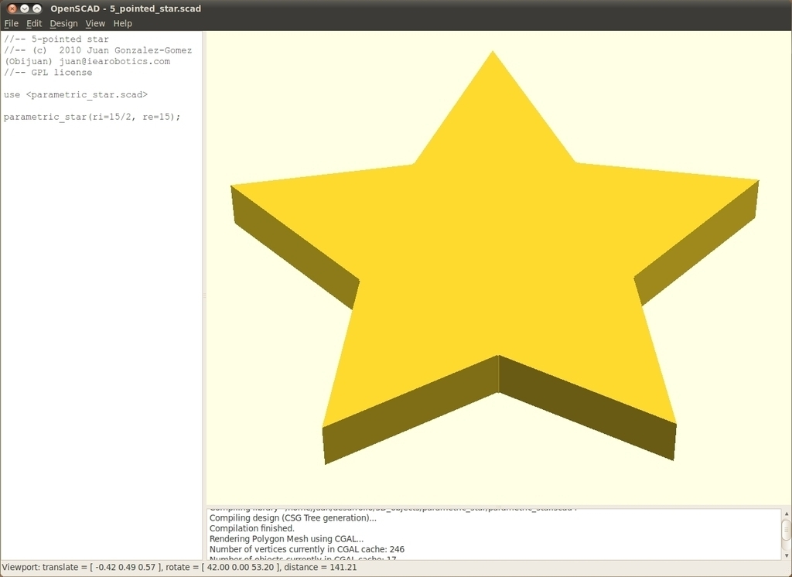
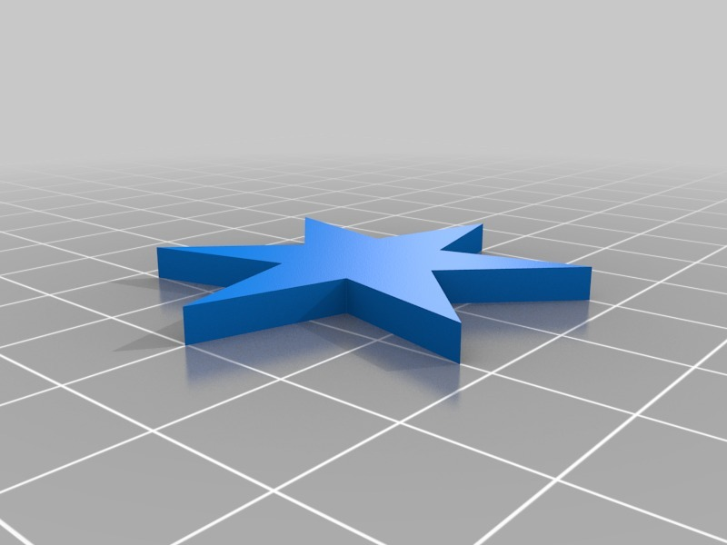

Parametric star
===============
**Please note: This thing is part of a list that was [automatically generated](https://github.com/carlosgs/export-things) and may have been updated since then. Make sure to check for the current license and authorship.**  

Parametric star  by obijuan , published Dec 6, 2010

Description
--------
Inspired by thing <a href="http://www.thingiverse.com/thing:5014" target="_blank" rel="nofollow">thingiverse.com/thing:5014</a> I have created a parametric flat star with OpenScad. 
 
The parameters are: 
N: Number of points 
re: outer radius 
ri: inner radius 
h: Height 
 
Three examples are provided: a 5-point, 6-point and 8-point stars

Instructions
--------
* Just create your own star or download an example 
* Print 
* Enjoy!

Files
--------

 [ 6_pointed_star.stl](6_pointed_star.stl)  

 [ 5_point-star.stl](5_point-star.stl)  

 [ 8_pointed_star.stl](8_pointed_star.stl)  

 [ parametric-star-v1.0-openscad.zip](parametric-star-v1.0-openscad.zip)  

Pictures
--------

Tags
--------
makerbot , openscad , parametric , plastic valley , script , toy , UC3M , Useful script  

  

License
--------
Parametric star by obijuan is licensed under the Creative Commons - Attribution - Share Alike license.  

By: Juan Gonzalez-Gomez (Obijuan)
--------
<http://www.iearobotics.com/wiki/index.php?title=Juan_Gonzalez:Main>