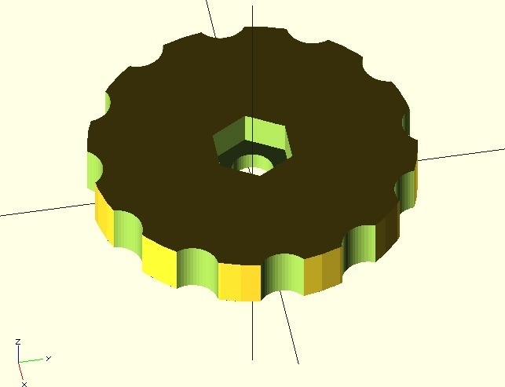
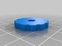
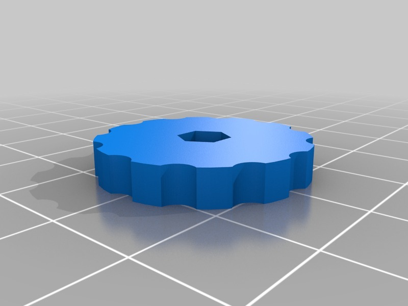
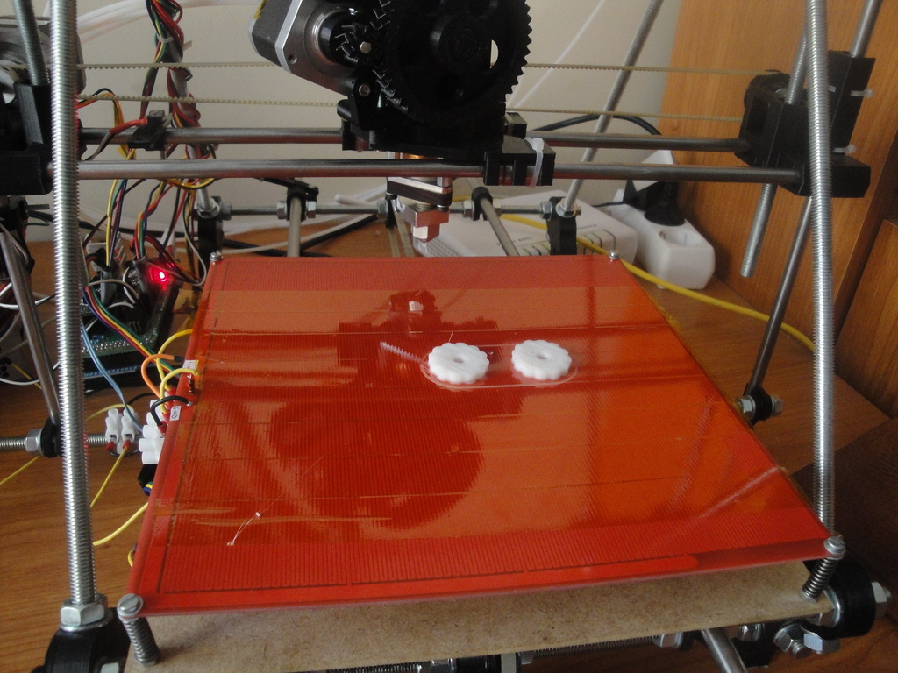
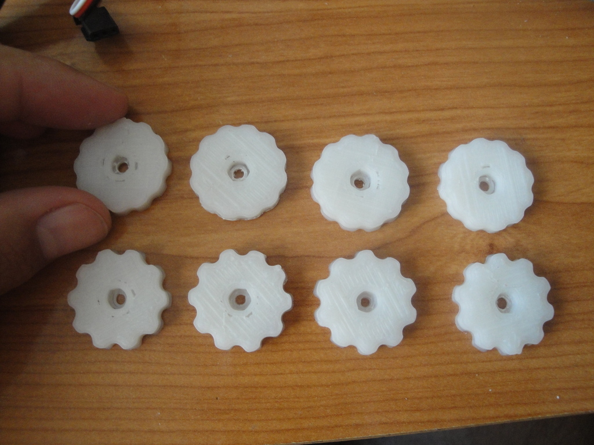
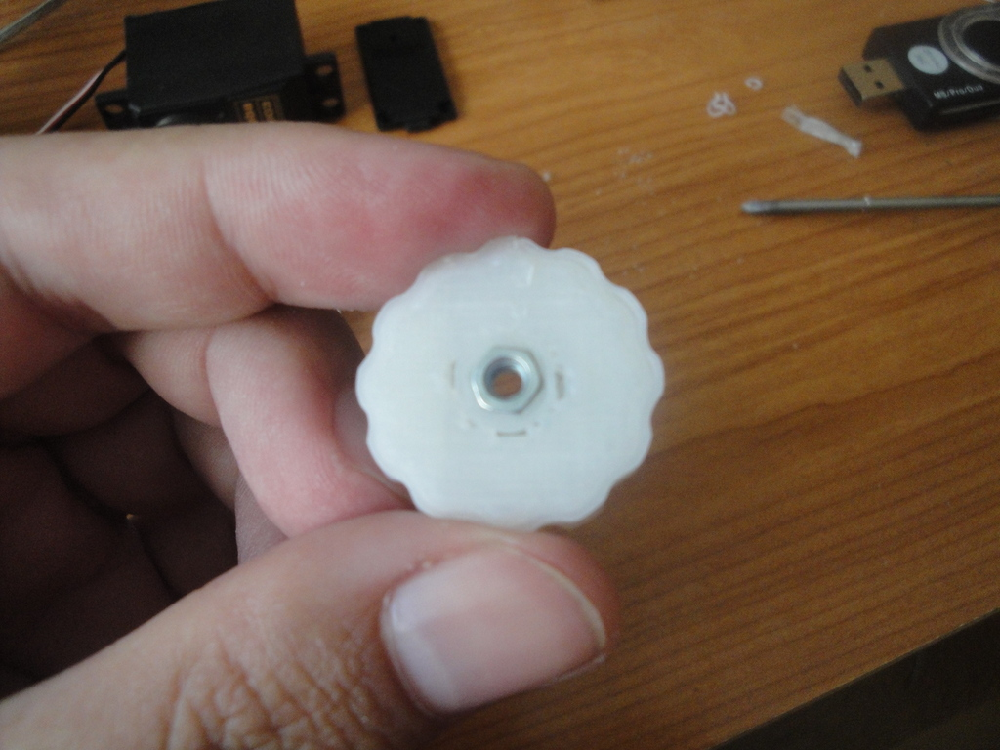
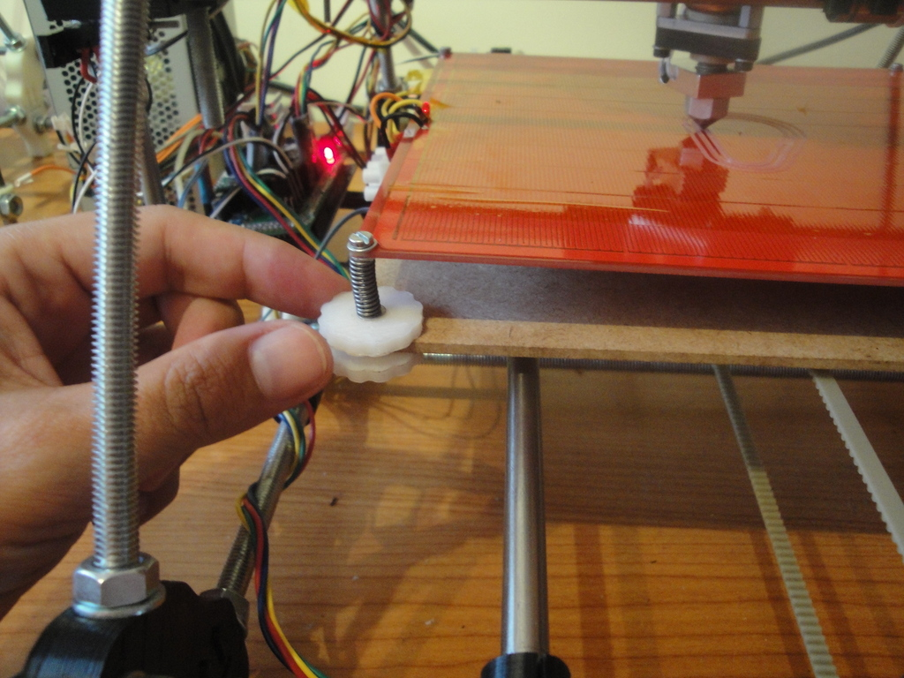

Parametric thumbwheel (M3)
===============
**Please note: This thing is part of a list that was [automatically generated](https://github.com/carlosgs/export-things) and may have been updated since then. Make sure to check for the current license and authorship.**  

Parametric thumbwheel (M3)  by obijuan , published Aug 31, 2012

Description
--------
I just have changed the parameters of the beautiful parametric thumbwheel by 67restomodder: 
 
<a href="http://www.thingiverse.com/thing:13807" target="_blank" rel="nofollow">thingiverse.com/thing:13807</a> 
 
The default parameters are for M3 nuts. In addition I have cleaned a little bit the code and changed the shape of the cutouts. 
 
More information (In spanish): 
<a href="http://www.iearobotics.com/wiki/index.php?title=Objeto_3D:_Ruedecilla_con_tuerca" target="_blank" rel="nofollow">iearobotics.com/wiki/index.php?title=Objeto_3D:_Ruedecilla_con_tuerca</a>

Instructions
--------
* Print 8 of them 
* Embed the M3 nuts 
* Use on your Prusa2!!

Files
--------

 [ thumb_wheel.scad](thumb_wheel.scad)  

 [ thumb_wheel_M3.stl](thumb_wheel_M3.stl)  

Pictures
--------

Tags
--------
knob , openscad , parametric , plastic_valley , prusa , thumbwheel , upgrades , useful  

  

License
--------
Parametric thumbwheel (M3) by obijuan is licensed under the Creative Commons - Attribution - Share Alike license.  

By: Juan Gonzalez-Gomez (Obijuan)
--------
<http://www.iearobotics.com/wiki/index.php?title=Juan_Gonzalez:Main>