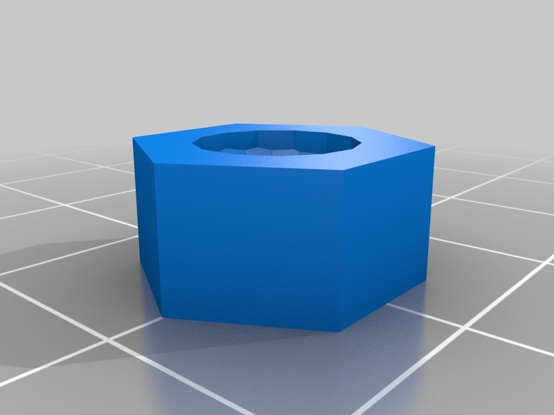
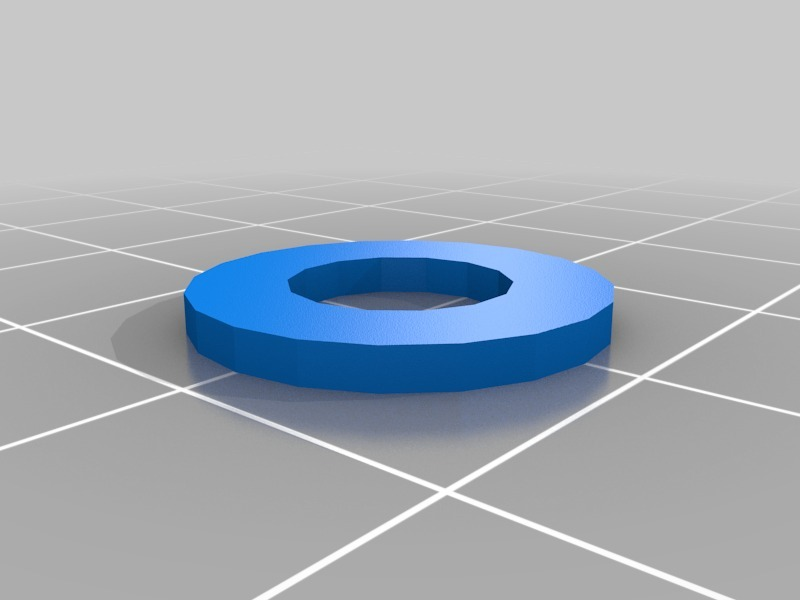
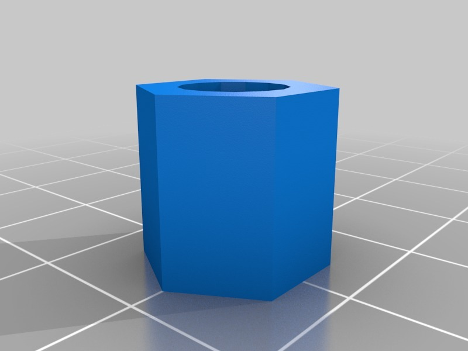
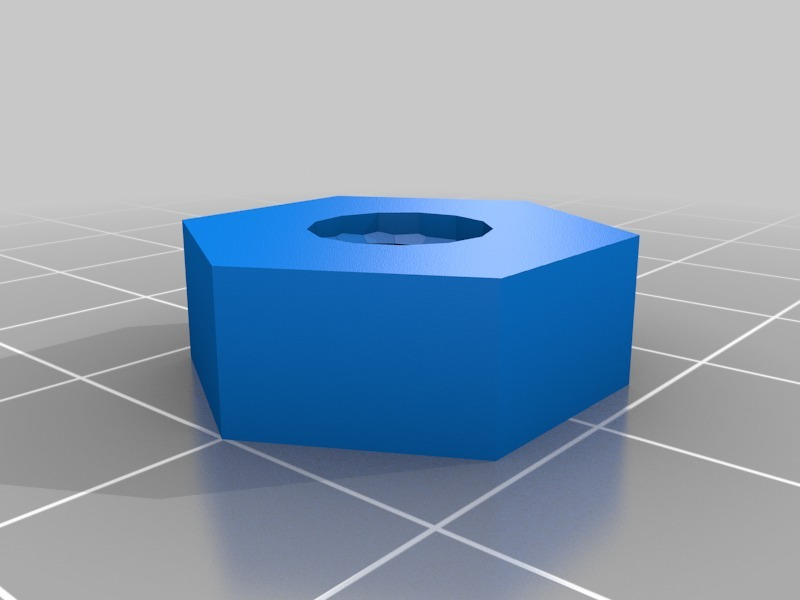
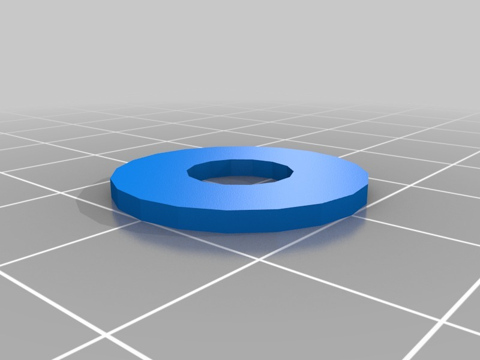
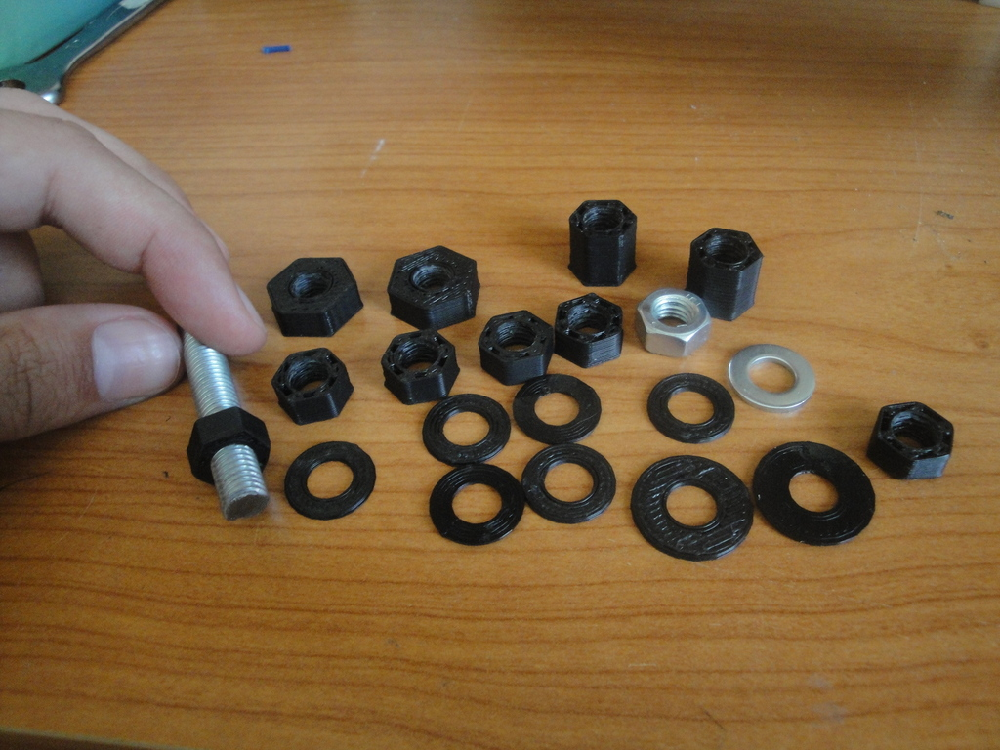
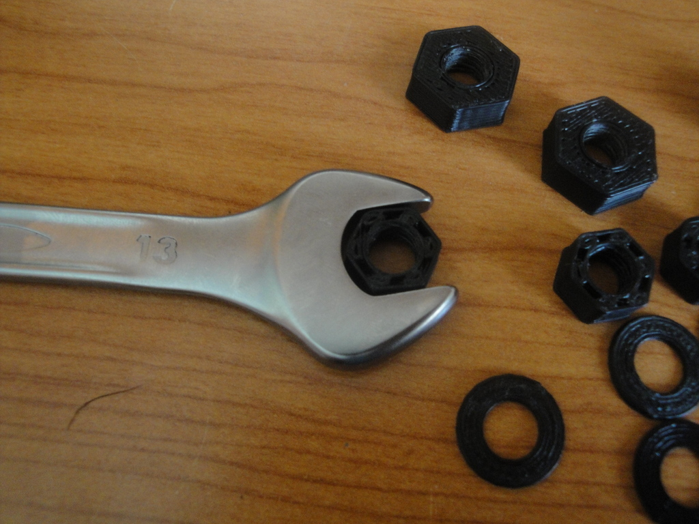
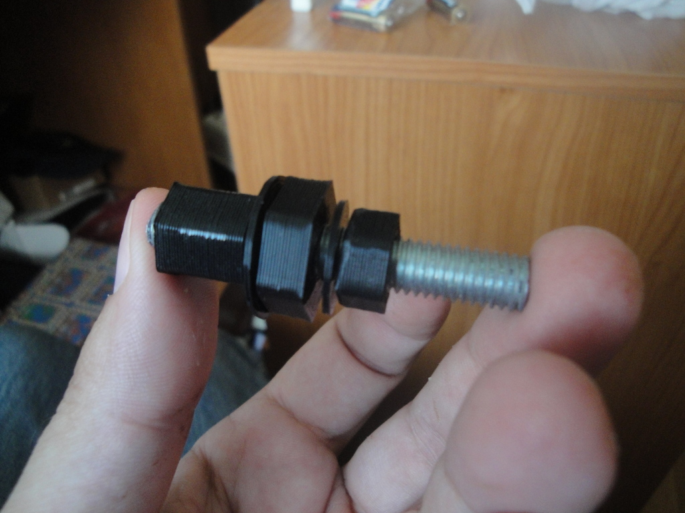
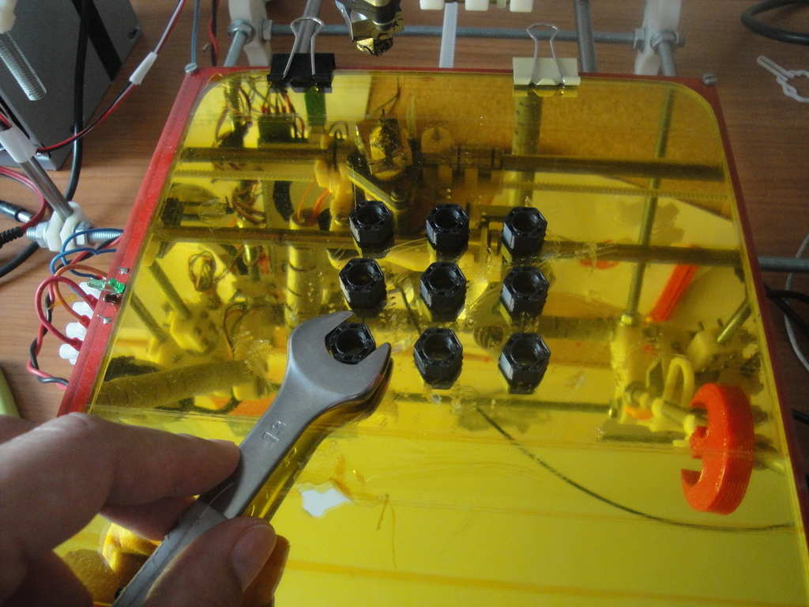
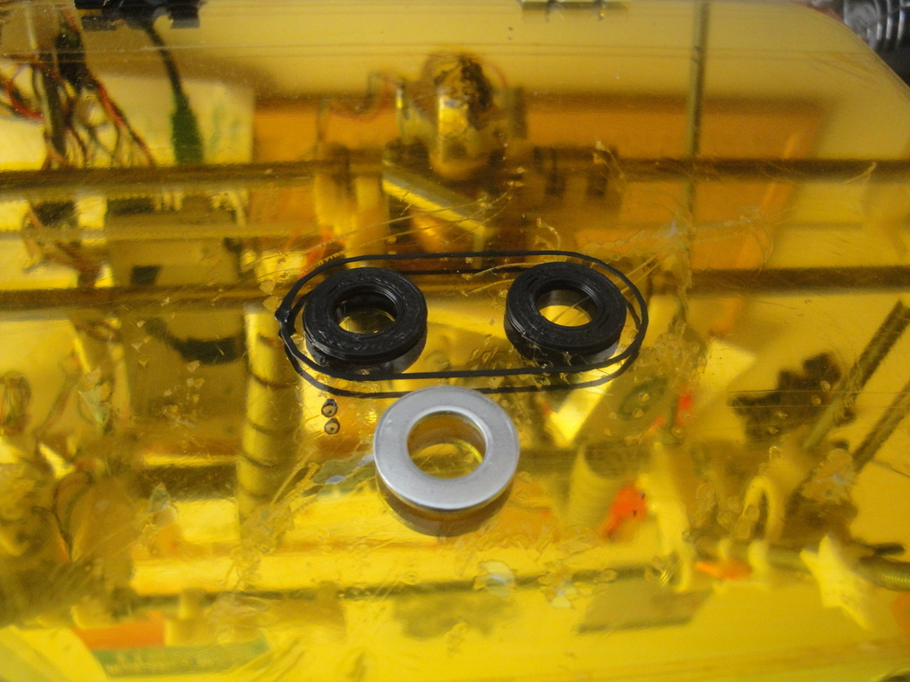

Printable standard M8 Hex nuts and washers
===============
**Please note: This thing is part of a list that was [automatically generated](https://github.com/carlosgs/export-things) and may have been updated since then. Make sure to check for the current license and authorship.**  

Printable standard M8 Hex nuts and washers  by obijuan , published Aug 1, 2012

Description
--------
Fully working printable M8 hex nuts with standard dimensions. They are derived from the wonderful ISO Metric thread library by Trevor Moseley. 
 
Do you want to build a Prusa with printable nuts and washers? Just download them and do it! 
 
You can see these parts in action in this video:  
<a href="http://www.youtube.com/watch?v=xHMjs-O9nq0" target="_blank" rel="nofollow">youtube.com/watch?v=xHMjs-O9nq0</a> 
 
More information (In Spanish): 
<a href="http://www.iearobotics.com/wiki/index.php?title=Tuerca_M8_imprimible" target="_blank" rel="nofollow">iearobotics.com/wiki/index.php?title=Tuerca_M8_imprimible</a> 
 
<b>UPDATE: 2012/Sep/06</b> 
<a href="http://www.youtube.com/watch?v=EIm0ZwCNhyA" target="_blank" rel="nofollow">youtube.com/watch?v=EIm0ZwCNhyA</a> 
 
The printable nuts are not only functional and cool. They can also be taken off very easily from the heatbed using a Wrench!! :-D 

Instructions
--------
The hex nut and washer with standard dimensiones are the files: 
Hex_nut_M8.stl and washer_M8.stl. 
 
But these parts are also parametric (designed with OpenScad), so that the user can easily change the height and outer diameters. I have created some STLs as an example: 
 
* Hex_nut_M8_higher.stl  : An M8 hex nut 13mm in height 
* Hex_nut_M8_wider.slt   : An M8 hex nut with an outer diameter of 20mm 
* washer_M8_extra.slt:  A M8 washer with an outer diameter of 20mm 
 
 
 

Files
--------

 [ washer_M8.stl](washer_M8.stl)  

 [ Hex_nut_M8_wider.stl](Hex_nut_M8_wider.stl)  

 [ washer_M8_extra_wide.stl](washer_M8_extra_wide.stl)  

 [ M8_hex_nut_washer.zip](M8_hex_nut_washer.zip)  

 [ Hex_nut_M8_higher.stl](Hex_nut_M8_higher.stl)  

 [ Hex_nut_M8.stl](Hex_nut_M8.stl)  

Pictures
--------

Tags
--------
M8 , nut , openscad , plastic_valley , prusa , reprap , upm , useful  

  

License
--------
Printable standard M8 Hex nuts and washers by obijuan is licensed under the Creative Commons - Attribution - Share Alike license.  

By: Juan Gonzalez-Gomez (Obijuan)
--------
<http://www.iearobotics.com/wiki/index.php?title=Juan_Gonzalez:Main>