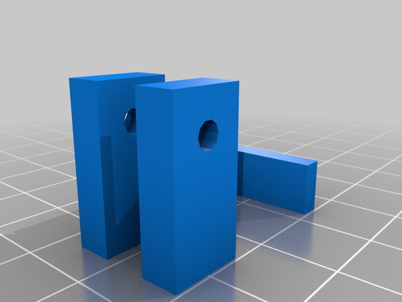
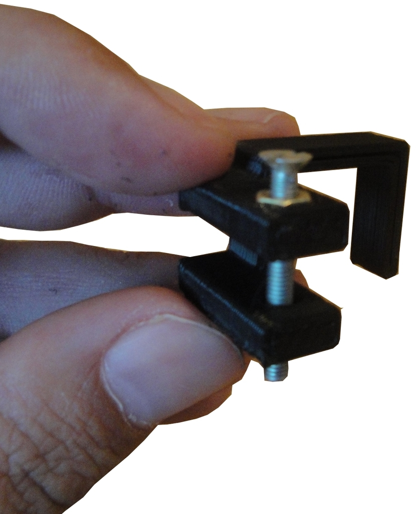
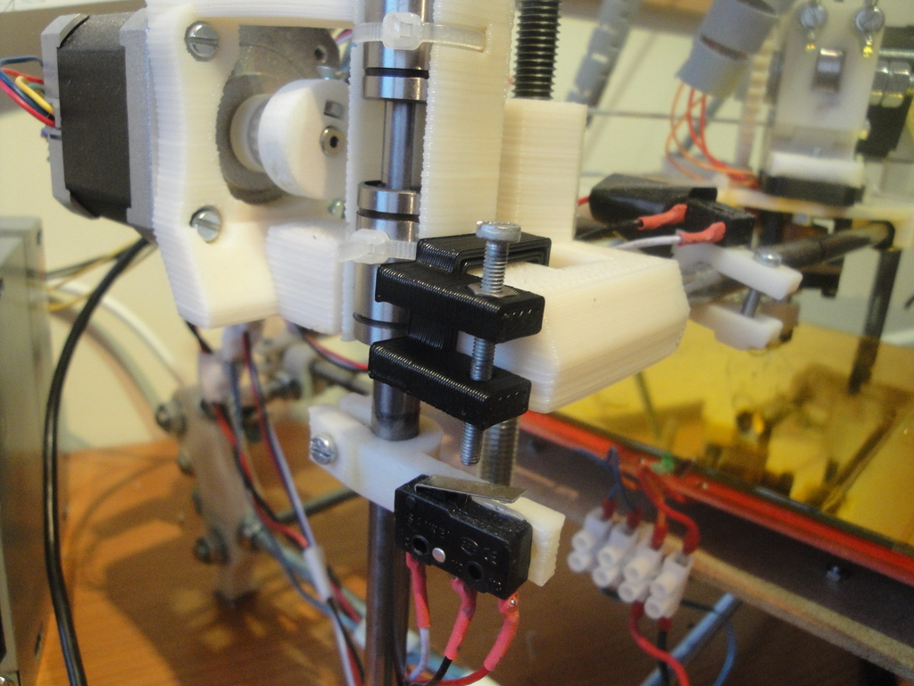
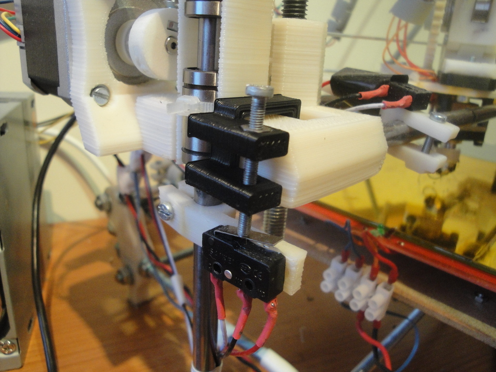
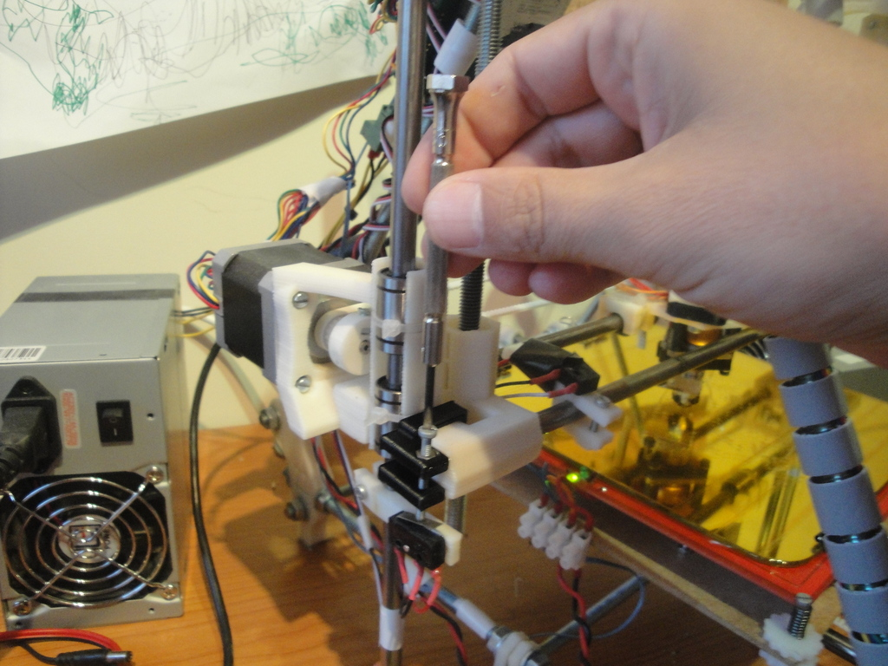

Prusa 2 z-height regulator
===============
**Please note: This thing is part of a list that was [automatically generated](https://github.com/carlosgs/export-things) and may have been updated since then. Make sure to check for the current license and authorship.**  

Prusa 2 z-height regulator  by obijuan , published Jul 31, 2012

Description
--------
Fine tune the initial z-height of your Prusa 2 easily by means of a screwdriver. 
 
This design is inspired in the printrbot V2 z-endstop 
 
More information (in Spanish): 
<a href="http://www.iearobotics.com/wiki/index.php?title=Regulador_altura_z_para_Prusa" target="_blank" rel="nofollow">iearobotics.com/wiki/index.php?title=Regulador_altura_z_para_Prusa</a>

Instructions
--------
* Print the height regulator 
* Insert the embeded M3 nut 
* Put a M3 x 25mm screw 
* Glue the part (or use acetone) to the x-end-motor of your Prusa 2 
* Adjust easily the home z height

Files
--------

 [ Prusa2-z-height-reg.stl](Prusa2-z-height-reg.stl)  

 [ Prusa2-z-height-reg.scad](Prusa2-z-height-reg.scad)  

Pictures
--------

Tags
--------
openscad , plastic_valley , prusa , upm  

  

License
--------
Prusa 2 z-height regulator by obijuan is licensed under the Creative Commons - Attribution - Share Alike license.  

By: Juan Gonzalez-Gomez (Obijuan)
--------
<http://www.iearobotics.com/wiki/index.php?title=Juan_Gonzalez:Main>