Prusa decorators!
===============
**Please note: This thing is part of a list that was [automatically generated](https://github.com/carlosgs/export-things) and may have been updated since then. Make sure to check for the current license and authorship.**  

Prusa decorators!  by obijuan , published Mar 26, 2012

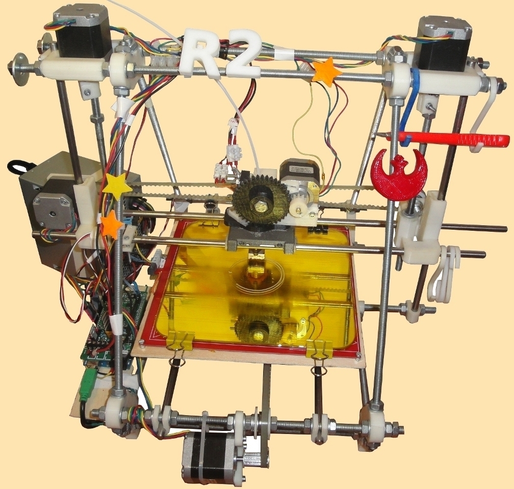

Description
--------
Decorate your prusa! 
 
I have designed a small clamp that is glued to other thingiverse objects for creating decorators for your Prusa Mendel 3D printer 
 
These decorators are attached to the Prusa M8 threaded rods

Instructions
--------
1) Choose a thingiverse object for decorating your Prusa. For example: 
  * Open hardware logo: <a href="http://www.thingiverse.com/thing:7635" target="_blank" rel="nofollow">thingiverse.com/thing:7635</a> 
  * Rebel alliance logo: <a href="http://www.thingiverse.com/thing:12352" target="_blank" rel="nofollow">thingiverse.com/thing:12352</a> 
  * Stars: <a href="http://www.thingiverse.com/thing:5052" target="_blank" rel="nofollow">thingiverse.com/thing:5052</a> 
  * Letters: <a href="http://www.thingiverse.com/thing:15198" target="_blank" rel="nofollow">thingiverse.com/thing:15198</a> 
  ... 
2) Print one or more Prusa Clamps 
3) Glue the clamp to the back of your object (you can use acetone) 
4) Engage the decorator to a Prusa M8 threaded rod 
5) Repeat the process as many times as you want :-) 
 
In this page I have also included some decoderators for you. The credits follow: 
-Rebel alliance logo, by Anandromeda 
-Stars, by Obijuan 
-Opensource-logo, by Clothbot 

Files
--------
[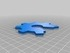](logo-openhardware-big.stl)
 [ logo-openhardware-big.stl](logo-openhardware-big.stl)  

 [ Prusa-clamp.scad](Prusa-clamp.scad)  

[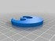](REBEL_alliance.stl)
 [ REBEL_alliance.stl](REBEL_alliance.stl)  

[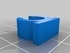](Prusa-clamp.stl)
 [ Prusa-clamp.stl](Prusa-clamp.stl)  

[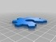](logo-openhardware-small.stl)
 [ logo-openhardware-small.stl](logo-openhardware-small.stl)  

[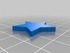](5_point-star.stl)
 [ 5_point-star.stl](5_point-star.stl)  

Pictures
--------

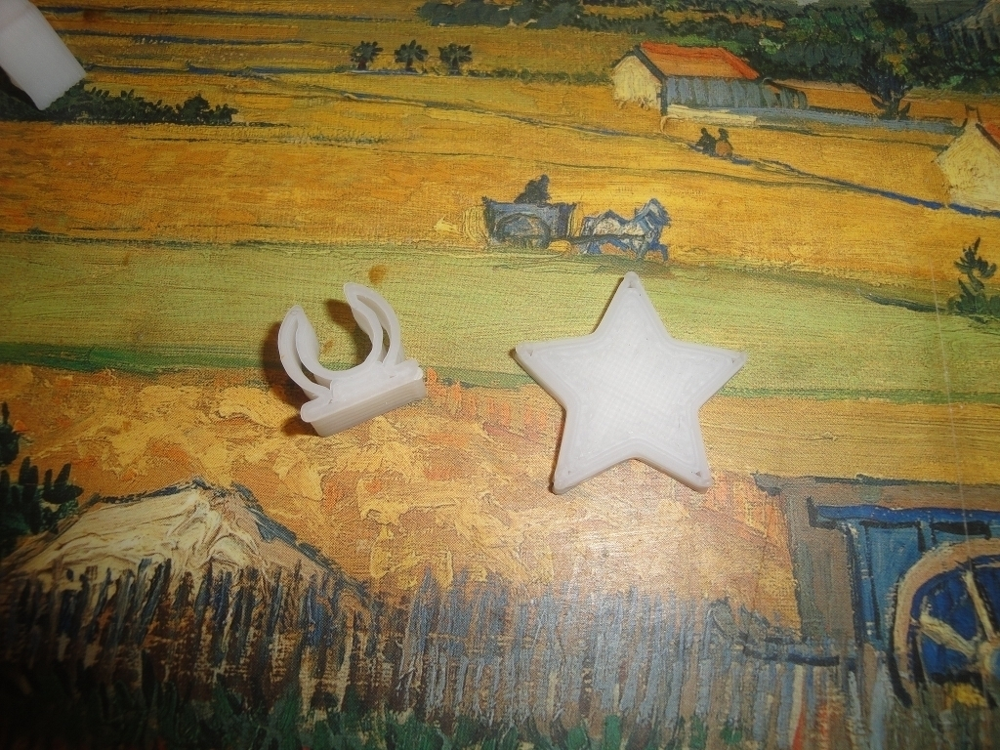

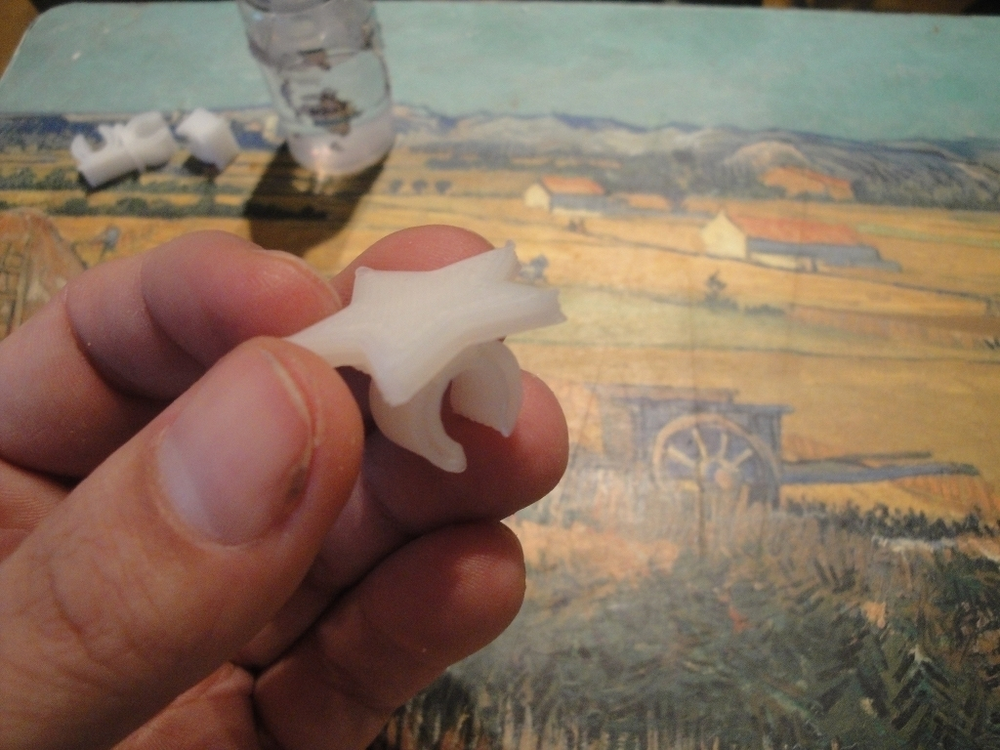
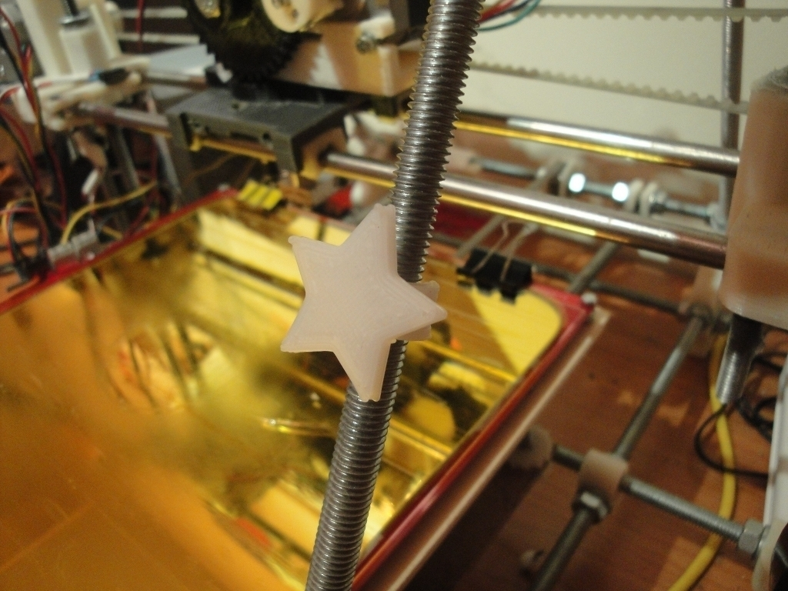
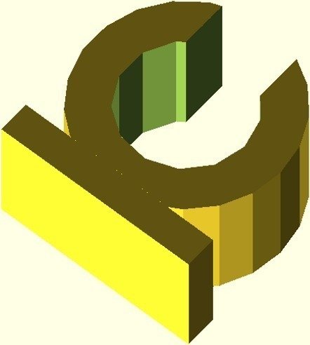
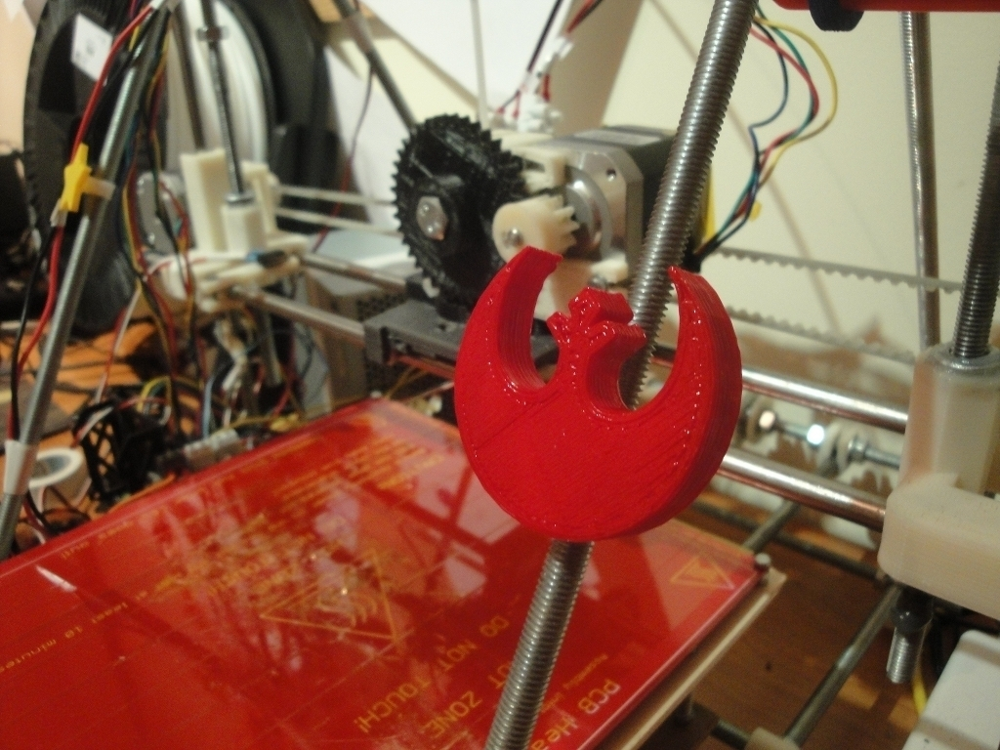
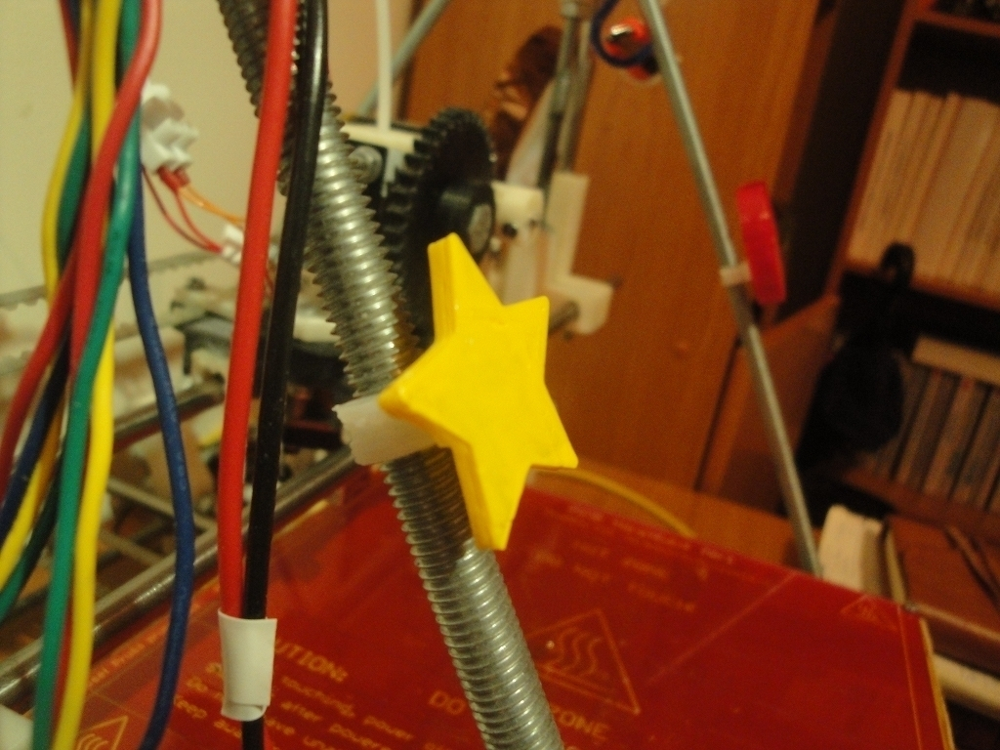
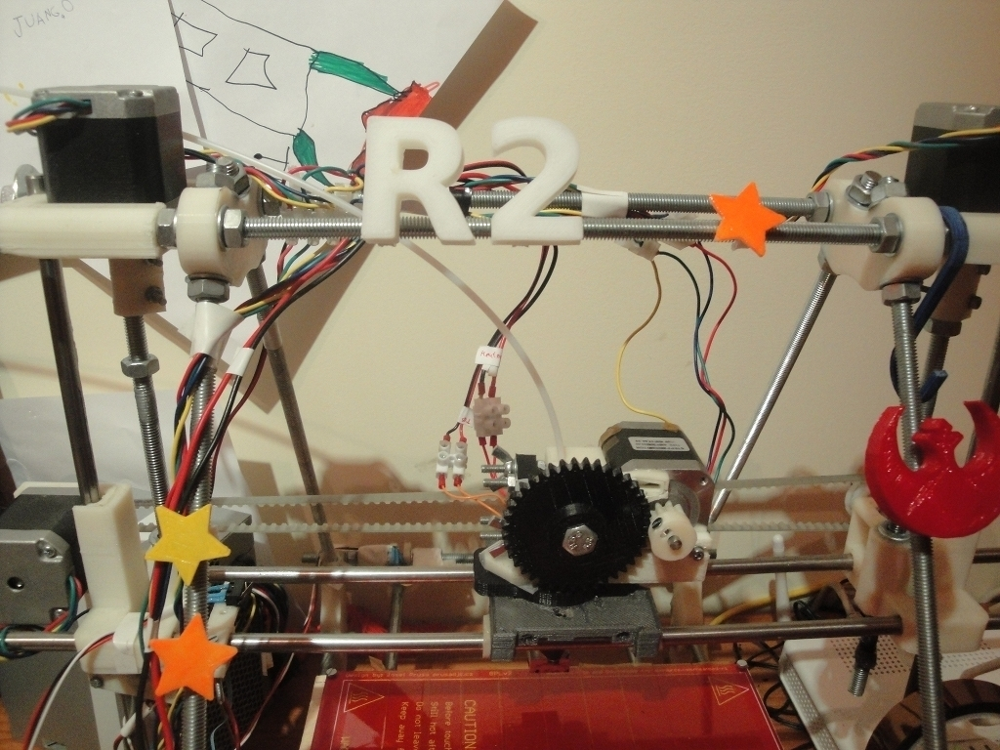

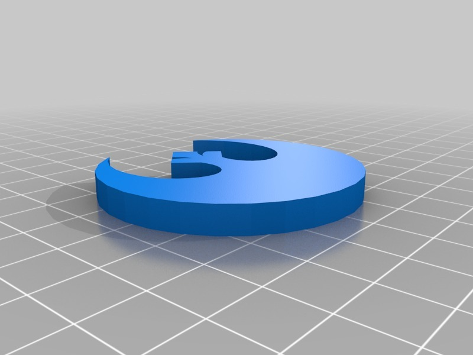
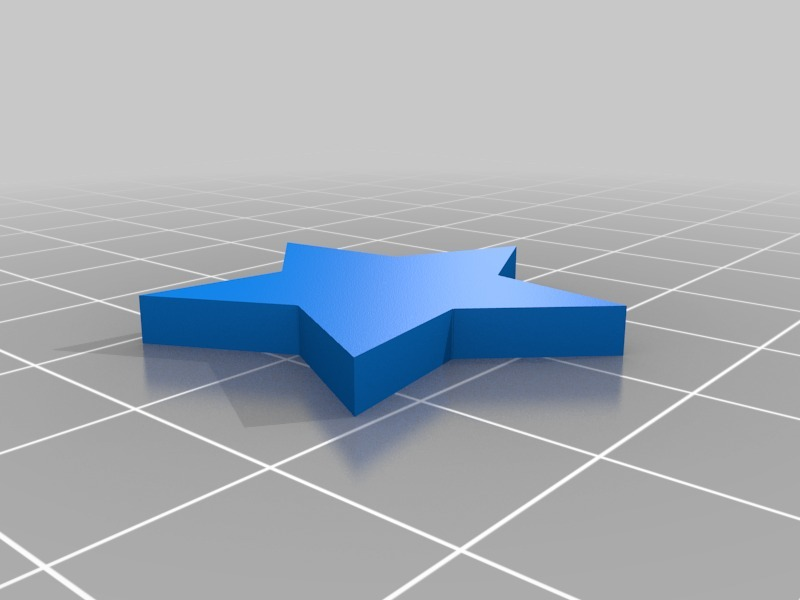
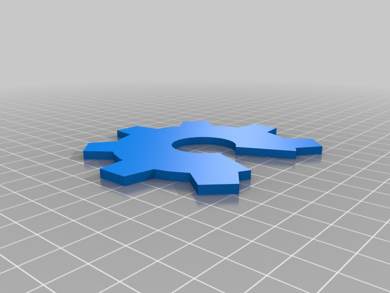

Tags
--------
clamp , openscad , ornament , parametric , plastic_valley , prusa  

  

License
--------
Prusa decorators! by obijuan is licensed under the Creative Commons - Attribution - Share Alike license.  

By: Juan Gonzalez-Gomez (Obijuan)
--------
<http://www.iearobotics.com/wiki/index.php?title=Juan_Gonzalez:Main>