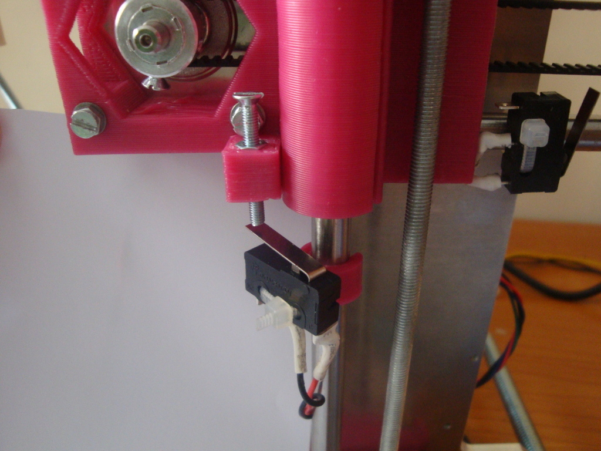
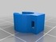
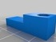
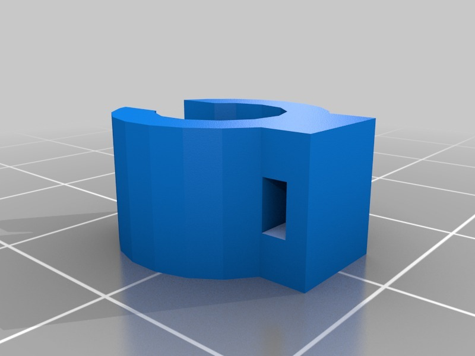
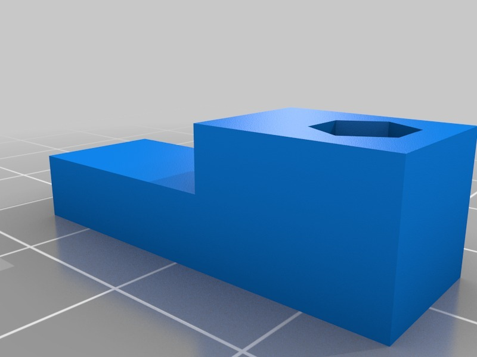
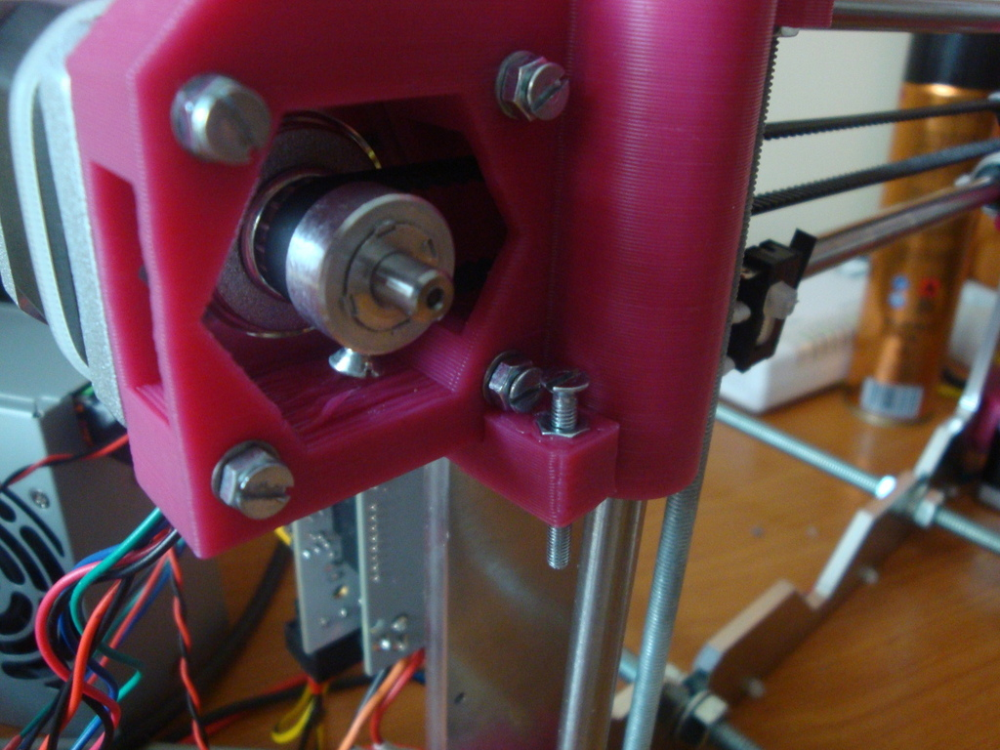
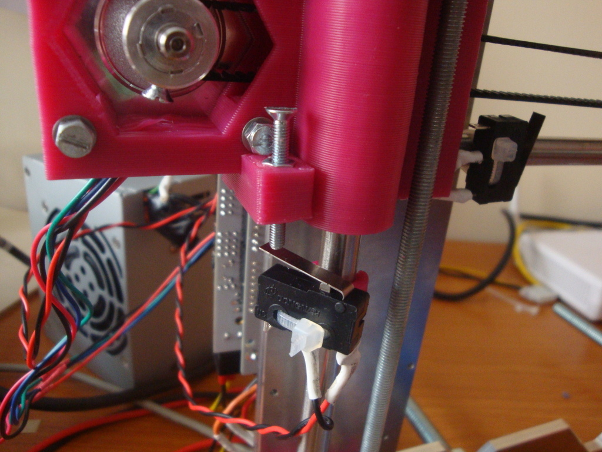

Prusa i3 z-height regulator
===============
**Please note: This thing is part of a list that was [automatically generated](https://github.com/carlosgs/export-things) and may have been updated since then. Make sure to check for the current license and authorship.**  

Prusa i3 z-height regulator  by obijuan , published Apr 8, 2013

Description
--------
Fine tune the initial z-height of your Prusa i3 easily by means of a screwdriver.   
 
The endstop clamp is needed:   
 
<a href="http://www.thingiverse.com/thing:71488" target="_blank" rel="nofollow">thingiverse.com/thing:71488</a>  
 
More information (in spanish):   
<a href="http://www.iearobotics.com/wiki/index.php?title=Regulador_altura_Prusa_i3" target="_blank" rel="nofollow">iearobotics.com/wiki/index.php?title=Regulador_altura_Prusa_i3</a>

Instructions
--------
1) Embedded the nut into the height regulator   
2)  Glue the height regulator to the bottom of the x-end-motor (as shown in the pictures)   
3) Place a M3x25mm screw   
4) Attach the endstop to the clamp   
5) Attach the clamp to the z-axis smooth bar

Files
--------

 [ endstop-clamp.stl](endstop-clamp.stl)  

 [ Prusa-i3-h-reg.stl](Prusa-i3-h-reg.stl)  

 [ Prusa-i3-h-reg.scad](Prusa-i3-h-reg.scad)  

Pictures
--------

Tags
--------
openscad , Prusa_i3  

  

License
--------
Prusa i3 z-height regulator by obijuan is licensed under the Creative Commons - Attribution license.  

By: Juan Gonzalez-Gomez (Obijuan)
--------
<http://www.iearobotics.com/wiki/index.php?title=Juan_Gonzalez:Main>