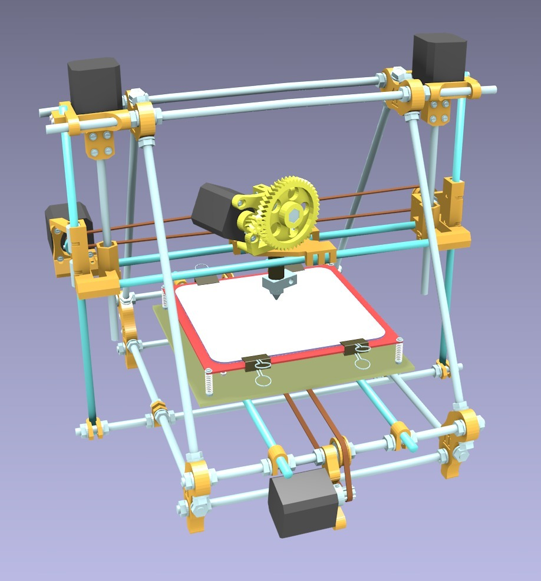
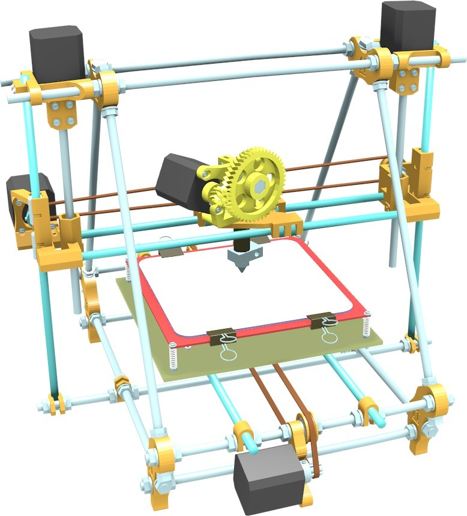
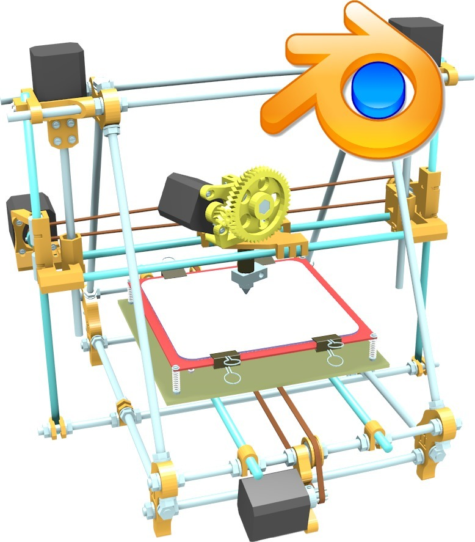
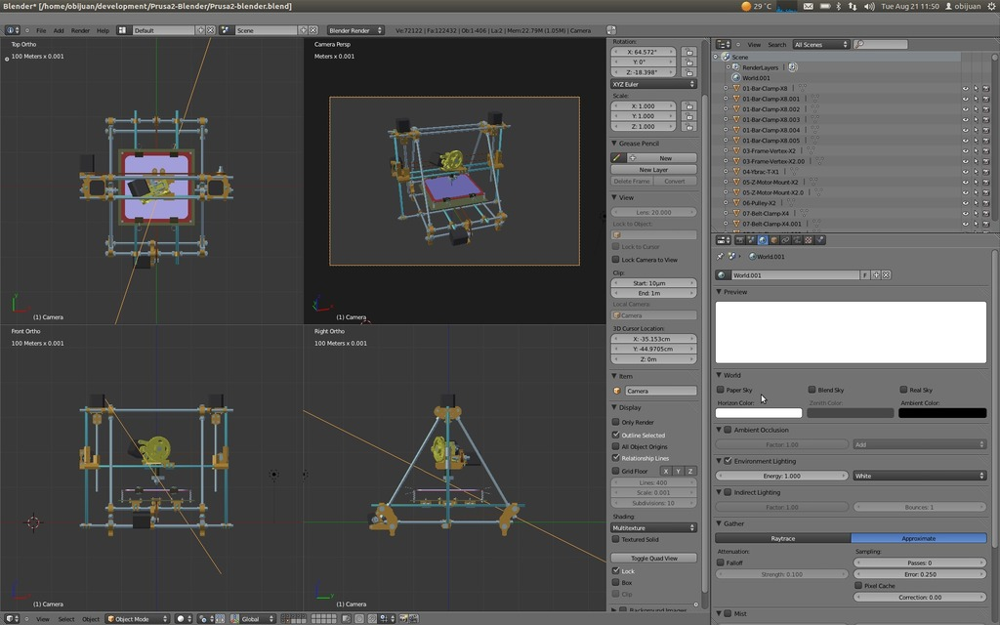
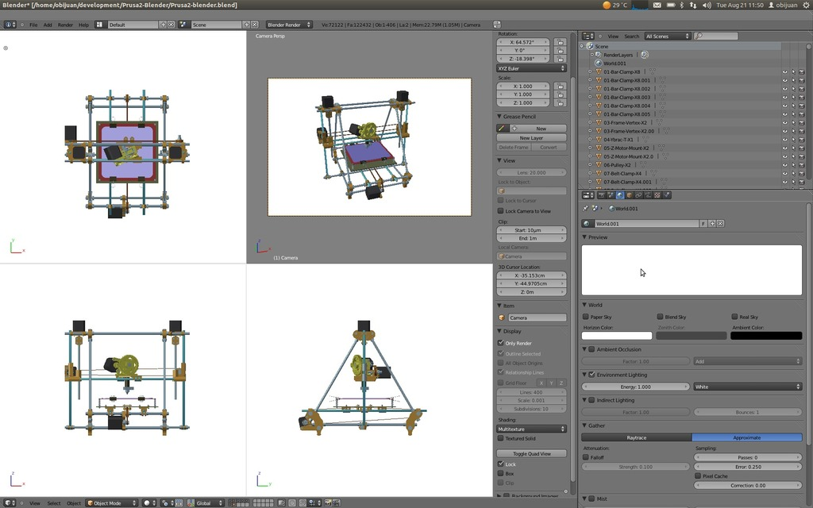

Prusa2-Blender
===============
**Please note: This thing is part of a list that was [automatically generated](https://github.com/carlosgs/export-things) and may have been updated since then. Make sure to check for the current license and authorship.**  

Prusa2-Blender  by obijuan , published Aug 21, 2012

Description
--------
The Prusa iteration 2 modelled in Blender 2.5. All the STLs parts of the official Prusa 2 have been imported into Blender. All the vitamins have been designed in OpenScad, exported to STL and imported into Blender. 
 
This model is very useful for generating documentation. The users can explore the design to see how the different parts are attached. In addition, animations can be generated in Blender. 
 
Blender is a multi-platform open-source high-quality application. Although it has not been explicitly designed for Engineering, is rather easy to import STLs parts and create complex 3D models. 
 
You can see a video here: 
<a href="http://www.youtube.com/watch?v=7fOu8MF8ZJg" target="_blank" rel="nofollow">youtube.com/watch?v=7fOu8MF8ZJg</a> 
 
Github repository: 
<a href="https://github.com/Obijuan/Prusa2-Blender" target="_blank" rel="nofollow">github.com/Obijuan/Prusa2-Blender</a> 
 
Wiki page (in Spanish): 
<a href="http://www.iearobotics.com/wiki/index.php?title=Prusa2_Blender" target="_blank" rel="nofollow">iearobotics.com/wiki/index.php?title=Prusa2_Blender</a>

Instructions
--------
* Uncompress the file Obijuan-Prusa2-Blender-v1.0.zip 
* Open the file Prusa2-blender.blend with Blender 
* Enjoy! 

Files
--------

 [ Obijuan-Prusa2-Blender-v1.0.zip](Obijuan-Prusa2-Blender-v1.0.zip)  

Pictures
--------

Tags
--------
blender , openscad , plastic_valley , Prusa , reprap  

  

License
--------
Prusa2-Blender by obijuan is licensed under the Creative Commons - Attribution - Share Alike license.  

By: Juan Gonzalez-Gomez (Obijuan)
--------
<http://www.iearobotics.com/wiki/index.php?title=Juan_Gonzalez:Main>