Things designed by Juan Gonzalez-Gomez (Obijuan)
===============

I've exported all my designs from thingiverse (#takerbot) using the [Export-things script](https://github.com/carlosgs/export-things) by Carlos Garcia Saura

These repo will no longer be maintaned. It is just a safe place were store the design and keeping them open.

1. [REPYZ modules](REPYZ-modules/)
--------
[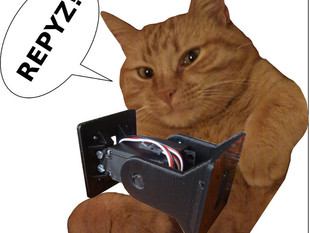](REPYZ-modules/)  

2. [Servo lower cover](Servo-lower-cover/)
--------
[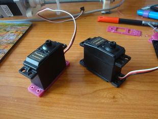](Servo-lower-cover/)  

3. [Another compartment box](Another-compartment-box/)
--------
[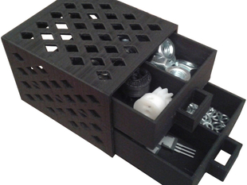](Another-compartment-box/)  

4. [Prusa i3 z-height regulator](Prusa-i3-z-height-regulator/)
--------
[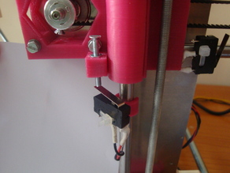](Prusa-i3-z-height-regulator/)  

5. [Endstop Clamp](Endstop-Clamp/)
--------
[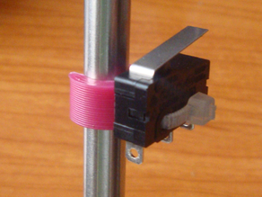](Endstop-Clamp/)  

6. [Miniskybot 2](Miniskybot-2/)
--------
[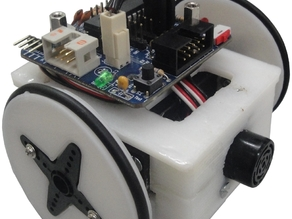](Miniskybot-2/)  

7. [Obijuan's Pen](Obijuan-s-Pen/)
--------
[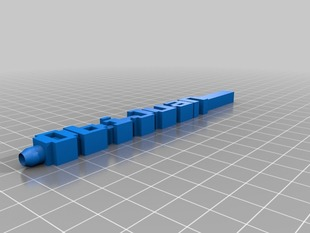](Obijuan-s-Pen/)  

8. [YATH: Yet Another Tool Holder](YATH-Yet-Another-Tool-Holder/)
--------
[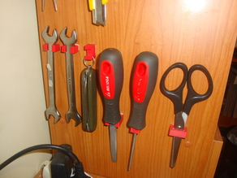](YATH-Yet-Another-Tool-Holder/)  

9. [star-6](star-6/)
--------
[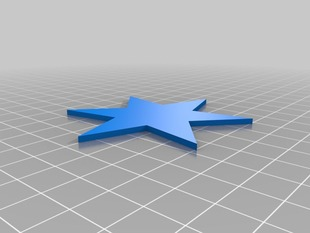](star-6/)  

10. [Tensile test specimen](Tensile-test-specimen/)
--------
[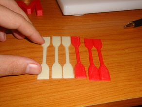](Tensile-test-specimen/)  

11. [Clone wars plate id](Clone-wars-plate-id/)
--------
[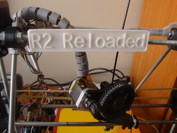](Clone-wars-plate-id/)  

12. [Ikea table foot](Ikea-table-foot/)
--------
[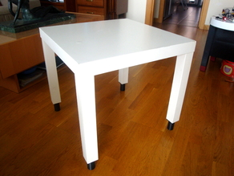](Ikea-table-foot/)  

13. [Table foot](Table-foot/)
--------
[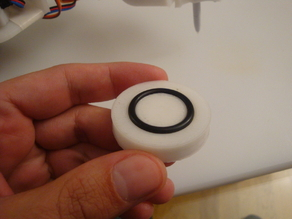](Table-foot/)  

14. [Sigma Technologies corp. logo](Sigma-Technologies-corp-logo/)
--------
[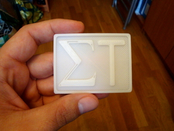](Sigma-Technologies-corp-logo/)  

15. [Servo lower lid](Servo-lower-lid/)
--------
[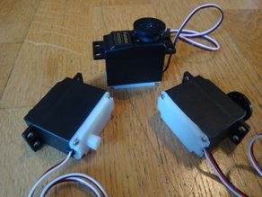](Servo-lower-lid/)  

16. [Bevel library for OpenScad](Bevel-library-for-OpenScad/)
--------
[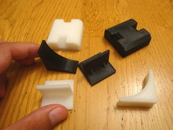](Bevel-library-for-OpenScad/)  

17. [Attach library for Openscad](Attach-library-for-Openscad/)
--------
[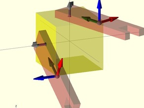](Attach-library-for-Openscad/)  

18. [Vector library for OpenScad](Vector-library-for-OpenScad/)
--------
[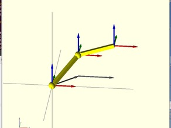](Vector-library-for-OpenScad/)  

19. [Parametric openscad beveled cube](Parametric-openscad-beveled-cube/)
--------
[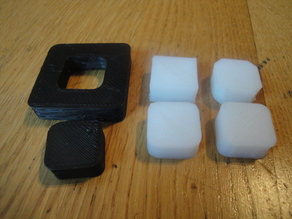](Parametric-openscad-beveled-cube/)  

20. [Parametric thumbwheel (M3)](Parametric-thumbwheel-M3/)
--------
[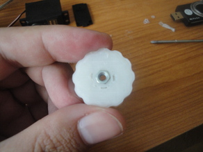](Parametric-thumbwheel-M3/)  

21. [Prusa2-Blender](Prusa2-Blender/)
--------
[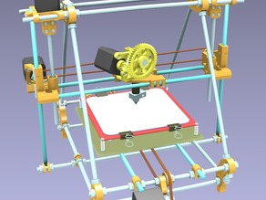](Prusa2-Blender/)  

22. [Belt holder for a portable DVD](Belt-holder-for-a-portable-DVD/)
--------
[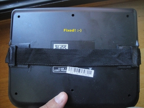](Belt-holder-for-a-portable-DVD/)  

23. [Printable standard M8 Hex nuts and washers](Printable-standard-M8-Hex-nuts-and-washers/)
--------
[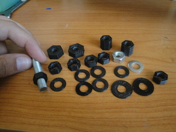](Printable-standard-M8-Hex-nuts-and-washers/)  

24. [Prusa 2 z-height regulator](Prusa-2-z-height-regulator/)
--------
[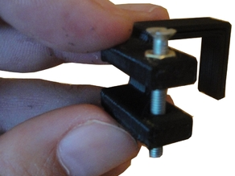](Prusa-2-z-height-regulator/)  

25. [Mini-dome](Mini-dome/)
--------
[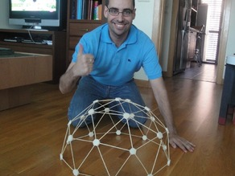](Mini-dome/)  

26. [ArduSnake: Arduino Modular Snake Robots Library](ArduSnake-Arduino-Modular-Snake-Robots-Library/)
--------
[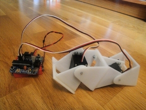](ArduSnake-Arduino-Modular-Snake-Robots-Library/)  

27. [Parameterized printable spring](Parameterized-printable-spring/)
--------
[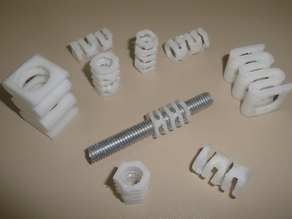](Parameterized-printable-spring/)  

28. [Prusa decorators!](Prusa-decorators/)
--------
[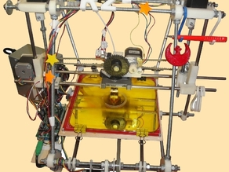](Prusa-decorators/)  

29. [Servo wheel 4.0](Servo-wheel-4-0/)
--------
[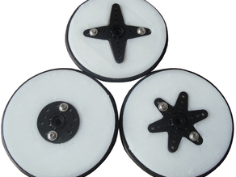](Servo-wheel-4-0/)  

30. [The f*** you all coin](The-f-you-all-coin/)
--------
[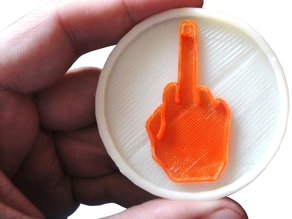](The-f-you-all-coin/)  

31. [Yet another Pendrive holder](Yet-another-Pendrive-holder/)
--------
[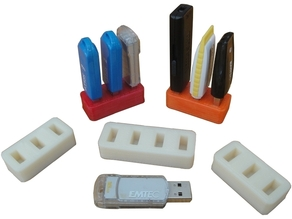](Yet-another-Pendrive-holder/)  

32. [Ikea hook clone](Ikea-hook-clone/)
--------
[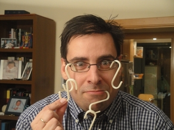](Ikea-hook-clone/)  

33. [Skymega board](Skymega-board/)
--------
[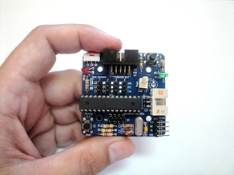](Skymega-board/)  

34. [REPY1 modules. Version 1.1](REPY1-modules-Version-1-1/)
--------
[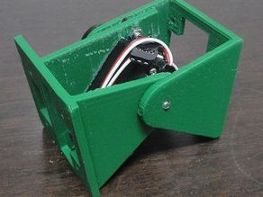](REPY1-modules-Version-1-1/)  

35. [Parameterized Servo wheel for mobile robots](Parameterized-Servo-wheel-for-mobile-robots/)
--------
[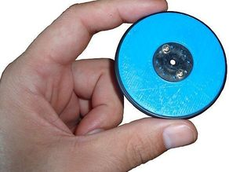](Parameterized-Servo-wheel-for-mobile-robots/)  

36. [MiniSkybot Robot V1.0](MiniSkybot-Robot-V1-0/)
--------
[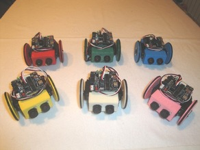](MiniSkybot-Robot-V1-0/)  

37. [Yet another Glasses!](Yet-another-Glasses/)
--------
[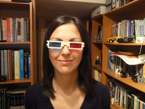](Yet-another-Glasses/)  

38. [Parameterized battery pack with contacts](Parameterized-battery-pack-with-contacts/)
--------
[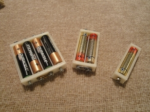](Parameterized-battery-pack-with-contacts/)  

39. [Battery Compartment with contacts](Battery-Compartment-with-contacts/)
--------
[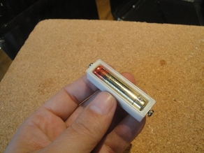](Battery-Compartment-with-contacts/)  

40. [Parametric star](Parametric-star/)
--------
[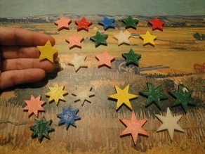](Parametric-star/)  

41. [MiniSkybot Robot Chassis](MiniSkybot-Robot-Chassis/)
--------
[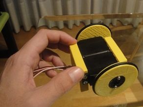](MiniSkybot-Robot-Chassis/)  

42. [Hoap Robot's head](Hoap-Robot-s-head/)
--------
[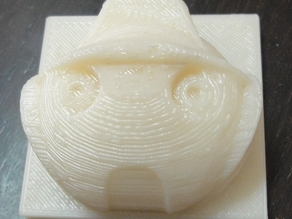](Hoap-Robot-s-head/)  

43. [Coffee Stirrer](Coffee-Stirrer/)
--------
[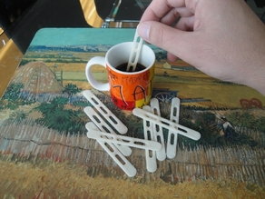](Coffee-Stirrer/)  

44. [Servo wheel for mobile robots](Servo-wheel-for-mobile-robots/)
--------
[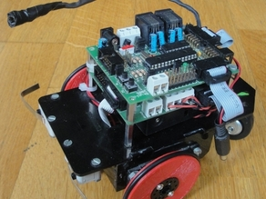](Servo-wheel-for-mobile-robots/)  

45. [Casino chips](Casino-chips/)
--------
[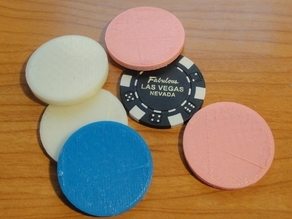](Casino-chips/)  

46. [REPY-1 modules. Version 1.0](REPY-1-modules-Version-1-0/)
--------
[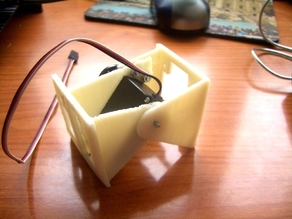](REPY-1-modules-Version-1-0/)  

  

License
--------
Please check the individual pages for each design

By: Juan Gonzalez-Gomez (Obijuan)
--------
<http://www.iearobotics.com/wiki/index.php?title=Juan_Gonzalez:Main>
