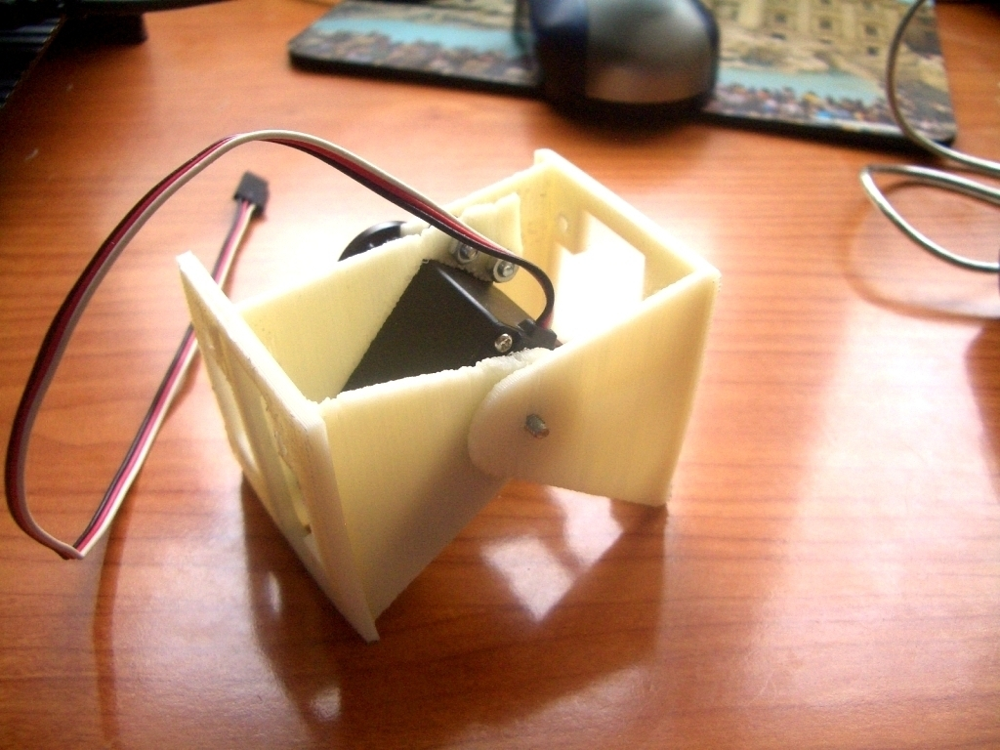
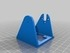
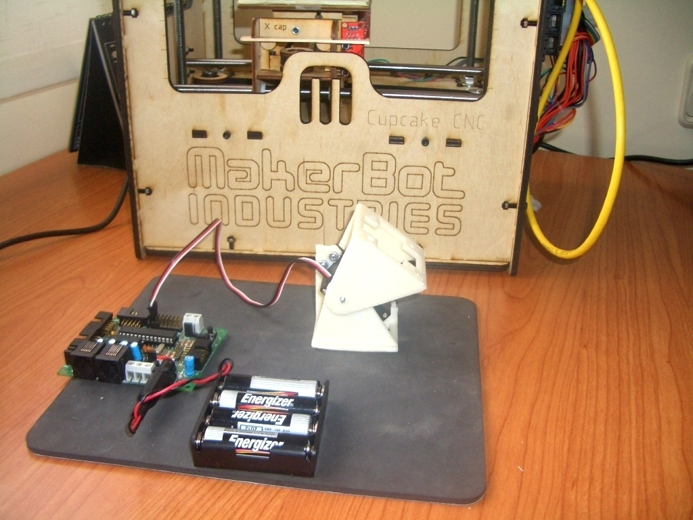
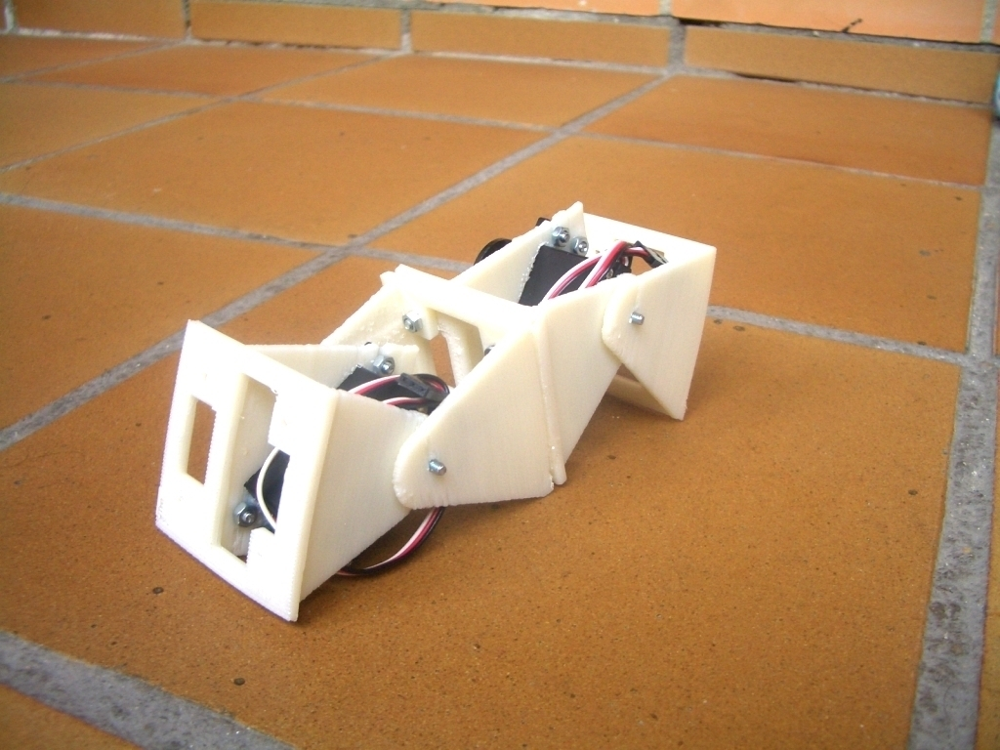
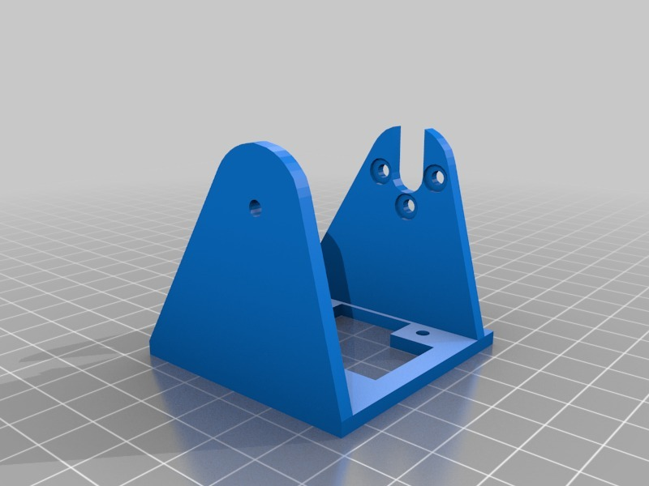
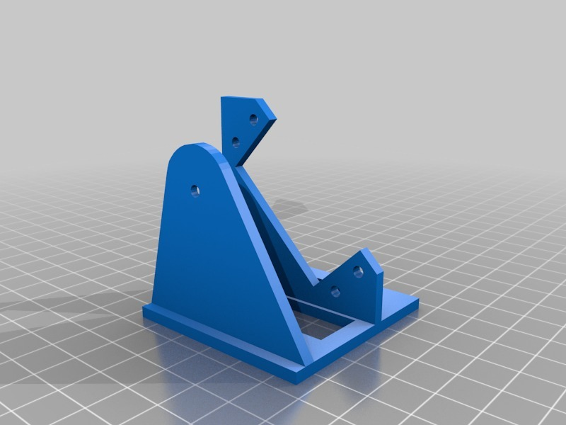

REPY-1 modules. Version 1.0
===============
**Please note: This thing is part of a list that was [automatically generated](https://github.com/carlosgs/export-things) and may have been updated since then. Make sure to check for the current license and authorship.**  

REPY-1 modules. Version 1.0  by obijuan , published Jun 9, 2009

Description
--------
Articulated modules for building modular robots. It is the repraped version of the <b>Y1 modules</b> that I have created for my PhD. 
<a href="http://www.iearobotics.com/personal/juan/doctorado/Modulos-Y1/modulos-y1.html" target="_blank" rel="nofollow">iearobotics.com/personal/juan/doctorado/Modulos-Y1/modulos-y1.html</a> 
Version 1.0 is the first one. It works and it is 3D printable, but the design should be improved in order to obtain a better printing quality. 
 
<b>UPDATE: 09/Nov/2011</b> 
A new version has been released: <a href="http://www.thingiverse.com/thing:13442" target="_blank" rel="nofollow">thingiverse.com/thing:13442</a>

Instructions
--------
For building the <b>REPY-1 modules</b>, two 3D objects should be printed: the body and the head. Also, a Futaba 3003 compatible servo is needed, along with six M3 8mm bolts, 5 nuts and 1 washer. 
You can have a look at these pictures to see how to build it: 
 
<a href="http://fotos.iearobotics.com/index.php?album=modulos-repy-1" target="_blank" rel="nofollow">fotos.iearobotics.com/index.php?album=modulos-repy-1</a> 
 
  You can see one module in action in this youtube video: 
 
<a href="http://www.youtube.com/watch?v=x7OYkaXNGrY" target="_blank" rel="nofollow">youtube.com/watch?v=x7OYkaXNGrY</a> 
 
I apologize for my bad English :-( 
 
In this video, you can see the <b>minimal modular robot</b> that can be built using two REPY1 modules: 
 
<a href="http://www.youtube.com/watch?v=QmFV8lIZhB8" target="_blank" rel="nofollow">youtube.com/watch?v=QmFV8lIZhB8</a> 
 
Here is a <b>very funny video</b> showing the kind of modular robot that can be built if you print more modules.  
 
<a href="http://www.youtube.com/watch?v=GUuVUEFfbEg" target="_blank" rel="nofollow">youtube.com/watch?v=GUuVUEFfbEg</a> 

Files
--------

 [ repy1-module-body.stl](repy1-module-body.stl)  

 [ repy1-module-head.stl](repy1-module-head.stl)  

 [ repy1-module-body.blend](repy1-module-body.blend)  

 [ repy1-module-head.blend](repy1-module-head.blend)  

Pictures
--------

Tags
--------
education , makerbot , modular_robot , Pan , part , plastic valley , printbot , reprap , robot , robotics , servo , Tilt , UC3M  

  

License
--------
REPY-1 modules. Version 1.0 by obijuan is licensed under the Creative Commons - Attribution - Share Alike license.  

By: Juan Gonzalez-Gomez (Obijuan)
--------
<http://www.iearobotics.com/wiki/index.php?title=Juan_Gonzalez:Main>