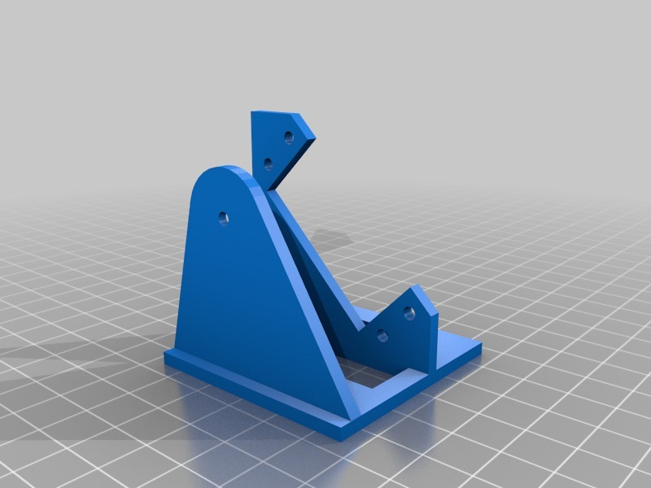
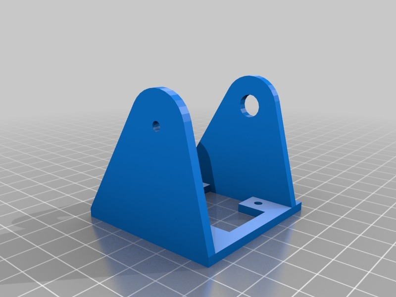
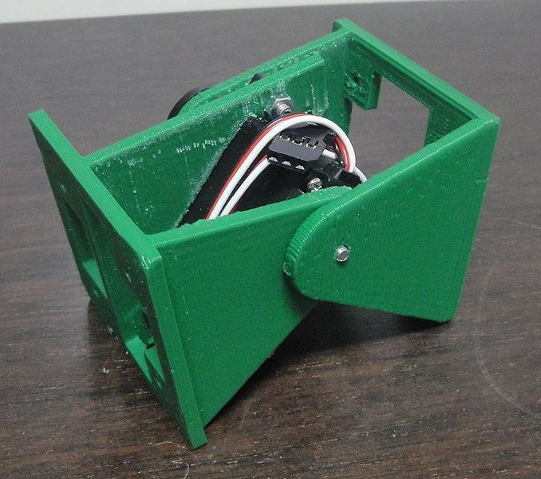
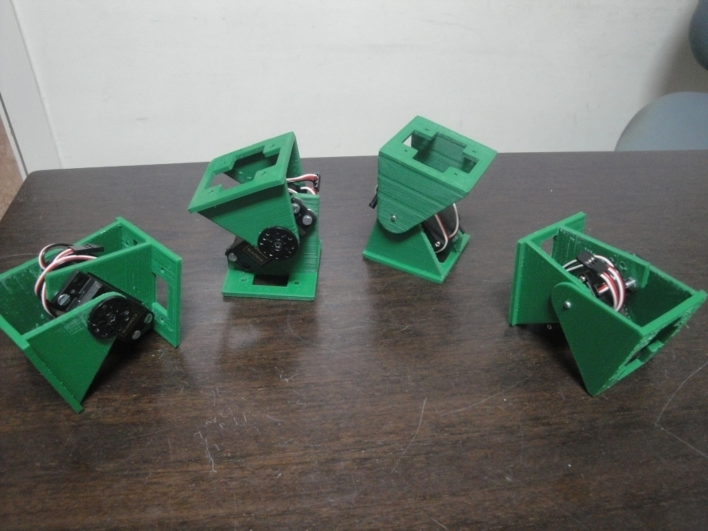
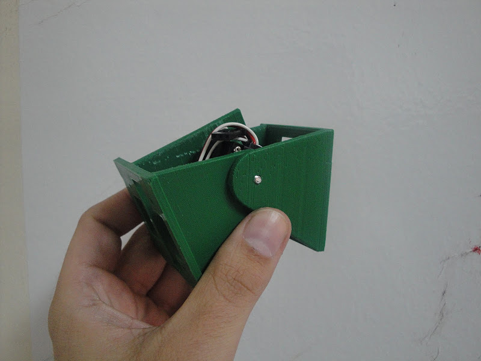
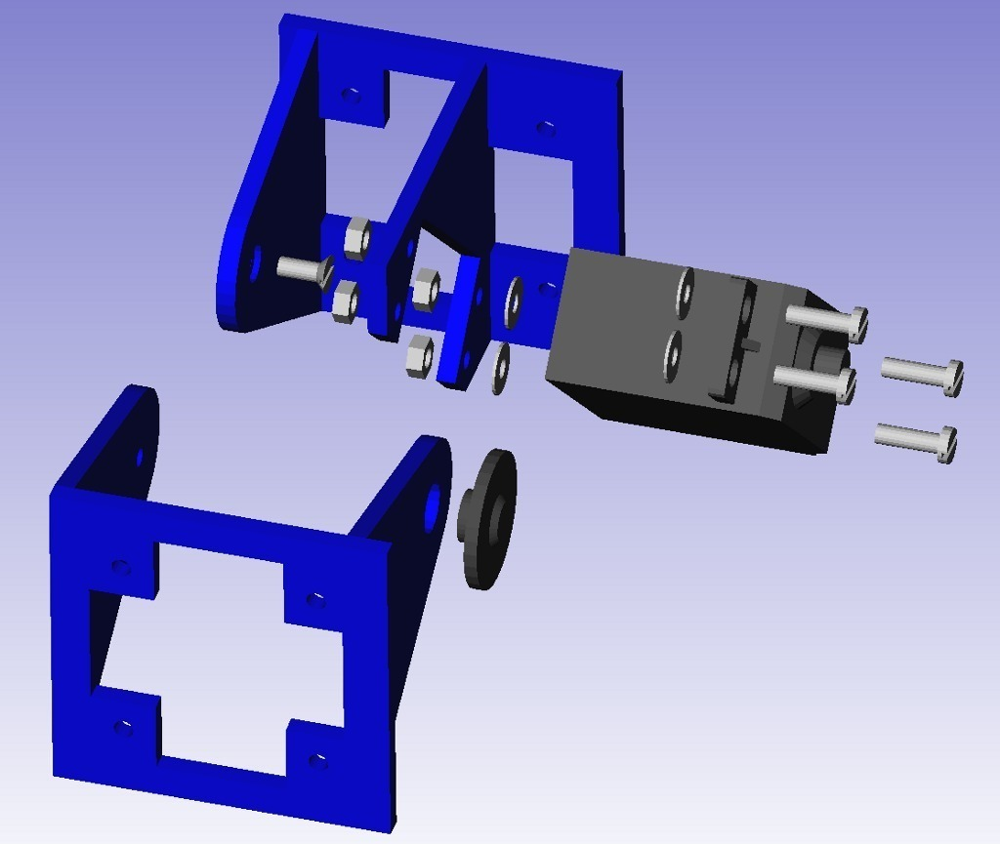
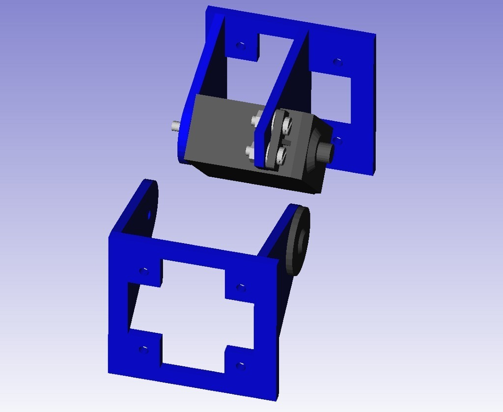
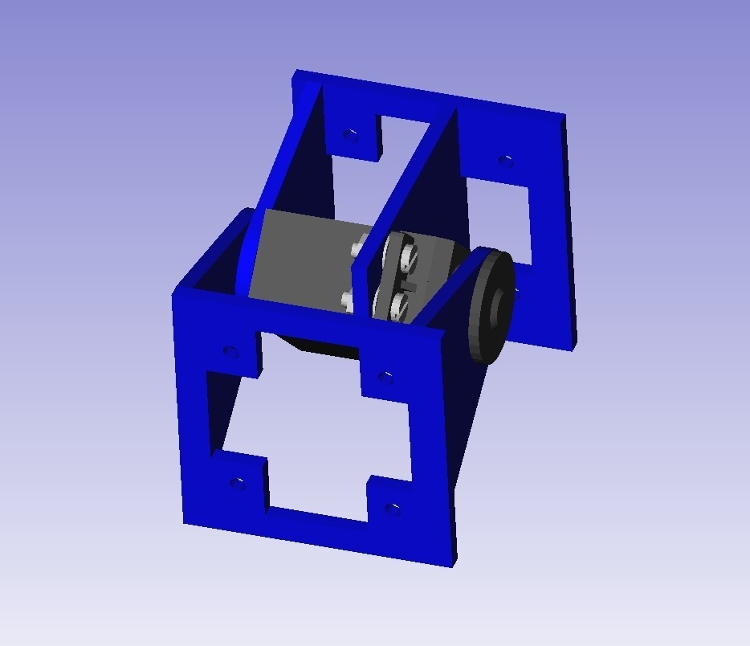

REPY1 modules. Version 1.1
===============
**Please note: This thing is part of a list that was [automatically generated](https://github.com/carlosgs/export-things) and may have been updated since then. Make sure to check for the current license and authorship.**  

REPY1 modules. Version 1.1  by obijuan , published Nov 9, 2011

Description
--------
This design is a mechanical module for building <b>modular printbots</b> (printable robots). 
The main improvement of this design over v1.0 is that it has been migrated from Blender to Openscad. Therefore the drills and part's thickness are parametric. 
 
The documentation has been done with Freecad. For more details just download and open the freecad files 
 
Our goal is to <b>build the longest modular snake robot ever!</b> :-D 
 
There are more information (in Spanish) about these modules in the following link: 
 
<a href="http://www.iearobotics.com/wiki/index.php?title=M%C3%B3dulos_REPY-1" target="_blank" rel="nofollow">iearobotics.com/wiki/index.php?title=M%C3%B3dulos_REPY-1</a>

Instructions
--------
Print the two parts: body and head.  
See the attached pictures for building the module 
Join together two or more modules for creating snakes capable of moving both on 1D and 2D. 
 
 

Files
--------

 [ REPY1-1.1-module-head.stl](REPY1-1.1-module-head.stl)  

 [ REPY1-1.1-module-body.stl](REPY1-1.1-module-body.stl)  

 [ repy1-v1.1-sources-openscad.zip](repy1-v1.1-sources-openscad.zip)  

 [ repy1-v1_1-doc-freecad.zip](repy1-v1_1-doc-freecad.zip)  

Pictures
--------

Tags
--------
makerbot , modular_robot , openscad , plastic valley , printbot , Repy , robot , skymega , uc3m  

  

License
--------
REPY1 modules. Version 1.1 by obijuan is licensed under the Creative Commons - Attribution - Share Alike license.  

By: Juan Gonzalez-Gomez (Obijuan)
--------
<http://www.iearobotics.com/wiki/index.php?title=Juan_Gonzalez:Main>