REPYZ modules
===============
**Please note: This thing is part of a list that was [automatically generated](https://github.com/carlosgs/export-things) and may have been updated since then. Make sure to check for the current license and authorship.**  

REPYZ modules  by obijuan , published Jun 5, 2013

Description
--------
3D Printable module units for building **modular robots**.- They are very useful for 1D-topology modular robots like caterpillars or snakes, capable of moving along a line (1D) or on a plane (2D).   
 
REPYZ modules are an **evolution of the REPY modules**   
 
There are two flavors. The standard REPYZ and the **PRO**, which includes an 608 bearing for making the movements more smooth   
 
More information   
-----   
 
- github: <a href="https://github.com/Obijuan/REPYZ" target="_blank" rel="nofollow">github.com/Obijuan/REPYZ</a>  
- REPYZ wiki page (in spanish): <a href="http://www.iearobotics.com/wiki/index.php?title=M%C3%B3dulos_REPYZ" target="_blank" rel="nofollow">iearobotics.com/wiki/index.php?title=M%C3%B3dulos_REPYZ</a>  
 
Pictures   
-------   
* G+ album:   <a href="https://plus.google.com/u/0/photos/109138697406392447933/albums/5878857037837654529" target="_blank" rel="nofollow">plus.google.com/u/0/photos/109138697406392447933/albums/5878857037837654529</a>  
 
Credits   
-------   
* **David Estevez**: Is the author of the **Repy v2**. Repyz were inspired in Repy v2: <a href="http://www.dsquaredrobotics.com/wiki/index.php?title=REPY-2.0" target="_blank" rel="nofollow">dsquaredrobotics.com/wiki/index.php?title=REPY-2.0</a>  
 
*   **Andres Prieto-Moreno**. Is the author of the **MY1 modules**, in which the repyz are also inspired. He also suggested me the idea of including a lower servo cover with ears for the servos. Because of these ears, the body of the module has been dramatically simplified.   
 
*    **Gocha** is the cat of **Carlos Garcia Saura**. It is the one that appears on the REPYZ logo   
 
 
 
 
 
 

Instructions
--------
Bill of materials:   
----   
*  The 3 printed parts: body, head and servo lower cover (There are two differents heads, one for the standard and the other for the PRO)   
*  Servo Futaba 3003   
*  1 M8 washer   
*  1 608 bearing (optional, only for the pro version)   
*  4 M3 nuts   
*  4 M3x10mm bolts   
*  2 M2x12mm bolts (provided with the servo)   
 
 
Assembly process:   
 
<a href="https://plus.google.com/u/0/photos/109138697406392447933/albums/5884847018420290209" target="_blank" rel="nofollow">plus.google.com/u/0/photos/109138697406392447933/albums/5884847018420290209</a>

Files
--------

 [ repyz-PRO-exploded-view.fcstd](repyz-PRO-exploded-view.fcstd)  

 [ servo_lower_cover_fake_shaft.stl](servo_lower_cover_fake_shaft.stl)  

[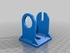](repyz-head-PRO.stl)
 [ repyz-head-PRO.stl](repyz-head-PRO.stl)  

 [ REPYZ-openscad-src.zip](REPYZ-openscad-src.zip)  

 [ repyz.fcstd](repyz.fcstd)  

 [ repyz-exploded-view.fcstd](repyz-exploded-view.fcstd)  

[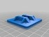](repyz-body.stl)
 [ repyz-body.stl](repyz-body.stl)  

 [ repyz-PRO.fcstd](repyz-PRO.fcstd)  

[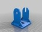](repyz-head.stl)
 [ repyz-head.stl](repyz-head.stl)  

Pictures
--------
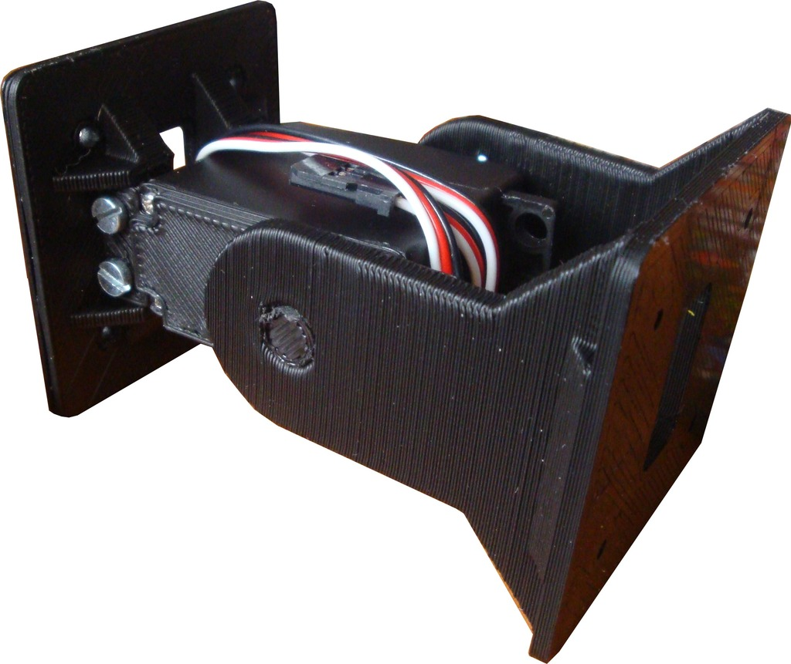
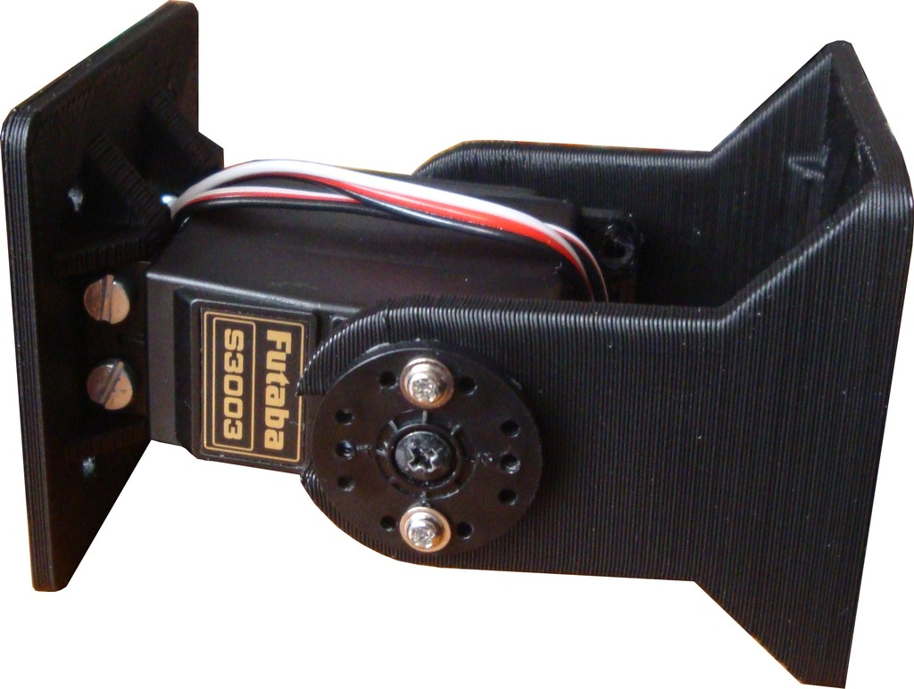
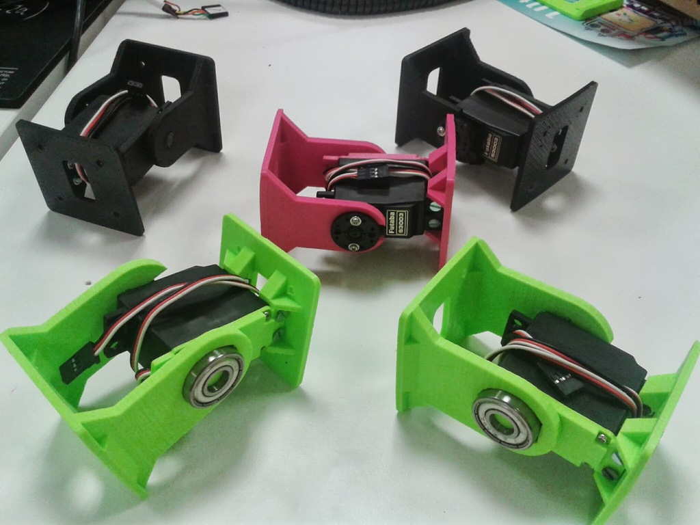
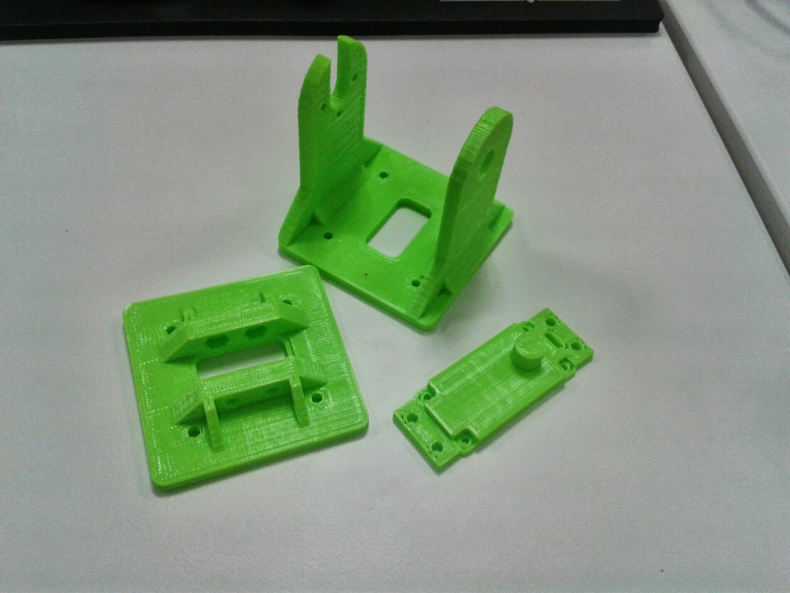
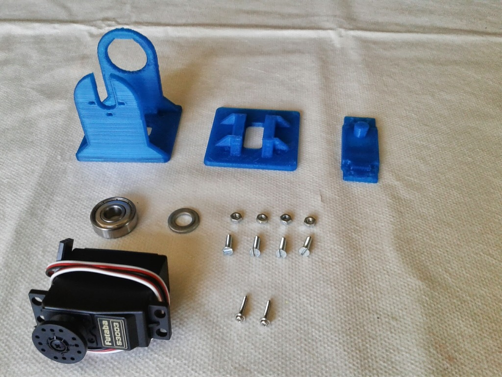
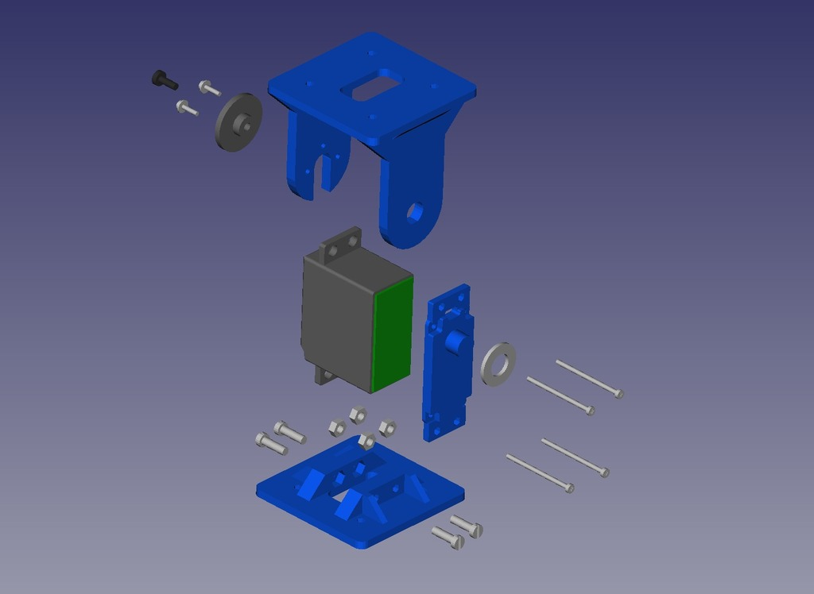
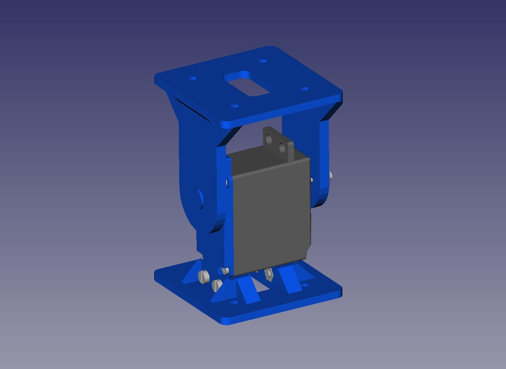
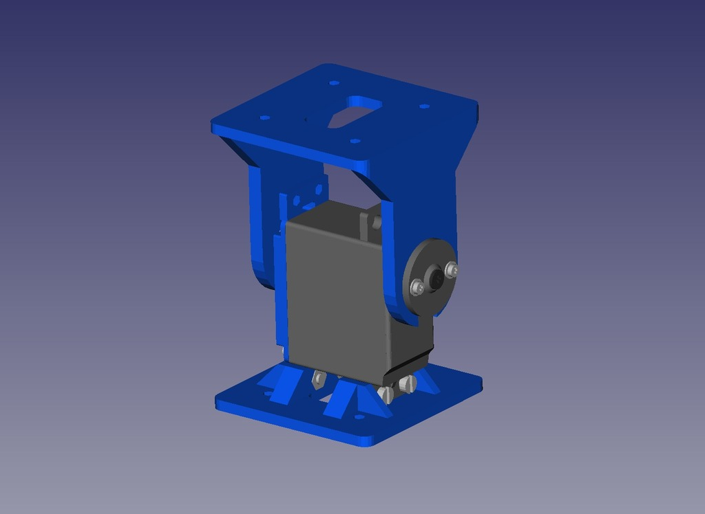
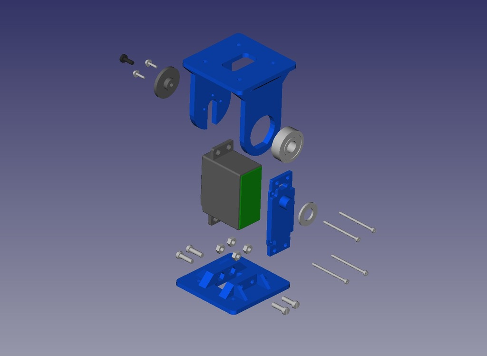
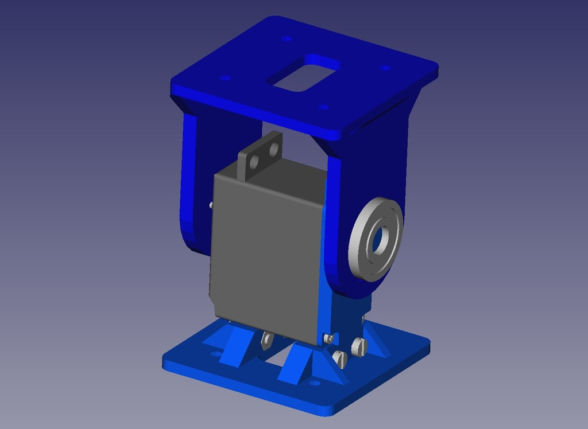
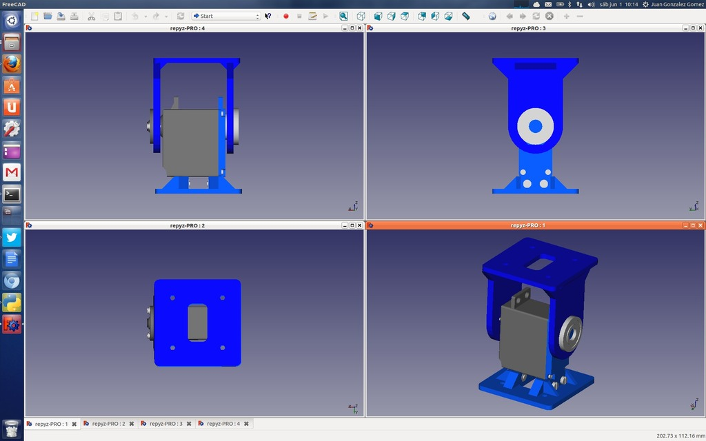

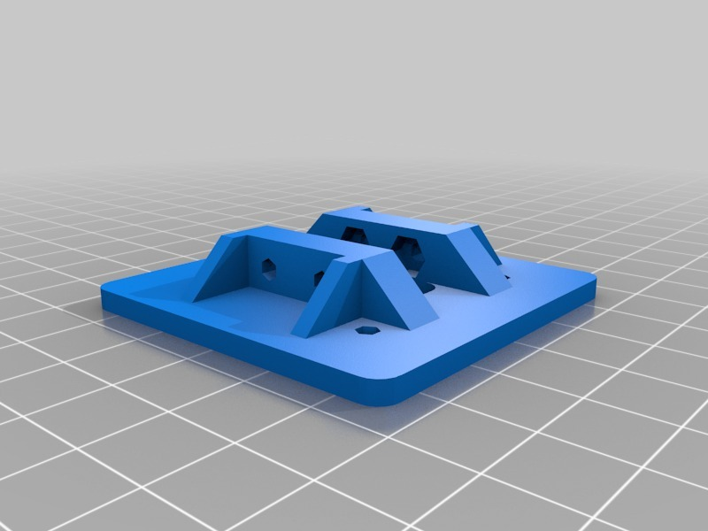
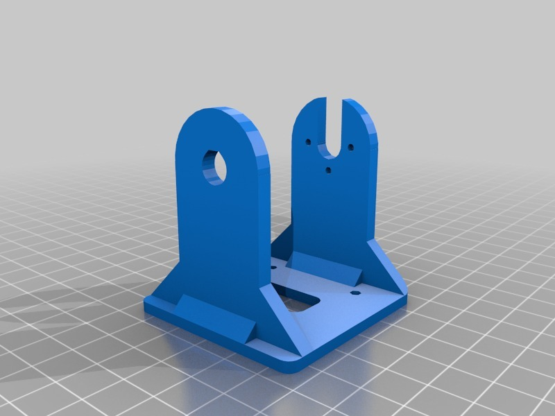
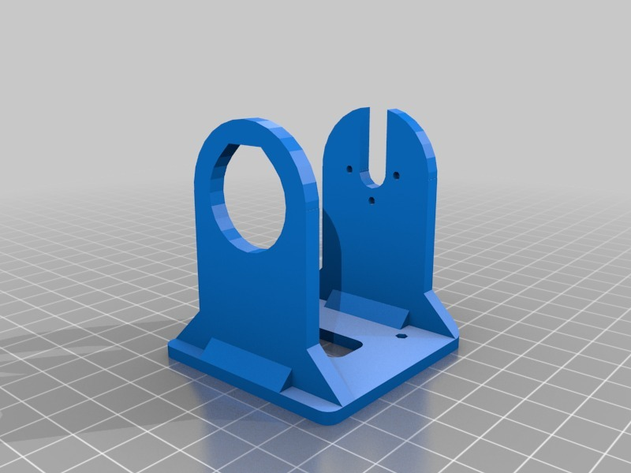

Tags
--------
freecad , modular_robot , openscad , printbot , repy , robot  

  

License
--------
REPYZ modules by obijuan is licensed under the Creative Commons - Attribution - Share Alike license.  

By: Juan Gonzalez-Gomez (Obijuan)
--------
<http://www.iearobotics.com/wiki/index.php?title=Juan_Gonzalez:Main>