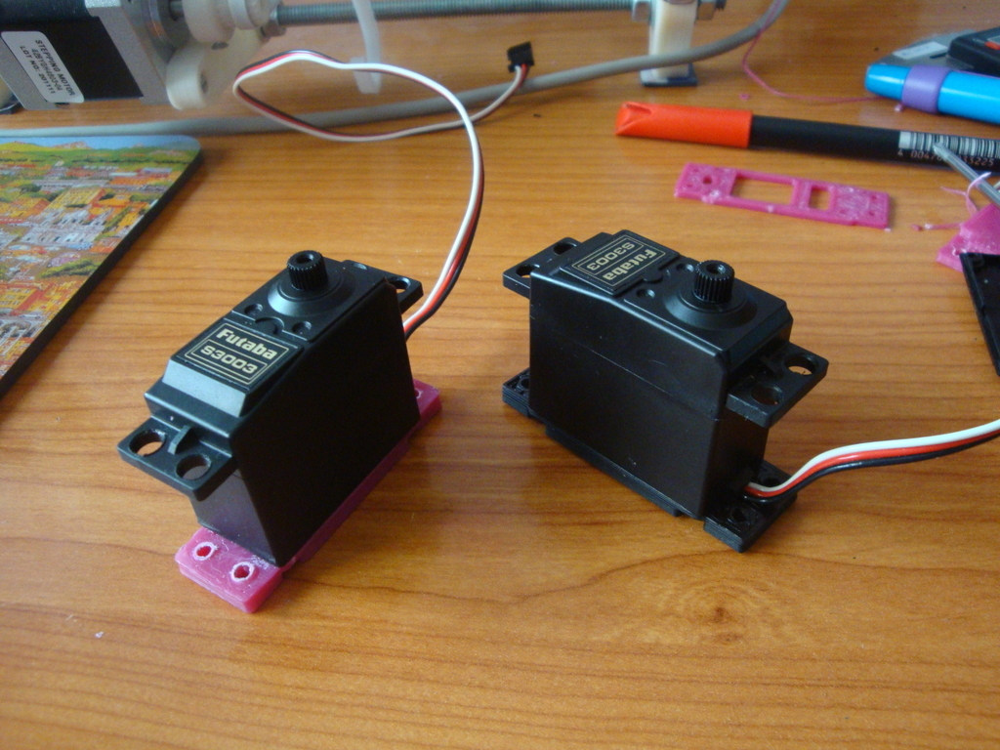
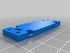
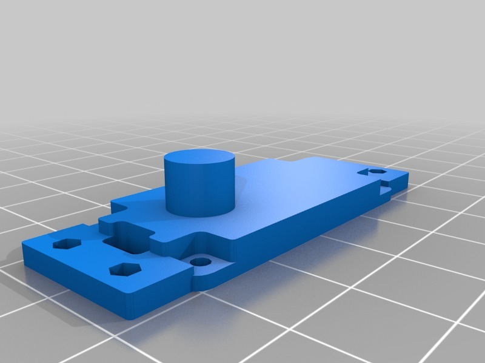
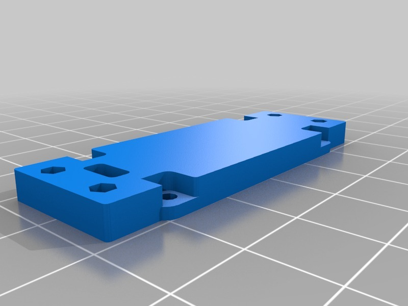
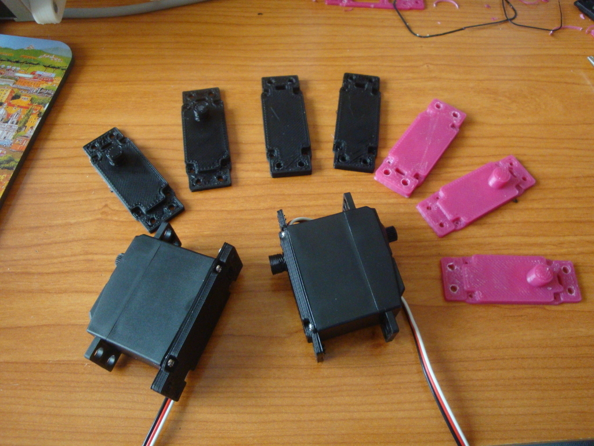
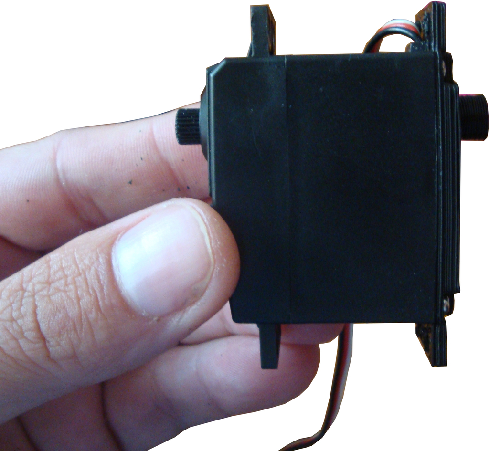
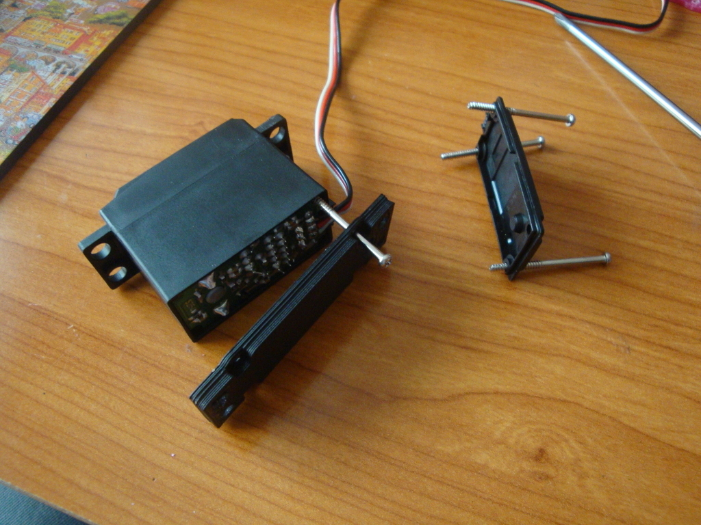
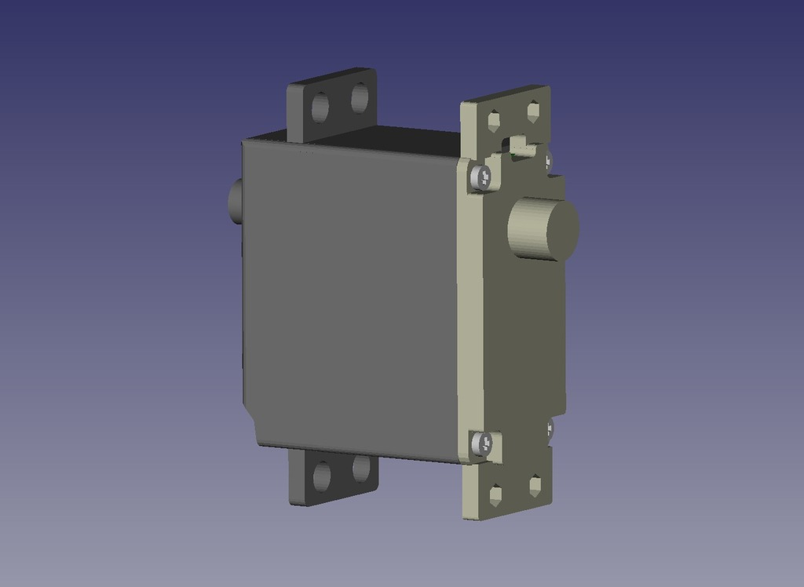
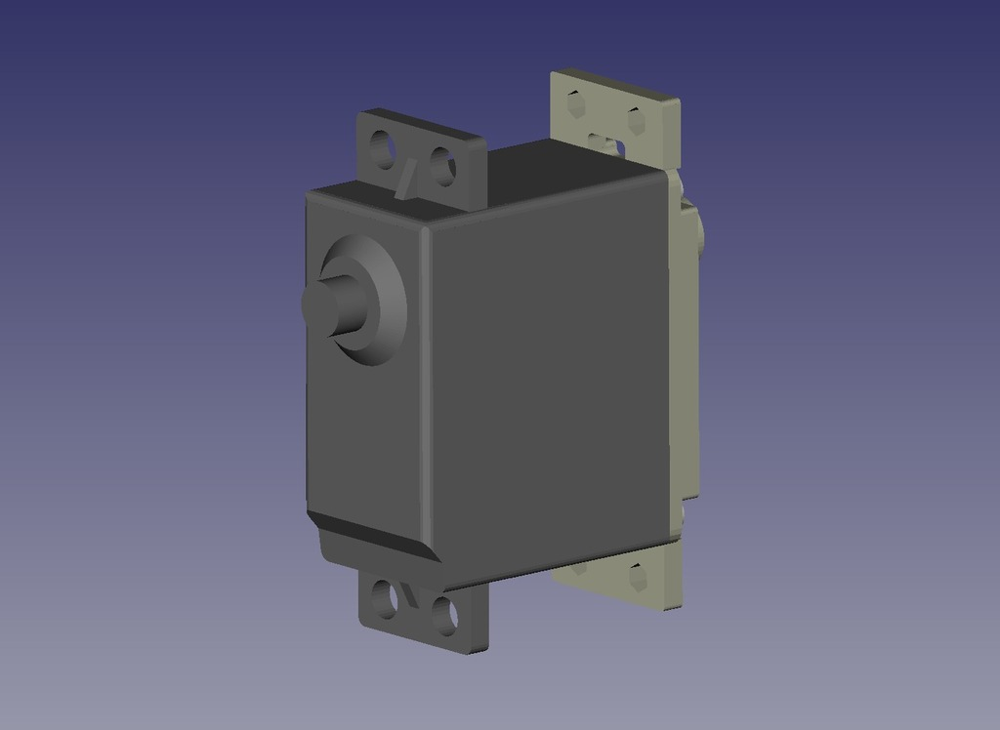
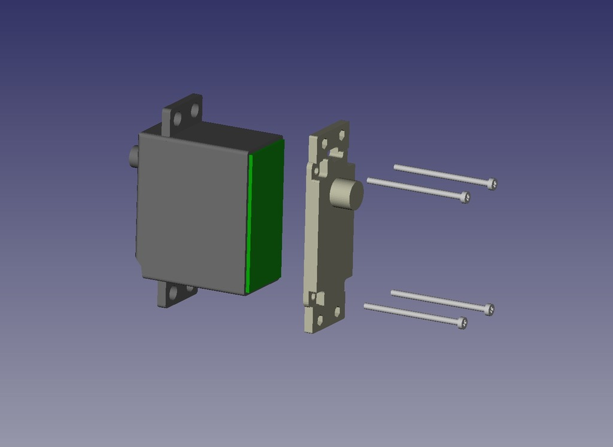

Servo lower cover
===============
**Please note: This thing is part of a list that was [automatically generated](https://github.com/carlosgs/export-things) and may have been updated since then. Make sure to check for the current license and authorship.**  

Servo lower cover  by obijuan , published May 16, 2013

Description
--------
I have added 4 drills to the servo lower cover so that it is more symmetric.This improvement allows the servos to be easily screwed to other parts. The process of building articulated robots is now easier as well.    
 
Github repository:   
<a href="https://github.com/Obijuan/3D-parts/tree/master/Servo_lower_cover" target="_blank" rel="nofollow">github.com/Obijuan/3D-parts/tree/master/Servo_lower_cover</a>  
 
  More information (in Spanish) can be found in this link: <a href="http://www.iearobotics.com/wiki/index.php?title=Tapas_inferiores_para_Servos" target="_blank" rel="nofollow">iearobotics.com/wiki/index.php?title=Tapas_inferiores_para_Servos</a>

Instructions
--------
* Remove the servo lower cover   
* A print the new want   
* Replace it

Files
--------

 [ servo_lower_cover_ears_shaft.stl](servo_lower_cover_ears_shaft.stl)  

 [ servo_lower_cover.stl](servo_lower_cover.stl)  

 [ Servo_lower_cover.zip](Servo_lower_cover.zip)  

Pictures
--------

Tags
--------
openscad , robot , servo  

  

License
--------
Servo lower cover by obijuan is licensed under the GNU - GPL license.  

By: Juan Gonzalez-Gomez (Obijuan)
--------
<http://www.iearobotics.com/wiki/index.php?title=Juan_Gonzalez:Main>