Servo lower lid
===============
**Please note: This thing is part of a list that was [automatically generated](https://github.com/carlosgs/export-things) and may have been updated since then. Make sure to check for the current license and authorship.**  

Servo lower lid  by obijuan , published Sep 18, 2012

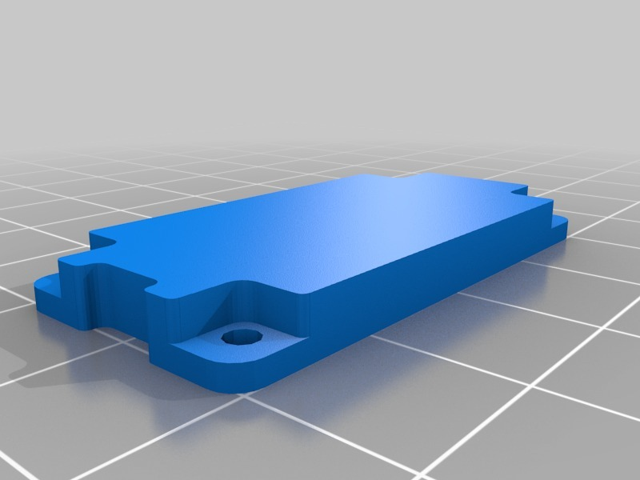

Description
--------
A servo lower lid for your Futaba 3003 servos. It is a parametric design, so that you can adapt it easily to your servos. 
 
It can be used as a replacement for the servo lid if broken... but what makes this object so powerful is that you can customize it, adding more elements to the servo, like a fake shaft. 
 
This object opens the door to the design of robot with simplified structures. 
 
This part has been designed with the Obiscad tools for Openscad 
 
More information (in Spanish): 
<a href="http://www.iearobotics.com/wiki/index.php?title=Objeto_3D:_Tapadera_inferior_para_servos" target="_blank" rel="nofollow">iearobotics.com/wiki/index.php?title=Objeto_3D:_Tapadera_inferior_para_servos</a>

Instructions
--------
Two version of the servo lid are provide: the standard version and the one with a small fake shaft.  The code is well written and documented for allowing the user to easily modify it adding their own elements. 
 
* Print the servo lid (or a modified version) 
* Pick up a servo and unscrew its servo lid 
* screw the printable servo lid (with the same screws) 
* You are done! 
 

Files
--------

 [ Servo_lid_openscad.zip](Servo_lid_openscad.zip)  

[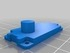](servo_lid_fake_shaft.stl)
 [ servo_lid_fake_shaft.stl](servo_lid_fake_shaft.stl)  

[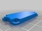](servo_lid.stl)
 [ servo_lid.stl](servo_lid.stl)  

Pictures
--------
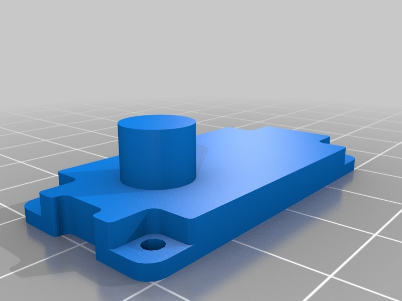
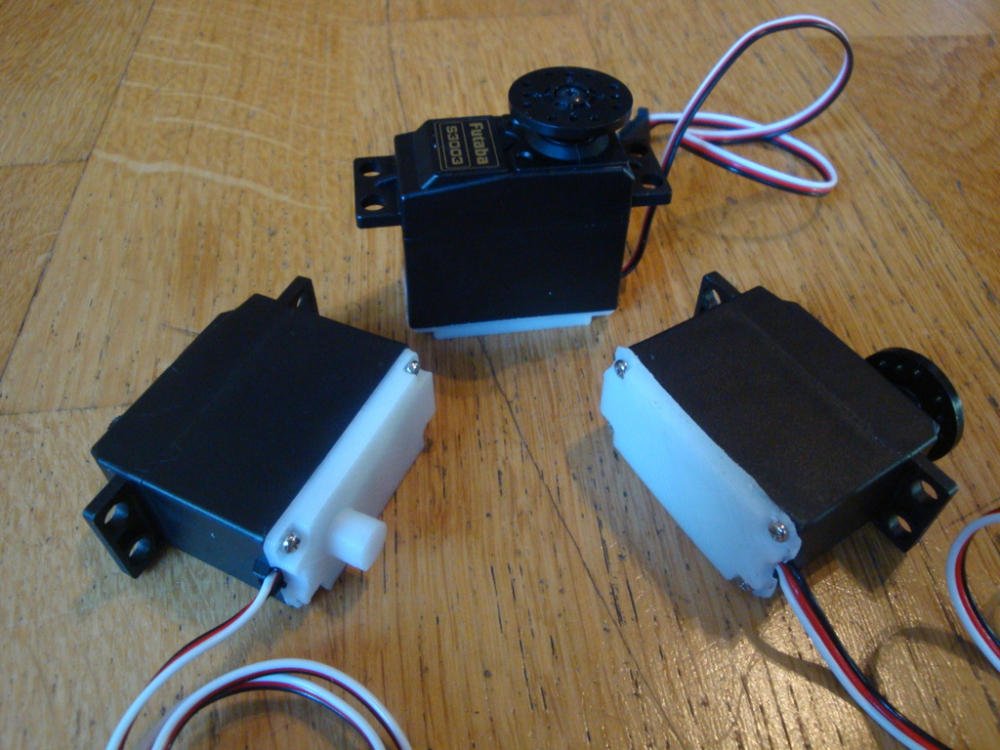
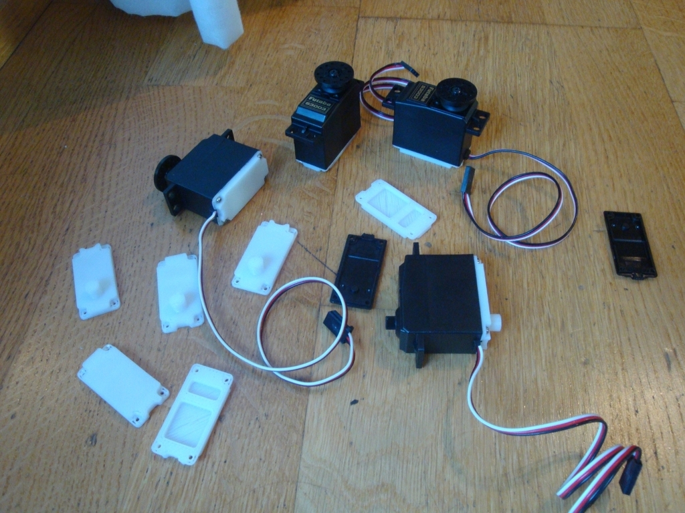
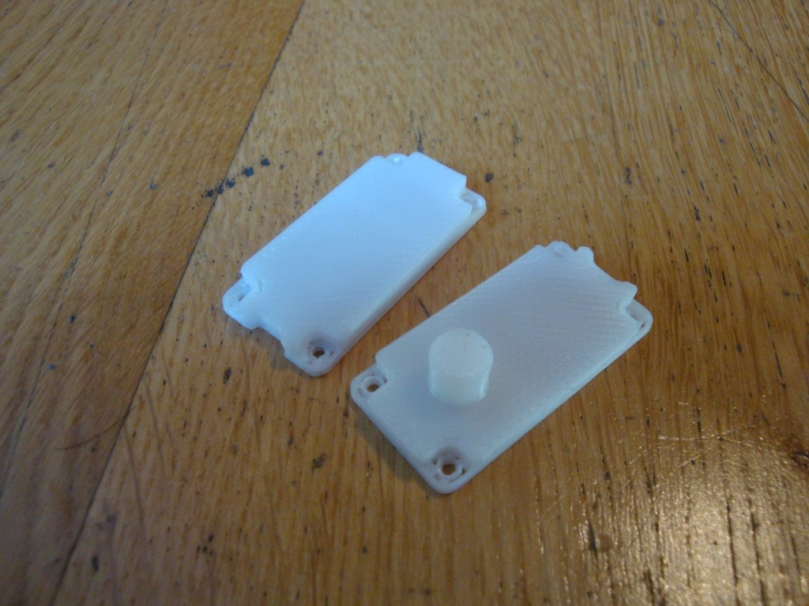
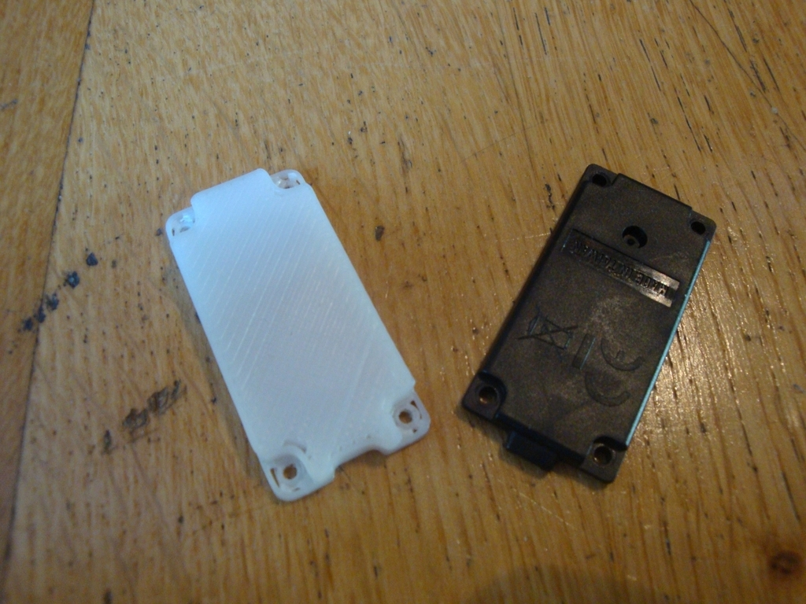
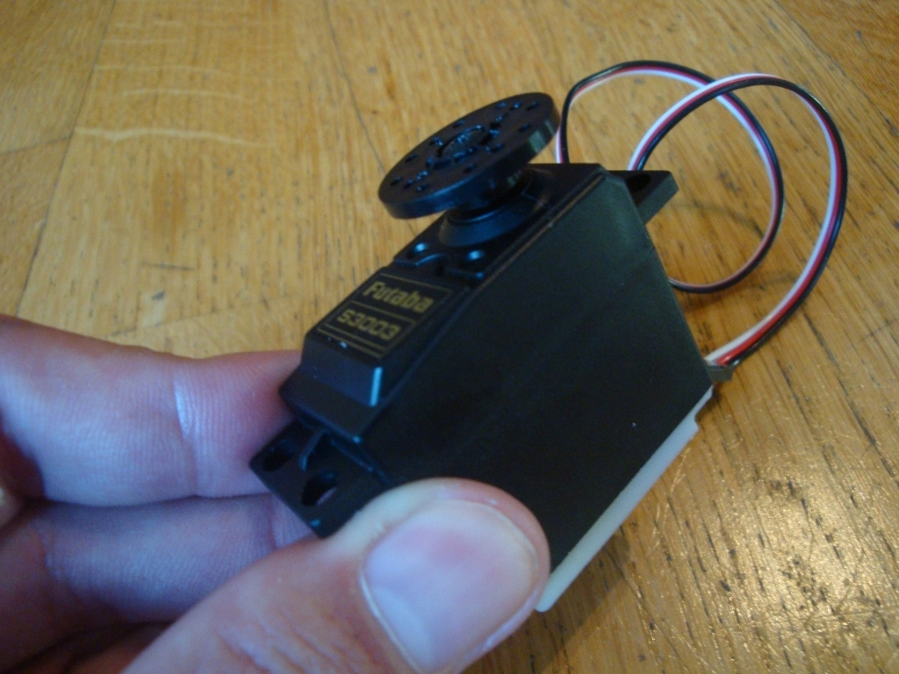
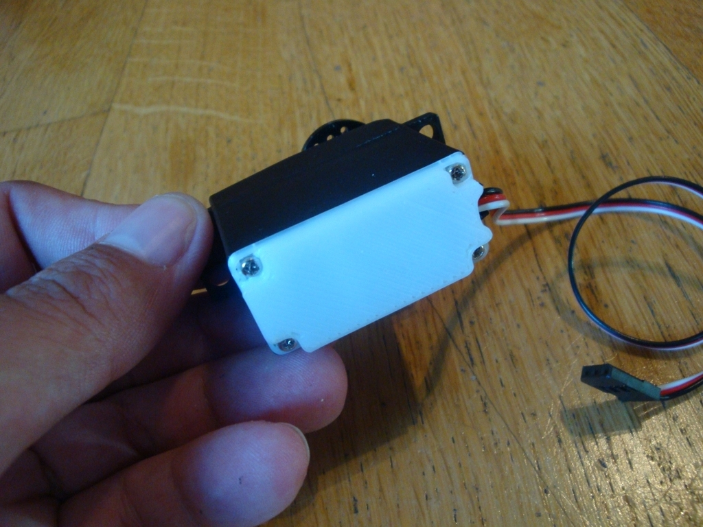
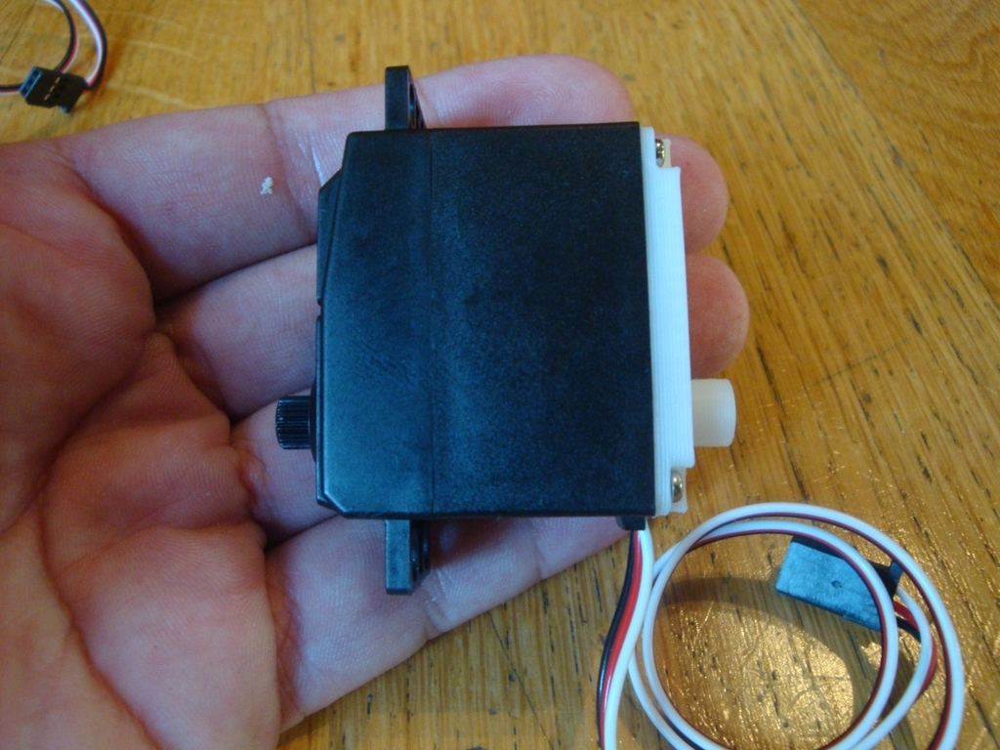
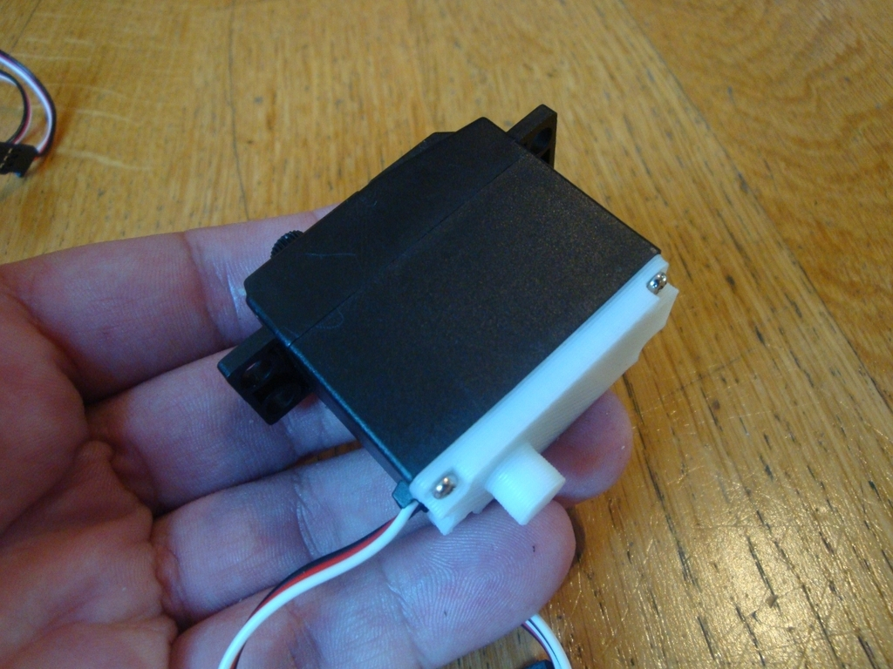
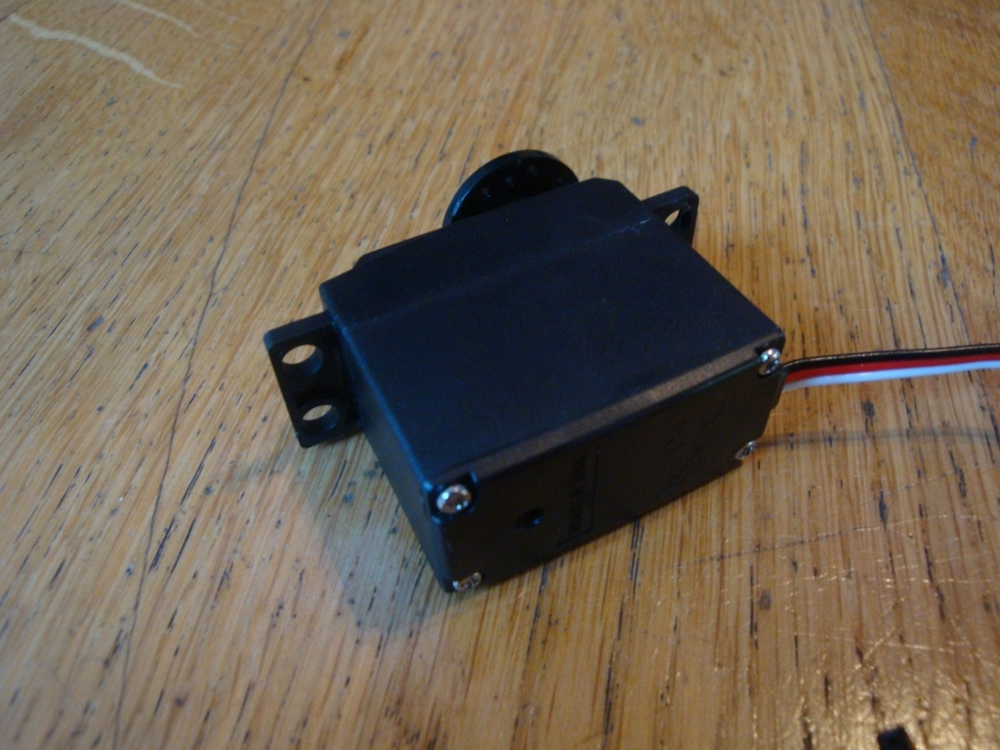
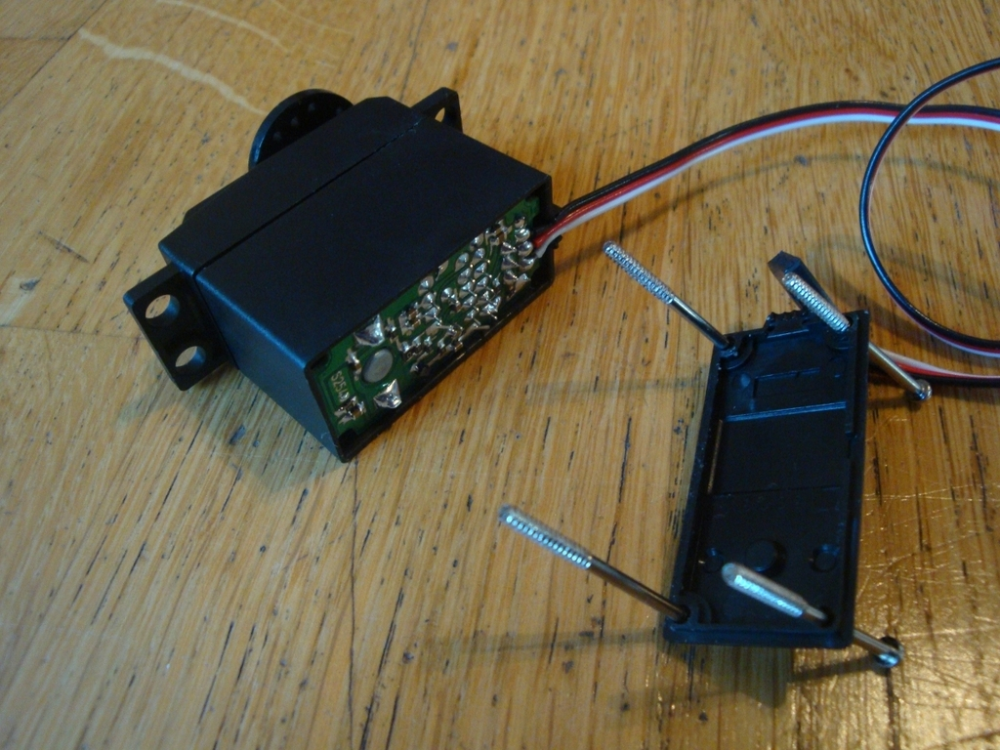
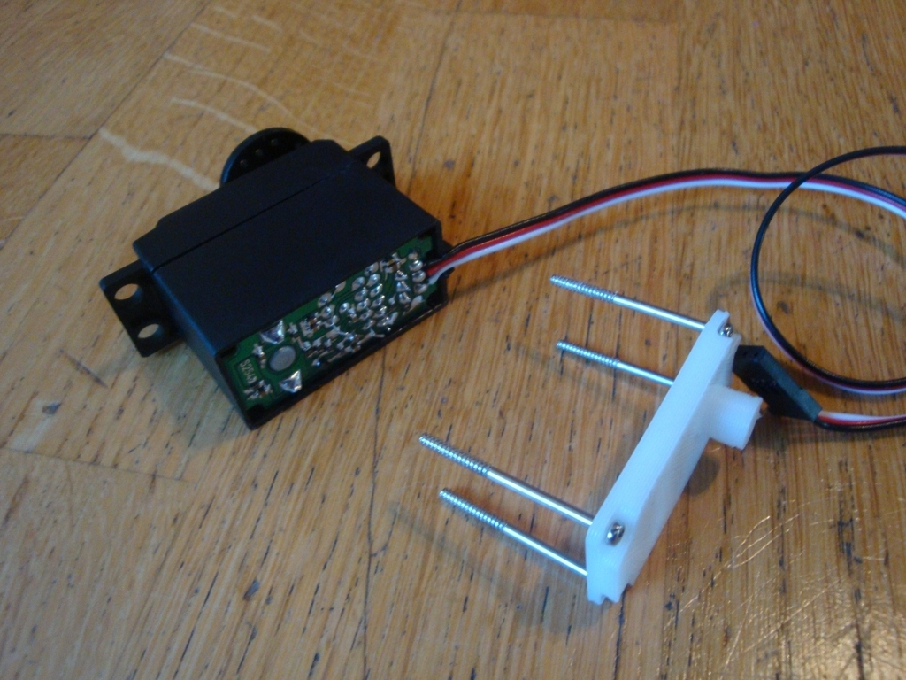
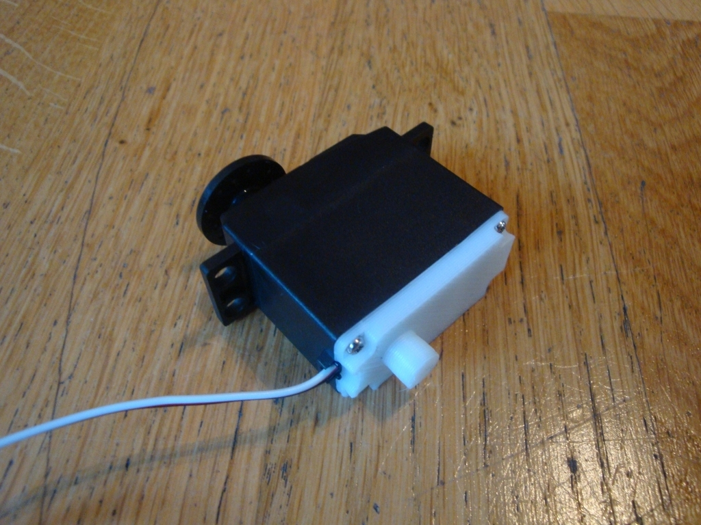
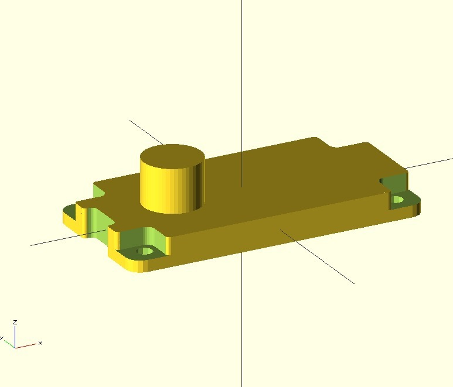

Tags
--------
obiscad , openscad , plastic_valley , printbot , robot , servo  

  

License
--------
Servo lower lid by obijuan is licensed under the Creative Commons - Attribution - Share Alike license.  

By: Juan Gonzalez-Gomez (Obijuan)
--------
<http://www.iearobotics.com/wiki/index.php?title=Juan_Gonzalez:Main>