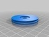
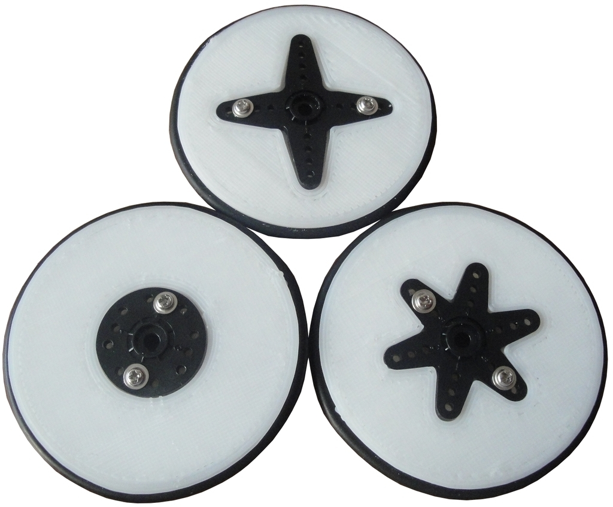
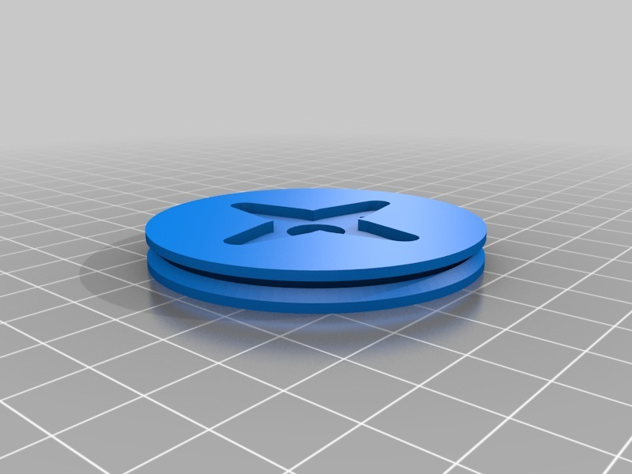
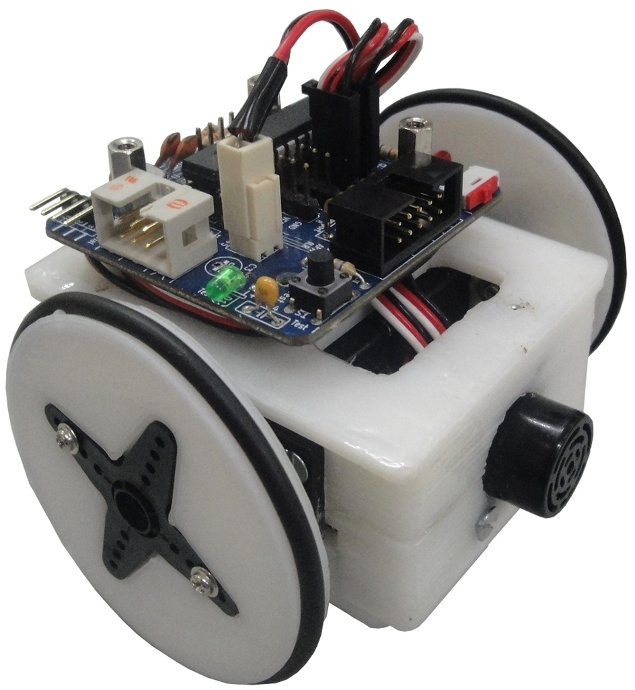
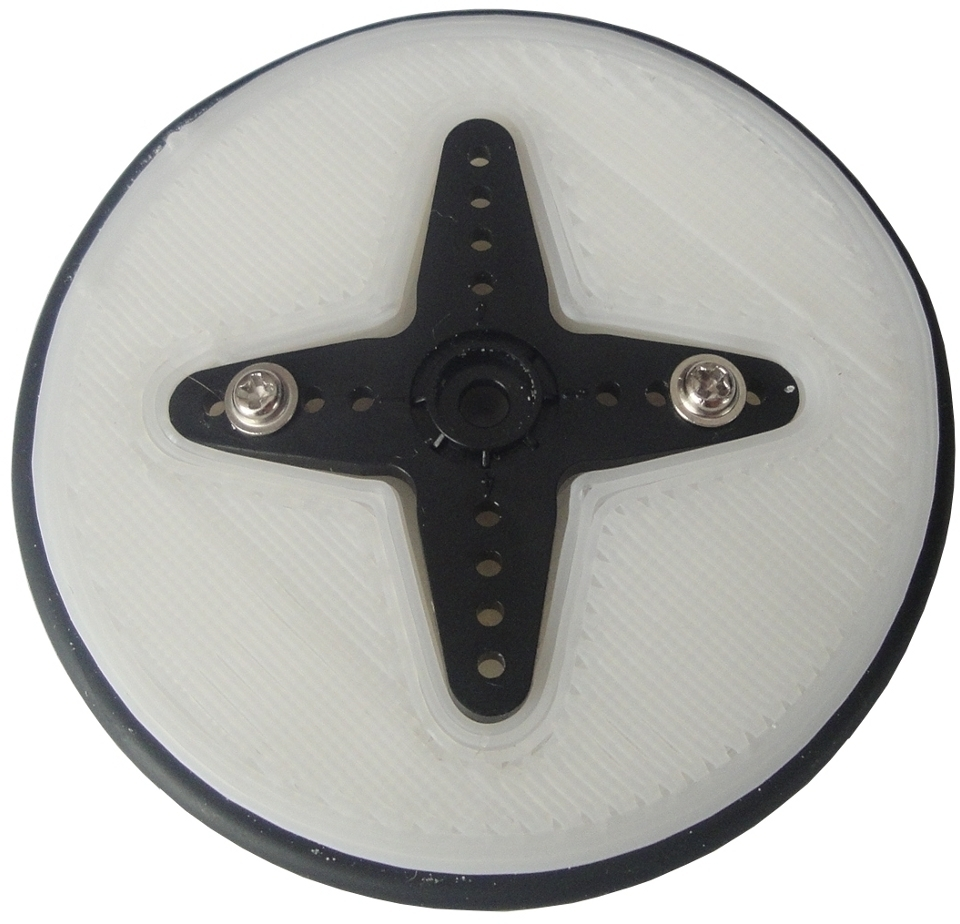
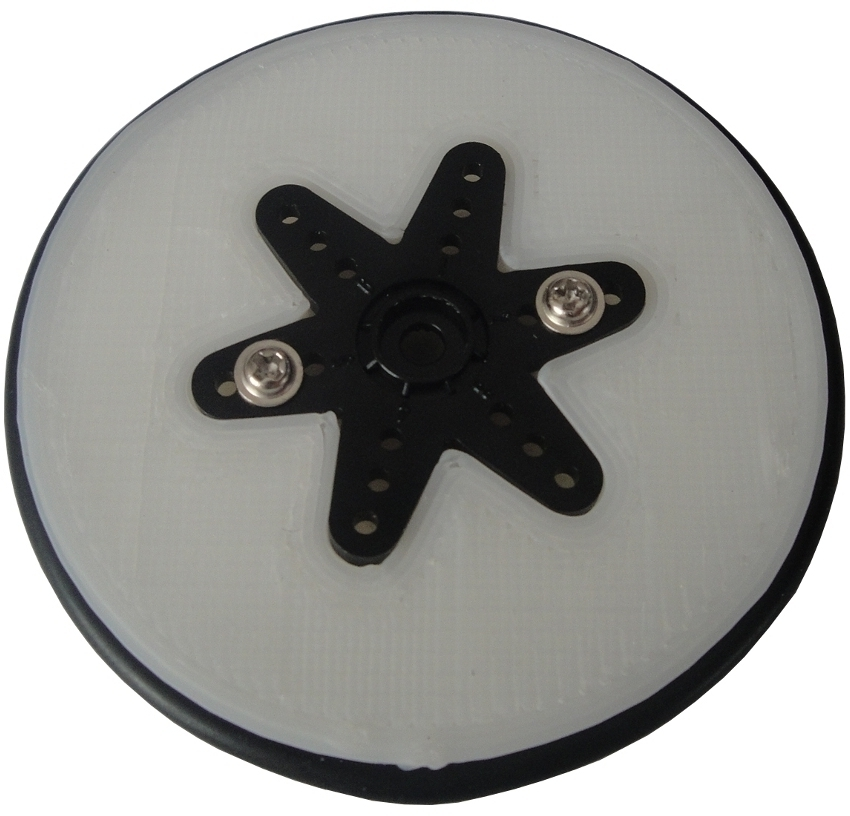
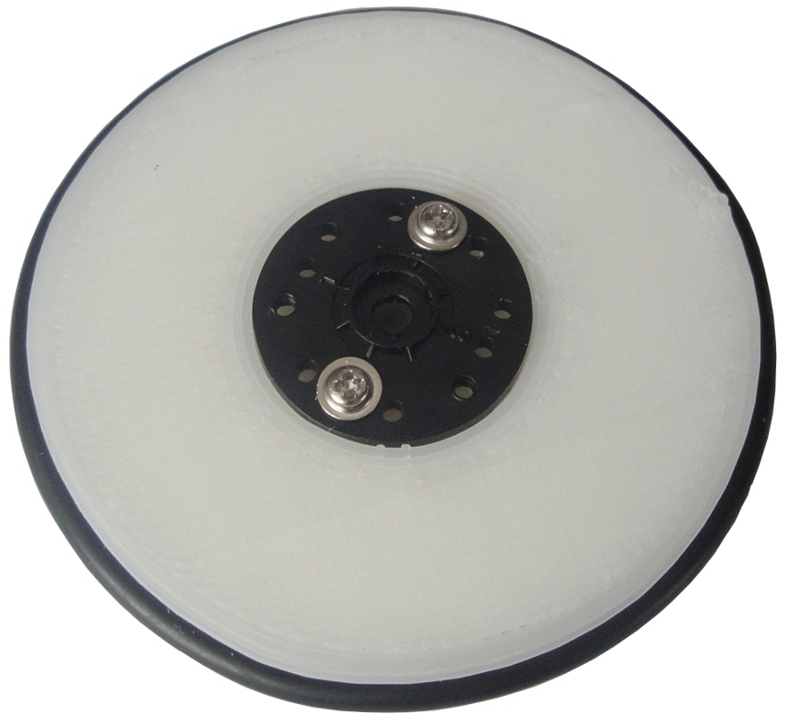
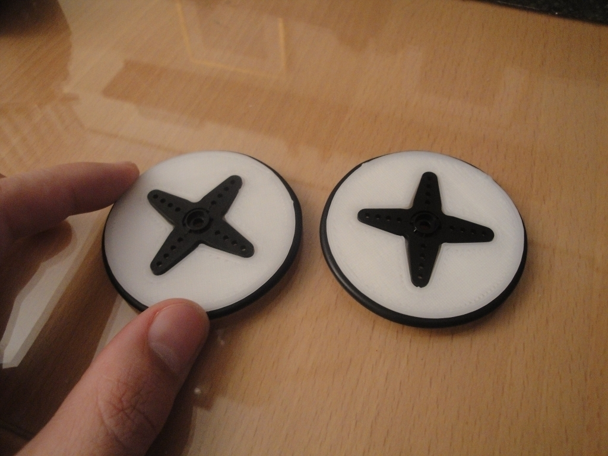
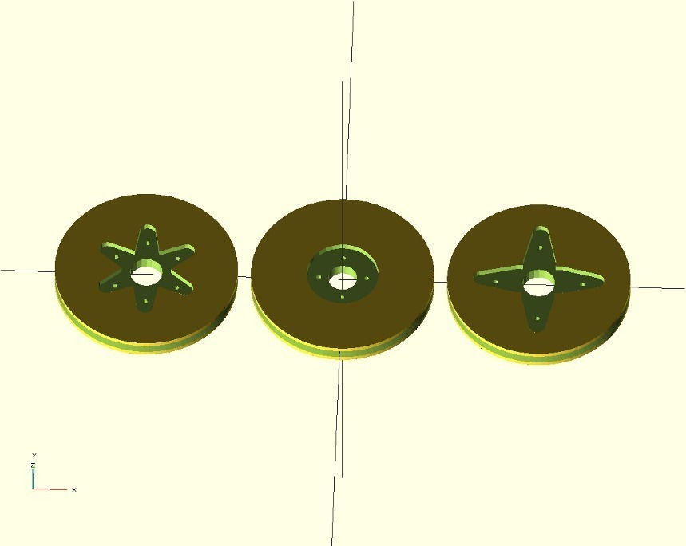

Servo wheel 4.0
===============
**Please note: This thing is part of a list that was [automatically generated](https://github.com/carlosgs/export-things) and may have been updated since then. Make sure to check for the current license and authorship.**  

Servo wheel 4.0  by obijuan , published Mar 25, 2012

Description
--------
This is a new version of the parameterized Servo wheel for mobile robots: 
 
<a href="http://www.thingiverse.com/thing:9071" target="_blank" rel="nofollow">thingiverse.com/thing:9071</a> 
 
These are the wheels used by many printbots such as Miniskybot or Scout. The improvements of the Version 4.0 are: 
* Adaptation to the 3 types of Futaba 3003 servo horns: rounded, 4-arms and 6-arms 
* New drills for attaching the horns. Now it is easier to screew the horns to the wheels 
 
The sources are stored in the Miniskybot 2 github: 
 
<a href="https://github.com/Obijuan/Miniskybot/" target="_blank" rel="nofollow">github.com/Obijuan/Miniskybot/</a> 
 

Instructions
--------
* Choose the kind of servo horn you want to use 
* print the servo wheel for that horn 
* Screw the servo horn to the wheel using the standard screws that come with the servo 
* Put the O-ring around the wheel 
* Attach the wheel to you robot! 
 

Files
--------

 [ Servo-wheel.scad](Servo-wheel.scad)  

 [ Servo-wheel-4-arm-horn.stl](Servo-wheel-4-arm-horn.stl)  

 [ Servo-wheel-6-arm-horn.stl](Servo-wheel-6-arm-horn.stl)  

 [ Servo-wheel-rounded-horn.stl](Servo-wheel-rounded-horn.stl)  

Pictures
--------

Tags
--------
miniskybot , openscad , parametric , plastic_valley , robot , robotics , servo , wheel  

  

License
--------
Servo wheel 4.0 by obijuan is licensed under the Creative Commons - Attribution - Share Alike license.  

By: Juan Gonzalez-Gomez (Obijuan)
--------
<http://www.iearobotics.com/wiki/index.php?title=Juan_Gonzalez:Main>