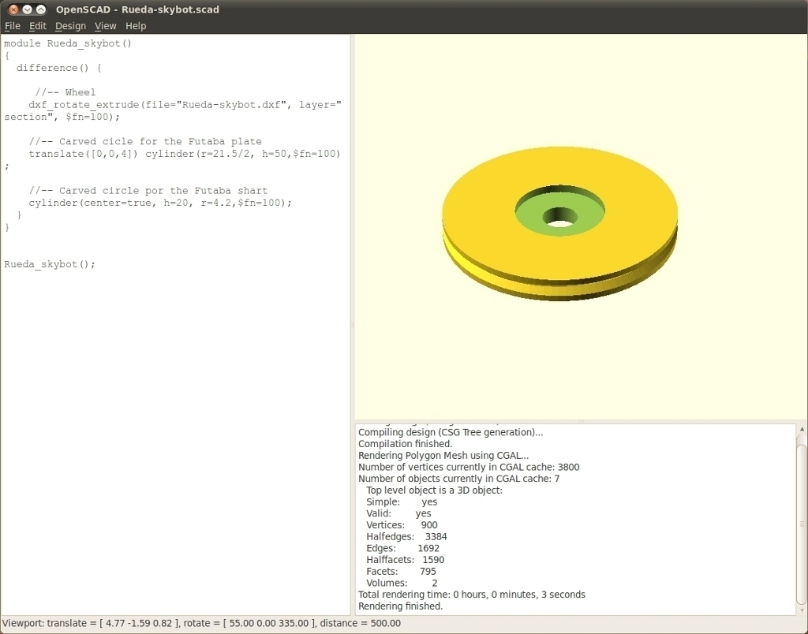
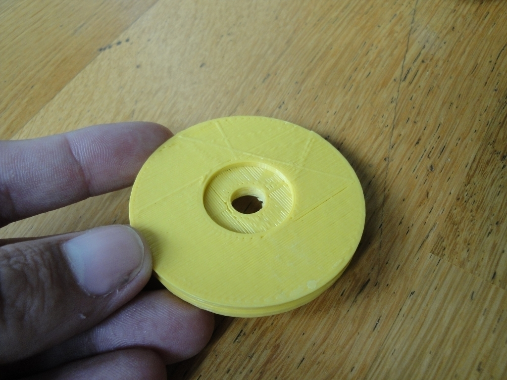
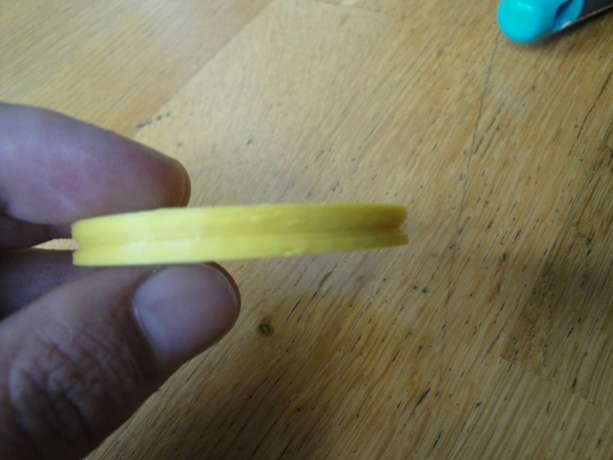
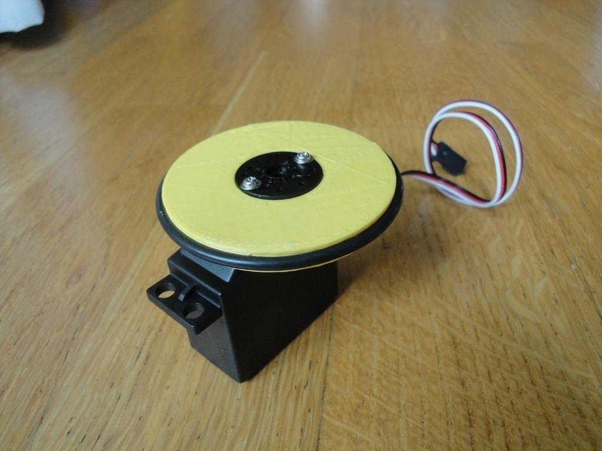
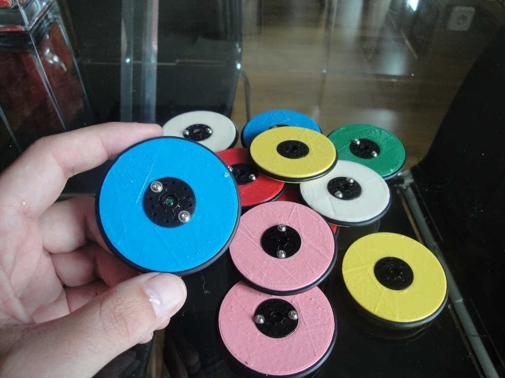
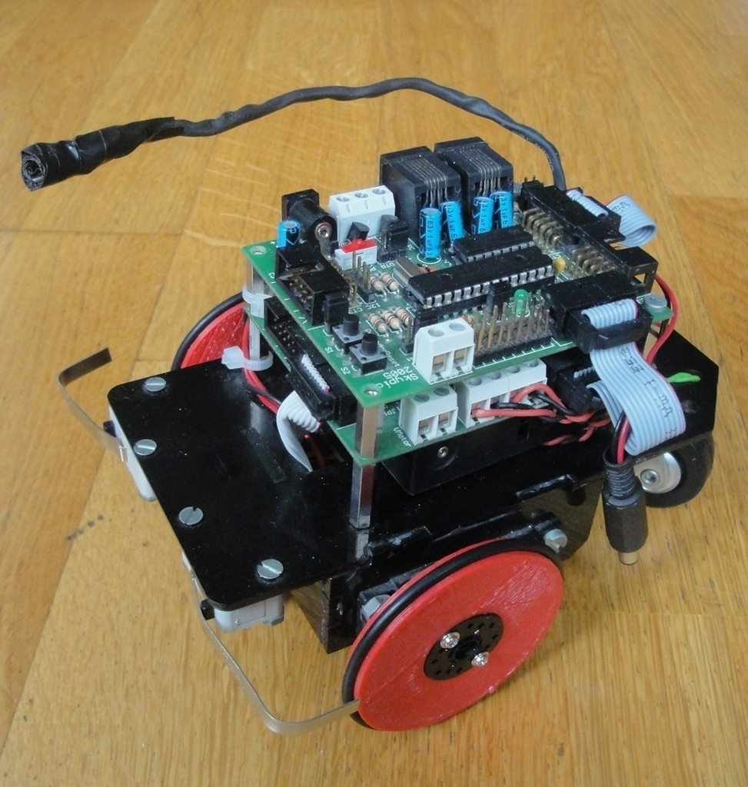
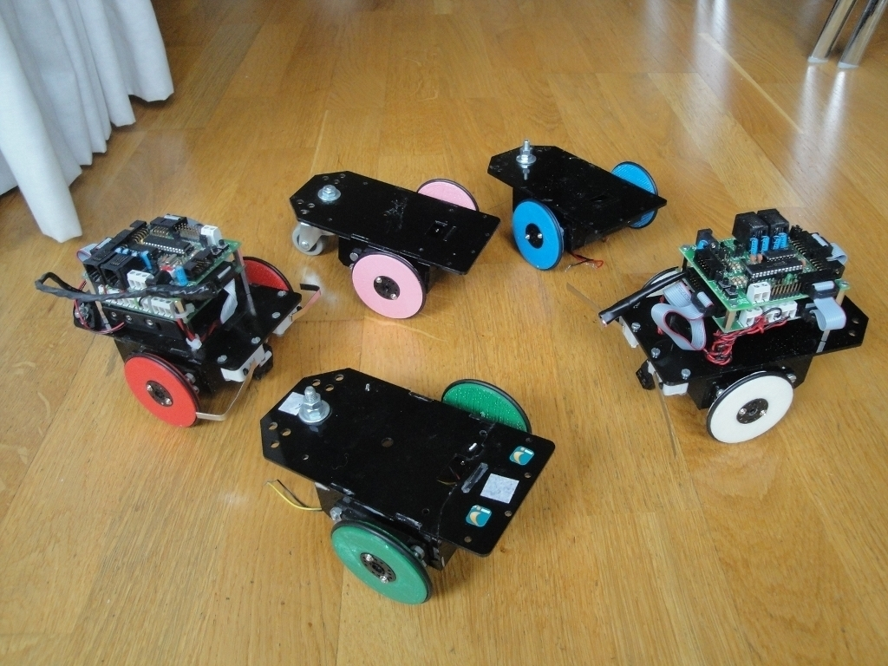
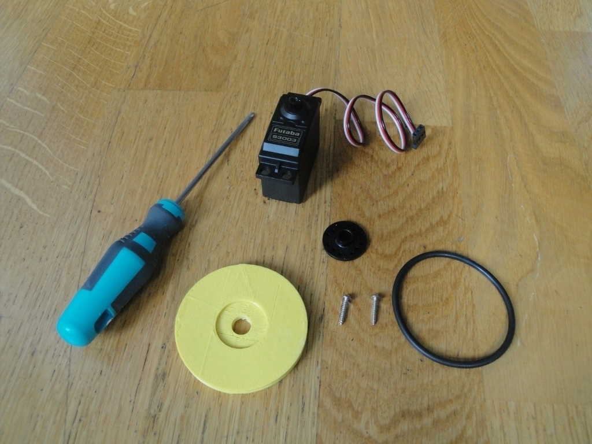
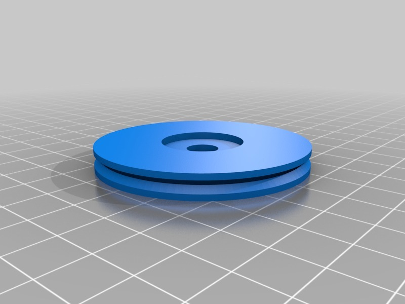

Servo wheel for mobile robots
===============
**Please note: This thing is part of a list that was [automatically generated](https://github.com/carlosgs/export-things) and may have been updated since then. Make sure to check for the current license and authorship.**  

Servo wheel for mobile robots  by obijuan , published Nov 14, 2010

Description
--------
A wheel for building <b>mobile robots</b>.  This wheel has been designed for the Futaba 3003 or compatible servo, but it can be change to other servos easily. It has been created with <b>openscad</b>. 
 
For building mobile robots, the servos should be tricked so that they can turn freely. 
 
We are using these wheels for our educational open-source Robot: <b>Skybot</b> 
* <a href="http://www.iearobotics.com/wiki/index.php?title=Skybot" target="_blank" rel="nofollow">iearobotics.com/wiki/index.php?title=Skybot</a> 
 
More information on the wheels: 
* <a href="http://www.iearobotics.com/wiki/index.php?title=Ruedas_G3_para_el_Skybot" target="_blank" rel="nofollow">iearobotics.com/wiki/index.php?title=Ruedas_G3_para_el_Skybot</a> 
 
A Youtube Video showing the Skybot robot with the new wheels 
<a href="http://www.youtube.com/watch?v=hUrEytTOa2g" target="_blank" rel="nofollow">youtube.com/watch?v=hUrEytTOa2g</a> 
 
I am sorry, the above links are in Spanish by now. The translation into English is in my TODO :-( 

Instructions
--------
* Print the wheel 
* Insert the Rounded Futaba horn 
* Put two screws  
* Trim the excess screw 
* Fit the 55 mm rubber O-ring 
 
Detailed pictures can be found here: 
 
<a href="http://www.iearobotics.com/wiki/index.php?title=Montaje:Ruedas_G3_para_el_Skybot" target="_blank" rel="nofollow">iearobotics.com/wiki/index.php?title=Montaje:Ruedas_G3_para_el_Skybot</a>

Files
--------

 [ Servo-wheel.stl](Servo-wheel.stl)  

 [ Servo-wheel.zip](Servo-wheel.zip)  

Pictures
--------

Tags
--------
makerbot , wheel , education , Miniskybot , Miniskybot , mobile robot , openscad , plastic valley , robot , servo , UC3M  

  

License
--------
Servo wheel for mobile robots by obijuan is licensed under the Creative Commons - Attribution - Share Alike license.  

By: Juan Gonzalez-Gomez (Obijuan)
--------
<http://www.iearobotics.com/wiki/index.php?title=Juan_Gonzalez:Main>