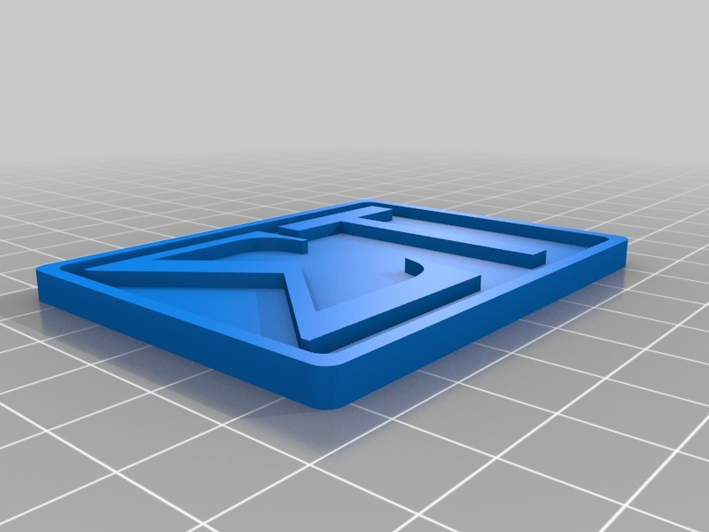
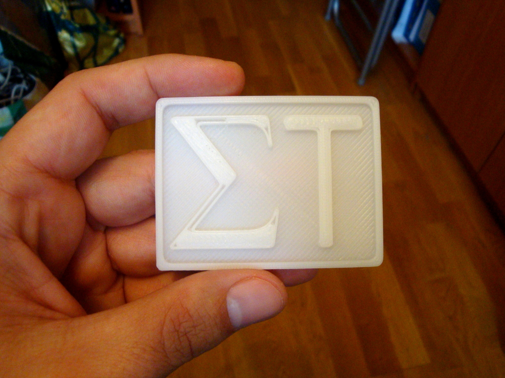

Sigma Technologies corp. logo
===============
**Please note: This thing is part of a list that was [automatically generated](https://github.com/carlosgs/export-things) and may have been updated since then. Make sure to check for the current license and authorship.**  

Sigma Technologies corp. logo  by obijuan , published Nov 27, 2012

Description
--------
A simple logo of the Spanish Sigma Technologies corporation. It is designed in openscad.  
 
It uses the wonderfull openscad write library by HarlanDMii: 
 
<a href="http://www.thingiverse.com/thing:16193" target="_blank" rel="nofollow">thingiverse.com/thing:16193</a> 

Instructions
--------
Just slice and print 
 
The .zip file contains all the sources (including the write.scad library from HarlanDMii) 
 
This part is also published in Spanish in this wiki: 
 
<a href="http://www.iearobotics.com/wiki/index.php?title=Objecto_3D:_Logo_de_sigma_technologies" target="_blank" rel="nofollow">iearobotics.com/wiki/index.php?title=Objecto_3D:_Logo_de_sigma_technologies</a>

Files
--------

 [ sigma-tech-logo-openscad.zip](sigma-tech-logo-openscad.zip)  

 [ Sigma-tech-logo.stl](Sigma-tech-logo.stl)  

Pictures
--------

Tags
--------
logo , openscad , plastic_valley  

  

License
--------
Sigma Technologies corp. logo by obijuan is licensed under the Creative Commons - Attribution - Share Alike license.  

By: Juan Gonzalez-Gomez (Obijuan)
--------
<http://www.iearobotics.com/wiki/index.php?title=Juan_Gonzalez:Main>