Skymega board
===============
**Please note: This thing is part of a list that was [automatically generated](https://github.com/carlosgs/export-things) and may have been updated since then. Make sure to check for the current license and authorship.**  

Skymega board  by obijuan , published Dec 2, 2011

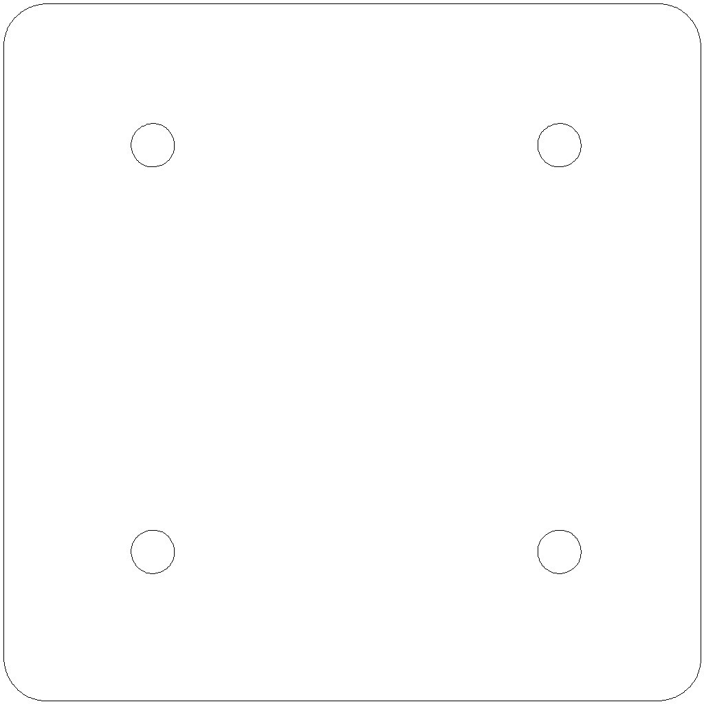

Description
--------
The Skymega is an electronic board for programming <b>printbots</b>. It is open source hardware, designed with the open source tools <b>Kicad</b> (we have named this kind of hardware as <b>open source squared</b>). It is based on the ATmega microcontrollers, so <b>it is Arduino compatible</b>. 
 
This board has been specifically designed for building modular robots or mini mobile robots. Currently we are using it at Universidad Carlos III de Madrid for the following printbots: 
 
* <b>Miniskybot</b>: <a href="http://www.thingiverse.com/thing:7989" target="_blank" rel="nofollow">thingiverse.com/thing:7989</a> 
* <b>Repy1 1.1 modules</b>: <a href="http://www.thingiverse.com/thing:13442" target="_blank" rel="nofollow">thingiverse.com/thing:13442</a> 
* <b>F-track</b>: <a href="http://www.thingiverse.com/thing:13298" target="_blank" rel="nofollow">thingiverse.com/thing:13298</a> 
* <b>Orugator</b>: <a href="http://www.thingiverse.com/thing:8559" target="_blank" rel="nofollow">thingiverse.com/thing:8559</a> 
 
<b>Features</b>: 
* Small in size 
* Easy to build by the students 
* ON/OFF switch 
* Arduino compatible 
* Connection up to 8 servos 
* I2C bus 
* 1 Test button 
* 2 Test led 
 
<big>Authors</big> 
* Juan Gonzalez-Gomez (Obijuan) 
* Andrs Prieto-Moreno 
* Itziar Lima 
* Ricardo Gomez 
 
More information on this board (repository, images, instructions) can be found on this link (in Spanish): <a href="http://www.iearobotics.com/wiki/index.php?title=SkyMega" target="_blank" rel="nofollow">iearobotics.com/wiki/index.php?title=SkyMega</a> 

Instructions
--------
You can manufacture the board with the provided Gerber files, or you can edit the schematic and PCB using the Kicad tool. 
 
For the bill of materials please have a look at the <i>skymega-BOM-en.pdf</i> file. 
 
The software is written and uploaded to the board using the Arduino environmnet. It is necessary to connect the Skymega to the PC by means of a modified FTDI cable (see the attached images for detailed instruccions) 
 
<b>Enjoy building and programming open source printbots!!!</b>

Files
--------
[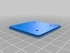](skymega-v1.0-pcb-edges-drills.stl)
 [ skymega-v1.0-pcb-edges-drills.stl](skymega-v1.0-pcb-edges-drills.stl)  

 [ skymega-v1.0-pcb-edges-openscad.zip](skymega-v1.0-pcb-edges-openscad.zip)  

 [ skymega-v1.0-gerber.zip](skymega-v1.0-gerber.zip)  

 [ skymega-v1.0-pcb-edges-drills.dxf](skymega-v1.0-pcb-edges-drills.dxf)  

 [ skymega-BOM-en.pdf](skymega-BOM-en.pdf)  

 [ skymega-v1.0-sch.pdf](skymega-v1.0-sch.pdf)  

 [ skymega-1.0-kicad-src.zip](skymega-1.0-kicad-src.zip)  

Pictures
--------
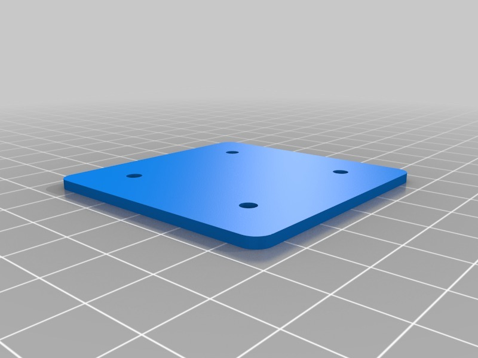

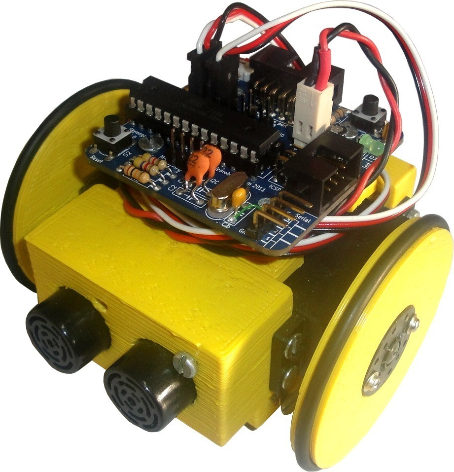
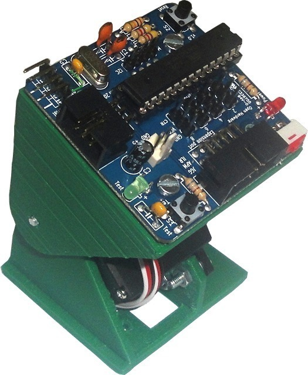
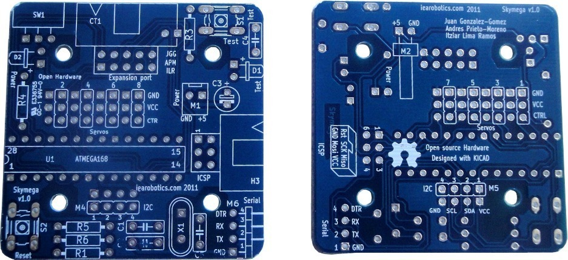
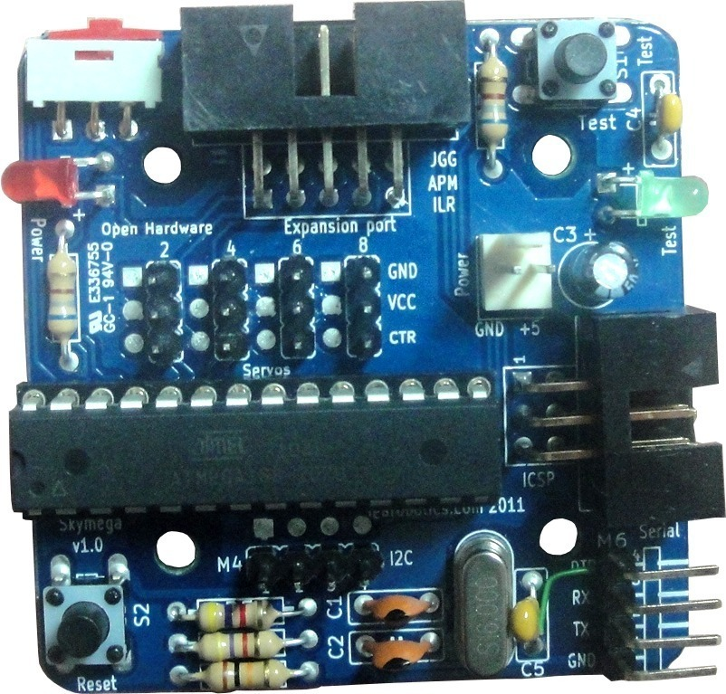
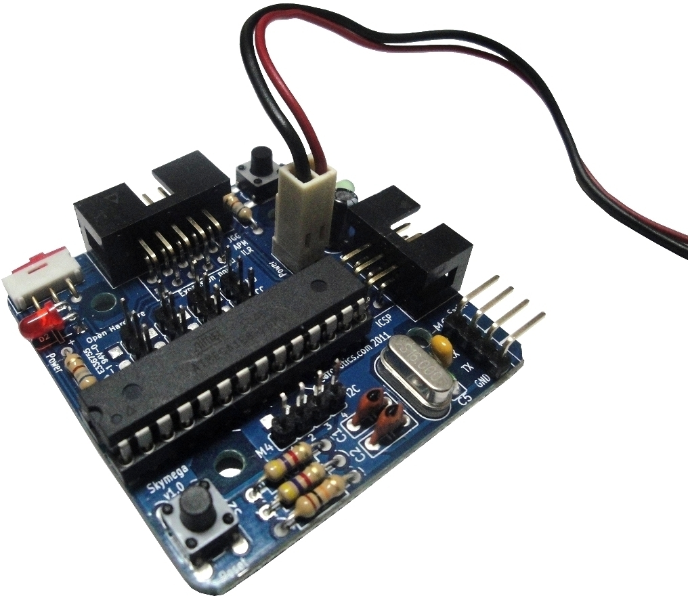

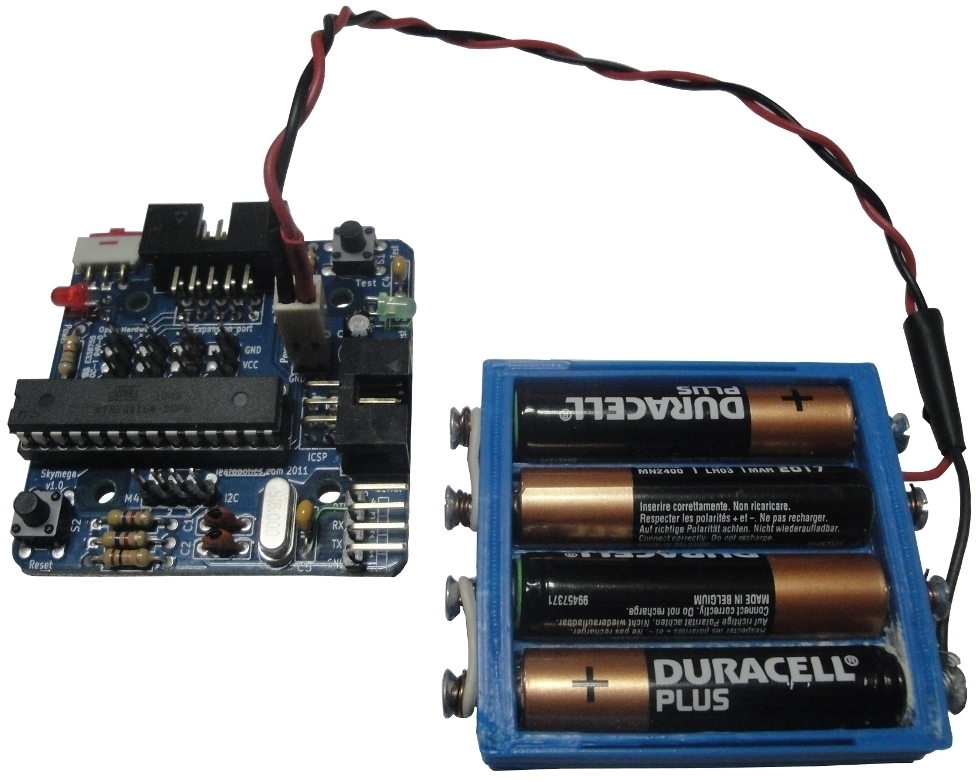
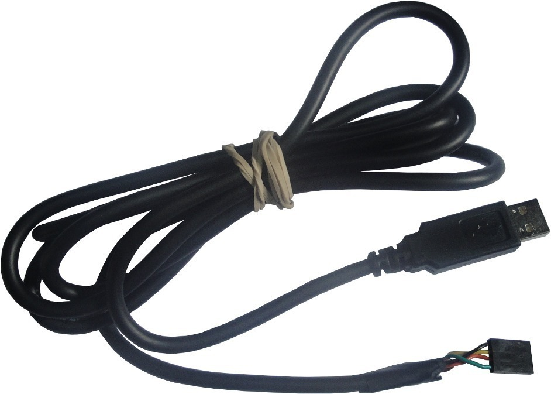
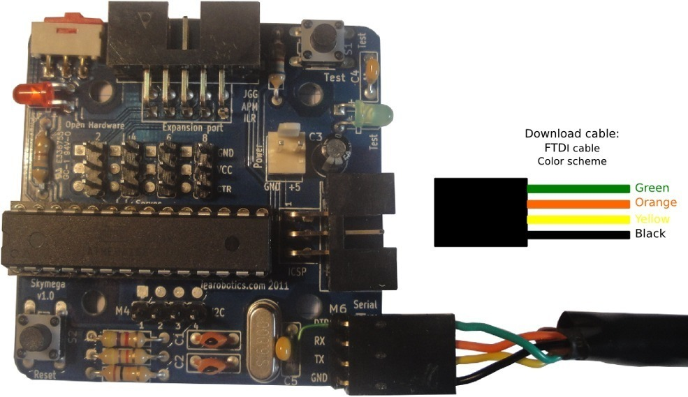
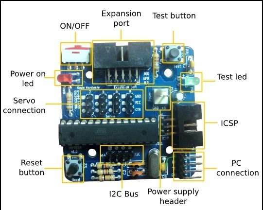
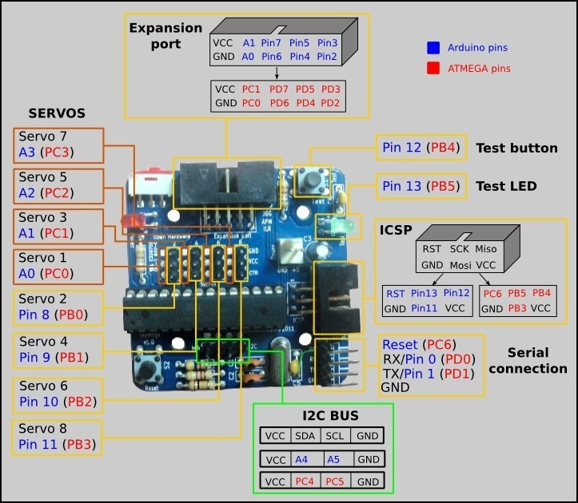
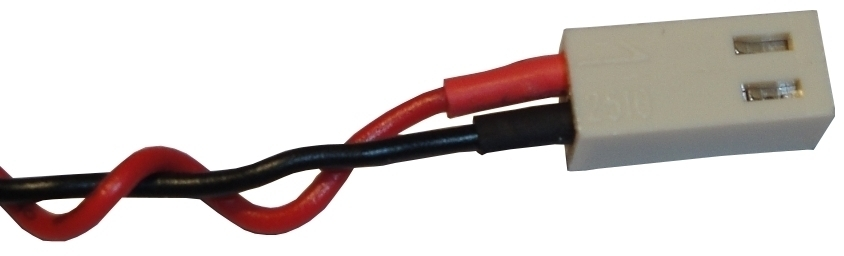
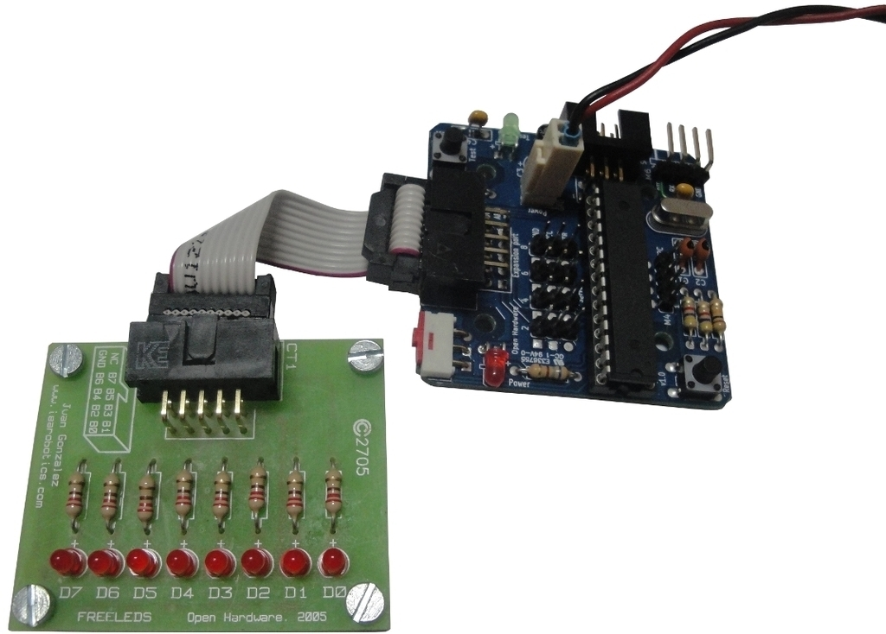
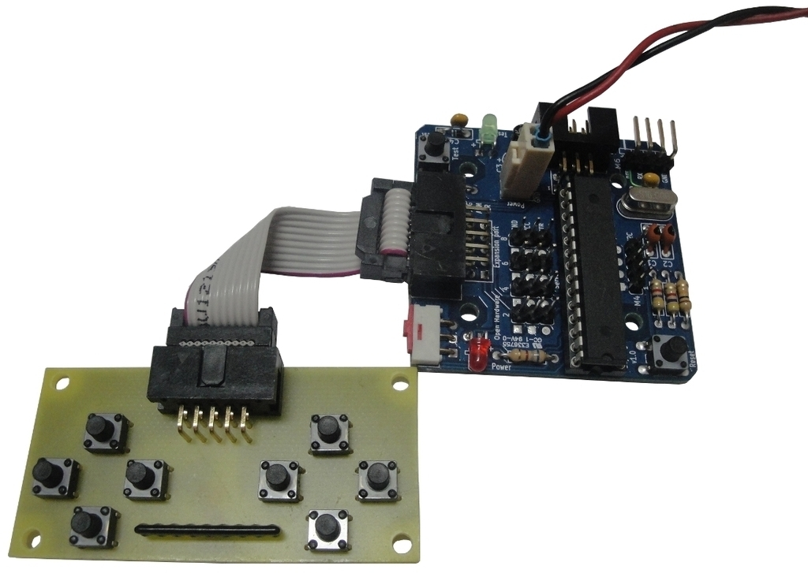
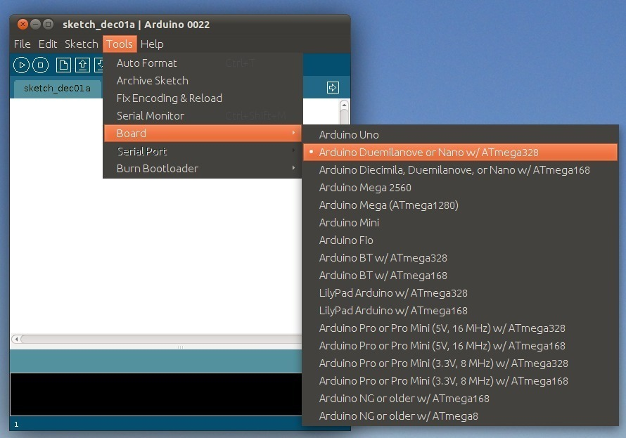
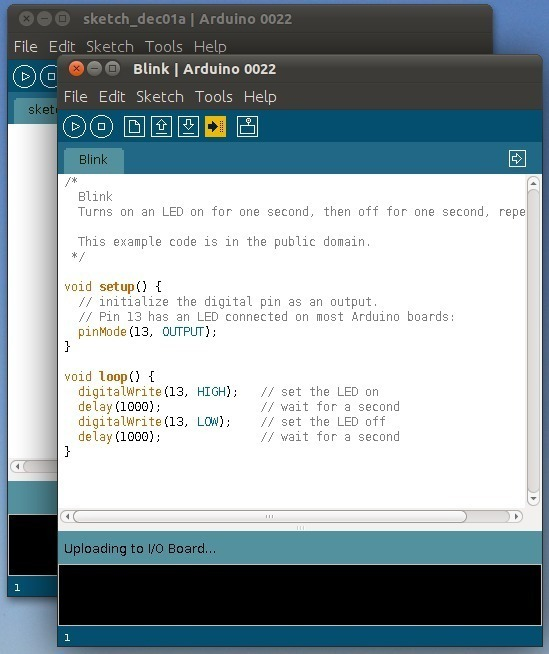

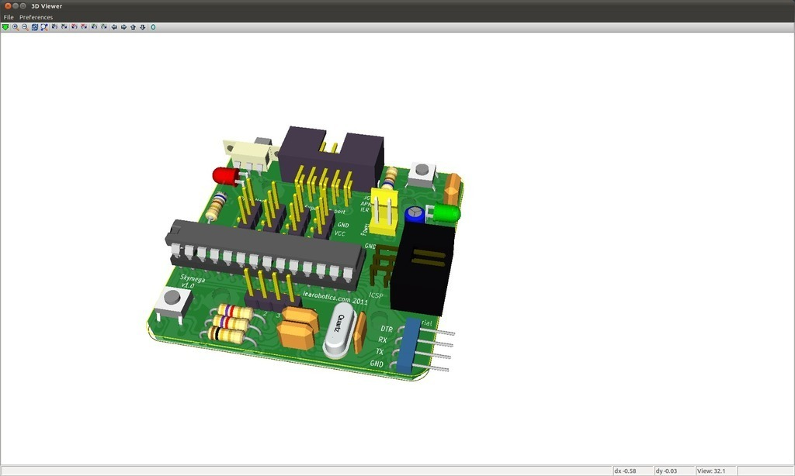

Tags
--------
arduino , electronics , Kicad , mega , pcb , plastic valley , robot , servo , skymega , uc3m  

  

License
--------
Skymega board by obijuan is licensed under the Creative Commons - Attribution - Share Alike license.  

By: Juan Gonzalez-Gomez (Obijuan)
--------
<http://www.iearobotics.com/wiki/index.php?title=Juan_Gonzalez:Main>