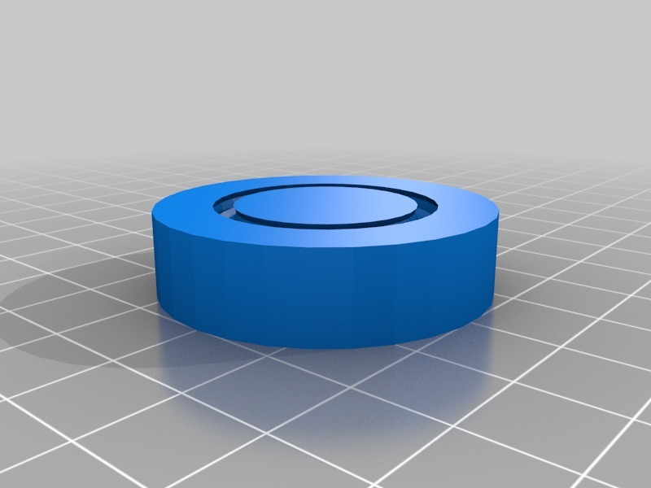
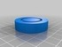
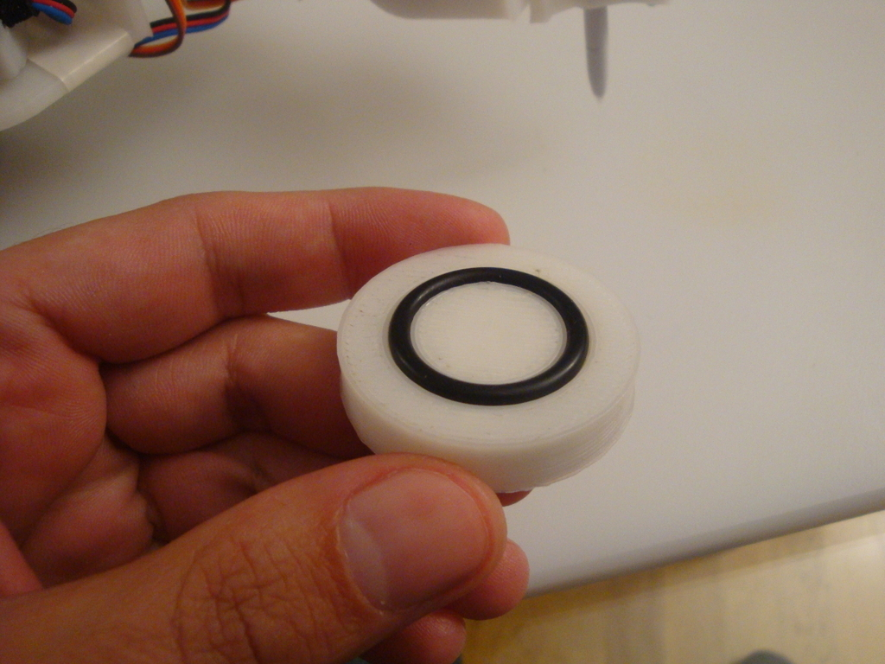
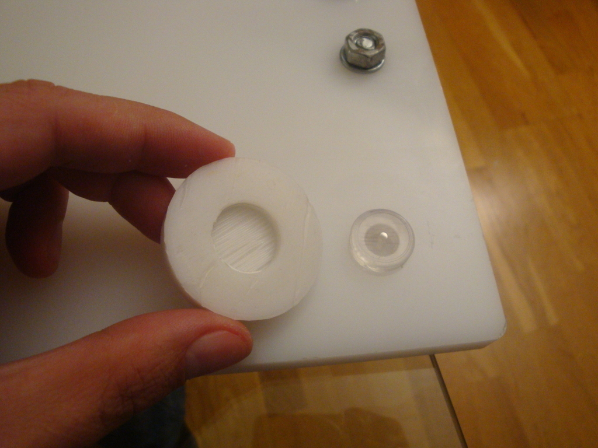
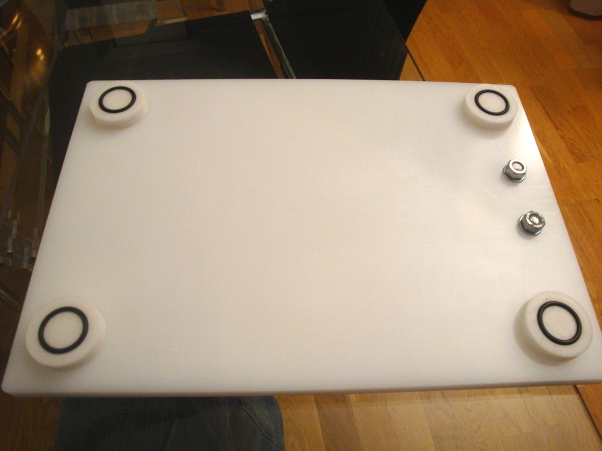
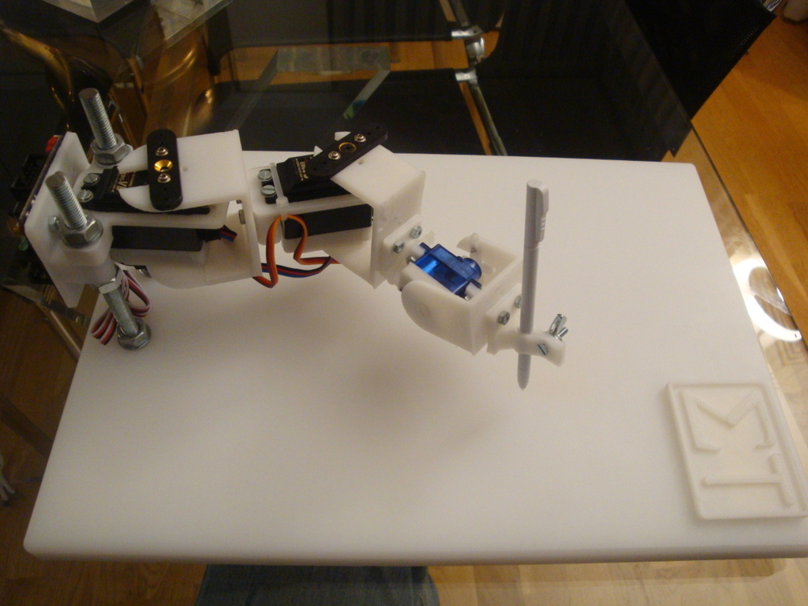

Table foot
===============
**Please note: This thing is part of a list that was [automatically generated](https://github.com/carlosgs/export-things) and may have been updated since then. Make sure to check for the current license and authorship.**  

Table foot  by obijuan , published Nov 28, 2012

Description
--------
Simple and elegant table foot. It has an o-ring in the bottom for better adherence to the floor. 
 
I designed it originally for a kitchen cutting table used as the base for the RoboDraw Robot (see pictures). But it can also be used as a standard table foot. 
 
The design is parametric (Openscad) 
 
You can find more info (in Spanish) in this wiki: 
 
<a href="http://www.iearobotics.com/wiki/index.php?title=Objecto_3D:_Patas_de_mesa" target="_blank" rel="nofollow">iearobotics.com/wiki/index.php?title=Objecto_3D:_Patas_de_mesa</a>

Instructions
--------
The default table foot is 10 mm in hight and a diameter of 40 mm. It uses 20 mm internal diameter O-ring (3mm section). 
 
It also includes a top hole (optional). I am using it to fit in the original cutting table foot. 
 
* Edit the table_foot.scad file and change the parameters 
* Generate the STL 
* Print! 
* Insert the O-ring 
* Attach the part to the table! 
 

Files
--------

 [ table_foot.scad](table_foot.scad)  

 [ table_foot.stl](table_foot.stl)  

Pictures
--------

Tags
--------
foot , openscad , parametric , plastic_valley  

  

License
--------
Table foot by obijuan is licensed under the Creative Commons - Attribution - Share Alike license.  

By: Juan Gonzalez-Gomez (Obijuan)
--------
<http://www.iearobotics.com/wiki/index.php?title=Juan_Gonzalez:Main>