Tensile test specimen
===============
**Please note: This thing is part of a list that was [automatically generated](https://github.com/carlosgs/export-things) and may have been updated since then. Make sure to check for the current license and authorship.**  

Tensile test specimen  by obijuan , published Jan 13, 2013

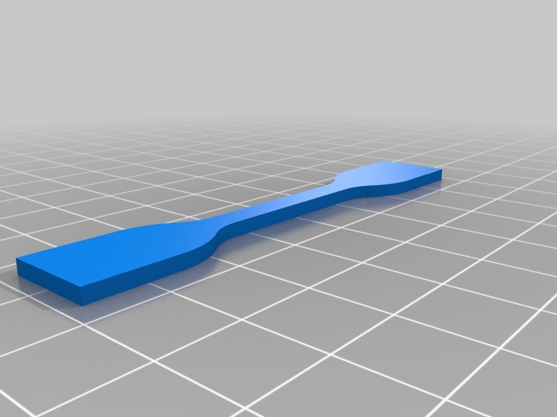

Description
--------
Tensile test specimens according to ISO 527 A  (Models 5A and 5B) 
 
Perform tensile strength tests to the plastics for printing (ABS, PLA...)  
 
More information (in Spanish) : 
<a href="http://www.iearobotics.com/wiki/index.php?title=Probeta_para_pruebas_de_tracci%C3%B3n" target="_blank" rel="nofollow">iearobotics.com/wiki/index.php?title=Probeta_para_pruebas_de_tracci%C3%B3n</a> 

Instructions
--------
The specimen is parametric, but two examples are given (for models 5A and 5B). 
* Edit the specimen.scad file 
* Choose the model (or change the parameters) 
* Generate the STL 
* Print! 
* Perform the tensile strength test!

Files
--------

 [ tensile-specimen.zip](tensile-specimen.zip)  

[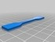](specimen--ISO-527A-5A.stl)
 [ specimen--ISO-527A-5A.stl](specimen--ISO-527A-5A.stl)  

[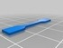](specimen--ISO-527A-5B.stl)
 [ specimen--ISO-527A-5B.stl](specimen--ISO-527A-5B.stl)  

[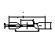](specimen-schematic.dxf)
 [ specimen-schematic.dxf](specimen-schematic.dxf)  

Pictures
--------
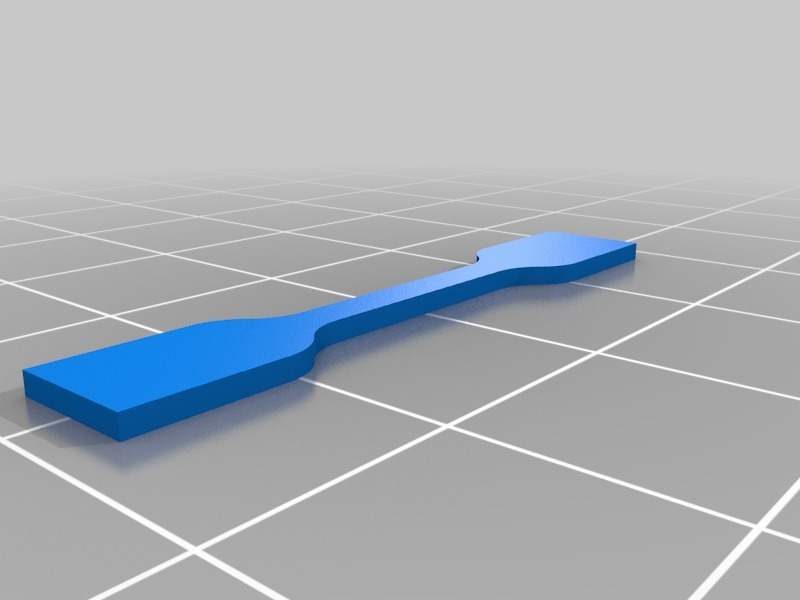
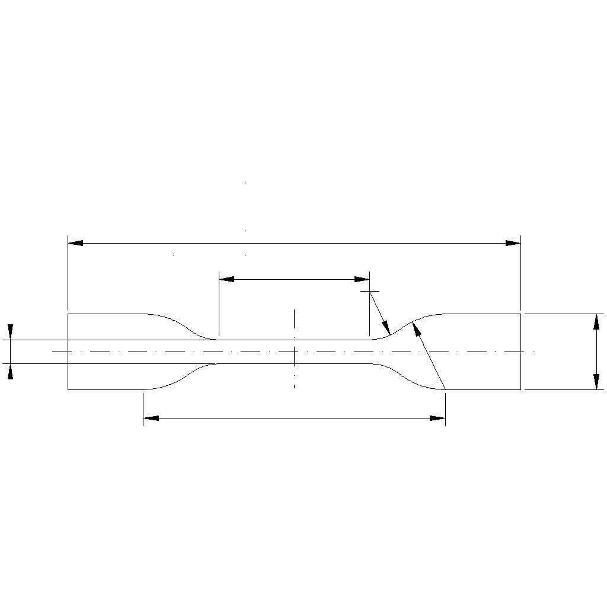
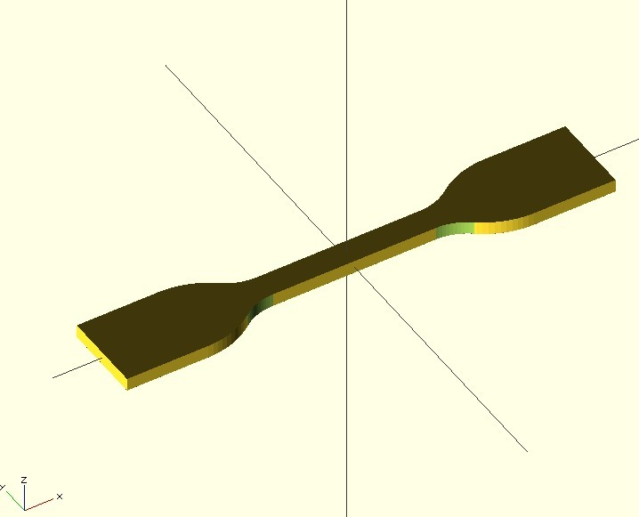
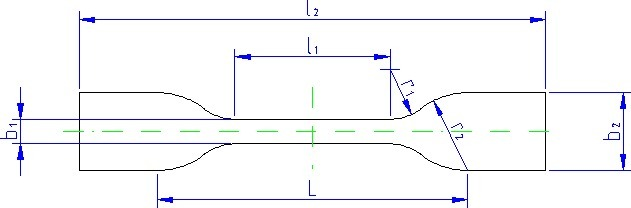
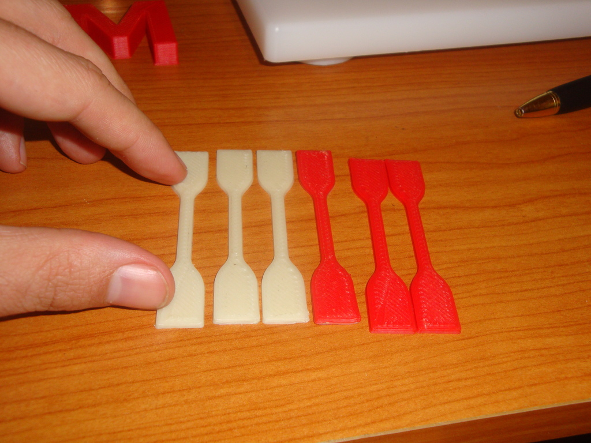
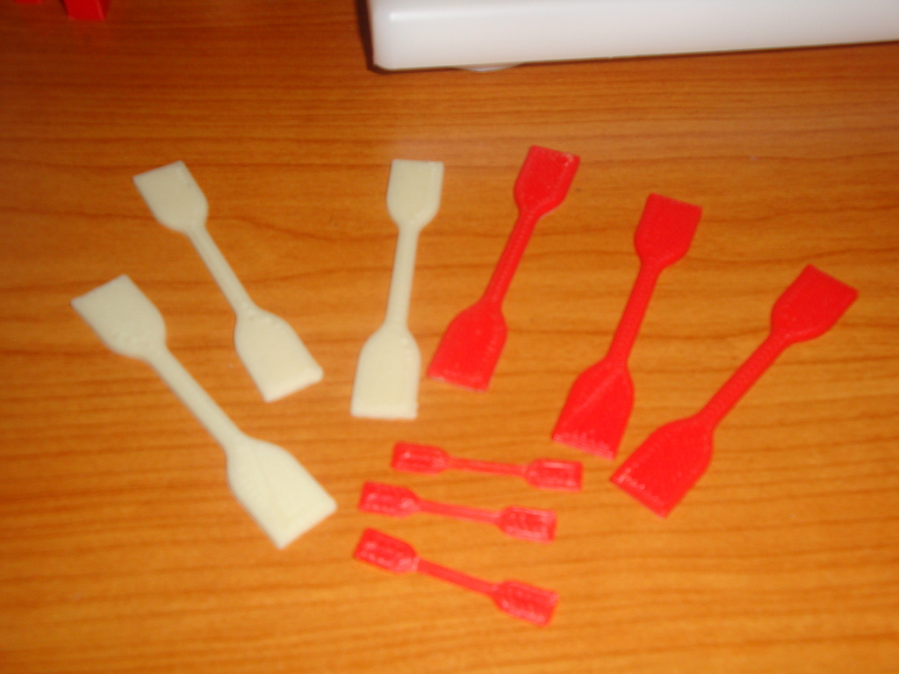
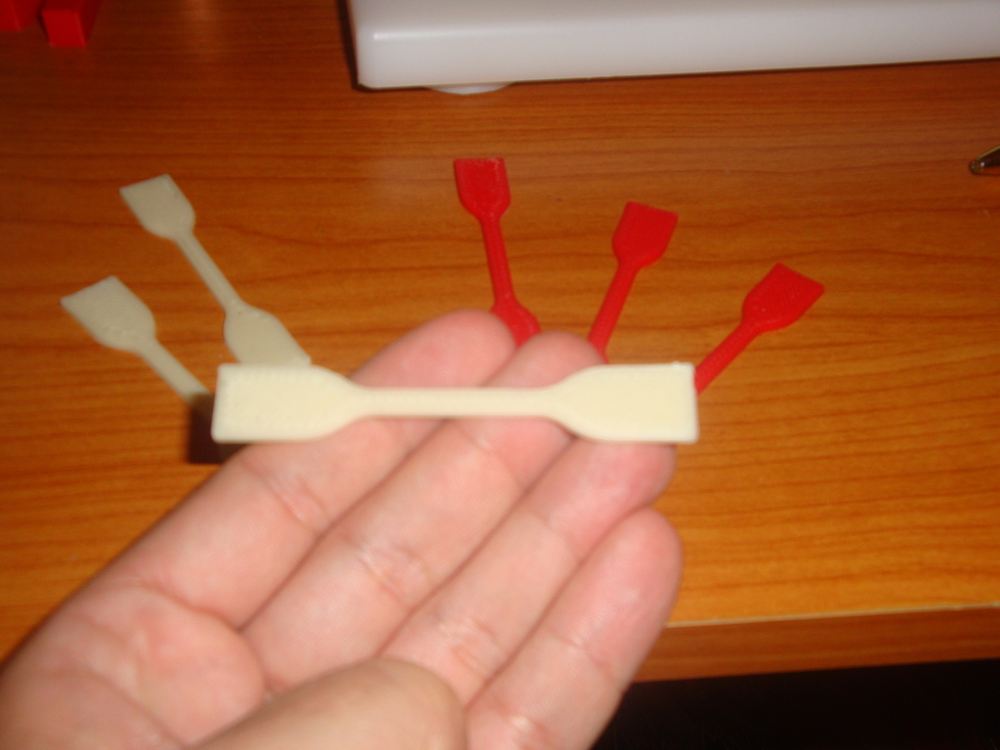

Tags
--------
openscad , parametric , Plastic_Valley  

  

License
--------
Tensile test specimen by obijuan is licensed under the Creative Commons - Attribution - Share Alike license.  

By: Juan Gonzalez-Gomez (Obijuan)
--------
<http://www.iearobotics.com/wiki/index.php?title=Juan_Gonzalez:Main>