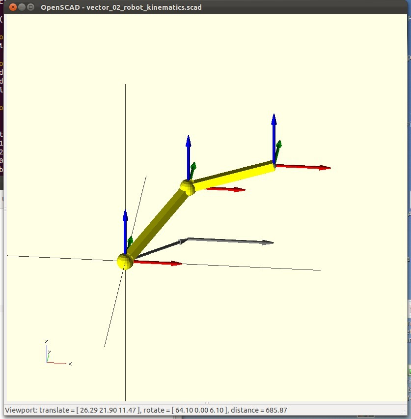
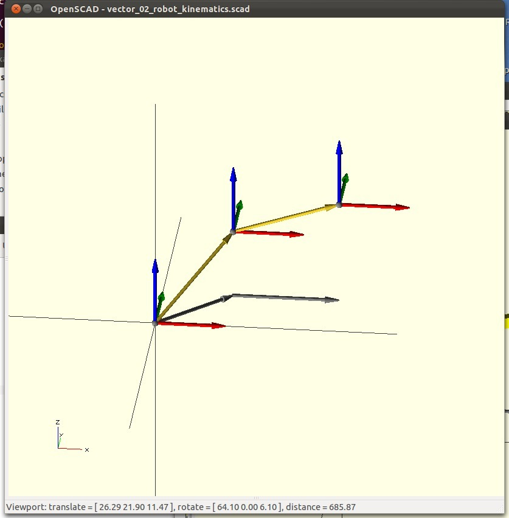
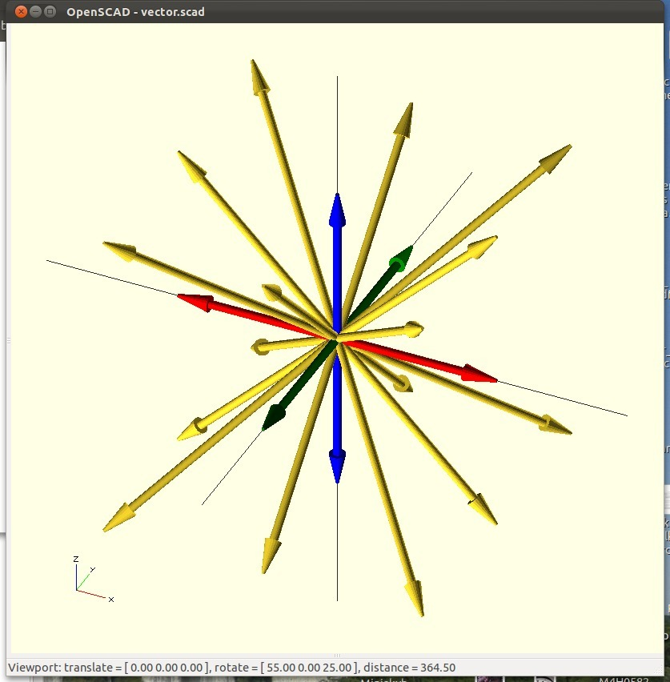
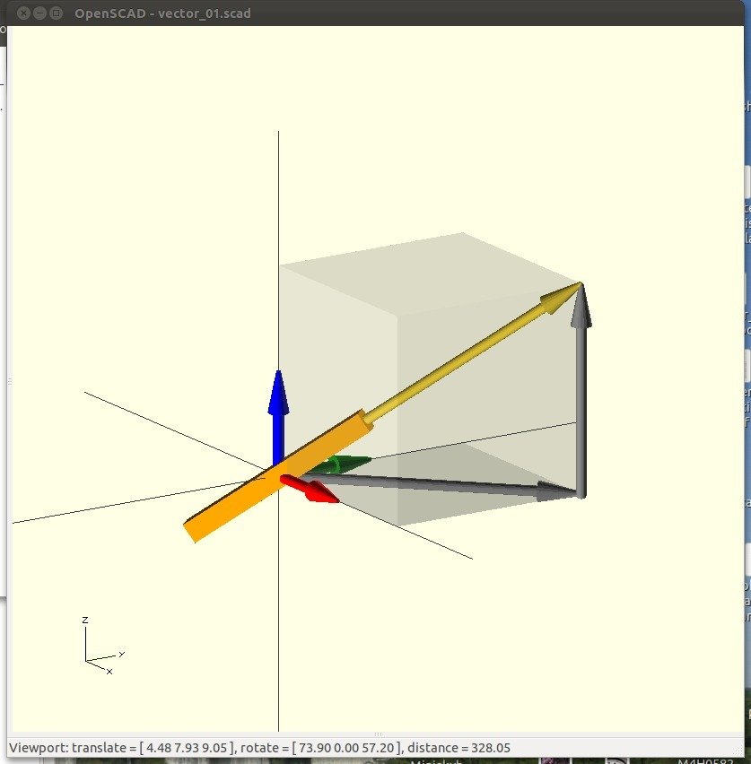

Vector library for OpenScad
===============
**Please note: This thing is part of a list that was [automatically generated](https://github.com/carlosgs/export-things) and may have been updated since then. Make sure to check for the current license and authorship.**  

Vector library for OpenScad  by obijuan , published Sep 8, 2012

Description
--------
This is a Vector library for drawing vectors in Openscad. It is extremely useful for designing robots and viewing their kinematics. In addition, it gives a lot of help when designing parts by means of displaying auxiliary vectors and frames of reference. 
 
  Another very useful operator is  "orientate()" which make the child to point in the direction given by a vector.  
 
The vector library is part of the tools I am developing for making it easier the use of Openscad. These tools are called obiscad. They are located in this repo: 
 
<a href="https://github.com/Obijuan/obiscad/" target="_blank" rel="nofollow">github.com/Obijuan/obiscad/</a> 
 
More information (in spanish) in this page: 
 
<a href="http://www.iearobotics.com/wiki/index.php?title=Obiscad" target="_blank" rel="nofollow">iearobotics.com/wiki/index.php?title=Obiscad</a> 

Instructions
--------
* Uncompress the .zip file 
* Open the examples given in openscad 
 
Drawing a vector is as easy as writting: 
 
use &lt; obiscad/vector.scad &gt; 
vector([10,10,10]); 
 
If you want to make a part to have the orientation given by a vector, just use the orientate() operator: 
 
orientate(v=[1,1,1], roll=0) 
  cube ([20,20,20]),center=true)  // Change it by the oject you want to change orientation 
 
There are more instructions in the library comments and examples.

Files
--------

 [ obiscad-vector.zip](obiscad-vector.zip)  

Pictures
--------

Tags
--------
library , obiscad , openscad , plastic_valley , printbot , robot , vector  

  

License
--------
Vector library for OpenScad by obijuan is licensed under the Creative Commons - Attribution - Share Alike license.  

By: Juan Gonzalez-Gomez (Obijuan)
--------
<http://www.iearobotics.com/wiki/index.php?title=Juan_Gonzalez:Main>