YATH: Yet Another Tool Holder
===============
**Please note: This thing is part of a list that was [automatically generated](https://github.com/carlosgs/export-things) and may have been updated since then. Make sure to check for the current license and authorship.**  

YATH: Yet Another Tool Holder  by obijuan , published Jan 24, 2013

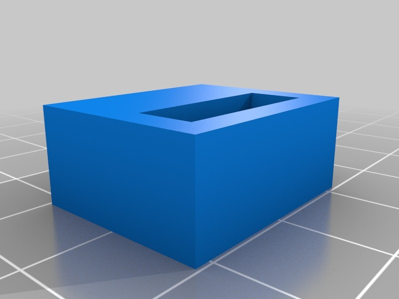

Description
--------
Parametric Tool holder.  The design is very simple but useful. There are two types of holders that can be generated: open and close. Open holders are useful for hanging wrenches and as standard hooks. Close holders can be used for hanging callipers, pliers, files, scissors and so on. 
 
More information (in Spanish): 
<a href="http://www.iearobotics.com/wiki/index.php?title=Soporte_para_colgar_herramientas" target="_blank" rel="nofollow">iearobotics.com/wiki/index.php?title=Soporte_para_colgar_herramientas</a> 

Instructions
--------
1) Customize your own tool holder: edit the scad file and change the parameters or use the Customizer app 
2) Generate the STL 
3) Print! 
4) Stick to the wall using double-sided tape 
5) Hang the tool 
 
I have included some examples customized for my tools (in the .scad file) 
 
<b>Update: 25/Jan/2013</b>: Modified for the Customizer app 

Files
--------

 [ tool_holder_customizer.scad](tool_holder_customizer.scad)  

 [ file_holder.stl](file_holder.stl)  

 [ Wrench_12_holder.stl](Wrench_12_holder.stl)  

[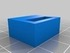](caliper_holder.stl)
 [ caliper_holder.stl](caliper_holder.stl)  

 [ pliers_holder.stl](pliers_holder.stl)  

[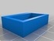](cutter_holder.stl)
 [ cutter_holder.stl](cutter_holder.stl)  

[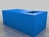](round_file_holder.stl)
 [ round_file_holder.stl](round_file_holder.stl)  

Pictures
--------
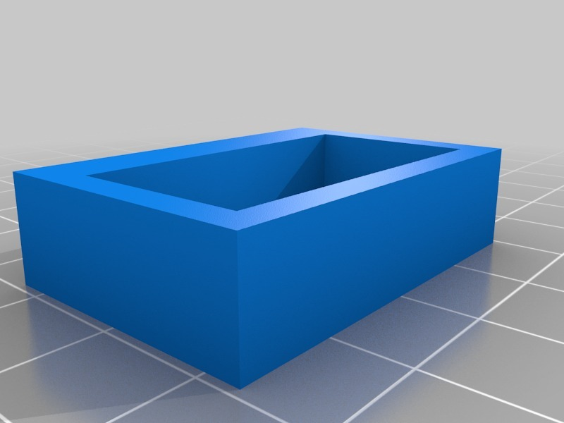
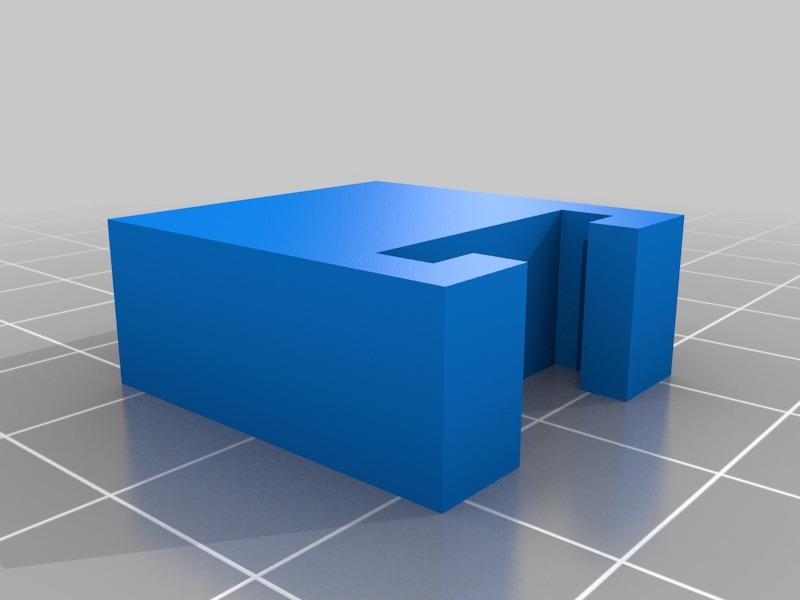
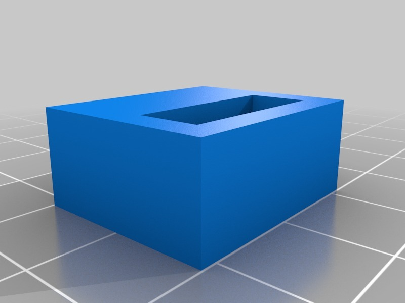
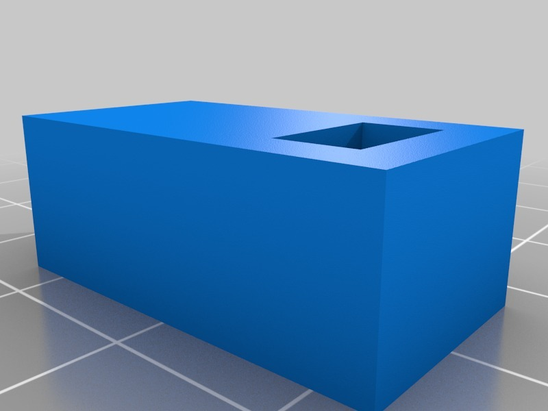
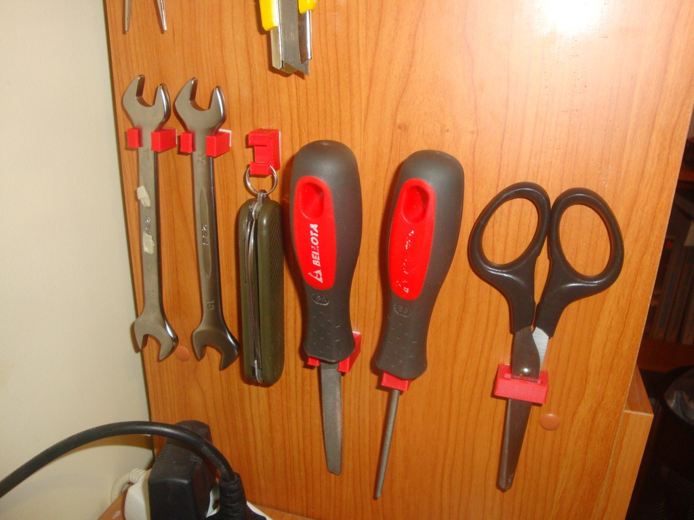
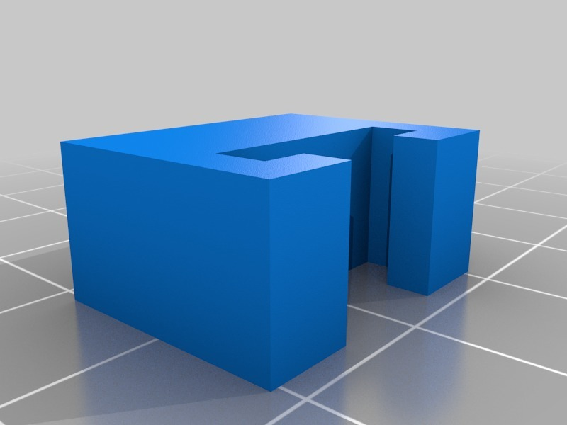
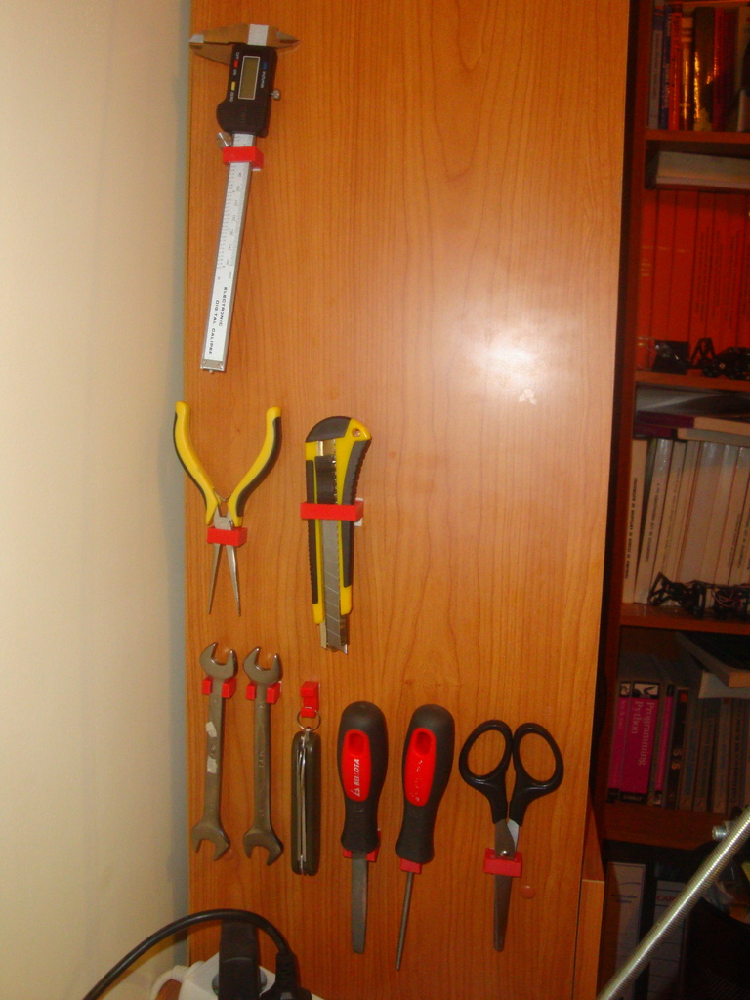
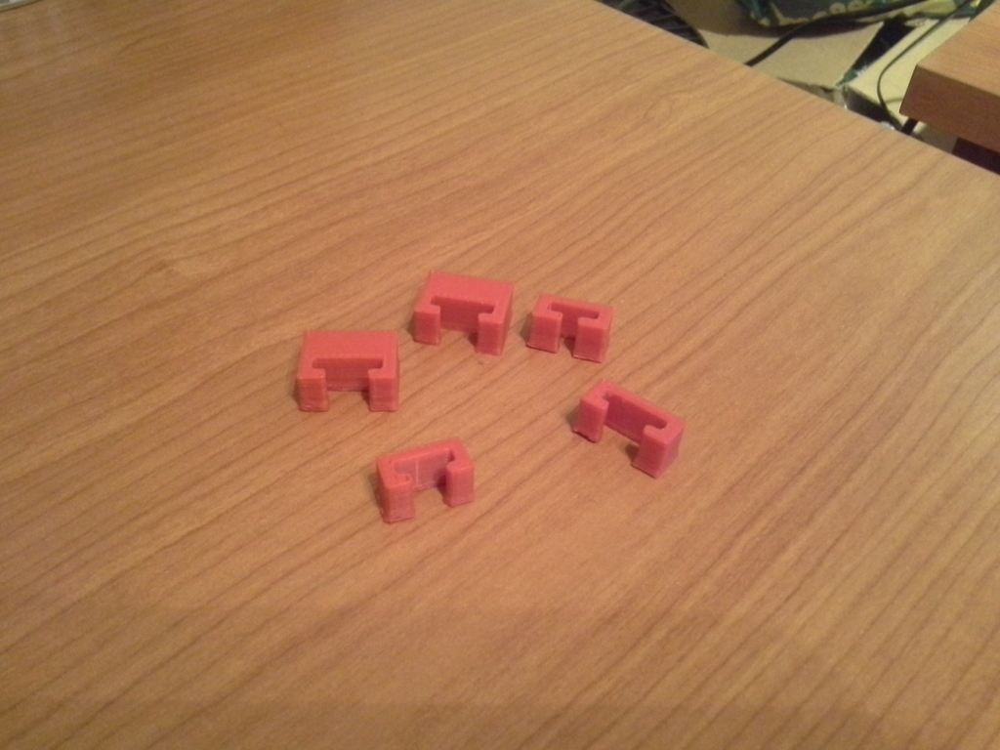
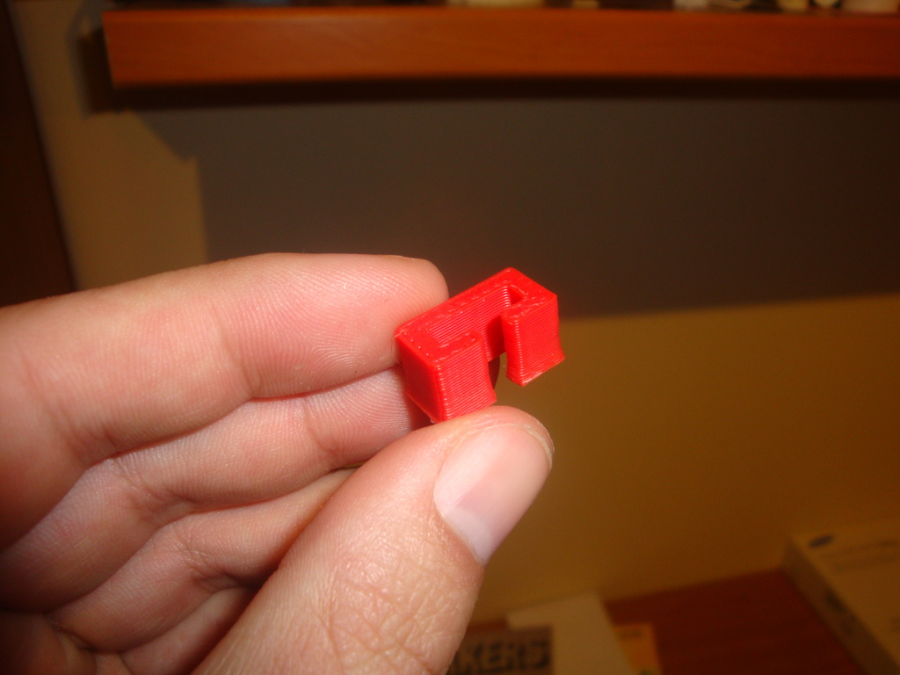

Tags
--------
customized , customizer , holder , hook , openscad , Plastic_Valley , tool  

  

License
--------
YATH: Yet Another Tool Holder by obijuan is licensed under the GNU - GPL license.  

By: Juan Gonzalez-Gomez (Obijuan)
--------
<http://www.iearobotics.com/wiki/index.php?title=Juan_Gonzalez:Main>