Yet another Glasses!
===============
**Please note: This thing is part of a list that was [automatically generated](https://github.com/carlosgs/export-things) and may have been updated since then. Make sure to check for the current license and authorship.**  

Yet another Glasses!  by obijuan , published Apr 20, 2011

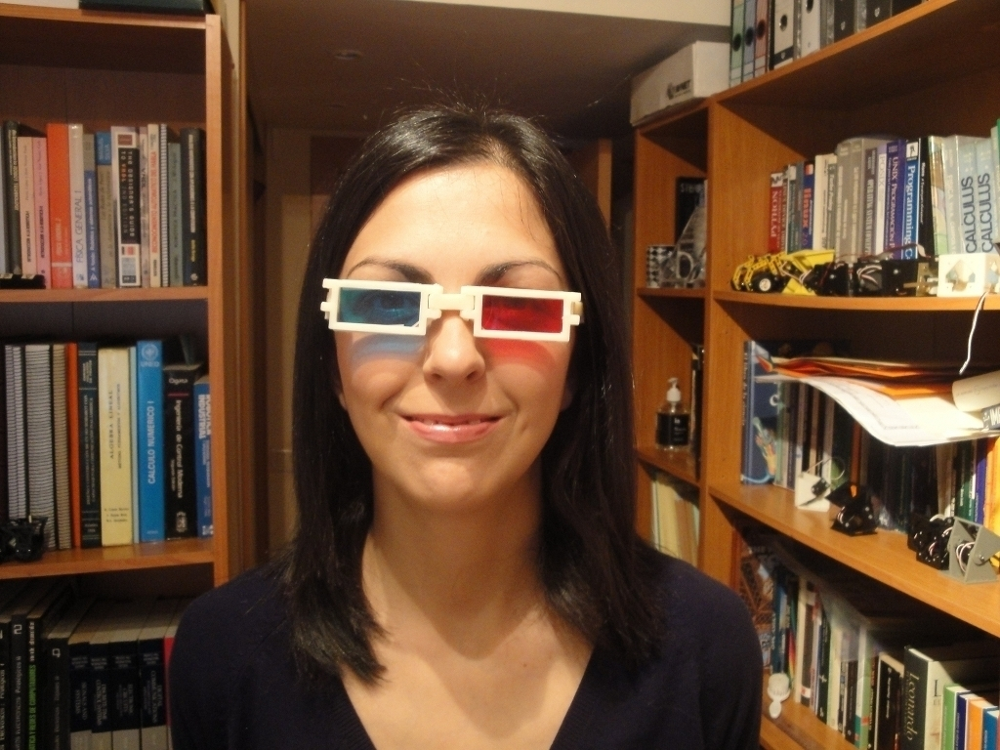

Description
--------
Yet another pair of glasses! It is a parameterized design with Openscad. The glasses consist of 7 parts joined by 5 3mm-abs-pins. So, they are fully printable and very easy to assemble. 
 
If you glue red and cyan translucent paper, you have a wonderful 3D glasses!! 
 
More information on this link (in Spanish): 
<a href="http://www.iearobotics.com/wiki/index.php?title=Objeto_3D:_Gafas" target="_blank" rel="nofollow">iearobotics.com/wiki/index.php?title=Objeto_3D:_Gafas</a>

Instructions
--------
1.- Print the 7 parts: eye-frame x 1, eye-frame2 x 1, bridge x 1, leg1 x 2, leg2 x 2 
2.- Join the parts using 3mm ABS pins 
3.- Put your glasses on!

Files
--------
[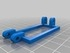](eye_frame2.stl)
 [ eye_frame2.stl](eye_frame2.stl)  

[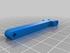](leg1.stl)
 [ leg1.stl](leg1.stl)  

 [ glasses-parts-freecad.fcstd](glasses-parts-freecad.fcstd)  

[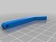](leg2.stl)
 [ leg2.stl](leg2.stl)  

 [ eye_frame.stl](eye_frame.stl)  

 [ glasses-freecad.fcstd](glasses-freecad.fcstd)  

 [ glasses-openscad.zip](glasses-openscad.zip)  

 [ glasses-stl.zip](glasses-stl.zip)  

[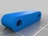](bridge.stl)
 [ bridge.stl](bridge.stl)  

Pictures
--------
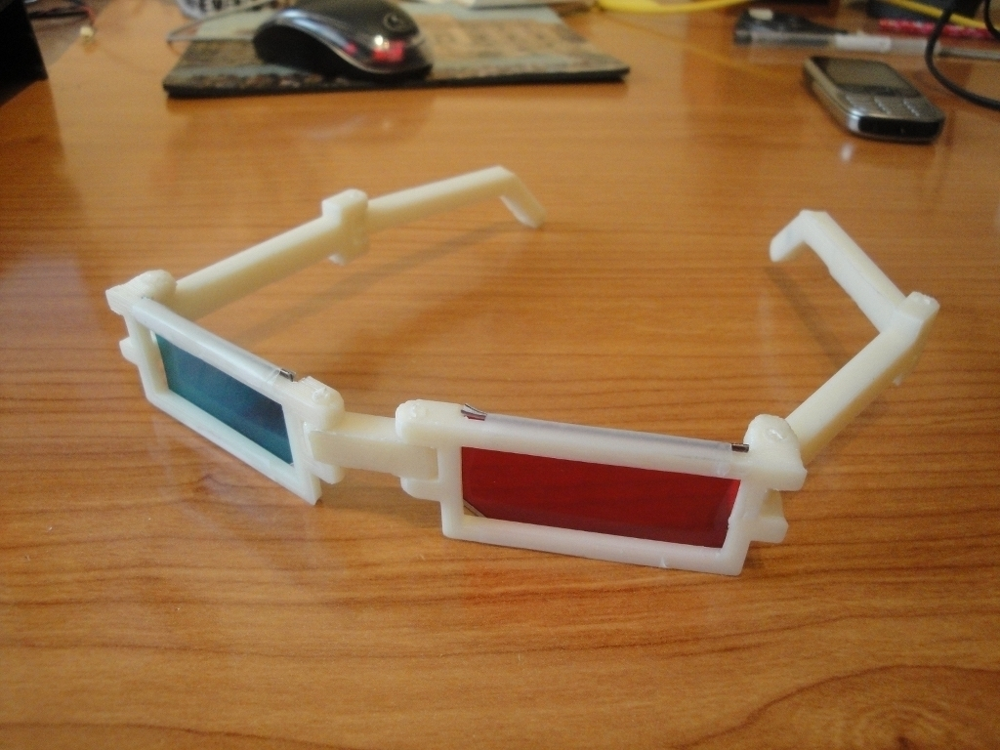
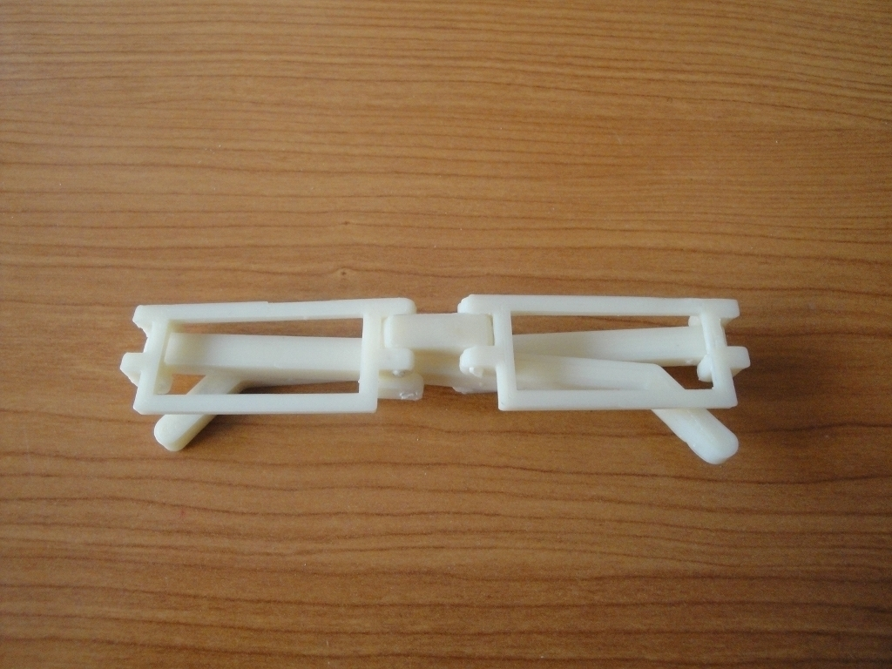
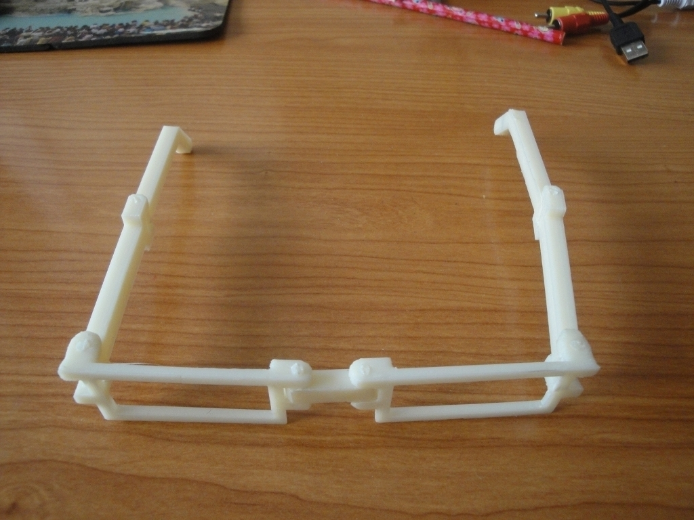
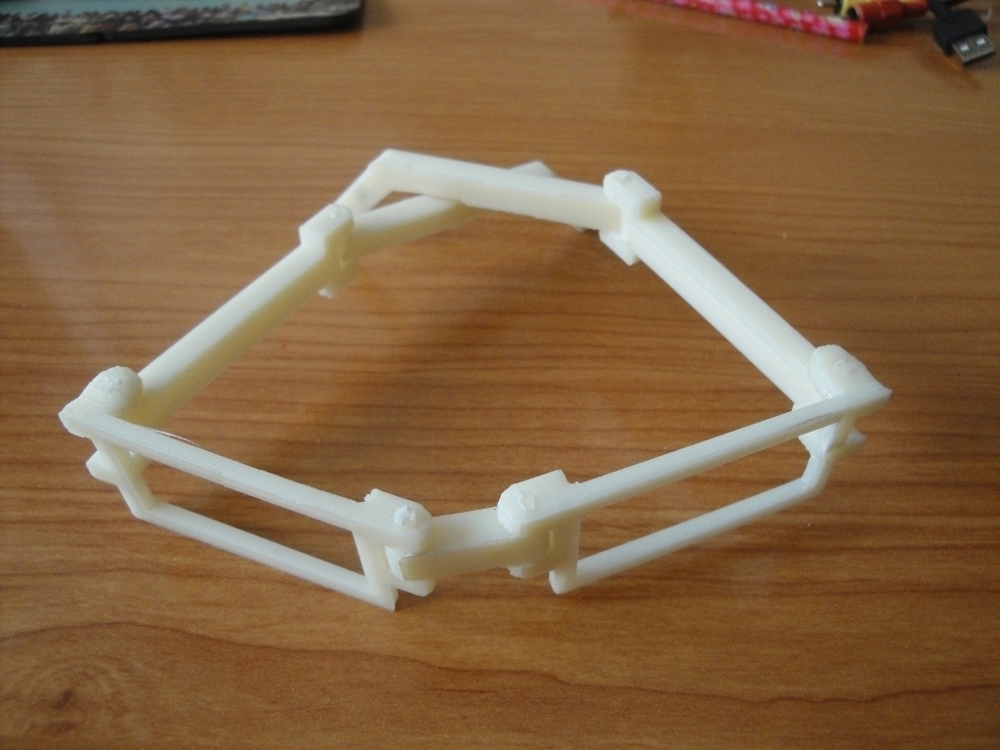
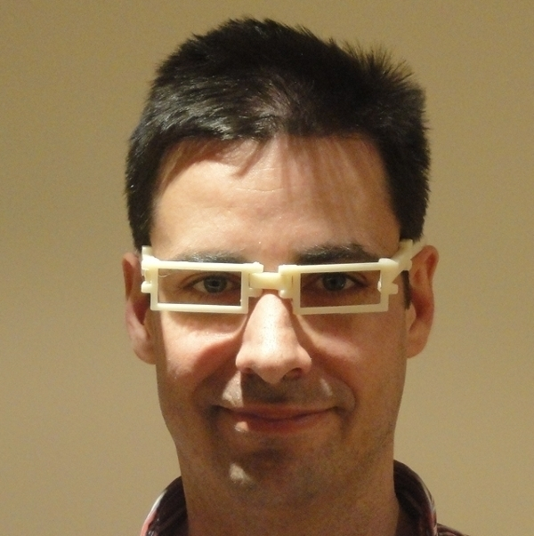
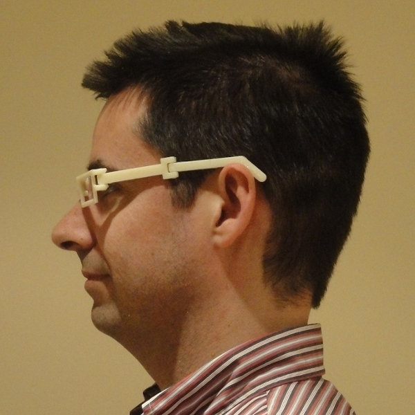
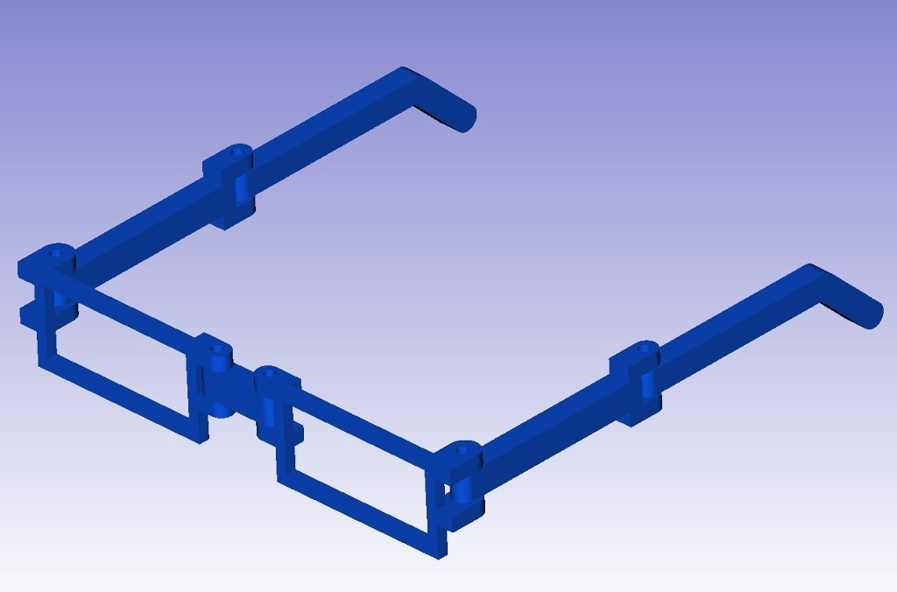
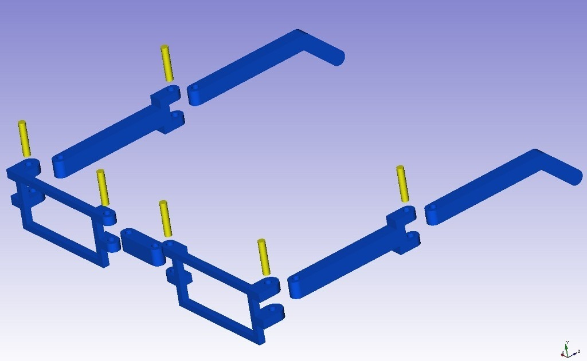
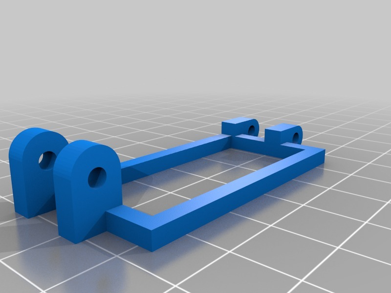

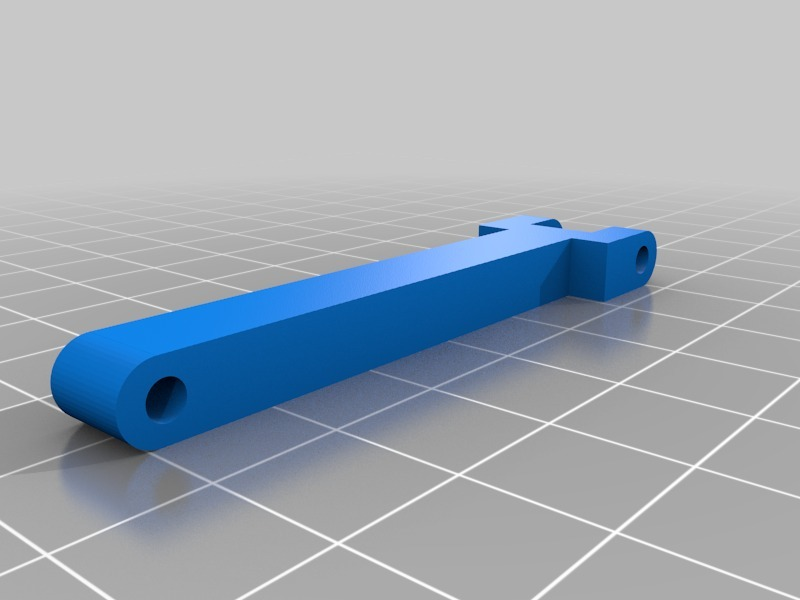
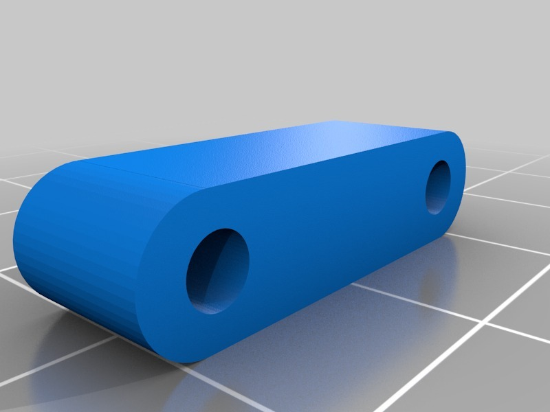
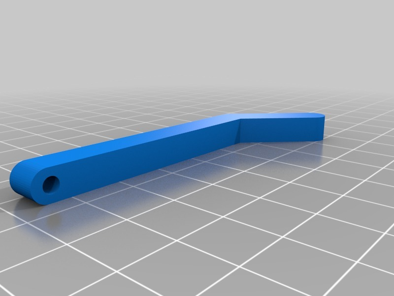

Tags
--------
glasses , makerbot , openscad , parametric , Plastic Valley , UC3M , useful , wearable  

  

License
--------
Yet another Glasses! by obijuan is licensed under the Creative Commons - Attribution - Share Alike license.  

By: Juan Gonzalez-Gomez (Obijuan)
--------
<http://www.iearobotics.com/wiki/index.php?title=Juan_Gonzalez:Main>