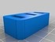
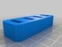
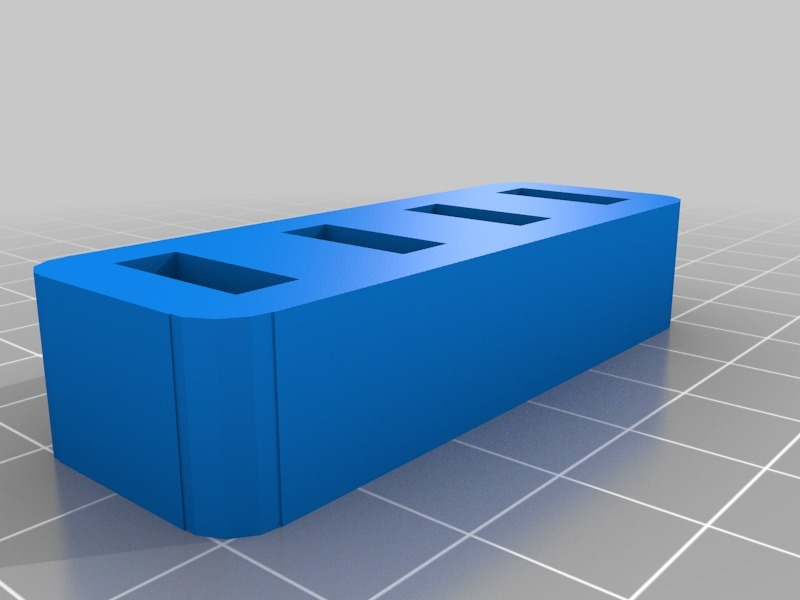
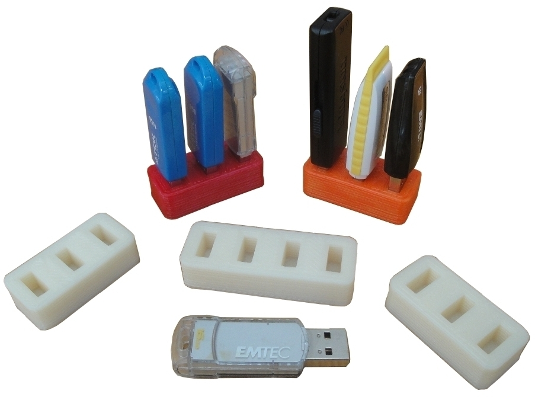
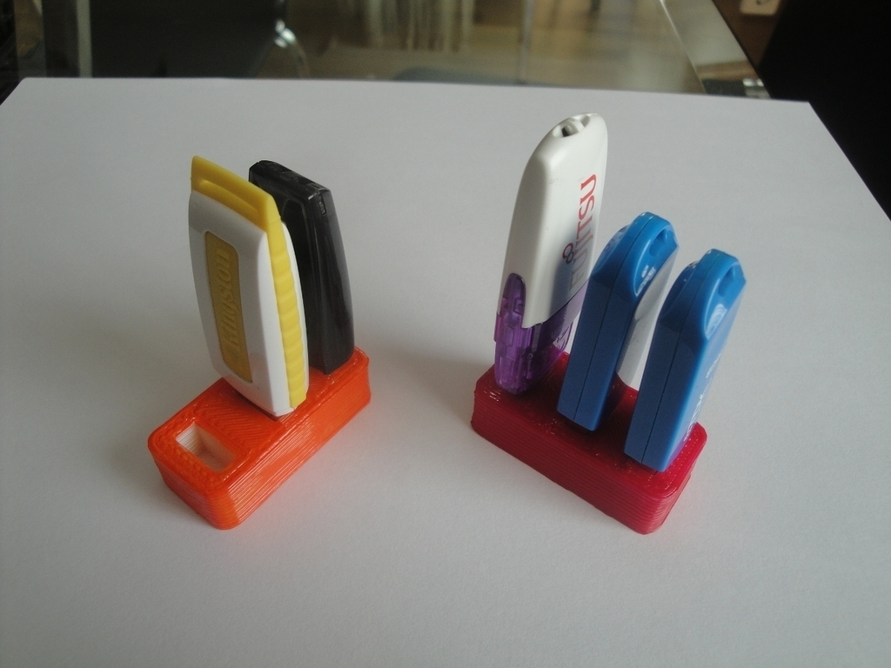
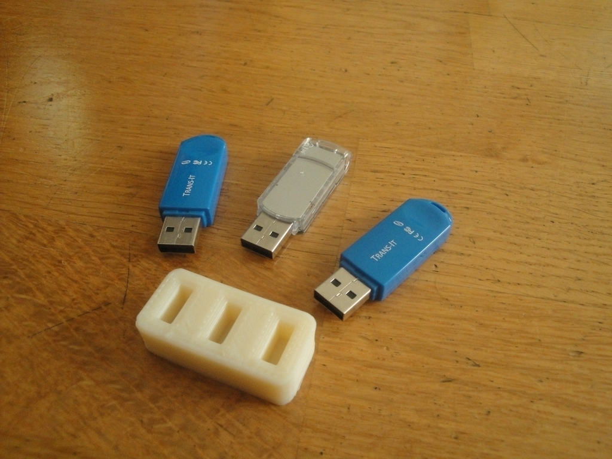
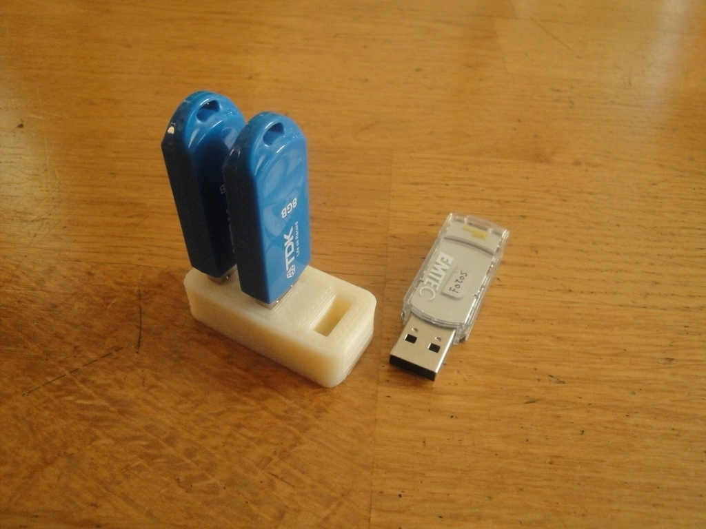

Yet another Pendrive holder
===============
**Please note: This thing is part of a list that was [automatically generated](https://github.com/carlosgs/export-things) and may have been updated since then. Make sure to check for the current license and authorship.**  

Yet another Pendrive holder  by obijuan , published Jan 8, 2012

Description
--------
This is a derivated design from the USB memory stick holder by <a href="http://www.thingiverse.com/jpcw" target="_blank" rel="nofollow">thingiverse.com/jpcw</a> 
 
The main differences are: redesigned in openscad, parametric design and rounded edges

Instructions
--------
Specify the number of slot in the .scad file, generate the stl file, print and enjoy!

Files
--------

 [ pen_drive_holderx3.stl](pen_drive_holderx3.stl)  

 [ pen_drive_holderx4.stl](pen_drive_holderx4.stl)  

 [ pendrive-holder.zip](pendrive-holder.zip)  

Pictures
--------

Tags
--------
holder , memory stick , openscad , plastic valley , uc3m  

  

License
--------
Yet another Pendrive holder by obijuan is licensed under the Creative Commons - Attribution - Share Alike license.  

By: Juan Gonzalez-Gomez (Obijuan)
--------
<http://www.iearobotics.com/wiki/index.php?title=Juan_Gonzalez:Main>