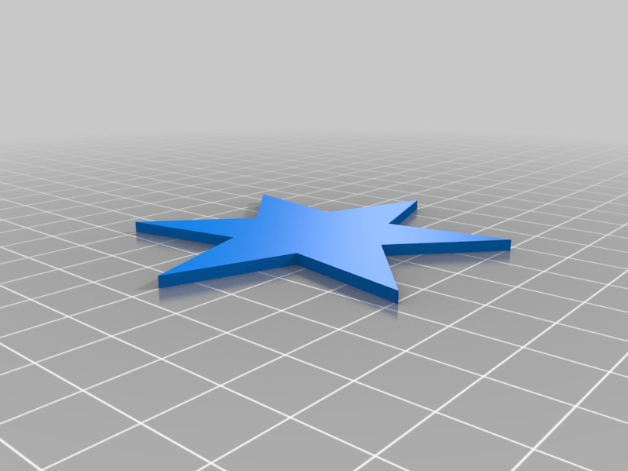
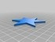

star-6
===============
**Please note: This thing is part of a list that was [automatically generated](https://github.com/carlosgs/export-things) and may have been updated since then. Make sure to check for the current license and authorship.**  

star-6  by obijuan , published Jan 16, 2013

Description
--------
Customized version of <a href="http://www.thingiverse.com/thing:42493" target="_blank" rel="nofollow">thingiverse.com/thing:42493</a> 
 
Created with Customizer! <a href="http://www.thingiverse.com/apps/customizer/run?thing_id=42493" target="_blank" rel="nofollow">thingiverse.com/apps/customizer/run?thing_id=42493</a> 
 
Just testing the customizer...

Instructions
--------
Using the following options: 
 
inner_radius = 15 
number_of_points = 6 
outer_radius = 20 
height = 2 

Files
--------

 [ parametric_star.scad20130116-2770-11xqioh-0.stl](parametric_star.scad20130116-2770-11xqioh-0.stl)  

Tags
--------
customized  

  

License
--------
star-6 by obijuan is licensed under the Creative Commons - Attribution license.  

By: Juan Gonzalez-Gomez (Obijuan)
--------
<http://www.iearobotics.com/wiki/index.php?title=Juan_Gonzalez:Main>